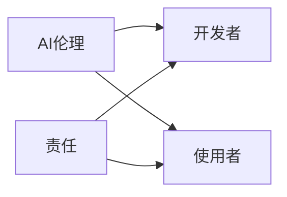
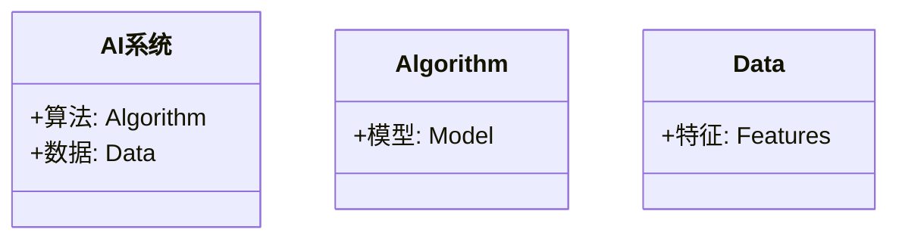

                 


# AI伦理与责任

## 关键词：AI伦理，人工智能责任，伦理决策，算法公平性，AI治理

## 摘要：AI伦理与责任是当前人工智能领域的重要议题，随着AI技术的广泛应用，伦理和责任问题日益突出。本文将从AI伦理的核心概念出发，分析其在算法设计、系统架构中的体现，通过实际案例探讨AI伦理的实现与责任分配，最后总结AI伦理与责任的最佳实践。

---

# 第1章: AI伦理与责任的背景介绍

## 1.1 AI技术的发展现状

### 1.1.1 AI技术的快速发展
人工智能（AI）技术近年来取得了飞速发展，从机器学习到深度学习，再到生成式AI，AI已经渗透到各个行业，如医疗、金融、交通和教育等。这些技术的进步使得AI系统能够执行复杂的任务，甚至在某些领域超过了人类的能力。

### 1.1.2 AI技术的应用领域
AI技术的应用范围不断扩大，包括但不限于：
- **医疗领域**：AI辅助诊断、药物研发。
- **金融领域**：风险评估、欺诈检测。
- **交通领域**：自动驾驶、智能交通管理。
- **教育领域**：个性化教学、学习辅助工具。

### 1.1.3 AI技术带来的社会变革
AI技术的普及带来了生产方式、生活方式和思维方式的深刻变革，但也带来了新的挑战，如就业结构调整、隐私保护等问题。

## 1.2 AI伦理问题的提出

### 1.2.1 AI技术的潜在风险
AI技术的应用并非没有风险，以下是几个关键问题：
- **算法偏见**：AI系统可能因为训练数据的偏差而产生不公平的结果。
- **透明性不足**：复杂的AI模型可能难以解释其决策过程，导致用户信任缺失。
- **责任归属**：当AI系统出现问题时，责任归属往往模糊不清。

### 1.2.2 伦理问题的出现背景
随着AI系统的决策影响力越来越大，伦理问题逐渐成为公众关注的焦点。例如，自动驾驶汽车在事故中的责任归属问题，引发了广泛讨论。

### 1.2.3 伦理问题的核心领域
AI伦理的核心领域包括：
- 数据隐私
- 算法公平性
- 人机交互中的伦理问题
- AI系统决策的透明性与可解释性

## 1.3 责任与伦理的关系

### 1.3.1 责任的定义与分类
责任是指个体或组织因其行为或决策而产生的义务或负担。在AI系统中，责任可以分为：
- **开发者责任**：算法设计者的责任。
- **使用者责任**：系统操作者的责任。
- **第三方责任**：如监管机构的责任。

### 1.3.2 伦理与责任的相互作用
伦理为责任提供了行为准则，而责任则是伦理原则在实际中的体现。例如，AI系统的公平性伦理原则要求开发者在设计算法时避免偏见，这直接关联到开发者的责任。

### 1.3.3 责任在AI技术中的重要性
明确的责任归属有助于解决AI系统引发的问题，维护用户信任，促进技术的健康发展。

## 1.4 本章小结
本章介绍了AI技术的发展现状，分析了AI伦理问题的背景，并探讨了责任与伦理的关系。下一章将深入探讨AI伦理与责任的核心概念。

---

# 第2章: AI伦理与责任的核心概念

## 2.1 核心概念的定义

### 2.1.1 AI伦理的定义
AI伦理是指在设计、开发和应用AI系统时，应遵循的道德准则和行为规范，旨在确保技术的使用符合人类社会的共同价值观。

### 2.1.2 责任的定义
责任是指个体或组织因其行为或决策而产生的义务或负担，涉及AI系统的责任归属和行为后果。

### 2.1.3 伦理与责任的对比
| **方面** | **伦理** | **责任** |
|----------|----------|----------|
| 定义     | 道德准则 | 行为后果 |
| 对象     | AI系统   | 开发者、使用者等 |
| 关系     | 指导原则 | 实施结果 |

## 2.2 核心概念的属性特征对比

### 2.2.1 表格对比核心概念的属性特征
| **属性**   | **AI伦理**                  | **责任**                   |
|------------|------------------------------|-----------------------------|
| 核心目标   | 最大化社会福祉              | 明确行为后果               |
| 实施主体   | 开发者、使用者              | 开发者、监管机构           |
| 表现形式   | 算法公平性、透明性          | 法律责任、道德责任         |

### 2.2.2 图表展示核心概念的对比关系


## 2.3 AI伦理与责任的ER实体关系图

### 2.3.1 实体关系图的构建
```mermaid
erd
actor 开发者
actor 使用者
actor 监管机构
object AI系统
object 算法
object 数据
```

### 2.3.2 实体关系图的解释
AI系统由算法和数据构成，开发者和使用者是主要的参与者，监管机构负责监督和规范。

## 2.4 本章小结
本章通过定义和对比AI伦理与责任的核心概念，构建了相应的实体关系图。下一章将分析AI伦理与责任在算法中的体现。

---

# 第3章: AI伦理与责任的算法原理

## 3.1 AI算法中的伦理考量

### 3.1.1 算法的公平性
算法的公平性要求在数据选择和处理过程中避免偏见。例如，招聘系统中不应因性别而影响录用结果。

### 3.1.2 算法的透明性
透明性是指算法的决策过程可以被理解和解释，避免“黑箱”操作。例如，银行贷款审批系统应向用户解释拒绝的原因。

### 3.1.3 算法的可解释性
可解释性要求算法的决策过程能够以人类可理解的方式解释。例如，医疗诊断系统应说明诊断依据。

## 3.2 责任分配的算法模型

### 3.2.1 责任分配的数学模型
责任分配可以基于贡献度进行量化。例如：
$$
\text{责任权重} = \frac{\text{贡献度}}{\sum \text{所有贡献度}}
$$

### 3.2.2 责任分配的算法流程


### 3.2.3 责任分配的案例分析
以自动驾驶汽车为例，责任分配涉及制造商、软件开发者和驾驶员。

## 3.3 伦理决策的算法实现

### 3.3.1 伦理决策的算法框架
伦理决策框架包括目标识别、利益权衡和结果评估。

### 3.3.2 伦理决策的流程图


### 3.3.3 伦理决策的数学模型
伦理决策可以通过加权和公式进行量化：
$$
\text{决策值} = \sum (\text{权重} \times \text{利益})
$$

## 3.4 本章小结
本章分析了AI算法中的伦理考量，构建了责任分配和伦理决策的算法模型。下一章将探讨系统分析与架构设计。

---

# 第4章: AI伦理与责任的系统分析与架构设计

## 4.1 系统功能设计

### 4.1.1 系统功能模块
AI伦理与责任系统主要包括：
- 数据采集模块
- 算法设计模块
- 责任分配模块

### 4.1.2 领域模型类图


## 4.2 系统架构设计

### 4.2.1 系统架构图


## 4.3 接口设计与交互流程图

### 4.3.1 接口设计
- **输入接口**：接收用户请求
- **输出接口**：返回处理结果

### 4.3.2 交互流程图


## 4.4 本章小结
本章通过系统功能设计和架构图，展示了AI伦理与责任在系统层面的实现。下一章将通过项目实战进一步分析。

---

# 第5章: 项目实战：AI医疗系统的伦理审查

## 5.1 环境安装与配置

### 5.1.1 开发环境
- Python 3.8+
- TensorFlow 2.0+

## 5.2 系统核心实现

### 5.2.1 数据处理代码
```python
def preprocess_data(data):
    # 数据清洗和特征提取
    pass
```

### 5.2.2 责任分配代码
```python
def assign Responsibility(contributors):
    # 责任分配逻辑
    pass
```

## 5.3 案例分析与解读

### 5.3.1 实际案例分析
以AI医疗诊断系统为例，分析算法中的伦理问题和责任分配。

## 5.4 项目总结与反思

### 5.4.1 项目总结
通过项目实战，我们掌握了AI伦理与责任在实际中的应用。

### 5.4.2 项目反思
伦理审查是确保AI系统合规的关键步骤，需要在开发过程中尽早介入。

---

# 第6章: 最佳实践与小结

## 6.1 最佳实践 tips

### 6.1.1 开发阶段
- 建立伦理审查机制
- 确保数据公平性

### 6.1.2 应用阶段
- 提供透明的决策过程
- 建立责任追溯机制

## 6.2 小结
AI伦理与责任是确保技术健康发展的重要保障，需要开发者、使用者和监管机构的共同努力。

## 6.3 注意事项
- 定期审查和更新伦理规范
- 加强公众教育和宣传

## 6.4 未来趋势
- AI伦理将更加制度化
- 责任分配将更加细化

## 6.5 拓展阅读
推荐书籍：
- 《AI治理：伦理与责任》
- 《算法公平性与社会影响》

---

# 作者：AI天才研究院 & 禅与计算机程序设计艺术

---

通过以上章节的详细分析，我们可以全面理解AI伦理与责任的核心概念、算法原理和实际应用。希望本文能为读者提供有价值的见解和指导。

