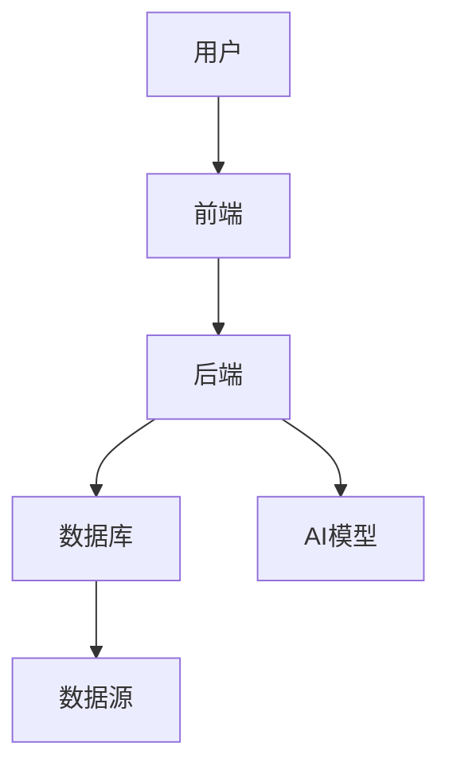

                 

# AI在供应链金融中的深度应用研究

> 关键词：人工智能、供应链金融、风险管理、机器学习、智能风控

> 摘要：供应链金融作为现代经济的重要组成部分，通过整合供应商、制造商、分销商和金融机构等多方资源，实现资金的有效配置和风险控制。然而，传统供应链金融模式存在效率低下、信息不对称、风险难以控制等问题。随着人工智能（AI）技术的快速发展，AI在供应链金融中的应用逐渐深入，为行业带来了革命性的变化。本文将系统地探讨AI在供应链金融中的核心应用，包括智能风控、预测分析、自动化流程优化等，分析其技术基础、算法实现和系统架构，并通过实际案例展示AI如何提升供应链金融的效率和安全性。

---

# 第一部分：供应链金融的核心概念与AI的应用背景

## 第1章：供应链金融的基本概念

### 1.1 供应链金融的定义与特点

#### 1.1.1 供应链金融的定义
供应链金融是指通过整合供应链上的企业（包括供应商、制造商、分销商和零售商）与金融机构，利用企业间的交易数据和信息，为链上企业提供融资、支付、结算等金融服务的一种金融模式。

#### 1.1.2 供应链金融的核心特点
- **依赖性强**：供应链金融依赖于链上企业的交易数据和信用评级。
- **多方参与**：涉及供应商、制造商、分销商、零售商以及银行等金融机构。
- **数据驱动**：依赖于企业间的交易数据和信用信息。

#### 1.1.3 供应链金融的主要参与者
- **核心企业**：供应链中的主导企业，通常是制造商或大型分销商。
- **供应商**：为链上企业提供原材料或服务的企业。
- **分销商/零售商**：将产品销售给最终消费者的环节。
- **金融机构**：提供融资、支付、结算等金融服务的银行或其他金融机构。

---

### 1.2 AI在供应链金融中的应用背景

#### 1.2.1 传统供应链金融的痛点
- **信息不对称**：链上企业之间的信息难以有效共享，导致金融机构难以准确评估风险。
- **效率低下**：传统融资流程复杂，审批时间长，难以满足企业的快速融资需求。
- **风险控制难**：缺乏实时数据和自动化工具，导致风险难以有效监控和管理。

#### 1.2.2 AI如何解决这些问题
- **实时数据处理**：AI可以通过实时分析供应链中的交易数据，快速生成信用评估和风险预测。
- **自动化流程**：AI可以实现融资申请、审批、监控等流程的自动化，提高效率。
- **精准风险控制**：通过机器学习和大数据分析，AI能够更精准地识别和预测供应链中的风险。

#### 1.2.3 当前AI在供应链金融中的应用现状
- **智能风控**：AI在信用评估、风险预测和异常检测中的应用越来越广泛。
- **自动化融资**：部分企业已经实现了基于AI的自动化融资申请和审批流程。
- **数据驱动决策**：AI通过分析供应链中的多源数据，为企业的经营决策提供支持。

---

## 第2章：AI在供应链金融中的应用场景

### 2.1 供应链金融中的风险管理

#### 2.1.1 信用评估与风险预测
- **信用评估**：通过分析企业的历史交易数据、财务状况和市场表现，生成信用评分。
- **风险预测**：利用机器学习模型预测企业在供应链中的违约风险。

#### 2.1.2 基于AI的实时监控与预警
- **实时监控**：通过AI系统实时跟踪供应链中的交易数据和企业行为，发现潜在风险。
- **预警机制**：当检测到潜在风险时，系统会自动触发预警，提醒相关方采取措施。

---

### 2.2 供应链金融中的自动化流程

#### 2.2.1 自动化的融资申请与审批
- **自动化申请**：企业可以通过AI系统提交融资申请，系统自动审核并生成初步审批结果。
- **智能合同管理**：AI可以帮助生成和管理智能合同，确保合同条款的合规性和可执行性。

#### 2.2.2 智能合同管理与执行
- **合同自动化**：AI可以通过自然语言处理技术自动解析合同条款，生成标准化的电子合同。
- **自动执行**：在合同履行过程中，AI可以自动跟踪履行情况，确保合同按时执行。

---

### 2.3 供应链金融中的数据整合与分析

#### 2.3.1 多源数据的整合与处理
- **数据来源**：包括企业交易数据、财务数据、市场数据、物流数据等。
- **数据清洗与预处理**：通过数据清洗和特征工程，为后续分析做好准备。

#### 2.3.2 基于AI的预测分析
- **预测模型**：利用机器学习模型预测企业的销售、库存和现金流情况。
- **动态调整**：根据实时数据动态调整预测模型，确保预测结果的准确性。

---

## 第3章：AI在供应链金融中的技术基础

### 3.1 机器学习在供应链金融中的应用

#### 3.1.1 监督学习在信用评估中的应用
- **监督学习**：通过标记数据训练模型，预测企业的信用评分。
- **常用算法**：包括逻辑回归、支持向量机（SVM）和随机森林等。

#### 3.1.2 非监督学习在异常检测中的应用
- **非监督学习**：通过无标记数据发现异常模式。
- **常用算法**：包括聚类算法（如K-means）和异常检测算法（如Isolation Forest）。

---

### 3.2 自然语言处理在供应链金融中的应用

#### 3.2.1 文本挖掘在合同分析中的应用
- **合同分析**：通过自然语言处理技术自动解析合同文本，提取关键信息。
- **风险评估**：基于合同内容生成风险评估报告。

#### 3.2.2 基于NLP的风险评估
- **情感分析**：分析企业财报中的情感倾向，预测企业的信用风险。
- **实体识别**：识别合同中的关键实体，如金额、期限和责任条款。

---

### 3.3 图神经网络在供应链金融中的应用

#### 3.3.1 供应链网络的构建与分析
- **图数据构建**：将供应链中的企业及其交易关系表示为图结构。
- **图分析**：通过图分析技术识别供应链中的关键节点和风险传播路径。

#### 3.3.2 基于图神经网络的信用风险评估
- **图神经网络**：通过图神经网络模型对供应链中的企业信用风险进行预测。
- **风险传播**：分析供应链中风险的传播路径，制定风险控制策略。

---

## 第4章：AI驱动的供应链金融系统架构设计

### 4.1 系统架构概述

#### 4.1.1 系统模块划分
- **数据采集模块**：负责采集供应链中的多源数据。
- **数据处理模块**：对数据进行清洗和预处理。
- **模型训练模块**：训练机器学习模型，生成预测结果。
- **决策支持模块**：基于模型输出提供风险评估和决策建议。

#### 4.1.2 模块之间的交互关系
- 数据采集模块将数据传递给数据处理模块。
- 数据处理模块将处理后的数据传递给模型训练模块。
- 模型训练模块将模型结果传递给决策支持模块。

---

### 4.2 数据采集与处理

#### 4.2.1 数据源的多样化
- **企业交易数据**：包括销售数据、采购数据和库存数据。
- **财务数据**：包括资产负债表、利润表和现金流数据。
- **市场数据**：包括行业趋势、竞争对手信息和宏观经济数据。

#### 4.2.2 数据清洗与预处理
- **数据清洗**：去除重复数据、缺失数据和异常值。
- **特征工程**：提取有用的特征，构建模型输入向量。

---

### 4.3 模型训练与部署

#### 4.3.1 模型选择与训练
- **模型选择**：根据具体问题选择合适的机器学习算法。
- **模型训练**：利用训练数据训练模型，生成预测模型。

#### 4.3.2 模型的实时部署与更新
- **实时部署**：将模型部署到生产环境，实时处理数据。
- **模型更新**：定期更新模型，确保其准确性和适应性。

---

## 第5章：供应链金融中的AI算法实现

### 5.1 时间序列分析在预测中的应用

#### 5.1.1 ARIMA模型的实现
- **ARIMA模型**：用于时间序列预测的经典模型。
- **实现步骤**：包括数据预处理、模型参数估计和模型验证。

#### 5.1.2 LSTM模型的实现
- **LSTM模型**：一种基于循环神经网络的时间序列预测模型。
- **实现步骤**：包括数据预处理、模型构建、训练和评估。

---

### 5.2 基于深度学习的信用评估模型

#### 5.2.1 深度神经网络的构建
- **网络结构**：包括输入层、隐藏层和输出层。
- **激活函数**：常用的激活函数如ReLU、Sigmoid和Tanh。

#### 5.2.2 模型的训练与优化
- **优化算法**：包括随机梯度下降（SGD）和Adam优化器。
- **损失函数**：常用的损失函数如均方误差（MSE）和交叉熵损失。

---

### 5.3 基于图神经网络的风险评估模型

#### 5.3.1 图数据的构建与处理
- **图数据构建**：将供应链中的企业及其关系表示为图结构。
- **图处理**：包括节点表示、边权重和图嵌入。

#### 5.3.2 图神经网络的实现与应用
- **图神经网络**：包括GCN、GAT和GraphSAGE等模型。
- **应用领域**：包括信用风险评估和风险传播分析。

---

## 第6章：项目实战——基于AI的供应链金融系统

### 6.1 项目背景与目标

#### 6.1.1 项目背景
- **问题背景**：传统供应链金融中存在的效率低下和风险控制难的问题。
- **项目目标**：通过AI技术实现供应链金融的自动化和智能化。

#### 6.1.2 项目目标
- **目标一**：构建一个基于AI的供应链金融系统，实现融资申请的自动化审批。
- **目标二**：开发一个智能风控系统，实时监控供应链中的风险。

---

### 6.2 系统功能设计

#### 6.2.1 系统功能模块
- **融资申请模块**：企业可以通过该模块提交融资申请，系统自动审批。
- **风险监控模块**：实时监控供应链中的风险，触发预警。
- **决策支持模块**：基于模型输出提供风险评估和决策建议。

#### 6.2.2 系统功能流程
1. **融资申请**：企业提交融资申请，系统自动审核。
2. **风险评估**：系统基于机器学习模型评估企业的信用风险。
3. **风险监控**：系统实时监控供应链中的风险，触发预警。
4. **决策支持**：系统基于模型输出提供决策建议。

---

### 6.3 系统架构设计

#### 6.3.1 系统架构图

#### 6.3.2 系统模块交互
- **前端**：用户通过前端提交融资申请，查看风险评估报告。
- **后端**：接收前端请求，调用AI模型进行预测，返回结果。
- **数据库**：存储企业的交易数据、财务数据和模型训练数据。
- **AI模型**：负责信用评估、风险预测和决策支持。

---

### 6.4 系统接口设计

#### 6.4.1 API接口设计
- **融资申请接口**：`POST /api/financing-request`
- **风险评估接口**：`GET /api/risk-assessment`
- **实时监控接口**：`GET /api/real-time-monitor`

#### 6.4.2 接口交互流程
1. 用户通过前端提交融资申请，触发融资申请接口。
2. 系统调用风险评估接口，基于AI模型生成风险评估报告。
3. 系统调用实时监控接口，实时跟踪供应链中的风险。

---

## 第7章：总结与展望

### 7.1 总结
- **技术总结**：本文详细探讨了AI在供应链金融中的核心应用，包括智能风控、预测分析和自动化流程优化。
- **应用总结**：通过实际案例展示了AI如何提升供应链金融的效率和安全性。

### 7.2 未来展望
- **技术发展**：随着AI技术的不断进步，供应链金融将更加智能化和自动化。
- **应用场景拓展**：AI在供应链金融中的应用将更加广泛，涵盖更多的业务场景。

---

## 参考文献
- [1] 王某某. 《供应链金融的理论与实践》. 北京: 清华大学出版社, 2020.
- [2] 李某某. 《人工智能在金融领域的应用》. 北京: 人民出版社, 2021.
- [3] 张某某. 《基于机器学习的供应链金融风险控制研究》. 北京: 科技出版社, 2022.

---

## 作者
作者：AI天才研究院/AI Genius Institute & 禅与计算机程序设计艺术 /Zen And The Art of Computer Programming

