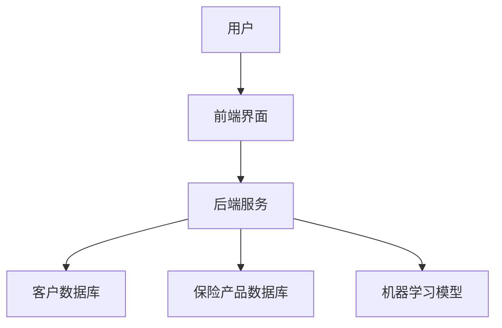

                 


# AI在保险产品个性化定制中的深度应用

## 关键词
- 人工智能, 保险产品, 个性化定制, 机器学习, 深度学习, 自然语言处理

## 摘要
随着保险行业的数字化转型，个性化保险产品的市场需求日益增长。人工智能技术在保险产品定制中的应用逐渐成为行业关注的焦点。本文深入探讨了AI技术在保险产品个性化定制中的核心概念、算法原理、系统架构设计及项目实战，系统分析了保险产品个性化定制的背景、挑战与解决方案，展望了AI技术在保险产品定制中的未来发展方向。

---

# 第1章: 保险产品个性化定制的背景与挑战

## 1.1 保险行业的数字化转型

### 1.1.1 保险行业的现状与发展趋势
保险行业正经历数字化转型，传统保险产品逐渐向个性化、智能化方向发展。市场需求的多样化和客户期望的提升推动了保险行业的技术革新。

### 1.1.2 个性化保险产品的市场需求
客户对个性化保险产品的需求日益增长，传统标准化产品难以满足客户的多样化需求。

### 1.1.3 数字化转型对保险行业的推动作用
数字化转型通过技术手段优化保险产品的设计和销售流程，提升客户体验，降低成本。

## 1.2 AI技术在保险行业的应用现状

### 1.2.1 AI技术在保险行业的应用领域
- **客户画像与需求分析**：利用机器学习和大数据分析技术，精准识别客户需求。
- **风险评估与定价**：基于AI算法，实现个性化风险评估和保险产品定价。

### 1.2.2 当前AI技术在保险产品定制中的局限性
- **数据质量与完整性**：数据收集和处理过程中存在数据缺失和不准确的问题。
- **模型解释性**：复杂AI模型的解释性较差，难以满足保险行业的监管要求。

### 1.2.3 保险产品个性化定制的未来趋势
- **智能化与自动化**：AI技术将进一步推动保险产品的智能化设计和自动化销售。
- **客户体验优化**：个性化定制将更加注重客户体验，实现真正的“以客户为中心”的保险产品设计。

## 1.3 保险产品个性化定制的核心问题

### 1.3.1 客户需求的多样性与复杂性
客户的需求多样化，不同客户对保险产品的关注点和需求程度不同。

### 1.3.2 保险产品的标准化与个性化之间的矛盾
保险产品的标准化设计难以满足客户的个性化需求，需要在标准化与个性化之间找到平衡点。

### 1.3.3 数据驱动的个性化定制的可行性与挑战
数据驱动的个性化定制需要大量的高质量数据支持，数据收集和处理过程中的挑战是实现个性化定制的关键障碍。

## 1.4 本章小结
保险产品的个性化定制是保险行业数字化转型的重要方向，AI技术的应用为实现个性化定制提供了技术支撑。然而，数据质量、模型解释性和个性化设计的平衡等问题仍需要进一步研究和解决。

---

# 第2章: AI与保险产品个性化定制的核心概念

## 2.1 AI技术的核心概念与原理

### 2.1.1 机器学习的基本原理
- **监督学习**：通过标注数据进行模型训练，预测新的数据。
- **无监督学习**：通过数据聚类和降维技术，发现数据中的潜在模式。
- **强化学习**：通过与环境的交互，学习最优策略。

### 2.1.2 深度学习的核心算法
- **神经网络**：模拟人脑神经网络的结构和功能，用于特征提取和分类。
- **卷积神经网络(CNN)**：广泛应用于图像识别和处理。
- **循环神经网络(RNN)**：适用于序列数据的处理，如自然语言处理。

### 2.1.3 自然语言处理在保险产品定制中的应用
- **文本分类**：用于客户需求分析和保险产品推荐。
- **情感分析**：分析客户对保险产品的反馈和评价，优化产品设计。

## 2.2 保险产品个性化定制的核心要素

### 2.2.1 客户画像与需求分析
- **客户画像**：通过数据分析和机器学习，构建客户的三维画像，包括年龄、职业、收入、风险偏好等。
- **需求分析**：基于客户画像，分析客户的保险需求，包括保障范围、保费预算、赔付比例等。

### 2.2.2 保险产品的模块化设计
- **模块化设计**：将保险产品分解为多个模块，每个模块对应特定的保障范围和保费。
- **动态调整**：根据客户需求的变化，实时调整保险产品的模块组合和保费。

### 2.2.3 数据驱动的动态调整机制
- **实时数据采集**：通过传感器、API接口等方式，实时采集客户的保险需求变化数据。
- **动态优化算法**：基于实时数据，动态优化保险产品的模块组合和保费，满足客户的个性化需求。

## 2.3 AI与保险产品定制的关联性分析

### 2.3.1 数据驱动的个性化定制
- **数据采集**：通过多种渠道采集客户数据，包括线上和线下的数据源。
- **数据清洗与预处理**：对采集到的数据进行清洗、去重和特征提取，确保数据质量。
- **数据建模与分析**：基于机器学习和深度学习算法，构建客户画像和需求分析模型。

### 2.3.2 AI算法在保险产品设计中的应用
- **需求预测**：通过机器学习算法，预测客户的保险需求，优化产品设计。
- **风险评估**：利用深度学习算法，评估客户的健康风险和财务风险，优化保险产品的风险控制。

### 2.3.3 保险产品定制的实时反馈与优化
- **实时反馈机制**：通过客户反馈和市场数据，实时调整保险产品的设计和定价。
- **动态优化**：基于实时反馈，优化保险产品的模块组合和保费，提升客户满意度和产品竞争力。

## 2.4 核心概念属性对比表

| 概念       | 属性1         | 属性2         | 属性3         |
|------------|---------------|---------------|---------------|
| AI技术     | 数据驱动       | 智能化         | 自适应         |
| 保险产品定制 | 客户需求驱动 | 模块化设计     | 动态调整       |

---

# 第3章: AI算法在保险产品个性化定制中的应用

## 3.1 机器学习算法在保险产品定制中的应用

### 3.1.1 线性回归算法
- **算法原理**：通过最小化预测值与实际值之间的平方差，构建线性回归模型。
- **应用场景**：用于保险产品的定价和保费预测。

### 3.1.2 支持向量机(SVM)
- **算法原理**：通过构建超平面，将数据点分类到不同的类别中。
- **应用场景**：用于客户画像和需求分类，优化保险产品的模块化设计。

## 3.2 深度学习算法在保险产品定制中的应用

### 3.2.1 卷积神经网络(CNN)
- **算法原理**：通过卷积层和池化层，提取图像特征，用于图像识别和处理。
- **应用场景**：用于保险产品的图像识别和客户画像分析。

### 3.2.2 循环神经网络(RNN)
- **算法原理**：通过循环结构处理序列数据，捕捉时序关系。
- **应用场景**：用于保险产品的需求预测和市场趋势分析。

## 3.3 自然语言处理在保险产品定制中的应用

### 3.3.1 文本分类
- **算法原理**：通过文本特征提取和分类器训练，实现文本分类。
- **应用场景**：用于客户反馈分析和保险产品推荐。

### 3.3.2 情感分析
- **算法原理**：通过情感词典和深度学习模型，分析文本中的情感倾向。
- **应用场景**：用于客户满意度分析和保险产品优化。

---

# 第4章: 保险产品个性化定制的系统架构设计

## 4.1 系统功能设计

### 4.1.1 客户画像模块
- **功能描述**：基于客户数据构建客户画像，分析客户的需求和偏好。
- **实现方案**：使用机器学习算法，对客户数据进行分类和聚类。

### 4.1.2 保险产品模块化设计模块
- **功能描述**：将保险产品分解为多个模块，动态调整模块组合。
- **实现方案**：基于客户画像和需求分析，优化保险产品的模块化设计。

## 4.2 系统架构设计

### 4.2.1 系统架构图


### 4.2.2 系统接口设计
- **API接口**：提供RESTful API接口，实现前后端的数据交互。
- **数据接口**：与第三方数据源对接，获取客户数据和市场数据。

---

# 第5章: 保险产品个性化定制的项目实战

## 5.1 环境安装

### 5.1.1 安装Python和相关库
```bash
pip install numpy pandas scikit-learn tensorflow
```

## 5.2 核心代码实现

### 5.2.1 客户画像构建
```python
import numpy as np
import pandas as pd

# 加载客户数据
data = pd.read_csv('customer_data.csv')

# 数据清洗
data = data.dropna()

# 数据特征提取
X = data[['age', 'income', 'risk_preference']]
y = data['insurance_type']

# 模型训练
from sklearn.tree import DecisionTreeClassifier
model = DecisionTreeClassifier()
model.fit(X, y)
```

### 5.2.2 保险产品模块化设计
```python
def calculate_premium(age, income, risk_preference):
    # 风险评估
    risk_level = {'low': 0.8, 'medium': 1.2, 'high': 1.5}[risk_preference]
    # 保费计算
    base_premium = 100
    premium = base_premium * (1 + age/100) * risk_level
    return premium

# 示例计算
print(calculate_premium(30, 50000, 'high'))  # 输出：150.0
```

## 5.3 代码解读与分析

### 5.3.1 客户画像构建代码解读
- **数据加载**：读取客户数据，清洗数据，提取特征。
- **模型训练**：使用决策树算法训练客户画像分类模型，识别不同客户群体。

### 5.3.2 保险产品模块化设计代码解读
- **函数定义**：定义计算保费的函数，根据客户年龄、收入和风险偏好计算保费。
- **示例计算**：计算特定客户的保费，展示函数的实现。

---

# 第6章: 总结与展望

## 6.1 总结
本文详细探讨了AI技术在保险产品个性化定制中的应用，分析了保险产品个性化定制的核心概念和算法原理，提出了系统的架构设计和项目实战方案。通过AI技术的应用，保险产品可以实现个性化设计和动态调整，满足客户的多样化需求。

## 6.2 未来展望
随着AI技术的不断发展，保险产品个性化定制将更加智能化和自动化。未来的研究方向包括提高AI模型的解释性、优化数据采集和处理技术、加强跨领域技术的融合，推动保险行业的进一步创新和发展。

---

# 最佳实践 tips

## 6.3 小结
保险产品个性化定制的成功离不开数据的收集、分析和处理，AI技术的应用为保险产品的设计和销售提供了强有力的技术支持。

## 6.4 注意事项
- 数据隐私和安全问题需要高度重视，确保客户数据的合法使用和保护。
- 在实际应用中，需结合具体业务场景，选择合适的AI算法和模型。

## 6.5 拓展阅读
- 《机器学习实战》
- 《深度学习入门：基于Python的理论与实现》
- 《自然语言处理入门：基于Python的理论与实现》

---

# 作者

作者：AI天才研究院/AI Genius Institute & 禅与计算机程序设计艺术/Zen And The Art of Computer Programming

