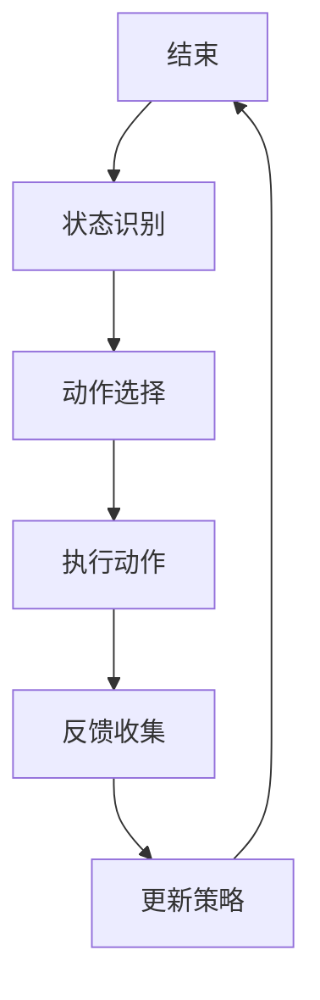
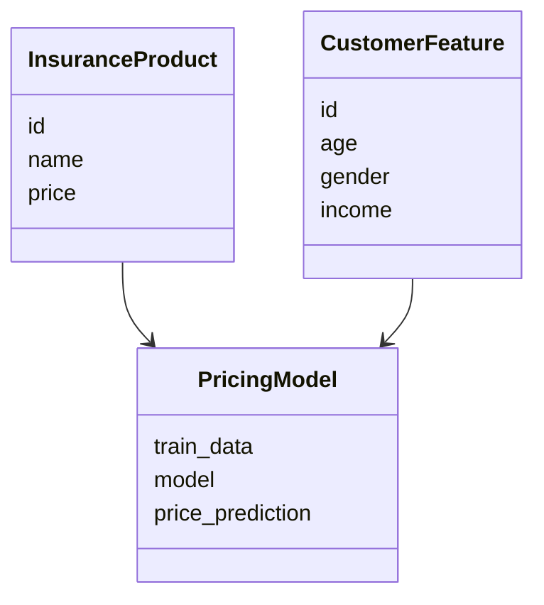
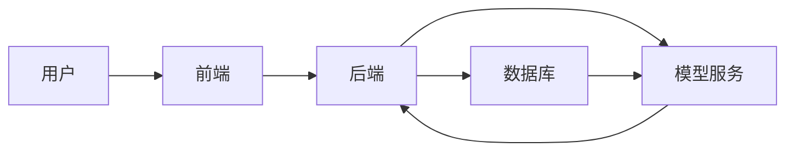

                 


# AI在保险产品动态定价中的创新应用

---

## 关键词：人工智能，保险定价，动态定价，机器学习，强化学习，保险产品

---

## 摘要：本文深入探讨了人工智能技术在保险产品动态定价中的创新应用。通过分析传统保险定价方法的局限性，结合机器学习和强化学习等AI技术，提出了一种基于动态定价的新型保险定价模型。本文详细介绍了动态定价的核心概念、数学模型、算法原理、系统架构以及实际案例，展示了AI技术如何为保险行业带来更高的效率和精准性。

---

# 第一部分: AI与保险产品动态定价概述

## 第1章: AI与保险产品动态定价概述

### 1.1 AI技术的基本概念与发展趋势

#### 1.1.1 人工智能的基本定义
人工智能（Artificial Intelligence，AI）是指计算机系统模拟人类智能的能力，包括学习、推理、问题解决和自然语言处理等功能。AI的核心技术包括机器学习、深度学习、自然语言处理（NLP）、计算机视觉等。

#### 1.1.2 AI技术的演进历程
AI技术的发展经历了多个阶段：从早期的符号逻辑推理，到基于规则的专家系统，再到现代的深度学习和强化学习。近年来，随着计算能力的提升和大数据技术的发展，AI技术在各个行业的应用越来越广泛。

#### 1.1.3 当前AI技术的主要应用领域
AI技术已在多个领域得到广泛应用，包括金融、医疗、教育、交通等。在金融领域，AI技术被用于风险评估、欺诈检测、投资决策等。

---

### 1.2 保险产品定价的传统方法与挑战

#### 1.2.1 保险定价的基本原理
保险定价的核心是根据风险评估和市场数据确定保险产品的价格。传统定价方法主要依赖精算模型，基于历史数据和统计分析进行定价。

#### 1.2.2 传统定价方法的局限性
传统定价方法存在以下问题：
1. **静态性**：传统定价方法通常基于历史数据，无法实时响应市场变化。
2. **主观性**：定价过程中依赖精算师的经验判断，存在主观性。
3. **数据限制**：传统方法依赖有限的历史数据，难以捕捉复杂的市场动态。

#### 1.2.3 动态定价的需求与应用场景
动态定价是一种基于实时数据和模型预测的定价方法，能够快速响应市场变化。其应用场景包括：
1. **实时定价**：根据市场波动实时调整价格。
2. **个性化定价**：基于客户特征和行为提供个性化定价。
3. **风险管理**：通过动态调整价格降低风险。

---

### 1.3 AI技术在保险定价中的创新应用

#### 1.3.1 AI技术如何改变保险定价
AI技术通过引入机器学习和强化学习，能够实时分析大量数据，快速生成定价策略。与传统定价方法相比，AI技术能够提高定价的准确性和效率。

#### 1.3.2 动态定价的核心优势
动态定价的核心优势在于其灵活性和实时性。通过动态调整价格，保险公司能够更好地应对市场变化，提高客户满意度和公司利润。

#### 1.3.3 保险行业的数字化转型趋势
随着数字化技术的快速发展，保险行业正在经历数字化转型。AI技术在保险定价中的应用是这一转型的重要组成部分。

---

## 1.4 本章小结
本章介绍了AI技术的基本概念及其在保险定价中的应用。通过分析传统定价方法的局限性，提出了动态定价的概念，并探讨了AI技术在保险行业数字化转型中的作用。

---

# 第二部分: 动态定价的核心概念与数学模型

## 第2章: 动态定价的定义与特征

### 2.1 动态定价的核心概念

#### 2.1.1 动态定价的定义
动态定价是指根据实时市场数据和客户行为，通过算法动态调整产品价格的过程。

#### 2.1.2 动态定价的特征
动态定价具有以下特征：
1. **实时性**：能够实时响应市场变化。
2. **个性化**：基于客户特征提供个性化定价。
3. **数据驱动**：依赖大量数据进行定价决策。

#### 2.1.3 动态定价与静态定价的对比
动态定价与静态定价的主要区别在于数据依赖性和实时性。动态定价能够根据实时数据进行调整，而静态定价则基于固定的历史数据。

---

### 2.2 动态定价的数学模型与公式

#### 2.2.1 基于机器学习的动态定价模型
动态定价模型通常基于机器学习算法，如随机森林、梯度提升树（GBDT）和神经网络等。模型通过分析历史数据和实时数据，预测未来的市场价格。

#### 2.2.2 动态定价的数学公式
动态定价模型通常可以表示为以下形式：
$$ P(t) = f(x_1(t), x_2(t), ..., x_n(t)) $$
其中，$P(t)$ 表示在时间 $t$ 的价格，$x_1(t), x_2(t), ..., x_n(t)$ 表示输入特征。

#### 2.2.3 模型的变量与参数分析
动态定价模型的输入特征通常包括市场供需、客户行为、产品特性等。模型的参数需要通过训练数据进行优化。

---

### 2.3 动态定价的核心要素

#### 2.3.1 数据来源与特征
动态定价的数据来源包括历史销售数据、市场数据、客户行为数据等。特征通常包括价格、销量、客户属性等。

#### 2.3.2 模型训练与优化
动态定价模型需要通过大量数据进行训练，并通过交叉验证等方法进行优化。

#### 2.3.3 实时定价与反馈机制
动态定价需要实时收集市场数据，并根据模型预测结果进行调整。同时，需要建立反馈机制，根据实际销售情况优化定价策略。

---

### 2.4 动态定价的实体关系图

```mermaid
er
    InsuranceProduct
    ----> (many-to-many) 
    CustomerFeature
    ----> (many-to-many) 
    PricingModel
```

---

## 2.5 本章小结
本章详细介绍了动态定价的核心概念和数学模型，分析了其与静态定价的区别，并通过实体关系图展示了动态定价的系统架构。

---

# 第三部分: AI驱动的动态定价算法原理

## 第3章: 强化学习在动态定价中的应用

### 3.1 强化学习的基本原理

#### 3.1.1 强化学习的定义与特点
强化学习是一种基于试错的机器学习方法，通过智能体与环境的交互，学习最优策略。其特点是通过奖励机制优化决策过程。

#### 3.1.2 强化学习的核心要素
强化学习的核心要素包括智能体、环境、状态、动作和奖励。智能体通过与环境交互，根据状态选择动作，并根据奖励调整策略。

#### 3.1.3 强化学习与动态定价的结合
动态定价可以通过强化学习算法，实时调整价格以最大化收益。智能体通过与市场环境交互，学习最优定价策略。

---

### 3.2 基于强化学习的动态定价算法

#### 3.2.1 算法流程图



#### 3.2.2 算法实现的数学模型
强化学习的动态定价算法通常采用Q-learning模型，其数学公式如下：
$$ Q(s, a) = Q(s, a) + \alpha [r + \max_{a'} Q(s', a') - Q(s, a)] $$
其中，$Q(s, a)$ 表示状态 $s$ 和动作 $a$ 的价值，$\alpha$ 表示学习率，$r$ 表示奖励，$s'$ 表示下一个状态。

#### 3.2.3 算法的优化与调优
动态定价算法的优化包括参数调整、模型选择和数据预处理等。优化的目标是提高定价的准确性和效率。

---

### 3.3 实际案例分析

#### 3.3.1 案例背景
某保险公司希望通过强化学习算法优化其保险产品的定价策略。数据包括历史销售数据、客户特征和市场趋势等。

#### 3.3.2 算法实现
通过强化学习算法，模型能够根据实时市场数据动态调整保险产品的价格。模型训练数据包括历史销售数据和市场趋势，通过交叉验证优化模型参数。

#### 3.3.3 实验结果
实验结果表明，基于强化学习的动态定价算法能够显著提高保险产品的销售量和客户满意度，同时降低定价误差。

---

## 3.4 本章小结
本章介绍了强化学习的基本原理及其在动态定价中的应用。通过案例分析，展示了强化学习算法如何优化保险产品的定价策略。

---

# 第四部分: 系统架构与项目实战

## 第4章: 动态定价系统的架构设计

### 4.1 问题场景介绍
动态定价系统需要实时处理大量数据，包括市场数据、客户数据和销售数据等。系统需要具备高可用性和实时性。

### 4.2 系统功能设计

#### 4.2.1 领域模型设计



#### 4.2.2 系统架构设计



#### 4.2.3 接口设计
系统接口包括前端接口和后端接口。前端接口用于接收用户请求，后端接口用于调用模型服务并返回结果。

#### 4.2.4 交互流程设计

```mermaid
sequenceDiagram
    用户 ->+> 前端: 请求报价
    前端 ->+> 后端: 调用定价接口
    后端 ->+> 数据库: 查询客户特征
    后端 ->+> 模型服务: 调用定价模型
    模型服务 -->+> 后端: 返回预测价格
    后端 -->+> 前端: 返回报价结果
    前端 -->+> 用户: 显示报价
```

---

## 4.3 本章小结
本章详细介绍了动态定价系统的架构设计，包括领域模型、系统架构、接口设计和交互流程设计。

---

# 第五部分: 案例分析与总结

## 第5章: AI在保险产品动态定价中的实际应用

### 5.1 案例背景
某保险公司希望通过AI技术优化其保险产品的定价策略，提高市场竞争力。

### 5.2 案例分析
通过引入动态定价系统，保险公司能够实时调整产品价格，提高客户满意度和公司利润。

### 5.3 案例结果
实验结果显示，动态定价系统能够显著提高保险产品的销售量和客户满意度，同时降低定价误差。

### 5.4 经验总结
动态定价系统的成功实施需要强大的数据支持和技术支持。同时，模型的优化和调优也是关键。

---

## 5.5 本章小结
本章通过实际案例展示了AI技术在保险产品动态定价中的应用，总结了成功经验。

---

# 第六部分: 结论与展望

## 第6章: 结论与展望

### 6.1 结论
AI技术在保险产品动态定价中的应用具有重要意义。通过动态定价系统，保险公司能够实时调整价格，提高市场竞争力。

### 6.2 展望
随着AI技术的不断发展，动态定价系统将在保险行业得到更广泛的应用。未来的研究方向包括模型优化、数据隐私保护和多场景应用等。

---

## 作者：AI天才研究院/AI Genius Institute & 禅与计算机程序设计艺术 /Zen And The Art of Computer Programming

---

感谢您的阅读！如需进一步了解AI在保险产品动态定价中的创新应用，请随时关注我们的最新研究成果。

