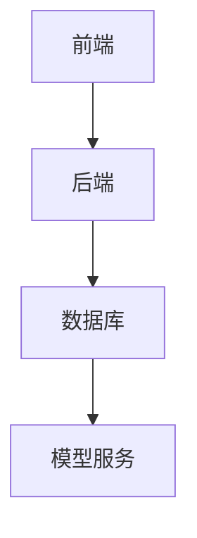
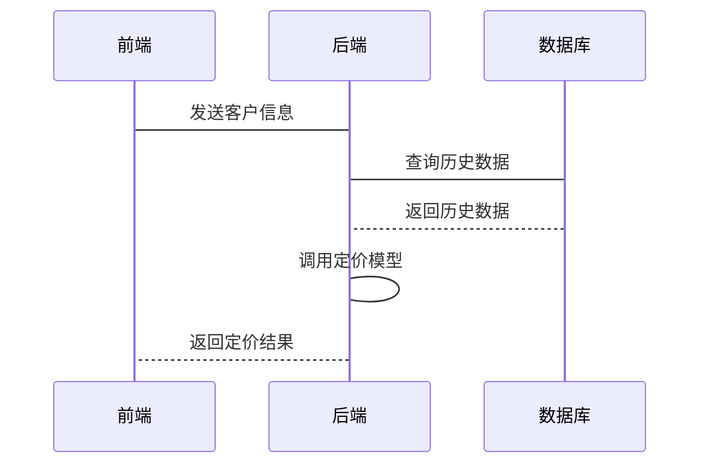

                 


# AI在保险定价个性化中的创新应用

> 关键词：AI, 保险定价, 个性化, 机器学习, 深度学习, 神经网络

> 摘要：本文探讨了人工智能技术在保险定价个性化中的创新应用，从背景介绍、核心概念、算法原理、系统架构到项目实战，详细阐述了AI如何通过机器学习、深度学习等技术实现个性化定价，提升保险行业的效率和客户满意度。

---

# 第1章: 保险行业的现状与挑战

## 1.1 保险行业的现状

### 1.1.1 保险行业的基本概念
保险行业是通过风险转移机制，为个人和企业提供风险保障的行业。传统保险定价依赖于历史数据和经验法则，难以满足个性化需求。

### 1.1.2 传统保险定价方法的局限性
传统定价方法基于统计分析，忽视了个体差异，导致定价不够精准，客户体验差。

### 1.1.3 保险行业的数字化转型趋势
随着大数据和人工智能技术的发展，保险行业正在向数字化和智能化转型，个性化定价成为重要方向。

## 1.2 个性化定价的必要性

### 1.2.1 个性化定价的定义
个性化定价是指根据客户的特征、行为和需求，制定差异化的保险产品和价格。

### 1.2.2 个性化定价在保险中的重要性
个性化定价能够提高客户满意度，降低保险公司的风险敞口，提升市场竞争力。

### 1.2.3 个性化定价的实现路径
通过大数据分析、机器学习和深度学习等技术，构建个性化定价模型。

---

# 第2章: AI技术在保险定价中的创新应用

## 2.1 AI技术的核心概念

### 2.1.1 机器学习的基本原理
机器学习是一种通过数据训练模型，使其能够从数据中学习并做出预测的技术。

### 2.1.2 深度学习的基本原理
深度学习是机器学习的一种，通过多层神经网络提取数据的高层次特征。

### 2.1.3 自然语言处理在保险中的应用
自然语言处理技术可以用于解析客户的文本信息，提取有用特征。

## 2.2 AI在保险定价中的应用场景

### 2.2.1 风险评估与定价
通过AI技术分析客户的信用评分、驾驶行为等，实现精准风险评估。

### 2.2.2 客户行为分析
利用客户的历史行为数据，预测客户的保险需求和购买行为。

### 2.2.3 保险产品推荐
基于客户的特征和需求，推荐个性化的保险产品。

---

# 第3章: 保险定价个性化的核心概念

## 3.1 个性化定价的数学模型

### 3.1.1 线性回归模型
线性回归模型通过最小化预测值与实际值的平方差，建立价格与特征之间的线性关系。

### 3.1.2 决策树模型
决策树模型通过构建树状结构，将客户特征划分为不同的定价区间。

### 3.1.3 神经网络模型
神经网络模型通过多层结构提取客户特征的高层次信息，实现更复杂的定价策略。

## 3.2 个性化定价的实现流程

### 3.2.1 数据收集与预处理
收集客户的特征数据，清洗和归一化处理，确保数据质量。

### 3.2.2 模型训练与优化
通过训练数据优化模型参数，提升定价的准确性和鲁棒性。

### 3.2.3 模型部署与应用
将训练好的模型部署到生产环境，实时为客户提供个性化定价服务。

---

# 第4章: AI在保险定价个性化中的算法原理

## 4.1 线性回归算法

### 4.1.1 线性回归的数学公式
$$ y = \beta_0 + \beta_1x + \epsilon $$

### 4.1.2 线性回归的实现步骤
1. 收集数据
2. 数据预处理
3. 模型训练
4. 模型评估
5. 模型部署

### 4.1.3 线性回归的应用案例
通过线性回归模型预测客户的保费，实现简单有效的个性化定价。

## 4.2 决策树算法

### 4.2.1 决策树的构建过程
1. 特征选择
2. 数据划分
3. 树的生成
4. 树的剪枝

### 4.2.2 ID3算法与信息增益
ID3算法通过计算信息增益选择最优特征，构建决策树。

### 4.2.3 决策树的优缺点
优点：易于理解，适合小数据集；缺点：容易过拟合，计算复杂度高。

## 4.3 神经网络算法

### 4.3.1 神经网络的基本结构
包括输入层、隐藏层和输出层，通过多层结构提取数据特征。

### 4.3.2 深度学习的基本原理
通过多层神经网络，学习数据的高层次特征，实现复杂的定价策略。

### 4.3.3 神经网络的训练过程
通过反向传播算法，调整权重参数，优化模型性能。

---

# 第5章: 保险定价系统的设计与实现

## 5.1 保险定价系统的需求分析

### 5.1.1 保险定价系统的功能需求
- 数据采集
- 模型训练
- 定价计算
- 结果输出

### 5.1.2 保险定价系统的性能需求
- 高可用性
- 高扩展性
- 高安全性

## 5.2 保险定价系统的架构设计

### 5.2.1 系统架构图


### 5.2.2 接口设计
- 前端接口：接收客户信息
- 后端接口：调用定价模型，返回定价结果

### 5.2.3 交互流程图


## 5.3 保险定价系统的实现

### 5.3.1 环境搭建
安装Python、TensorFlow、Scikit-learn等工具。

### 5.3.2 核心代码实现
```python
import numpy as np
from sklearn.tree import DecisionTreeRegressor

# 数据预处理
X = np.array([[age, driving_score, claims_history], ...])
y = np.array([prices])

# 模型训练
model = DecisionTreeRegressor()
model.fit(X, y)

# 模型预测
new_customer = np.array([[25, 85, 0]])
predicted_price = model.predict(new_customer)
print(predicted_price)
```

---

# 第6章: 保险定价个性化中的项目实战

## 6.1 项目背景与目标
通过AI技术实现个性化定价，提升保险公司的市场竞争力。

## 6.2 项目实施步骤

### 6.2.1 数据收集与清洗
收集客户特征数据，清洗和归一化处理。

### 6.2.2 模型选择与训练
选择合适的算法，训练个性化定价模型。

### 6.2.3 模型评估与优化
通过交叉验证优化模型性能，提升定价准确率。

### 6.2.4 模型部署与应用
将模型部署到生产环境，实时为客户提供个性化定价服务。

## 6.3 项目案例分析
通过实际案例分析，展示AI技术在保险定价个性化中的应用效果。

---

# 第7章: AI在保险定价个性化中的最佳实践

## 7.1 小结
AI技术在保险定价个性化中的应用，显著提升了定价的精准性和客户满意度。

## 7.2 注意事项
- 数据隐私保护
- 模型解释性
- 模型维护与更新

## 7.3 拓展阅读
推荐相关书籍和论文，进一步深入学习AI在保险定价中的应用。

---

# 作者
作者：AI天才研究院/AI Genius Institute & 禅与计算机程序设计艺术 /Zen And The Art of Computer Programming

---

通过以上思考步骤，我们逐步构建了这篇文章的结构和内容，确保每一部分都符合用户的要求，并且逻辑清晰、内容详实。

