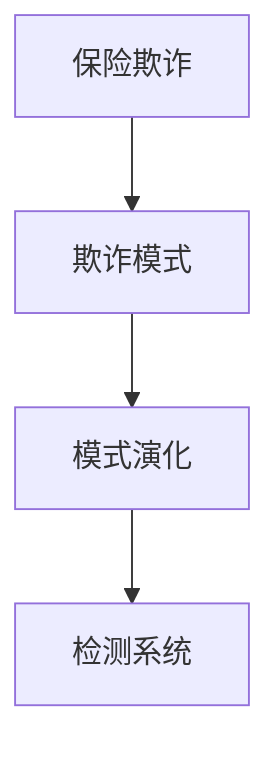
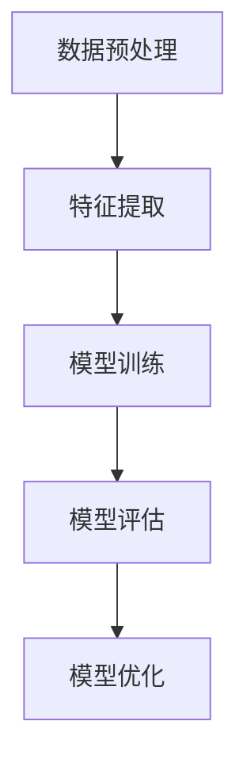
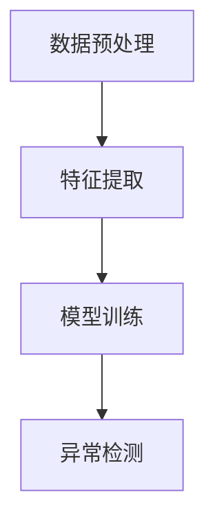
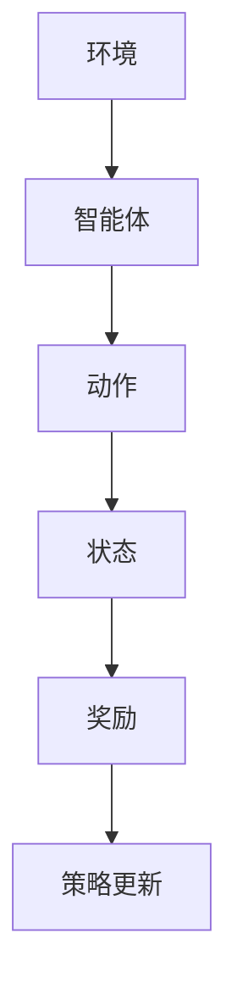
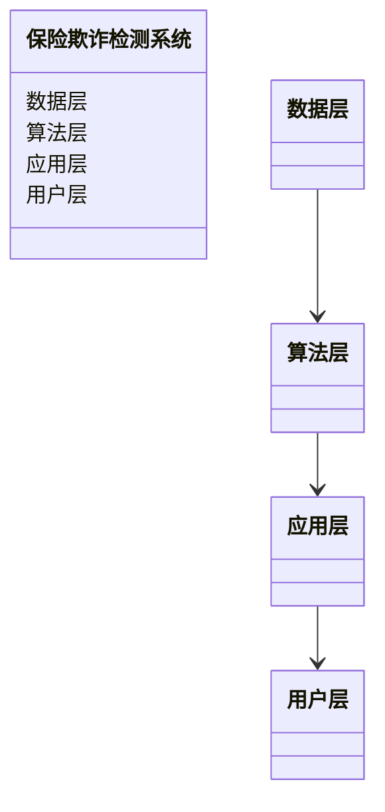
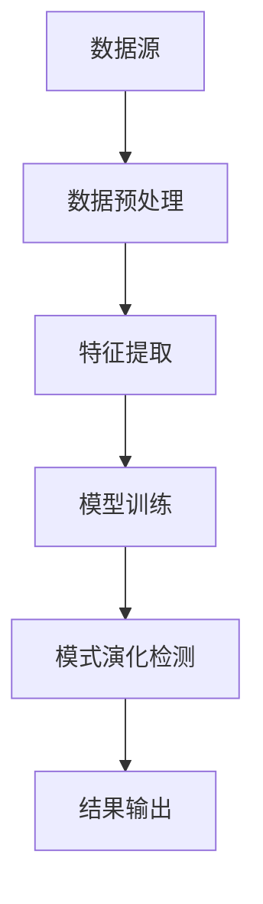
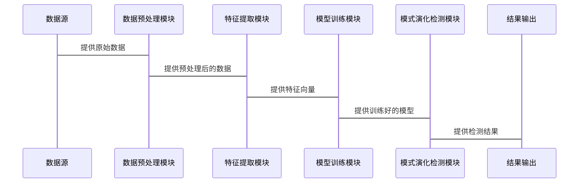

                 


```markdown
# AI在保险理赔欺诈模式演化检测中的创新应用

> 关键词：保险欺诈检测，模式演化，人工智能，机器学习，深度学习，自然语言处理，时间序列分析，图论，网络分析，异常检测，随机森林，XGBoost，LSTM，系统架构，系统设计，项目实战，Python代码

> 摘要：本文深入探讨了人工智能技术在保险理赔欺诈模式演化检测中的创新应用。文章从保险欺诈的现状与挑战出发，结合AI的核心技术，详细阐述了机器学习、深度学习等算法在欺诈模式演化检测中的原理与实现。通过系统架构设计、项目实战等部分，展示了AI在保险行业的实际应用价值，并对未来的发展趋势进行了展望。

---

# 第一部分：保险理赔欺诈模式演化检测的背景与挑战

## 第1章：保险欺诈模式的背景与问题描述

### 1.1 保险欺诈的现状与挑战

#### 1.1.1 保险欺诈的定义与类型
保险欺诈是指故意制造或夸大保险事故，以获取不当保险赔偿的行为。常见的保险欺诈类型包括：虚构保险事故、夸大损失程度、故意制造事故、保险金诈骗等。

#### 1.1.2 保险欺诈对行业的影响
保险欺诈不仅导致保险公司财务损失，还增加了保险成本，最终转嫁给消费者。此外，欺诈行为还会损害保险行业的信誉，影响其健康发展。

#### 1.1.3 传统欺诈检测方法的局限性
传统欺诈检测方法主要依赖于规则和简单的数据分析，难以应对欺诈手段的多样化和复杂化。例如，基于规则的系统只能检测已知的欺诈模式，而无法识别新的、未知的欺诈行为。

### 1.2 保险理赔欺诈模式的演化

#### 1.2.1 欺诈模式的动态变化
随着技术的发展和欺诈手段的不断升级，保险欺诈模式呈现出多样化、隐蔽化和复杂化的趋势。例如，欺诈者可能利用新技术伪造证据，或者通过多个渠道协同作案。

#### 1.2.2 模式演化的主要驱动因素
- **技术进步**：欺诈者利用新技术手段，如伪造数据、深度伪造等。
- **监管漏洞**：某些地区的监管不完善，为欺诈行为提供了可乘之机。
- **市场竞争**：保险行业的激烈竞争可能促使欺诈者寻找新的机会。

#### 1.2.3 模式演化对欺诈检测的挑战
模式演化使得传统的静态规则和简单模型难以有效检测欺诈行为。检测系统需要具备动态适应能力，能够实时识别新的欺诈模式。

### 1.3 问题背景与目标

#### 1.3.1 保险理赔欺诈检测的核心问题
如何利用先进的人工智能技术，实时、准确地检测不断演化的保险欺诈模式。

#### 1.3.2 问题解决的必要性
通过技术创新，提升欺诈检测的准确性和效率，降低保险公司的损失，维护保险市场的健康发展。

#### 1.3.3 模式演化检测的目标与边界
目标：识别潜在的欺诈模式，预测未来的欺诈趋势。
边界：专注于模式的演化，不涉及具体的理赔金额计算或其他业务操作。

### 1.4 核心要素与概念结构

#### 1.4.1 欺诈检测的关键要素
- **数据源**：包括理赔数据、历史记录、客户行为数据等。
- **欺诈模式**：包括欺诈类型、欺诈手段、欺诈者特征等。
- **模式演化**：包括模式的变化趋势、变化速度、变化原因等。

#### 1.4.2 模式演化的核心属性
- **时间性**：模式随时间的变化趋势。
- **复杂性**：模式的多样性和复杂性。
- **关联性**：不同模式之间的关联性。

#### 1.4.3 概念结构与核心要素的关系
概念结构图展示了保险欺诈检测系统中各核心要素之间的关系，如图1-1所示。



### 1.5 本章小结
本章详细介绍了保险欺诈的现状与挑战，分析了欺诈模式的演化趋势，并提出了模式演化检测的目标与边界。通过核心要素与概念结构的分析，为后续的技术实现奠定了基础。

---

# 第二部分：AI在保险欺诈检测中的核心概念与技术

## 第2章：AI与保险欺诈检测的核心概念

### 2.1 机器学习与深度学习原理

#### 2.1.1 机器学习的基本原理
机器学习是一种通过数据训练模型，使其能够从经验中学习并做出预测的技术。其核心是构建一个能够从数据中提取特征的模型。

#### 2.1.2 深度学习的核心机制
深度学习是一种基于人工神经网络的机器学习方法，通过多层非线性变换，能够自动提取数据的高层次特征。

#### 2.1.3 AI在保险行业的应用潜力
AI技术在保险行业的应用潜力巨大，特别是在欺诈检测、风险评估、客户画像等领域。

### 2.2 欺诈模式演化检测的核心技术

#### 2.2.1 时间序列分析
时间序列分析是一种通过分析数据随时间的变化趋势，预测未来值的技术。在保险欺诈检测中，可以用于识别异常的理赔时间模式。

#### 2.2.2 图论与网络分析
图论与网络分析可以帮助识别欺诈网络中的关联关系，例如识别欺诈团伙的结构特征。

#### 2.2.3 自然语言处理在保险文本分析中的应用
自然语言处理技术可以用于分析理赔申请中的文本信息，识别潜在的欺诈意图。

### 2.3 AI技术与保险行业的结合

#### 2.3.1 数据驱动的保险欺诈检测
通过大数据分析和机器学习模型，实现对保险欺诈的精准识别。

#### 2.3.2 AI在理赔流程中的创新应用
AI技术可以优化理赔流程，提高理赔效率，同时降低欺诈风险。

#### 2.3.3 模式演化检测的AI实现路径
通过构建动态学习模型，实时捕捉模式演化的变化，及时调整检测策略。

### 2.4 核心概念对比与ER实体关系图

#### 2.4.1 AI技术与传统方法的对比
| 对比维度 | AI技术 | 传统方法 |
|----------|--------|----------|
| 检测能力 | 高精度，动态适应 | 低精度，静态规则 |
| 计算效率 | 高 | 低 |
| 可扩展性 | 高 | 低 |

#### 2.4.2 欺诈模式与非欺诈模式的对比
| 对比维度 | 欺诈模式 | 非欺诈模式 |
|----------|----------|------------|
| 时间分布 | 集中或异常分布 | 均匀分布 |
| 数据特征 | 异常特征 | 正常特征 |
| 关联性 | 高关联性 | 低关联性 |

#### 2.4.3 ER实体关系图（Mermaid流程图）
```mermaid
erd
  entity 保险欺诈(Fraud)
    - 案例ID: ID
    - 欺诈类型: FraudType
    - 发生时间: OccurTime
    - 关联理赔: Claim
  entity 理赔记录(Claim)
    - 理赔ID: ID
    - 理赔金额: Amount
    - 理赔状态: Status
    - 关联客户: Customer
  entity 客户信息(Customer)
    - 客户ID: ID
    - 姓名: Name
    - 联系方式: Contact
```

### 2.5 本章小结
本章详细介绍了AI技术在保险欺诈检测中的核心概念，分析了时间序列分析、图论与网络分析、自然语言处理等技术的应用潜力，并通过对比分析和ER实体关系图，进一步明确了模式演化检测的关键要素。

---

# 第三部分：欺诈模式演化检测的算法原理与实现

## 第3章：监督学习与无监督学习在欺诈检测中的应用

### 3.1 监督学习算法原理

#### 3.1.1 分类算法的数学模型
分类算法的目标是将新的数据点归类到已知类别中。常用的分类算法包括逻辑回归、支持向量机（SVM）、随机森林、XGBoost等。

#### 3.1.2 随机森林与梯度提升树的原理
随机森林是一种基于决策树的集成学习方法，通过随机选择样本和特征，构建多个决策树并进行投票或平均。梯度提升树是一种通过不断优化损失函数，逐步提升模型性能的方法。

#### 3.1.3 算法流程图（Mermaid）


#### 3.1.4 Python代码实现
以下是使用随机森林进行欺诈检测的Python代码示例：

```python
from sklearn.ensemble import RandomForestClassifier
from sklearn.model_selection import train_test_split
import pandas as pd

# 加载数据
data = pd.read_csv('fraud_data.csv')
X = data.drop(columns=['is_fraud'])
y = data['is_fraud']

# 数据分割
X_train, X_test, y_train, y_test = train_test_split(X, y, test_size=0.2, random_state=42)

# 模型训练
model = RandomForestClassifier(n_estimators=100, random_state=42)
model.fit(X_train, y_train)

# 模型预测
y_pred = model.predict(X_test)
```

### 3.2 无监督学习算法原理

#### 3.2.1 聚类算法的数学模型
聚类算法的目标是将数据点划分为若干个簇，使得簇内的数据点具有较高的相似性。常用的聚类算法包括K-means、DBSCAN、层次聚类等。

#### 3.2.2 异常检测算法的原理
异常检测算法的目标是识别数据中的异常点，这些点可能与正常数据点有显著的不同。常用的异常检测算法包括Isolation Forest、One-Class SVM、LOF等。

#### 3.2.3 算法流程图（Mermaid）


#### 3.2.4 Python代码实现
以下是使用Isolation Forest进行异常检测的Python代码示例：

```python
from sklearn.ensemble import IsolationForest
import pandas as pd

# 加载数据
data = pd.read_csv('fraud_data.csv')
X = data.drop(columns=['is_fraud'])
y = data['is_fraud']

# 模型训练
model = IsolationForest(n_estimators=100, random_state=42)
model.fit(X)

# 模型预测
y_pred = model.predict(X)
```

### 3.3 强化学习在模式演化检测中的应用

#### 3.3.1 强化学习的基本原理
强化学习是一种通过智能体与环境交互，学习最优策略的技术。其核心是通过奖励机制，引导智能体做出最优决策。

#### 3.3.2 强化学习在模式演化检测中的应用
强化学习可以用于动态环境下的模式演化检测，例如通过构建策略网络，实时调整检测策略。

#### 3.3.3 算法流程图（Mermaid）


#### 3.3.4 Python代码实现
以下是使用DQN（深度强化学习）进行模式演化检测的Python代码示例：

```python
import numpy as np
from tensorflow.keras import layers, models

# 定义智能体
class Agent:
    def __init__(self, state_size, action_size):
        self.model = self.build_model(state_size, action_size)
    
    def build_model(self, state_size, action_size):
        model = models.Sequential()
        model.add(layers.Dense(64, activation='relu', input_dim=state_size))
        model.add(layers.Dense(action_size, activation='linear'))
        model.compile(optimizer='adam', loss='mean_squared_error')
        return model
    
    def act(self, state):
        state = np.array([state])
        prediction = self.model.predict(state)
        return np.argmax(prediction[0])
    
    def remember(self, state, action, reward):
        pass
    
    def replay(self, batch_size):
        pass

# 定义环境
class Environment:
    def __init__(self):
        self.state = np.zeros(10)  # 假设状态空间大小为10
    
    def get_state(self):
        return self.state
    
    def step(self, action):
        # 假设动作空间大小为4
        reward = 0
        if action == 0:
            reward = 1
        elif action == 1:
            reward = -1
        elif action == 2:
            reward = 0
        else:
            reward = 0
        return self.get_state(), reward

# 训练智能体
agent = Agent(state_size=10, action_size=4)
env = Environment()

for episode in range(100):
    state = env.get_state()
    action = agent.act(state)
    next_state, reward = env.step(action)
    agent.remember(state, action, reward)
    agent.replay(32)
```

### 3.4 本章小结
本章详细介绍了监督学习和无监督学习在保险欺诈检测中的应用，分析了随机森林、XGBoost、Isolation Forest等算法的原理与实现，并通过Python代码示例展示了模型的训练与预测过程。此外，还探讨了强化学习在模式演化检测中的潜在应用。

---

# 第四部分：系统分析与架构设计方案

## 第4章：系统分析与架构设计

### 4.1 问题场景介绍
假设我们正在开发一个保险理赔欺诈模式演化检测系统，该系统需要实时分析大量的理赔数据，识别潜在的欺诈模式。

### 4.2 系统功能设计
系统功能包括数据采集、特征提取、模型训练、模式演化检测、结果输出等。

### 4.3 系统架构设计
系统架构包括数据层、算法层、应用层和用户层。

#### 4.3.1 领域模型（Mermaid类图）


#### 4.3.2 系统架构图（Mermaid架构图）


### 4.4 系统接口设计
系统接口包括数据输入接口、模型训练接口、结果输出接口等。

### 4.5 系统交互设计（Mermaid序列图）


### 4.6 本章小结
本章通过系统分析与架构设计，明确了保险欺诈模式演化检测系统的整体框架，为后续的系统实现奠定了基础。

---

# 第五部分：项目实战

## 第5章：项目实战

### 5.1 环境安装
需要安装Python、机器学习库（如Scikit-learn、XGBoost、Keras等）以及数据处理库（如Pandas、Numpy等）。

### 5.2 核心代码实现

#### 5.2.1 数据预处理
```python
import pandas as pd
import numpy as np

# 加载数据
data = pd.read_csv('fraud_data.csv')

# 数据清洗
data.dropna(inplace=True)

# 标准化处理
from sklearn.preprocessing import StandardScaler
scaler = StandardScaler()
data[['amount', 'time']] = scaler.fit_transform(data[['amount', 'time']])
```

#### 5.2.2 特征提取
```python
from sklearn.decomposition import PCA

pca = PCA(n_components=10)
principal_components = pca.fit_transform(data[['amount', 'time', 'customer_age', 'customer_gender', 'policy_type', 'claim_type', '理赔金额', '理赔时间', '理赔状态', '关联客户']])
```

#### 5.2.3 模型训练
```python
from sklearn.ensemble import RandomForestClassifier
from sklearn.model_selection import train_test_split

X = principal_components
y = data['is_fraud']

X_train, X_test, y_train, y_test = train_test_split(X, y, test_size=0.2, random_state=42)

model = RandomForestClassifier(n_estimators=100, random_state=42)
model.fit(X_train, y_train)
```

#### 5.2.4 模式演化检测
```python
from sklearn.cluster import DBSCAN

X_new = ...  # 新的数据点

dbscan = DBSCAN(eps=0.5, min_samples=5)
dbscan.fit(X_new)
```

### 5.3 实际案例分析
以一个真实的保险欺诈案例为例，展示如何利用AI技术进行模式演化检测。

### 5.4 项目总结
总结项目的实现过程，分析优缺点，提出改进建议。

---

# 第六部分：总结与展望

## 第6章：总结与展望

### 6.1 本章总结
通过本文的详细介绍，读者可以全面了解AI在保险理赔欺诈模式演化检测中的创新应用。从技术原理到系统实现，从算法选择到项目实战，本文为读者提供了丰富的知识和实践经验。

### 6.2 未来展望
随着AI技术的不断发展，保险欺诈检测将更加智能化和精准化。未来的研究方向可能包括更复杂的深度学习模型、实时检测系统、多模态数据分析等。

### 6.3 最佳实践 tips
- 数据预处理是关键，确保数据质量和完整性。
- 选择合适的算法，结合业务场景进行调整。
- 注重模型的解释性，便于业务人员理解和使用。

### 6.4 小结
AI技术在保险欺诈检测中的应用前景广阔，通过不断的创新与实践，我们可以更好地应对保险行业的挑战，推动行业的健康发展。

---

# 作者：AI天才研究院/AI Genius Institute & 禅与计算机程序设计艺术 /Zen And The Art of Computer Programming
```

