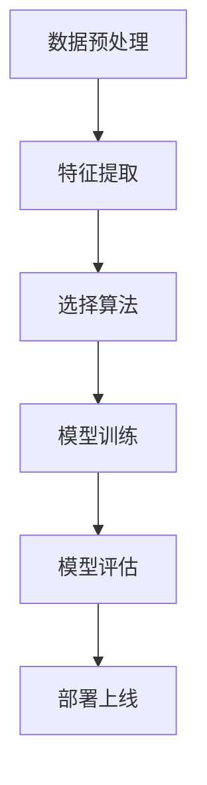

                 


# AI在保险理赔流程优化与客户体验提升中的应用

> 关键词：人工智能，保险理赔，流程优化，客户体验，自然语言处理，机器学习

> 摘要：本文探讨了人工智能技术在保险理赔流程优化与客户体验提升中的应用。通过分析传统保险理赔流程的痛点与挑战，结合AI技术的核心原理，详细阐述了机器学习、自然语言处理和深度学习在保险理赔中的具体应用场景。同时，通过实际案例分析，展示了AI技术如何有效提升理赔效率、降低运营成本，并显著改善客户体验。文章还总结了AI在保险行业中的发展趋势与最佳实践。

---

# 第1章: 保险行业的现状与挑战

## 1.1 保险行业的现状分析

### 1.1.1 保险行业的定义与分类

保险行业是通过分散风险、提供风险保障来服务社会的重要行业。保险业务主要分为寿险、财险、健康险、意外险等类别，其中财险是本文关注的重点。传统保险业务依赖人工操作，流程繁琐，效率低下，且容易出错。

### 1.1.2 当前保险行业的痛点与挑战

- **人工审核的低效性与误差**：传统理赔流程中，人工审核需要大量时间，且容易出现主观判断误差。
- **客户体验的不足**：客户在理赔过程中常常感到流程复杂、耗时长，且缺乏透明度。
- **数据孤岛与信息不对称**：保险行业存在数据分散、信息不透明的问题，难以实现高效协同。

### 1.1.3 保险行业的未来发展趋势

随着AI、大数据和云计算等技术的快速发展，保险行业正在向智能化、数字化方向转型。通过AI技术的应用，保险企业可以实现理赔流程的自动化、智能化，同时提升客户体验。

---

## 1.2 保险理赔流程的痛点与问题

### 1.2.1 传统保险理赔流程的复杂性

传统理赔流程通常包括以下几个步骤：
1. 理赔申请提交。
2. 人工审核（包括资料收集、核对、评估等）。
3. 理赔结果通知。
4. 赔款支付。

整个流程耗时长，且容易出错。

### 1.2.2 人工审核的低效性与误差

人工审核不仅效率低，还容易受到主观因素的影响，导致审核结果不一致。例如，在车险理赔中，人工审核可能出现对事故责任判定不一致的情况。

### 1.2.3 客户体验的不足与改进空间

客户在理赔过程中常常需要多次提交资料、等待长时间审核，且缺乏透明的反馈机制，导致客户满意度低。

---

## 1.3 AI技术在保险行业的应用前景

### 1.3.1 AI技术的核心优势

AI技术可以通过自动化、智能化的方式解决传统保险理赔中的痛点。例如，基于机器学习的自动理赔审核可以显著提高效率，减少人为错误。

### 1.3.2 AI在保险行业的潜在应用场景

- 自动化理赔审核。
- 基于NLP的理赔文本分析。
- 基于深度学习的理赔风险评估。

### 1.3.3 保险行业对AI技术的需求与挑战

尽管AI技术在保险行业的应用前景广阔，但也面临数据隐私、技术落地等挑战。例如，如何在保护客户隐私的前提下，有效利用数据进行AI训练。

---

## 1.4 本章小结

本章分析了保险行业的现状与挑战，重点探讨了传统保险理赔流程中的痛点与问题。同时，介绍了AI技术在保险行业的应用前景，为后续章节的深入分析奠定了基础。

---

# 第2章: AI技术的核心概念与原理

## 2.1 机器学习的基本原理

### 2.1.1 机器学习的定义与分类

机器学习是一种通过数据驱动的方式，让计算机从经验中学习并改进性能的技术。常见的机器学习方法包括监督学习、无监督学习和强化学习。

### 2.1.2 监督学习、无监督学习与强化学习的对比

| 方法类型         | 输入数据           | 输出目标       | 应用场景                     |
|------------------|--------------------|----------------|------------------------------|
| 监督学习         | 带标签的数据       | 预测或分类       | 理赔结果预测                 |
| 无监督学习       | 无标签的数据       | 数据聚类或分组   | 理赔风险分组                 |
| 强化学习         | 环境与奖励信号     | 行为策略         | 自动化理赔流程优化           |

### 2.1.3 机器学习的核心算法与实现

以下是机器学习算法的工作流程图：



例如，使用Python实现一个简单的线性回归模型：

```python
import numpy as np
from sklearn.linear_model import LinearRegression

# 数据预处理
X = np.array([[1], [2], [3], [4]])  # 特征
y = np.array([2, 4, 6, 8])          # 目标

# 模型训练
model = LinearRegression()
model.fit(X, y)

# 预测
print(model.predict([[5]]))  # 输出：[[10]]
```

---

## 2.2 自然语言处理（NLP）的基本原理

### 2.2.1 NLP的定义与核心任务

NLP是研究人机交互中自然语言的处理技术，核心任务包括文本分类、实体识别、情感分析等。

### 2.2.2 常见的NLP算法与模型

| 算法/模型       | 描述                     | 应用场景                     |
|------------------|--------------------------|------------------------------|
| 朴素贝叶斯       | 基于概率统计的分类算法   | 理赔文本分类                 |
| 支持向量机（SVM） | 常用于文本分类的算法     | 理赔文本分类                 |
| BERT             | 基于深度学习的预训练模型 | 文本语义理解与情感分析         |

### 2.2.3 NLP在保险理赔中的应用

例如，使用NLP技术对理赔申请中的文本进行分类，识别出理赔类型和关键信息。

---

## 2.3 深度学习的基本原理

### 2.3.1 深度学习的定义与特点

深度学习是一种基于人工神经网络的机器学习方法，具有非线性表达能力强、自动提取特征等特点。

### 2.3.2 常见的深度学习模型

| 模型           | 描述                     | 应用场景                     |
|----------------|--------------------------|------------------------------|
| CNN（卷积神经网络） | 常用于图像识别           | 理赔相关图像识别             |
| RNN（循环神经网络） | 常用于序列数据处理       | 理赔文本生成与预测           |
| Transformer      | 基于自注意力机制的模型     | 文本生成与语义理解           |

### 2.3.3 深度学习在保险理赔中的应用

例如，使用深度学习模型对理赔申请中的图像进行识别，提取关键信息。

---

## 2.4 本章小结

本章介绍了机器学习、NLP和深度学习的基本原理及其在保险理赔中的应用。这些技术为后续章节中AI在保险理赔流程优化与客户体验提升中的应用奠定了理论基础。

---

# 第3章: AI在保险理赔流程优化中的应用

## 3.1 保险理赔流程的优化需求

### 3.1.1 理赔流程的标准化与自动化

通过标准化流程设计和自动化技术，可以显著提高理赔效率。

### 3.1.2 理赔效率的提升与成本的降低

AI技术可以减少人工干预，降低运营成本。

### 3.1.3 理赔风险的控制与管理

通过AI技术实现风险的早期识别与预警。

---

## 3.2 AI在理赔流程中的具体应用

### 3.2.1 自动化理赔申请的处理

通过AI技术实现理赔申请的自动分类与初步审核。

### 3.2.2 基于NLP的理赔文本分析

使用NLP技术对理赔文本进行分类和信息提取。

### 3.2.3 基于机器学习的理赔风险评估

通过机器学习模型对理赔风险进行评估和预测。

---

## 3.3 理赔流程优化的案例分析

### 3.3.1 某保险公司理赔流程优化的实践

例如，某保险公司通过引入AI技术，将理赔流程的处理时间从原来的5天缩短到2天。

### 3.3.2 案例分析与经验总结

通过案例分析，总结出AI技术在理赔流程优化中的关键成功因素。

---

## 3.4 本章小结

本章详细探讨了AI技术在保险理赔流程优化中的具体应用，并通过案例分析验证了AI技术的有效性。

---

# 第4章: AI在客户体验提升中的应用

## 4.1 客户体验的核心要素

### 4.1.1 客户需求的精准识别

通过AI技术实现客户需求的精准识别与预测。

### 4.1.2 客户行为的预测与分析

通过分析客户行为数据，预测客户的潜在需求。

### 4.1.3 客户满意度的提升

通过优化服务流程，提升客户的满意度和忠诚度。

---

## 4.2 AI在客户体验提升中的具体应用

### 4.2.1 智能客服的实现

通过AI技术实现智能客服，提供24小时在线服务。

### 4.2.2 基于NLP的客户情感分析

通过情感分析技术，识别客户情感倾向，提供个性化服务。

### 4.2.3 客户画像的构建与应用

通过构建客户画像，实现精准营销与个性化服务。

---

## 4.3 客户体验提升的案例分析

### 4.3.1 某保险公司客户体验提升的实践

例如，某保险公司通过引入智能客服和情感分析技术，显著提升了客户满意度。

### 4.3.2 案例分析与经验总结

通过案例分析，总结出AI技术在客户体验提升中的关键成功因素。

---

## 4.4 本章小结

本章详细探讨了AI技术在客户体验提升中的具体应用，并通过案例分析验证了AI技术的有效性。

---

# 第5章: AI在保险理赔与客户体验结合中的应用

## 5.1 理赔与客户体验的关联性

### 5.1.1 理赔效率对客户体验的影响

理赔效率直接影响客户的满意度和忠诚度。

### 5.1.2 客户体验对保险公司的核心竞争力影响

客户体验是保险公司核心竞争力的重要组成部分。

### 5.1.3 理赔与客户体验的协同优化

通过理赔流程的优化与客户体验的提升，实现保险公司的整体竞争力提升。

---

## 5.2 AI在保险理赔与客户体验结合中的具体应用

### 5.2.1 基于机器学习的客户画像构建

通过机器学习技术构建客户画像，实现精准营销与个性化服务。

### 5.2.2 基于NLP的客户反馈分析

通过NLP技术分析客户反馈，识别客户痛点，优化服务流程。

### 5.2.3 基于深度学习的理赔与客户体验协同优化

通过深度学习技术实现理赔与客户体验的协同优化。

---

## 5.3 保险理赔与客户体验结合的案例分析

### 5.3.1 某保险公司理赔与客户体验协同优化的实践

例如，某保险公司通过引入深度学习技术，实现了理赔与客户体验的协同优化。

### 5.3.2 案例分析与经验总结

通过案例分析，总结出AI技术在保险理赔与客户体验结合中的关键成功因素。

---

## 5.4 本章小结

本章探讨了AI技术在保险理赔与客户体验结合中的应用，并通过案例分析验证了AI技术的有效性。

---

# 第6章: 总结与展望

## 6.1 本章总结

本文详细探讨了AI技术在保险理赔流程优化与客户体验提升中的应用。通过分析传统保险理赔流程的痛点与挑战，结合AI技术的核心原理，详细阐述了机器学习、自然语言处理和深度学习在保险理赔中的具体应用场景。

## 6.2 对AI在保险行业发展的展望

随着AI技术的不断发展，保险行业将更加智能化、数字化。未来，AI技术将在保险理赔流程优化与客户体验提升中发挥更大的作用。

## 6.3 最佳实践 tips

- 在引入AI技术前，需确保数据的完整性和准确性。
- AI技术的应用需与业务流程紧密结合，确保技术落地。
- 定期对AI模型进行优化与更新，确保模型性能。

## 6.4 本章小结

本章总结了本文的核心内容，并展望了AI技术在保险行业中的未来发展方向。

---

# 作者：AI天才研究院/AI Genius Institute & 禅与计算机程序设计艺术 /Zen And The Art of Computer Programming

