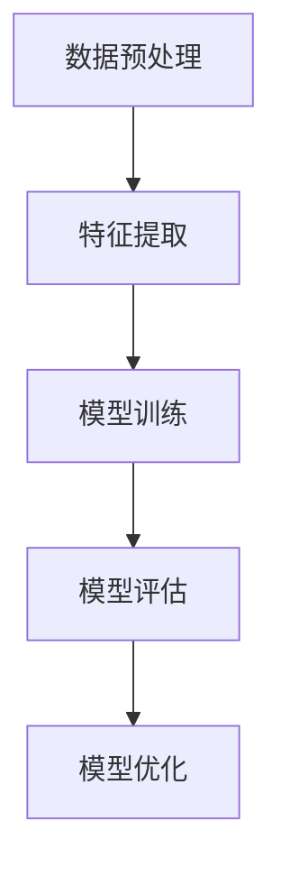
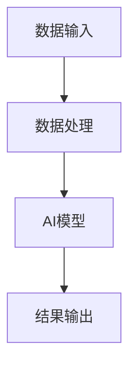

                 


# AI在保险理赔流程优化中的深度应用

## 关键词：AI，保险，理赔流程，优化，机器学习，深度学习

## 摘要：  
随着人工智能技术的快速发展，AI在保险行业的应用越来越广泛，特别是在保险理赔流程优化方面展现出巨大的潜力。本文从保险行业的现状出发，详细探讨AI技术如何深度应用于保险理赔流程优化，分析其核心概念、算法原理、系统架构设计及实际应用场景。通过案例分析和项目实战，总结AI技术在保险理赔流程优化中的最佳实践，为保险行业的数字化转型提供参考。

---

## 第1章: 保险理赔流程优化的背景与挑战

### 1.1 保险行业的现状与发展趋势
#### 1.1.1 保险行业的核心业务流程
保险行业的核心业务流程包括：
- **投保**：客户提交投保申请，保险公司审核并承保。
- **承保**：保险公司评估风险，决定是否承保及保费金额。
- **理赔**：客户发生保险事故后提交理赔申请，保险公司审核、评估并支付赔款。
- **续保**：保险合同到期后，客户选择是否续保。

#### 1.1.2 保险理赔流程中的痛点与问题
- **流程复杂**：理赔流程涉及多个环节，包括报案、审核、调查、赔付等，耗时较长。
- **效率低**：人工审核耗时较长，容易出现延误。
- **成本高**：传统理赔流程中，人工成本占比较大。
- **数据孤岛**：不同部门之间的数据孤岛问题，导致信息共享困难。
- **欺诈风险**：保险欺诈行为频发，增加了理赔难度。

#### 1.1.3 AI技术在保险行业的应用前景
- **自动化处理**：AI可以自动化处理理赔申请、风险评估等环节。
- **提高效率**：通过机器学习模型快速分析数据，缩短理赔时间。
- **降低成本**：AI技术可以减少人工干预，降低运营成本。
- **精准决策**：通过数据分析和预测，帮助保险公司做出更精准的理赔决策。

---

### 1.2 AI技术的发展与应用
#### 1.2.1 AI技术的演进历程
- **早期阶段**：基于规则的专家系统，如简单的保险欺诈检测。
- **机器学习阶段**：利用监督学习、无监督学习等技术进行预测和分类。
- **深度学习阶段**：利用神经网络进行复杂模式识别，如自然语言处理和图像识别。

#### 1.2.2 当前主流AI技术的特点与优势
| 技术特点 | 描述 |
|----------|------|
| 数据驱动 | 基于大量数据训练模型，数据质量直接影响模型性能。 |
| 自动学习 | 模型可以自动从数据中学习特征，减少人工干预。 |
| 高精度 | 在特定任务上，AI技术可以达到或超越人类水平。 |
| 可扩展性 | 可以快速扩展到大规模数据和复杂场景。 |

#### 1.2.3 AI在保险行业的典型应用案例
- **保险欺诈检测**：通过机器学习模型识别 fraudulent claims。
- **理赔自动化**：利用自然语言处理技术自动解析理赔文档。
- **风险评估**：通过深度学习模型预测保险事故的概率。

---

### 1.3 保险理赔流程优化的核心问题
#### 1.3.1 理赔流程中的关键环节分析
- **报案与受理**：客户提交理赔申请，保险公司接收并初步审核。
- **案件分配**：根据案件类型和复杂程度分配给不同的处理人员。
- **资料收集**：收集必要的理赔资料，如医疗记录、事故报告等。
- **案件审核**：人工或自动审核理赔请求，确定赔付金额。
- **赔付与结案**：支付赔款并完成案件结案。

#### 1.3.2 理赔效率与成本的优化目标
- **缩短理赔时间**：通过自动化流程减少人工干预，提高处理效率。
- **降低运营成本**：减少人工审核和管理的成本。
- **提高理赔准确性**：通过AI技术提高理赔决策的准确性。

#### 1.3.3 AI在理赔流程优化中的应用边界
- **数据可用性**：AI技术需要大量高质量的数据支持，数据不足时可能影响模型性能。
- **模型可解释性**：某些AI模型（如深度学习模型）缺乏可解释性，可能影响理赔决策的透明性。
- **法律法规限制**：保险行业的法律法规对AI技术的使用有严格限制，需符合相关法规要求。

---

## 第2章: AI在保险理赔流程中的核心概念与联系

### 2.1 AI技术的核心原理
#### 2.1.1 机器学习的基本原理
机器学习是一种通过数据训练模型的技术，主要包括监督学习、无监督学习和强化学习。监督学习是保险理赔中最常用的机器学习技术，用于分类和回归任务。

#### 2.1.2 深度学习的核心机制
深度学习通过多层神经网络进行特征提取和模式识别，适用于复杂的非结构化数据，如图像和文本。

#### 2.1.3 自然语言处理的关键技术
自然语言处理（NLP）技术用于处理和解析文本数据，如解析理赔文档和客户咨询。

---

### 2.2 AI技术与保险理赔的结合
#### 2.2.1 AI技术在保险理赔中的应用场景
- **自动报案**：客户通过APP或网页提交理赔申请，系统自动处理。
- **智能审核**：利用机器学习模型自动审核理赔请求。
- ** fraud detection**：通过AI技术识别保险欺诈行为。

#### 2.2.2 AI技术与保险理赔流程的结合方式
- **流程自动化**：AI技术可以自动化处理理赔流程中的某些环节，如自动分配案件和自动审核。
- **智能决策支持**：AI技术为理赔决策提供支持，如预测赔付金额和识别欺诈行为。

#### 2.2.3 AI技术在保险理赔中的优势与局限性
| 优势 | 局限性 |
|------|--------|
| 提高效率 | 数据依赖性高 |
| 降低成本 | 模型可解释性差 |
| 精准决策 | 法律法规限制 |

---

### 2.3 核心概念对比分析
#### 2.3.1 AI技术与传统保险理赔技术的特征对比
| 特征 | AI技术 | 传统技术 |
|------|--------|----------|
| 数据需求 | 高 | 低 |
| 处理速度 | 快 | 慢 |
| 精准度 | 高 | 中 |

#### 2.3.2 保险理赔流程中的ER实体关系图
```mermaid
er
    entity 理赔申请者 {
        id: string
        姓名: string
        身份证号: string
    }
    entity 理赔案件 {
        id: string
        理赔金额: number
        理赔状态: string
    }
    entity AI模型 {
        id: string
        模型类型: string
        训练数据集: string
    }
    理赔申请者 --> 理赔案件: 提交申请
    理赔案件 --> AI模型: 评估处理
```

---

## 第3章: AI在保险理赔流程优化中的算法原理

### 3.1 算法原理概述
#### 3.1.1 机器学习算法在保险理赔中的应用
- **分类算法**：如决策树、随机森林，用于判断理赔是否属于欺诈。
- **回归算法**：如线性回归、支持向量回归，用于预测赔付金额。

#### 3.1.2 深度学习算法的核心流程
深度学习算法通过多层神经网络进行特征提取和模式识别，适用于复杂的非结构化数据。

#### 3.1.3 自然语言处理算法的保险理赔应用
- **文本分类**：用于分类理赔文档的类型。
- **实体识别**：用于识别理赔文档中的关键实体信息。

---

### 3.2 算法实现流程


---

### 3.3 算法实现代码
#### 3.3.1 数据预处理
```python
import pandas as pd
data = pd.read_csv('insurance_claims.csv')
```

---

## 第4章: AI在保险理赔流程优化中的系统分析与架构设计

### 4.1 系统分析与架构设计
#### 4.1.1 问题场景介绍
- **问题描述**：保险理赔流程复杂，人工干预多，效率低。
- **目标**：通过AI技术优化理赔流程，提高效率和准确性。

#### 4.1.2 系统功能设计
- **数据输入模块**：接收理赔申请和相关资料。
- **数据处理模块**：对数据进行清洗和特征提取。
- **AI模型模块**：利用机器学习模型进行预测和分类。
- **结果输出模块**：输出理赔结果和建议。

#### 4.1.3 系统架构设计


---

### 4.2 系统接口设计
- **输入接口**：接收理赔申请和相关资料。
- **输出接口**：输出理赔结果和建议。

---

### 4.3 系统交互流程
```mermaid
sequence
    理赔申请者 -> 数据输入模块: 提交理赔申请
    数据输入模块 -> 数据处理模块: 数据预处理
    数据处理模块 -> AI模型模块: 调用模型进行预测
    AI模型模块 -> 结果输出模块: 输出结果
    结果输出模块 -> 理赔申请者: 提供理赔结果
```

---

## 第5章: AI在保险理赔流程优化中的项目实战

### 5.1 项目环境安装
- **安装Python**：Python 3.8+
- **安装依赖库**：pandas、scikit-learn、xgboost

#### 5.1.1 安装依赖库
```bash
pip install pandas scikit-learn xgboost
```

---

### 5.2 项目核心实现源代码
#### 5.2.1 数据加载
```python
import pandas as pd
data = pd.read_csv('insurance_claims.csv')
```

#### 5.2.2 特征工程
```python
from sklearn.preprocessing import StandardScaler
scaler = StandardScaler()
data_scaled = scaler.fit_transform(data)
```

#### 5.2.3 模型训练
```python
from sklearn.ensemble import RandomForestClassifier
model = RandomForestClassifier(n_estimators=100)
model.fit(data_scaled, labels)
```

#### 5.2.4 模型预测
```python
import numpy as np
new_claim = np.array([...])  # 新理赔申请数据
prediction = model.predict(new_claim.reshape(1, -1))
```

---

### 5.3 案例分析与详细解读
- **案例描述**：某客户提交车险理赔申请，涉及金额较大。
- **AI模型处理流程**：
  1. 数据预处理：清洗和标准化数据。
  2. 特征提取：提取关键特征，如事故类型、理赔金额、报案时间等。
  3. 模型预测：利用随机森林模型预测理赔是否为欺诈。
  4. 结果输出：输出预测结果，并提供赔付建议。

---

### 5.4 项目小结
- **项目总结**：通过AI技术优化保险理赔流程，提高了效率和准确性。
- **经验分享**：数据质量和模型选择对项目成功至关重要。

---

## 第6章: AI在保险理赔流程优化中的最佳实践

### 6.1 最佳实践 tips
- **数据治理**：确保数据质量，建立数据治理体系。
- **模型优化**：持续优化模型，提高准确性和可解释性。
- **团队协作**：建立跨学科团队，促进技术与业务的融合。

### 6.2 小结
- **核心内容回顾**：AI技术在保险理赔流程优化中的应用场景、算法原理、系统架构设计及项目实战。
- **未来展望**：随着AI技术的不断发展，保险理赔流程将更加智能化和自动化。

### 6.3 注意事项
- **数据隐私**：注意保护客户数据隐私，符合相关法律法规。
- **模型泛化能力**：确保模型在不同场景下具有良好的泛化能力。

### 6.4 拓展阅读
- **推荐书籍**：《机器学习实战》、《深度学习入门》。
- **推荐博客**：AI技术博客、保险行业技术博客。

---

## 作者：AI天才研究院/AI Genius Institute & 禅与计算机程序设计艺术 /Zen And The Art of Computer Programming

---

以上是《AI在保险理赔流程优化中的深度应用》的技术博客文章的完整目录和内容大纲。希望这篇文章能够为保险行业的数字化转型提供有价值的参考和启发。

