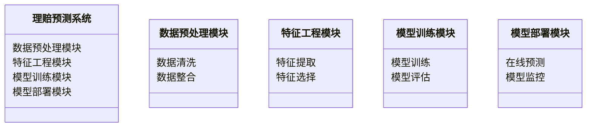
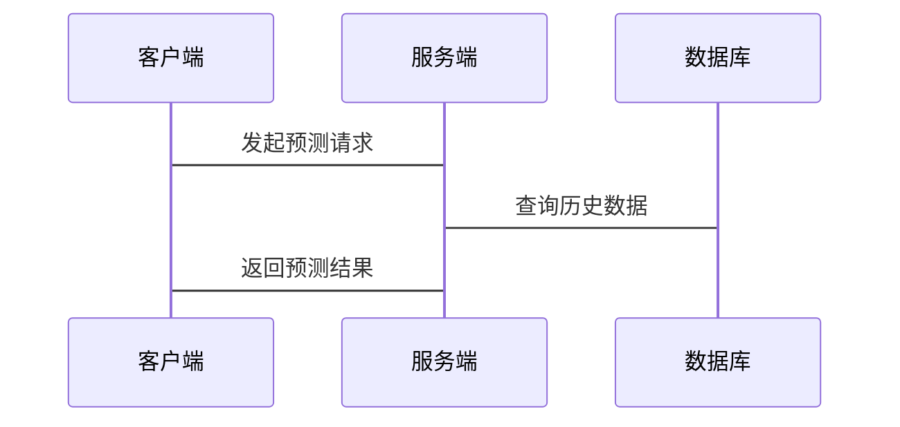

                 


# AI在保险理赔预测中的创新应用

> 关键词：保险理赔预测，人工智能，机器学习，深度学习，自然语言处理，计算机视觉

> 摘要：本文深入探讨了人工智能技术在保险理赔预测中的创新应用。从保险行业的数字化转型谈起，分析了AI技术如何解决传统理赔模式的痛点。详细介绍了AI在保险理赔预测中的核心概念、算法原理、系统架构设计及项目实战，并给出了实际应用中的最佳实践与注意事项。

---

# 第一部分：保险行业的数字化转型与AI技术的结合

# 第1章：保险行业的现状与挑战

## 1.1 保险行业的数字化转型

### 1.1.1 保险行业的现状分析

保险行业作为传统金融领域之一，正面临着数字化转型的迫切需求。随着互联网技术的快速发展，保险业务的线上化、智能化成为趋势。传统保险业务模式依赖人工操作，效率低下且成本高昂，难以满足日益增长的市场需求。

### 1.1.2 数字化转型的必要性

保险行业的数字化转型不仅是技术发展的必然结果，更是提高效率、降低成本、提升客户体验的必由之路。通过数字化技术的应用，保险公司可以实现业务流程的自动化、智能化，从而更好地应对市场竞争和客户需求。

### 1.1.3 AI技术在保险行业的应用前景

人工智能技术（AI）作为当前最前沿的技术之一，正在逐步改变保险行业的运作模式。AI技术在保险理赔预测中的应用，不仅可以提高理赔效率，还能降低欺诈风险，为保险公司创造更大的价值。

## 1.2 保险理赔的核心问题与痛点

### 1.2.1 保险理赔的基本流程

保险理赔的基本流程包括报案、审核、调查、赔付等环节。传统理赔模式依赖人工操作，存在效率低、成本高、易出错等问题。

### 1.2.2 传统理赔模式的痛点

传统理赔模式存在以下痛点：
1. 理赔流程复杂，耗时较长。
2. 人工审核容易出错，存在欺诈风险。
3. 数据分散，难以实现精准预测。

### 1.2.3 AI技术如何解决理赔问题

AI技术可以通过自动化处理、数据挖掘、模式识别等方式，帮助保险公司实现理赔预测的智能化。AI技术可以快速分析海量数据，识别潜在风险，从而提高理赔效率和准确性。

## 1.3 本章小结

本章主要介绍了保险行业的现状与挑战，重点分析了传统理赔模式的痛点，并探讨了AI技术在解决这些问题中的重要作用。通过数字化转型，保险公司可以实现业务流程的优化和创新，从而在市场竞争中占据优势。

---

# 第二部分：AI在保险理赔中的核心概念与技术

# 第2章：AI在保险理赔中的核心概念

## 2.1 保险理赔预测的定义与目标

### 2.1.1 理赔预测的定义

理赔预测是指通过分析历史数据和当前情况，预测未来可能发生的理赔事件及其金额大小。理赔预测可以帮助保险公司提前做好风险控制和资金规划。

### 2.1.2 理赔预测的目标

理赔预测的目标包括：
1. 提高理赔效率，缩短理赔周期。
2. 降低理赔成本，优化资源配置。
3. 减少欺诈行为，提高赔付准确性。

### 2.1.3 理赔预测的边界与外延

理赔预测的边界在于保险合同的范围和条款，外延则涉及与理赔相关的各种因素，如天气、地理位置、客户行为等。

## 2.2 AI技术的核心概念

### 2.2.1 机器学习与深度学习

机器学习是一种通过数据训练模型的技术，可以用于分类、回归、聚类等任务。深度学习是机器学习的一种，基于多层神经网络进行特征提取和模式识别。

### 2.2.2 自然语言处理

自然语言处理（NLP）是计算机处理人类语言的技术，常用于文本分析、情感分析、信息提取等任务。在保险理赔中，NLP可以用于分析客户投诉、保单条款等文本数据。

### 2.2.3 计算机视觉

计算机视觉是计算机处理图像或视频的技术，常用于目标检测、图像识别等任务。在保险理赔中，计算机视觉可以用于识别损坏的车辆、检测理赔中的虚假情况。

## 2.3 保险理赔预测的核心要素

### 2.3.1 数据特征

数据特征是理赔预测的基础，包括客户信息、保单信息、历史理赔记录等。通过提取有效的特征，可以提高模型的预测能力。

### 2.3.2 模型选择

模型选择是理赔预测的关键，不同的模型适用于不同的场景。例如，线性回归适用于简单的回归任务，随机森林适用于特征较多的分类任务。

### 2.3.3 业务规则

业务规则是理赔预测的依据，包括保险条款、理赔条件等。AI模型需要结合业务规则，才能做出符合实际的预测。

## 2.4 本章小结

本章介绍了AI在保险理赔中的核心概念，包括理赔预测的定义与目标、AI技术的核心概念以及理赔预测的核心要素。通过这些概念的分析，读者可以更好地理解AI在保险理赔中的应用。

---

# 第三部分：AI在保险理赔预测中的算法原理

# 第3章：常用算法原理与实现

## 3.1 机器学习算法

### 3.1.1 线性回归

线性回归是一种简单的回归算法，适用于预测连续型变量。其数学模型如下：

$$ y = \beta_0 + \beta_1x + \epsilon $$

其中，$y$是目标变量，$x$是自变量，$\beta_0$和$\beta_1$是回归系数，$\epsilon$是误差项。

### 3.1.2 支持向量机

支持向量机（SVM）是一种分类算法，适用于高维数据的分类任务。其核心思想是将数据映射到高维空间，然后找到一个超平面将数据分为两类。

### 3.1.3 随机森林

随机森林是一种基于决策树的集成算法，适用于分类和回归任务。其优势在于能够处理高维数据，并且具有较强的抗过拟合能力。

## 3.2 深度学习算法

### 3.2.1 神经网络基础

神经网络是一种模拟人脑神经元工作的模型，由输入层、隐藏层和输出层组成。其前向传播过程如下：

$$ a = Wx + b $$

$$ y = \sigma(a) $$

其中，$W$是权重矩阵，$x$是输入向量，$b$是偏置向量，$\sigma$是激活函数。

### 3.2.2 长短期记忆网络

长短期记忆网络（LSTM）是一种特殊的RNN，适用于时间序列数据的处理。其核心是引入记忆门控机制，能够有效地捕捉长期依赖关系。

### 3.2.3 图神经网络

图神经网络（GNN）是一种处理图结构数据的算法，适用于社交网络、分子结构等场景。其核心是通过聚合邻居节点的信息来更新节点表示。

## 3.3 算法原理的数学模型与公式

### 3.3.1 线性回归的数学模型

线性回归的损失函数通常采用均方误差（MSE）：

$$ L = \frac{1}{n}\sum_{i=1}^{n}(y_i - \hat{y}_i)^2 $$

其中，$n$是样本数量，$y_i$是真实值，$\hat{y}_i$是预测值。

### 3.3.2 神经网络的前向传播

神经网络的前向传播过程可以用以下公式表示：

$$ z = Wx + b $$

$$ a = \sigma(z) $$

其中，$z$是线性变换后的结果，$a$是激活后的输出。

## 3.4 算法实现与案例分析

### 3.4.1 算法实现的Python代码示例

以下是使用Python实现线性回归的代码示例：

```python
import numpy as np
from sklearn.linear_model import LinearRegression

# 示例数据
X = np.array([[1], [2], [3], [4]])
y = np.array([2, 4, 6, 8])

# 模型训练
model = LinearRegression()
model.fit(X, y)

# 预测结果
print(model.predict([[5]]))  # 输出：[[10]]
```

### 3.4.2 算法原理的通俗易懂举例

以线性回归为例，假设我们有一个简单的房价预测问题，已知房屋面积和价格数据，我们可以用线性回归模型预测房屋价格。例如：

- 房屋面积（x）：100平方米，价格（y）：100万元
- 房屋面积（x）：150平方米，价格（y）：150万元

通过线性回归模型，我们可以得到价格与面积之间的线性关系：

$$ y = 1 \times x + 0 $$

这样，当输入房屋面积为200平方米时，预测价格为200万元。

## 3.5 本章小结

本章详细介绍了常用的机器学习和深度学习算法，包括线性回归、支持向量机、随机森林、神经网络、LSTM和图神经网络。通过数学公式和代码示例，读者可以更好地理解这些算法的原理和实现方式。

---

# 第四部分：系统分析与架构设计方案

# 第4章：保险理赔预测的系统架构设计

## 4.1 理赔预测的场景介绍

### 4.1.1 理赔预测的典型场景

理赔预测的典型场景包括车险理赔、健康险理赔、财产险理赔等。以车险理赔为例，保险公司需要预测某辆车在未来一段时间内的理赔概率和金额。

### 4.1.2 理赔预测的业务目标

理赔预测的业务目标包括：
1. 提高理赔效率，缩短理赔周期。
2. 减少欺诈行为，降低赔付成本。
3. 提供精准定价，优化保险产品。

## 4.2 保险理赔预测系统的功能设计

### 4.2.1 领域模型（Mermaid 类图）



### 4.2.2 系统架构设计（Mermaid 架构图）


### 4.2.3 系统接口设计

系统接口设计包括以下内容：
1. 数据接口：提供数据清洗、数据整合等功能。
2. 模型接口：提供模型训练、模型评估等功能。
3. 预测接口：提供在线预测服务。

### 4.2.4 系统交互流程（Mermaid 序列图）



## 4.3 本章小结

本章详细介绍了保险理赔预测系统的功能设计和架构设计，包括领域模型、系统架构、接口设计和交互流程。通过Mermaid图表，读者可以直观地理解系统的构成和工作流程。

---

# 第五部分：项目实战

# 第5章：保险理赔预测的项目实战

## 5.1 项目介绍

### 5.1.1 项目背景

本项目旨在利用AI技术实现保险理赔预测，帮助保险公司提高理赔效率和准确性。以车险理赔为例，我们通过分析历史理赔数据，预测未来可能发生的理赔事件。

### 5.1.2 项目目标

项目目标包括：
1. 构建理赔预测模型，实现高精度的预测。
2. 实现模型的在线预测功能，提供实时服务。
3. 提供模型监控功能，确保模型的稳定性和准确性。

## 5.2 项目核心实现

### 5.2.1 环境配置

#### 5.2.1.1 Python 环境配置

```bash
# 安装必要的Python库
pip install numpy
pip install pandas
pip install scikit-learn
pip install xgboost
pip install matplotlib
```

#### 5.2.1.2 数据库配置

```bash
# 安装MySQL数据库
sudo apt-get install mysql-server
# 配置数据库连接参数
```

### 5.2.2 数据处理

#### 5.2.2.1 数据清洗

```python
import pandas as pd

# 读取数据
data = pd.read_csv('insuranceclaims.csv')

# 删除缺失值
data.dropna(inplace=True)

# 处理异常值
data = data[~(data['claim_amount'].apply(lambda x: x < 0))]
```

#### 5.2.2.2 特征工程

```python
from sklearn.preprocessing import OneHotEncoder

# 对分类变量进行编码
encoder = OneHotEncoder()
encoder.fit(data[['policy_type', 'coverage_area']])
encoded_features = encoder.transform(data[['policy_type', 'coverage_area']]).toarray()
```

### 5.2.3 模型训练

#### 5.2.3.1 模型选择与训练

```python
from sklearn.model_selection import train_test_split
from xgboost import XGBRegressor
from sklearn.metrics import mean_squared_error

# 划分训练集和测试集
X_train, X_test, y_train, y_test = train_test_split(encoded_features, data['claim_amount'], test_size=0.2)

# 训练模型
model = XGBRegressor(n_estimators=100, learning_rate=0.1, max_depth=3)
model.fit(X_train, y_train)

# 模型预测
y_pred = model.predict(X_test)

# 评估模型
print('均方误差:', mean_squared_error(y_test, y_pred))
```

#### 5.2.3.2 模型部署

```python
# 模型保存
import joblib

joblib.dump(model, 'insurance_claim_model.pkl')
```

### 5.2.4 模型监控

#### 5.2.4.1 模型性能监控

```python
# 监控模型性能
import time

def monitor_model():
    while True:
        # 加载模型
        model = joblib.load('insurance_claim_model.pkl')
        # 加载最新数据
        new_data = pd.read_csv('new_claims.csv')
        # 预测结果
        y_pred = model.predict(new_data)
        # 计算误差
        mse = mean_squared_error(new_data['claim_amount'], y_pred)
        print(f'均方误差: {mse}')
        time.sleep(3600)  # 每小时监控一次
```

### 5.3 项目小结

本章通过一个具体的车险理赔预测项目，详细介绍了项目的环境配置、数据处理、模型训练和部署过程。通过代码实现，读者可以更好地理解AI技术在保险理赔预测中的实际应用。

---

# 第六部分：最佳实践与总结

# 第6章：AI在保险理赔预测中的最佳实践

## 6.1 实际应用中的注意事项

### 6.1.1 数据隐私与安全

在实际应用中，需要特别注意数据的隐私和安全问题。保险公司需要遵守相关法律法规，确保客户数据的安全。

### 6.1.2 模型解释性

模型的解释性是理赔预测的重要因素。保险公司需要选择易于解释的模型，以便更好地与客户沟通和处理理赔事务。

### 6.1.3 模型的可扩展性

随着业务的发展，理赔预测模型需要具有良好的可扩展性，能够处理更大的数据量和更复杂的任务。

## 6.2 小结与总结

### 6.2.1 小结

本章总结了AI在保险理赔预测中的最佳实践，包括数据隐私与安全、模型解释性以及模型的可扩展性等方面。

### 6.2.2 总结

AI技术在保险理赔预测中的应用，不仅提高了理赔效率和准确性，还为保险公司创造了更大的价值。通过合理的模型选择和系统的架构设计，保险公司可以更好地应对市场竞争和客户需求。

## 6.3 注意事项

### 6.3.1 数据质量控制

在实际应用中，数据质量控制是确保模型准确性的关键。需要对数据进行严格的清洗和预处理。

### 6.3.2 模型迭代与优化

模型需要定期迭代和优化，以适应业务的变化和数据的更新。可以通过监控模型性能和收集反馈信息，不断优化模型。

### 6.3.3 与业务结合

AI技术的应用需要与业务紧密结合，确保模型的预测结果能够为业务决策提供支持。

## 6.4 拓展阅读

### 6.4.1 推荐书籍

1. 《机器学习实战》
2. 《深度学习入门：基于Python的理论与实现》
3. 《自然语言处理入门》

### 6.4.2 推荐博客与技术文章

1. [Towards Data Science](https://towardsdatascience.com/)
2. [Medium - AI & Machine Learning](https://medium.com/ai-and-machine-learning)
3. [Kaggle](https://www.kaggle.com/)

---

# 作者：AI天才研究院/AI Genius Institute & 禅与计算机程序设计艺术 /Zen And The Art of Computer Programming

