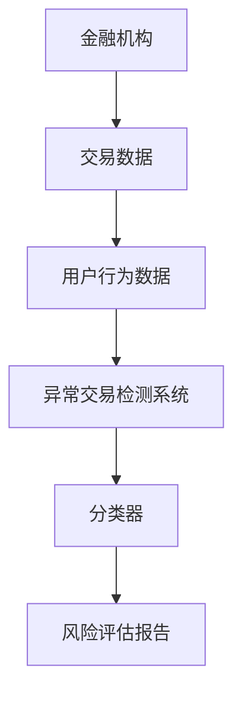
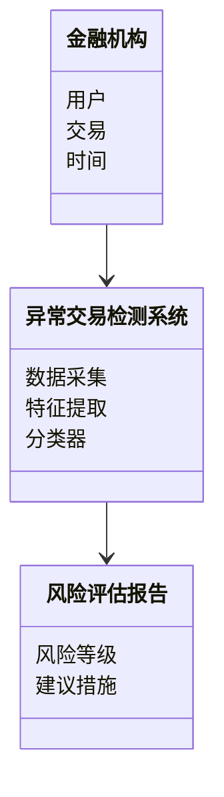
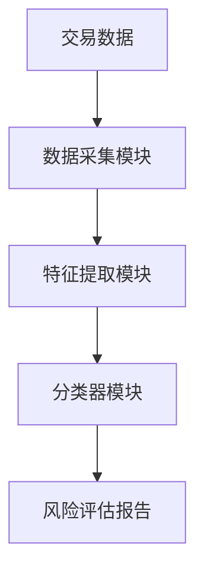
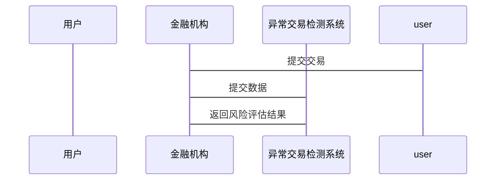

                 


# AI在反金融犯罪模式识别中的深度应用研究

## 关键词
- 人工智能
- 金融犯罪
- 模式识别
- 深度学习
- 反金融犯罪系统

## 摘要
随着金融交易的日益复杂化，金融犯罪手段也在不断进化。传统的反金融犯罪技术已难以应对新型威胁。基于人工智能（AI）的模式识别技术在反金融犯罪领域展现出巨大潜力。本文将深入探讨AI技术在金融犯罪模式识别中的应用，分析其核心算法、系统架构，并通过实战案例展示其有效性。

---

# 第一部分：AI在反金融犯罪模式识别中的背景与基础

## 第1章：问题背景与定义

### 1.1 问题背景
#### 1.1.1 金融犯罪的现状与挑战
金融犯罪包括欺诈、洗钱、内幕交易等行为，其手段日益隐蔽。传统基于规则的检测系统难以识别复杂的新型犯罪模式。

#### 1.1.2 AI技术在金融安全中的应用潜力
AI技术，尤其是深度学习和模式识别，能够从海量数据中发现异常模式，为反金融犯罪提供新的解决方案。

#### 1.1.3 模式识别在反金融犯罪中的作用
模式识别技术能够从交易数据中识别出异常行为模式，帮助金融机构及时发现和阻止金融犯罪。

### 1.2 核心概念定义
#### 1.2.1 什么是反金融犯罪模式识别
反金融犯罪模式识别是通过分析交易数据、用户行为等信息，识别出潜在的金融犯罪模式的过程。

#### 1.2.2 AI技术在模式识别中的应用
AI技术利用机器学习和深度学习算法，从数据中提取特征并训练分类器，实现对金融犯罪模式的识别。

#### 1.2.3 金融犯罪的主要类型与特征
- 欺诈交易：异常交易频率、金额、地点等特征。
- 洗钱：资金流动的复杂性、非正常交易链条。
- 内幕交易：非正常资金流动、交易时机。

### 1.3 技术演进与应用领域
#### 1.3.1 传统反金融犯罪技术的局限性
传统基于规则的系统难以应对复杂多变的金融犯罪手段。

#### 1.3.2 AI技术的引入与技术演进
AI技术的引入使反金融犯罪系统能够处理非结构化数据，发现隐藏的模式。

#### 1.3.3 模式识别在反金融犯罪中的主要应用领域
- 交易监控
- 用户行为分析
- 反欺诈检测

### 1.4 本章小结
- 本章介绍了金融犯罪的现状及其对金融系统的威胁。
- 阐述了AI技术在模式识别中的应用潜力及其在反金融犯罪中的重要性。
- 下一章将深入探讨AI和模式识别的核心原理。

---

# 第二部分：核心概念与技术原理

## 第2章：AI与模式识别的核心原理

### 2.1 AI技术的核心原理
#### 2.1.1 机器学习的基本原理
机器学习通过训练数据，建立输入与输出之间的映射关系。监督学习、无监督学习和强化学习是三种主要的学习范式。

#### 2.1.2 深度学习的基本原理
深度学习通过多层神经网络，自动提取数据特征。卷积神经网络（CNN）、循环神经网络（RNN）是常用的深度学习模型。

#### 2.1.3 神经网络的结构与功能
神经网络由输入层、隐藏层和输出层组成，通过非线性激活函数进行特征提取和分类。

### 2.2 模式识别的基本原理
#### 2.2.1 模式识别的定义与分类
模式识别是通过计算机对信号或数据进行分析，识别其模式和类别。

#### 2.2.2 常见模式识别技术
- 支持向量机（SVM）
- 随机森林
- 卷积神经网络（CNN）

#### 2.2.3 模式识别的关键步骤
1. 数据预处理
2. 特征提取
3. 分类器训练
4. 模型评估

### 2.3 AI在模式识别中的应用原理
#### 2.3.1 数据预处理与特征提取
对数据进行标准化、归一化处理，提取有用的特征，如交易金额、时间间隔等。

#### 2.3.2 分类器设计与训练
使用机器学习算法训练分类器，使其能够识别正常交易与异常交易。

#### 2.3.3 模型评估与优化
通过交叉验证评估模型性能，优化参数以提高准确率和召回率。

---

## 第3章：核心概念与联系

### 3.1 核心概念原理
#### 3.1.1 AI技术的数学基础
线性代数、概率论、统计学是AI技术的数学基础。

#### 3.1.2 模式识别的算法原理
基于统计学的分类算法（如随机森林）和基于深度学习的分类算法（如CNN）各有优缺点。

#### 3.1.3 反金融犯罪模式识别的系统架构
系统架构包括数据采集、特征提取、模型训练和结果输出四个模块。

### 3.2 核心概念对比分析
#### 3.2.1 AI技术与传统技术的对比
- AI技术能够处理非结构化数据，发现隐藏模式。
- 传统技术依赖于预定义规则，难以应对新型威胁。

#### 3.2.2 模式识别与传统识别方法的对比
- 模式识别能够处理复杂数据，识别潜在威胁。
- 传统识别方法依赖于预定义特征，识别能力有限。

#### 3.2.3 反金融犯罪模式识别与传统反金融犯罪技术的对比
- 基于AI的模式识别能够实时监控交易，识别异常行为。
- 传统技术依赖于事后分析，难以实时响应。

### 3.3 实体关系图



---

# 第三部分：系统分析与架构设计

## 第4章：系统分析与架构设计方案

### 4.1 问题场景介绍
金融机构需要实时监控交易数据，识别潜在的金融犯罪行为。

### 4.2 项目介绍
开发一个基于AI的反金融犯罪模式识别系统，实现对异常交易的实时检测。

### 4.3 系统功能设计
#### 4.3.1 领域模型


#### 4.3.2 系统架构设计


#### 4.3.3 系统接口设计
- 数据接口：接收交易数据和用户行为数据。
- 分类器接口：提供分类服务，返回异常交易标识。

#### 4.3.4 系统交互


---

# 第四部分：项目实战

## 第5章：项目实战

### 5.1 环境安装
安装必要的Python库：
```bash
pip install scikit-learn tensorflow matplotlib
```

### 5.2 系统核心实现源代码

#### 5.2.1 数据预处理
```python
import pandas as pd
import numpy as np

# 加载数据
data = pd.read_csv('transaction.csv')

# 数据清洗
data.dropna(inplace=True)

# 标准化处理
from sklearn.preprocessing import StandardScaler
scaler = StandardScaler()
scaled_data = scaler.fit_transform(data[['amount', 'time']])
```

#### 5.2.2 特征提取
```python
from sklearn.decomposition import PCA

pca = PCA(n_components=2)
principal_components = pca.fit_transform(scaled_data)
```

#### 5.2.3 分类器训练
```python
from sklearn.ensemble import RandomForestClassifier

model = RandomForestClassifier(n_estimators=100, random_state=42)
model.fit(principal_components, data['is_fraud'])
```

#### 5.2.4 模型评估
```python
from sklearn.metrics import accuracy_score, recall_score, precision_score

y_pred = model.predict(principal_components)
print(f"准确率: {accuracy_score(data['is_fraud'], y_pred)}")
print(f"召回率: {recall_score(data['is_fraud'], y_pred)}")
print(f"精确率: {precision_score(data['is_fraud'], y_pred)}")
```

### 5.3 实际案例分析
以欺诈交易为例，分析模型如何识别异常交易。

### 5.4 项目小结
本项目展示了如何利用AI技术实现反金融犯罪模式识别，验证了模型的有效性。

---

## 第6章：总结与最佳实践

### 6.1 本章总结
本文深入探讨了AI技术在反金融犯罪模式识别中的应用，分析了其核心算法和系统架构，并通过实战案例验证了其有效性。

### 6.2 最佳实践 tips
- 数据预处理是关键，确保数据质量。
- 特征提取和选择直接影响模型性能。
- 模型选择和调优需要结合实际业务需求。

### 6.3 小结
AI技术在反金融犯罪模式识别中具有巨大潜力，但也面临数据隐私和模型解释性等挑战。

### 6.4 注意事项
- 数据隐私保护至关重要。
- 模型需要持续更新以应对新型威胁。

### 6.5 拓展阅读
推荐阅读相关领域的最新研究论文和书籍，深入了解AI在金融安全中的应用。

---

# 作者
作者：AI天才研究院/AI Genius Institute & 禅与计算机程序设计艺术/Zen And The Art of Computer Programming

