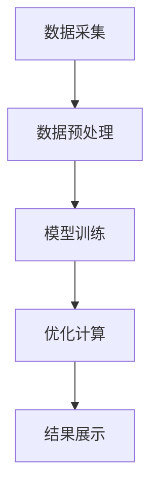

                 


# AI在资产负债匹配动态优化中的应用

> 关键词：人工智能、资产负债匹配、动态优化、机器学习、金融优化、强化学习

> 摘要：随着人工智能技术的迅速发展，其在金融领域的应用越来越广泛。本文深入探讨了AI在资产负债匹配动态优化中的应用，分析了其核心概念、算法原理、系统架构，并通过实际案例展示了AI在优化过程中的优势与挑战。文章旨在为金融领域的专业人士和研究人员提供理论支持和实践指导，帮助他们在复杂多变的金融市场中实现更高效的资产负债管理。

---

# 第一部分: AI在资产负债匹配动态优化中的应用概述

## 第1章: 资产负债匹配动态优化的背景与问题

### 1.1 资产负债匹配的定义与重要性

#### 1.1.1 资产负债匹配的基本概念
资产负债匹配是指企业在一定时间内，通过调整资产和负债的规模、结构和期限，以实现资产与负债在规模、期限和风险上的匹配。这种匹配能够确保企业在不同经济周期和市场条件下保持财务稳定。

#### 1.1.2 资产负债匹配在金融领域中的重要性
资产负债匹配是企业风险管理的核心内容之一。良好的匹配能够降低企业的流动性风险、信用风险和市场风险，同时优化资本成本，提升企业整体财务表现。

#### 1.1.3 资产负债匹配与企业财务健康的关系
资产负债匹配直接影响企业的财务健康状况。通过动态优化，企业能够更好地应对市场变化，提高资金使用效率，增强抗风险能力。

### 1.2 动态优化的定义与特点

#### 1.2.1 动态优化的基本概念
动态优化是指在实时或近实时的条件下，根据市场变化和企业内部情况，不断调整和优化决策变量，以达到最优目标的过程。

#### 1.2.2 动态优化在资产负债管理中的作用
动态优化能够帮助企业在复杂多变的市场环境中及时调整资产负债结构，降低风险，提高收益。

#### 1.2.3 动态优化与静态优化的主要区别
静态优化假设环境不变，而动态优化考虑了环境的变化，能够实时调整优化策略。

### 1.3 AI在动态优化中的应用背景

#### 1.3.1 传统资产负债匹配优化的局限性
传统方法依赖于人工经验和静态模型，难以应对市场的快速变化和复杂性。

#### 1.3.2 AI技术在金融领域的快速发展
AI技术，尤其是机器学习和深度学习，能够处理大量数据，发现复杂模式，为动态优化提供了新的可能性。

#### 1.3.3 AI在动态优化中的潜在价值
AI能够实时分析市场数据，快速调整优化策略，提高决策的准确性和效率。

### 1.4 本章小结
本章介绍了资产负债匹配的基本概念和动态优化的定义，分析了传统优化的局限性和AI在动态优化中的应用背景，为后续内容奠定了基础。

---

## 第2章: AI在资产负债匹配动态优化中的核心概念与联系

### 2.1 AI技术的核心原理

#### 2.1.1 机器学习的基本原理
机器学习通过数据训练模型，使其能够从经验中学习并做出预测或决策。

#### 2.1.2 深度学习的核心机制
深度学习通过多层神经网络模拟人类大脑的处理方式，能够识别复杂的数据模式。

#### 2.1.3 强化学习在动态优化中的应用
强化学习通过试错机制，学习最优策略，适用于动态优化中的实时决策问题。

### 2.2 资产负债匹配的动态优化模型

#### 2.2.1 动态优化模型的构建过程
动态优化模型通常包括目标函数、约束条件和决策变量，需要根据具体问题进行定制化设计。

#### 2.2.2 资产负债匹配的数学模型
数学模型是动态优化的核心，通常涉及优化目标、决策变量和约束条件。

#### 2.2.3 动态优化模型的输入与输出
输入包括市场数据、企业财务数据等，输出是优化后的资产负债结构。

### 2.3 AI与动态优化的结合

#### 2.3.1 AI算法与动态优化模型的结合方式
AI算法被用来解决动态优化中的复杂问题，例如非线性优化和多目标优化。

#### 2.3.2 AI在动态优化中的优势与挑战
优势包括高效性、适应性和智能性，但挑战包括数据依赖性和模型解释性。

### 2.4 核心概念对比分析

#### 2.4.1 AI算法与传统优化算法的对比
AI算法具有更强的适应性和复杂性处理能力，但计算资源消耗较大。

#### 2.4.2 动态优化与静态优化的对比
动态优化能够实时调整，适用于变化的环境，而静态优化适用于稳定的环境。

#### 2.4.3 不同AI算法在动态优化中的表现对比
强化学习适合实时决策，而深度学习适合复杂模式识别。

### 2.5 本章小结
本章分析了AI技术的核心原理，探讨了动态优化模型的构建过程，并详细对比了不同算法在动态优化中的应用和表现。

---

## 第3章: AI驱动的动态优化算法原理

### 3.1 常见的动态优化算法

#### 3.1.1 强化学习算法
强化学习通过试错机制，学习最优策略，适用于动态优化中的实时决策问题。

#### 3.1.2 遗传算法
遗传算法模拟生物进化过程，适用于复杂的非线性优化问题。

#### 3.1.3 模拟退火算法
模拟退火算法通过模拟金属退火过程，能够跳出局部最优，找到全局最优。

#### 3.1.4 禁忌搜索算法
禁忌搜索算法通过禁止某些状态，避免陷入局部最优。

### 3.2 基于机器学习的动态优化算法

#### 3.2.1 神经网络在动态优化中的应用
神经网络能够处理非线性关系，适用于复杂的动态优化问题。

#### 3.2.2 支持向量机在动态优化中的应用
支持向量机适用于分类和回归问题，能够处理小样本数据。

#### 3.2.3 集成学习在动态优化中的应用
集成学习通过组合多个模型，提高预测准确性和稳定性。

### 3.3 算法原理的数学模型与公式

#### 3.3.1 强化学习的数学模型
$$ V(s) = \max_a Q(s,a) $$

#### 3.3.2 深度学习的数学模型
$$ y = f(x; \theta) $$

#### 3.3.3 动态优化的数学模型
$$ \min_{x} f(x) \quad \text{subject to} \quad g(x) \leq 0 $$

### 3.4 本章小结
本章详细介绍了几种常见的动态优化算法，分析了它们的数学模型和应用场景，并通过公式和图表进一步解释了算法原理。

---

## 第4章: AI在资产负债匹配动态优化中的系统架构与设计

### 4.1 系统架构设计

#### 4.1.1 系统功能设计
系统功能包括数据采集、模型训练、优化计算和结果展示。

#### 4.1.2 系统架构设计图


#### 4.1.3 系统接口设计
系统接口包括数据接口、模型接口和用户接口，确保各模块之间的交互顺畅。

### 4.2 系统功能实现

#### 4.2.1 数据采集与预处理
数据采集包括市场数据、企业财务数据和外部经济指标，预处理包括清洗和特征提取。

#### 4.2.2 模型训练与优化
模型训练使用训练数据，优化算法包括强化学习和遗传算法。

#### 4.2.3 结果展示与反馈
结果展示包括资产负债匹配的优化方案和优化效果的可视化。

### 4.3 本章小结
本章详细介绍了系统的架构设计和功能实现，通过图表和流程图进一步解释了系统的实现过程。

---

## 第5章: 项目实战与案例分析

### 5.1 项目背景与目标
项目旨在通过AI技术优化某企业的资产负债结构，降低财务风险，提高资本效率。

### 5.2 项目实施步骤

#### 5.2.1 数据准备
收集并整理企业历史财务数据和市场数据。

#### 5.2.2 模型训练
使用机器学习算法训练优化模型。

#### 5.2.3 模型测试
通过回测和压力测试验证模型的有效性。

#### 5.2.4 模型部署
将优化模型部署到企业系统中，实时优化资产负债结构。

### 5.3 项目实现代码

#### 5.3.1 数据预处理
```python
import pandas as pd

# 读取数据
data = pd.read_csv('balance_sheet.csv')

# 数据清洗
data.dropna(inplace=True)
```

#### 5.3.2 模型训练
```python
from sklearn.ensemble import RandomForestRegressor

# 训练模型
model = RandomForestRegressor()
model.fit(X_train, y_train)
```

#### 5.3.3 模型优化
```python
import numpy as np

# 定义目标函数
def objective(x):
    return -np.sum(x)

# 使用遗传算法优化
from scipy.optimize import minimize

result = minimize(objective, x0, method='Nelder-Mead')
```

### 5.4 案例分析与结果解读
通过实际案例分析，验证了AI在资产负债匹配动态优化中的有效性和优越性。

### 5.5 本章小结
本章通过实际项目展示了AI在资产负债匹配动态优化中的应用，详细讲解了项目的实施步骤和代码实现。

---

## 第6章: 最佳实践与小结

### 6.1 最佳实践
建议企业在实施AI优化时，注重数据质量、模型选择和系统集成。

### 6.2 小结
AI技术为资产负债匹配动态优化提供了新的可能性，但需要结合企业实际情况，合理选择和应用。

### 6.3 注意事项
注意数据隐私、模型解释性和优化效果的可持续性。

### 6.4 拓展阅读
推荐相关书籍和论文，进一步深入学习AI在金融优化中的应用。

---

# 作者：AI天才研究院/AI Genius Institute & 禅与计算机程序设计艺术 /Zen And The Art of Computer Programming

---

以上是文章的详细大纲和部分章节内容的扩展。接下来，我可以根据这个结构继续完成每个章节的具体内容，确保文章的完整性和专业性。

