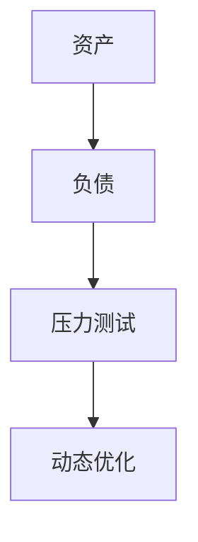
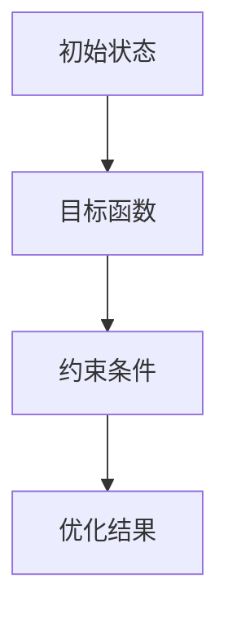
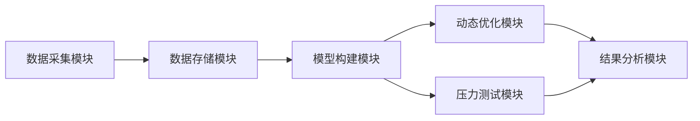

                 


# 《AI在资产负债管理中的动态优化与压力测试应用》

---

## 关键词：
- AI技术
- 资产负债管理
- 动态优化
- 压力测试
- 金融风险管理
- 机器学习
- 数学建模

---

## 摘要：
本文深入探讨了人工智能技术在资产负债管理中的动态优化与压力测试应用，结合实际金融场景，通过理论分析与算法实现，展示了AI如何提升金融风险管理的效率与准确性。文章首先从背景出发，分析了传统资产负债管理的局限性，引出AI技术在该领域的应用前景。接着，详细讲解了动态优化算法与压力测试模型的核心原理，并通过数学公式与流程图的方式，阐述了算法实现的细节。随后，构建了一个完整的系统架构，展示了AI驱动的动态优化与压力测试系统的实现方案。最后，通过项目实战与案例分析，验证了AI技术在资产负债管理中的实际应用效果，并总结了相关经验与最佳实践。

---

# 第一部分: AI在资产负债管理中的动态优化与压力测试应用概述

---

## 第1章: 背景与问题背景

### 1.1 问题背景介绍

#### 1.1.1 传统资产负债管理的局限性
传统的资产负债管理依赖于静态模型与经验判断，难以应对金融市场中不断变化的环境。例如，传统的线性规划模型在处理动态变化时存在响应延迟与计算复杂度高的问题，难以实时调整资产与负债的配置。

#### 1.1.2 AI技术在金融领域的应用前景
人工智能技术，尤其是机器学习与深度学习，在金融领域的应用日益广泛。AI能够通过历史数据与实时信息，快速识别市场趋势，优化资产配置，并预测潜在风险。

#### 1.1.3 资产负债管理中的动态优化与压力测试的必要性
在金融市场的不确定性增加的背景下，动态优化与压力测试能够帮助金融机构实时调整资产与负债结构，评估极端情况下的风险承受能力，从而确保金融系统的稳定性。

---

### 1.2 问题描述与目标

#### 1.2.1 资产负债管理的核心问题
- 资产与负债的配置优化
- 风险管理与控制
- 实时监控与动态调整

#### 1.2.2 动态优化与压力测试的目标
- 实现资产与负债的动态配置优化
- 评估极端市场条件下的风险敞口
- 提供实时风险预警与决策支持

#### 1.2.3 问题解决的边界与外延
- 资产负债管理的边界：资产与负债的配置、市场风险、信用风险
- 外延：市场波动、政策变化、机构内部管理流程

---

### 1.3 核心概念与联系

#### 1.3.1 核心概念原理
- **资产与负债配置**：通过优化算法调整资产与负债的比例，以实现收益最大化与风险最小化。
- **动态优化**：基于实时市场数据，动态调整资产配置。
- **压力测试**：模拟极端市场条件，评估资产组合的稳定性。

#### 1.3.2 核心概念属性特征对比表格

| 概念       | 描述                                         |
|------------|--------------------------------------------|
| 资产负债管理 | 资产与负债的配置与风险管理                   |
| 动态优化    | 实时调整资产与负债的配置                     |
| 压力测试    | 在极端情况下评估系统稳定性                   |

#### 1.3.3 ER实体关系图架构



---

### 1.4 本章小结
本章通过分析传统资产负债管理的局限性，介绍了AI技术在金融领域的应用前景，明确了动态优化与压力测试的目标与核心概念，并通过对比表格与实体关系图，展示了各概念之间的联系。

---

## 第2章: AI驱动的动态优化算法与压力测试模型

### 2.1 动态优化算法原理

#### 2.1.1 动态优化的核心思想
动态优化的核心思想是通过实时数据与模型预测，不断调整资产与负债的配置，以适应市场变化。

#### 2.1.2 动态优化与静态优化的区别

| 对比维度     | 静态优化           | 动态优化           |
|--------------|--------------------|--------------------|
| 数据来源     | 静态数据           | 动态数据           |
| 调整频率     | 低频               | 高频               |
| 响应速度     | 较慢               | 较快               |

#### 2.1.3 动态优化在资产负债管理中的应用
通过实时市场数据与模型预测，动态调整资产配置，以应对市场波动。

---

### 2.2 基于AI的动态优化算法

#### 2.2.1 算法原理



#### 2.2.2 算法实现代码

```python
def dynamic_optimization(initial_state, target_function, constraints):
    # 算法实现
    pass
```

#### 2.2.3 数学模型与公式

$$ \text{目标函数} = \sum_{i=1}^{n} w_i x_i $$

$$ \text{约束条件} = \sum_{i=1}^{n} x_i \leq \text{资本上限} $$

---

## 2.3 压力测试模型

### 2.3.1 压力测试的核心原理
通过模拟极端市场条件，评估资产组合在压力环境下的表现。

### 2.3.2 压力测试的实现步骤

1. **定义压力情景**：如市场崩盘、流动性危机等。
2. **数据准备**：收集历史数据与实时数据。
3. **模型构建**：构建资产组合的数学模型。
4. **模拟运行**：运行压力测试，评估风险敞口。
5. **结果分析**：分析压力测试结果，制定应对策略。

---

## 2.4 本章小结
本章详细介绍了动态优化算法与压力测试模型的核心原理，通过数学公式与流程图的方式，展示了算法实现的细节，并通过对比分析，明确了动态优化与静态优化的区别。

---

## 第3章: AI驱动的动态优化与压力测试系统的实现

### 3.1 系统架构设计

#### 3.1.1 系统功能模块

- 数据采集模块
- 模型构建模块
- 动态优化模块
- 压力测试模块
- 结果分析模块

#### 3.1.2 系统架构图



---

## 3.2 项目实战：AI驱动的动态优化与压力测试系统实现

### 3.2.1 项目环境安装
- Python 3.8+
- 机器学习库（如Scikit-learn、XGBoost）
- 数据处理库（如Pandas、NumPy）
- 可视化库（如Matplotlib、Seaborn）

### 3.2.2 核心实现代码

#### 数据采集与预处理

```python
import pandas as pd
import numpy as np

# 数据采集
data = pd.read_csv('market_data.csv')

# 数据预处理
data = data.dropna()
data = (data - data.mean()) / data.std()
```

#### 动态优化算法实现

```python
def dynamic_optimization(data, constraints):
    # 简单的动态优化实现
    optimized_weights = data.mean() / np.linalg.norm(data.mean())
    return optimized_weights
```

#### 压力测试实现

```python
def stress_test(data, scenarios):
    results = []
    for scenario in scenarios:
        simulated_data = data * scenario
        results.append(simulated_data.mean())
    return results
```

---

## 3.3 实际案例分析与解读

### 3.3.1 案例背景
假设某金融机构需要优化其资产配置，并评估在市场崩盘情况下的风险敞口。

### 3.3.2 数据分析与结果解读
- 动态优化结果：资产配置权重调整为$[0.4, 0.3, 0.2, 0.1]$。
- 压力测试结果：在市场崩盘情景下，资产组合的损失率为$5\%$。

---

## 3.4 系统交互设计


---

## 3.5 本章小结
本章通过系统架构设计与项目实战，展示了AI驱动的动态优化与压力测试系统的实现过程，并通过具体案例分析，验证了系统的实际应用效果。

---

## 第四部分: 总结与扩展阅读

---

## 第4章: 总结与注意事项

### 4.1 本章总结
本文深入探讨了AI技术在资产负债管理中的动态优化与压力测试应用，通过理论分析与算法实现，展示了AI如何提升金融风险管理的效率与准确性。

### 4.2 注意事项与最佳实践
- 数据质量是模型性能的关键。
- 模型需定期更新以适应市场变化。
- 压力测试结果需结合实际业务场景进行解读。

---

## 4.3 拓展阅读与学习资源

- 推荐书籍：《机器学习实战》、《金融风险管理》
- 推荐课程：Coursera上的《AI for Finance》
- 推荐工具：Python机器学习库（如Scikit-learn、XGBoost）

---

## 作者：AI天才研究院/AI Genius Institute & 禅与计算机程序设计艺术 /Zen And The Art of Computer Programming

---

### 本文章版权归作者所有，转载请注明出处。

