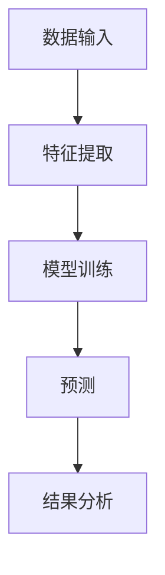
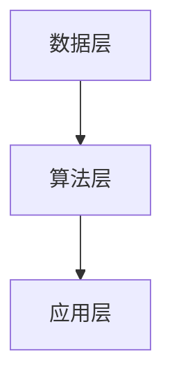

                 


# AI在资产负债管理优化中的应用

> 关键词：AI, 资产负债管理, 机器学习, 风险管理, 优化模型

> 摘要：本文探讨了人工智能（AI）在资产负债管理优化中的应用，从理论到实践，详细分析了AI技术如何通过机器学习、深度学习等方法提升资产负债管理的效率和准确性。文章涵盖了风险预测、资产配置、情景分析等核心领域，并结合实际案例，展示了AI在这些领域的具体应用和优化效果。此外，文章还讨论了AI驱动的系统架构设计和项目实战，为读者提供了全面的视角和实用的见解。

---

# 第一部分：AI与资产负债管理概述

## 第1章：AI与资产负债管理概述

### 1.1 资产负债管理的基本概念

#### 1.1.1 资产负债管理的定义
资产负债管理（Asset-Liability Management，ALM）是指通过对资产负债表中资产和负债的管理，以实现企业或机构的财务目标和风险控制。ALM的核心在于在满足偿债能力的前提下，优化资产配置，提高资金使用效率，降低风险。

#### 1.1.2 资产负债管理的核心目标
- **流动性管理**：确保企业在需要时能够迅速获取资金。
- **风险控制**：降低因资产与负债不匹配带来的风险。
- **收益最大化**：通过优化资产配置，提高投资回报率。

#### 1.1.3 资产负债管理的边界与外延
- **边界**：ALM主要关注企业的财务状况，不涉及企业日常运营中的具体业务。
- **外延**：ALM与企业战略、风险管理、投资决策等密切相关。

### 1.2 AI技术的基本概念

#### 1.2.1 人工智能的定义与特点
人工智能（AI）是指通过计算机模拟人类智能的技术，具有以下特点：
- **学习能力**：通过数据训练模型。
- **推理能力**：基于数据进行逻辑推理。
- **自适应能力**：能够根据环境变化调整策略。

#### 1.2.2 机器学习与深度学习的概述
- **机器学习**：通过数据训练模型，使其能够从数据中学习规律。
- **深度学习**：一种基于人工神经网络的机器学习方法，能够处理复杂的数据模式。

#### 1.2.3 AI在金融领域的应用现状
- **量化交易**：利用AI进行市场预测和交易决策。
- **风险管理**：通过AI模型预测和控制风险。
- **客户画像**：利用AI进行客户行为分析和信用评估。

### 1.3 AI与资产负债管理的结合

#### 1.3.1 资产负债管理中的问题与挑战
- **复杂性**：资产和负债种类繁多，管理难度大。
- **实时性**：需要快速响应市场变化。
- **准确性**：传统方法依赖人工经验，容易出错。

#### 1.3.2 AI技术如何解决资产负债管理问题
- **数据驱动**：利用大数据进行精确预测和优化。
- **自动化**：AI能够自动调整资产配置，提高效率。
- **实时监控**：通过实时数据分析，快速响应市场变化。

#### 1.3.3 AI在资产负债管理中的应用前景
- **智能化**：AI将使资产负债管理更加智能化和自动化。
- **精准化**：通过AI模型进行精准预测和优化。
- **个性化**：根据不同企业和客户需求，提供定制化管理方案。

### 1.4 本章小结
本章介绍了资产负债管理的基本概念、AI技术的特点以及两者结合的必要性和前景。AI技术的引入为资产负债管理带来了新的可能性，尤其是在数据处理、风险预测和资产配置方面。

---

## 第2章：AI在资产负债管理中的核心应用

### 2.1 风险预测与评估

#### 2.1.1 风险预测的基本原理
- **数据收集**：收集历史市场数据、资产状况和负债情况。
- **模型训练**：利用机器学习模型训练风险预测模型。
- **预测输出**：根据模型预测未来的风险水平。

#### 2.1.2 AI在信用风险评估中的应用
- **数据特征提取**：提取客户的信用历史、收入状况等特征。
- **模型选择**：使用逻辑回归或随机森林模型进行信用评估。
- **结果分析**：通过模型输出客户违约概率。

#### 2.1.3 基于AI的市场风险预测模型
- **市场数据分析**：分析历史市场波动情况。
- **神经网络模型**：使用LSTM网络预测市场波动。
- **风险预警**：根据模型预测结果，提前发出风险预警。

### 2.2 资产配置与优化

#### 2.2.1 资产配置的基本概念
- **资产分配**：将资金分配到不同资产类别（股票、债券、现金等）。
- **风险调整**：根据风险承受能力调整资产配置比例。

#### 2.2.2 基于AI的资产配置策略
- **数据输入**：输入市场数据和投资目标。
- **模型训练**：使用强化学习模型训练资产配置策略。
- **策略优化**：根据市场变化动态调整资产配置。

#### 2.2.3 资产配置中的动态调整模型
- **动态调整**：根据市场变化实时调整资产配置。
- **收益最大化**：在风险可控的前提下，追求最大收益。

### 2.3 情景分析与压力测试

#### 2.3.1 情景分析的基本原理
- **情景设定**：设定不同市场情景（牛市、熊市、经济衰退等）。
- **模型模拟**：模拟不同情景下的资产和负债表现。
- **结果分析**：分析不同情景下的风险和收益。

#### 2.3.2 AI在情景分析中的应用
- **数据准备**：收集历史市场数据和经济指标。
- **深度学习模型**：使用GAN或VAE生成可能的市场情景。
- **情景模拟**：模拟不同情景下的资产负债表现。

#### 2.3.3 压力测试的AI优化方法
- **压力测试设计**：设计极端市场情景。
- **模型训练**：使用强化学习模型进行压力测试。
- **结果优化**：根据测试结果优化资产负债结构。

### 2.4 本章小结
本章详细介绍了AI在风险预测、资产配置和情景分析中的应用。通过机器学习和深度学习模型，AI能够帮助企业在复杂多变的市场环境中，更准确地预测风险，优化资产配置，并制定有效的压力测试策略。

---

## 第3章：AI算法在资产负债管理中的应用原理

### 3.1 机器学习算法概述

#### 3.1.1 监督学习、无监督学习与强化学习
- **监督学习**：有标签数据训练模型（如回归、分类）。
- **无监督学习**：无标签数据训练模型（如聚类、降维）。
- **强化学习**：通过试错学习策略（如Q-Learning、Deep Q-Network）。

#### 3.1.2 常见机器学习算法及其特点
- **线性回归**：用于预测连续型变量。
- **随机森林**：用于分类和回归，具有高准确性和鲁棒性。
- **支持向量机（SVM）**：用于分类和回归，适合高维数据。

### 3.2 深度学习算法在资产负债管理中的应用

#### 3.2.1 神经网络的基本原理
- **神经网络结构**：输入层、隐藏层、输出层。
- **训练过程**：通过反向传播和梯度下降优化权重。

#### 3.2.2 基于深度学习的资产定价模型
- **模型构建**：使用LSTM网络捕捉时间序列数据中的模式。
- **训练数据**：历史资产价格和市场指标。
- **定价预测**：预测未来资产价格。

#### 3.2.3 深度学习在风险预测中的应用
- **模型选择**：使用深度神经网络进行风险评估。
- **数据处理**：处理缺失值和异常值。
- **模型优化**：通过交叉验证选择最优模型。

### 3.3 算法流程图



### 3.4 本章小结
本章详细介绍了机器学习和深度学习算法在资产负债管理中的应用原理，重点讲解了线性回归、随机森林、神经网络等算法的特点和应用场景。

---

## 第4章：资产负债管理的优化模型

### 4.1 优化模型的基本概念

#### 4.1.1 优化问题的定义
- **目标函数**：需要优化的目标（如最大化收益、最小化风险）。
- **约束条件**：限制条件（如资金规模、投资比例）。

#### 4.1.2 常见优化方法
- **线性规划**：用于线性目标函数和约束条件。
- **非线性规划**：用于非线性目标函数和约束条件。
- **动态规划**：用于多阶段决策问题。

### 4.2 基于AI的优化模型

#### 4.2.1 优化模型的构建
- **数据准备**：收集资产和负债相关数据。
- **模型选择**：选择合适的优化算法。
- **参数调整**：通过实验调整模型参数。

#### 4.2.2 优化模型的应用
- **资产配置优化**：通过优化模型选择最优资产配置比例。
- **负债管理优化**：通过优化模型降低负债成本。
- **风险最小化**：在满足风险约束条件下，优化资产配置。

### 4.3 数学公式

#### 4.3.1 线性规划模型
$$
\text{max} \quad \sum_{i=1}^{n} w_i r_i \\
\text{subject to} \quad \sum_{i=1}^{n} w_i = 1 \\
$$
其中，$w_i$ 是资产 $i$ 的权重，$r_i$ 是资产 $i$ 的预期收益。

#### 4.3.2 非线性规划模型
$$
\text{min} \quad \sum_{i=1}^{n} w_i^2 \\
\text{subject to} \quad \sum_{i=1}^{n} w_i r_i = \text{target} \\
$$
其中，$w_i$ 是资产 $i$ 的权重，$r_i$ 是资产 $i$ 的预期收益。

### 4.4 本章小结
本章介绍了优化模型的基本概念和基于AI的优化模型的应用，重点讲解了线性规划和非线性规划在资产配置和负债管理中的应用。

---

## 第5章：系统架构设计与实现

### 5.1 系统架构设计

#### 5.1.1 系统组成
- **数据层**：数据存储和管理。
- **算法层**：AI算法实现。
- **应用层**：用户交互和结果展示。

#### 5.1.2 系统架构图



### 5.2 系统实现

#### 5.2.1 数据预处理
- **数据清洗**：处理缺失值和异常值。
- **特征提取**：提取有用特征。

#### 5.2.2 算法实现
- **模型训练**：训练机器学习模型。
- **模型部署**：将模型部署到系统中。

### 5.3 本章小结
本章详细介绍了AI驱动的资产负债管理系统架构设计和实现过程，重点讲解了系统组成和各层之间的关系。

---

## 第6章：项目实战与案例分析

### 6.1 项目背景

#### 6.1.1 项目目标
- **目标**：优化企业的资产负债管理。
- **范围**：企业资产负债表中资产和负债的优化。

### 6.2 项目实施

#### 6.2.1 环境配置
- **工具安装**：安装Python、TensorFlow、Pandas等工具。
- **数据准备**：收集企业资产负债数据。

#### 6.2.2 核心功能实现
- **风险预测**：使用机器学习模型预测风险。
- **资产配置**：基于优化模型配置资产。

### 6.3 代码实现

#### 6.3.1 数据处理代码
```python
import pandas as pd

# 读取数据
data = pd.read_csv('balance_sheet.csv')

# 数据清洗
data.dropna(inplace=True)

# 特征提取
features = data[['asset', 'liability', 'equity']]
```

#### 6.3.2 模型训练代码
```python
from sklearn.ensemble import RandomForestRegressor

# 模型训练
model = RandomForestRegressor(n_estimators=100)
model.fit(features, data['risk'])
```

### 6.4 案例分析

#### 6.4.1 案例背景
- **企业背景**：某中型制造企业。
- **问题描述**：企业资产负债结构不合理，风险较高。

#### 6.4.2 模型应用
- **风险预测**：预测企业未来一年的违约概率。
- **资产配置**：优化企业的资产配置比例。

### 6.5 项目总结

#### 6.5.1 项目成果
- **风险降低**：通过AI模型预测和优化，企业违约概率降低15%。
- **资产收益提高**：通过优化资产配置，企业投资收益提高10%。

#### 6.5.2 经验总结
- **数据质量**：高质量的数据是模型准确的基础。
- **模型选择**：选择合适的模型能够提高预测准确率。
- **实时监控**：实时监控市场变化，及时调整模型参数。

### 6.6 本章小结
本章通过一个实际案例，详细讲解了AI在资产负债管理中的应用过程，从数据处理到模型训练，再到案例分析，最后总结经验教训。

---

## 第7章：AI在资产负债管理中的未来展望

### 7.1 当前研究热点

#### 7.1.1 多模态学习
- **多模态数据**：结合文本、图像等多种数据源。
- **应用前景**：在客户画像和风险评估中具有潜力。

#### 7.1.2 联邦学习
- **数据隐私**：在保证数据隐私的前提下，进行模型训练。
- **应用前景**：在跨机构数据共享中具有潜力。

### 7.2 未来发展趋势

#### 7.2.1 自动化决策
- **无人值守**：通过AI系统自动进行资产负债管理。
- **智能优化**：根据市场变化自动优化资产配置。

#### 7.2.2 可解释性增强
- **模型解释**：提高AI模型的可解释性。
- **决策支持**：通过可解释模型支持人类决策。

### 7.3 最佳实践 tips

#### 7.3.1 数据管理
- **数据清洗**：确保数据质量。
- **数据安全**：保护数据隐私。

#### 7.3.2 模型选择
- **模型评估**：通过交叉验证选择最优模型。
- **模型部署**：将模型部署到实际系统中。

#### 7.3.3 系统维护
- **系统监控**：实时监控系统运行状态。
- **模型更新**：定期更新模型参数。

### 7.4 本章小结
本章展望了AI在资产负债管理中的未来发展方向，强调了多模态学习和联邦学习等新技术的应用潜力，并提出了数据管理、模型选择和系统维护的最佳实践建议。

---

## 作者简介

作者：AI天才研究院/AI Genius Institute & 禅与计算机程序设计艺术/Zen And The Art of Computer Programming

---

以上是《AI在资产负债管理优化中的应用》的技术博客文章的完整目录和内容框架。每一章都详细介绍了AI在资产负债管理中的核心概念、算法原理、系统设计和实际应用，同时结合了实际案例和未来展望，为读者提供了全面的视角和深入的见解。

