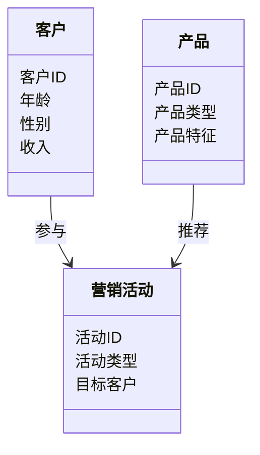
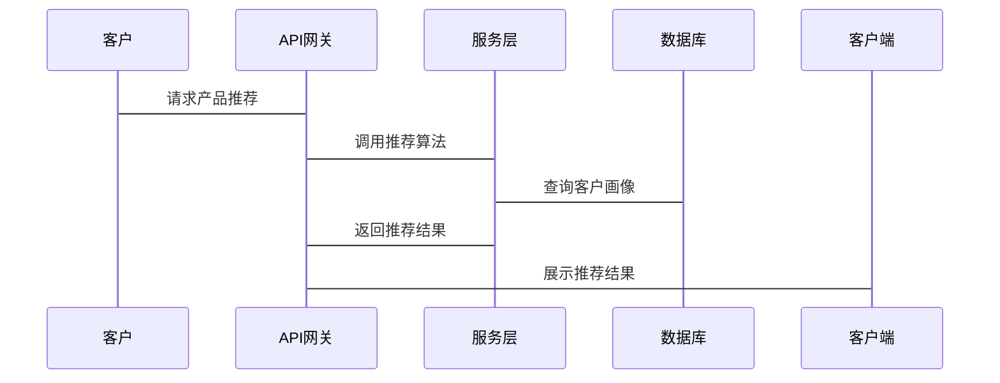

                 


# AI在金融产品营销中的创新应用

## 关键词：人工智能、金融产品营销、机器学习、自然语言处理、深度学习

## 摘要：随着人工智能技术的飞速发展，AI在金融产品营销中的应用越来越广泛。本文从背景介绍、核心概念、算法原理、系统架构、项目实战等多方面详细探讨AI在金融产品营销中的创新应用，结合实际案例和数学模型，深入分析AI如何提升金融产品的营销效果和用户体验。

---

# 第1章: 背景介绍

## 1.1 问题背景

### 1.1.1 传统金融产品营销的痛点
- **信息不对称**：传统营销方式难以精准匹配客户需求与产品特性。
- **效率低下**：人工营销成本高，覆盖面有限，难以实现大规模个性化营销。
- **客户体验差**：传统营销手段缺乏互动性和个性化，客户参与度低。

### 1.1.2 AI技术如何解决这些问题
- **精准匹配**：通过AI技术分析客户需求和产品特性，实现精准营销。
- **提高效率**：AI驱动自动化营销流程，降低人工成本，扩大营销范围。
- **提升客户体验**：通过智能化推荐和互动，提高客户参与度和满意度。

### 1.1.3 金融产品营销的边界与外延
- **边界**：AI在金融产品营销中的应用范围，如客户画像、产品推荐等。
- **外延**：AI技术在金融产品设计、风险评估等领域的延伸应用。

---

## 1.2 核心概念与问题描述

### 1.2.1 AI在金融产品营销中的核心概念
- **客户画像**：通过AI技术构建客户画像，分析客户的年龄、性别、收入、消费习惯等特征。
- **产品推荐系统**：基于客户画像和产品特征，利用机器学习算法推荐适合的产品。
- **营销自动化**：通过AI技术实现自动化的营销流程，如自动化邮件发送、个性化短信推送等。

### 1.2.2 问题的结构化描述
- **问题**：如何利用AI技术提升金融产品的营销效果和客户满意度。
- **目标**：构建一个智能化的金融产品营销系统，实现精准营销和个性化服务。

### 1.2.3 核心要素组成与关系
- **核心要素**：客户数据、产品数据、营销渠道、营销策略。
- **关系**：客户数据与产品数据通过AI算法进行匹配，生成营销策略，通过营销渠道实施。

---

## 1.3 问题解决的思路

### 1.3.1 AI技术如何创新性地解决问题
- **数据驱动**：通过大数据分析，挖掘客户行为和需求特征。
- **算法驱动**：利用机器学习算法，构建客户画像和产品推荐模型。
- **自动化驱动**：通过自动化营销工具，实现精准营销和个性化服务。

### 1.3.2 从传统营销到智能营销的转变
- **传统营销**：基于经验的营销策略，覆盖面有限，效果不佳。
- **智能营销**：基于数据和算法的精准营销，效果显著，成本降低。

### 1.3.3 创新应用的边界与可行性
- **边界**：AI技术在金融产品营销中的应用范围和限制。
- **可行性**：基于现有技术和数据，AI在金融产品营销中的应用是可行的。

---

## 1.4 本章小结

本章从传统金融产品营销的痛点出发，介绍了AI技术如何解决这些问题，提出了AI在金融产品营销中的核心概念和问题描述，并分析了AI技术在金融产品营销中的创新应用的边界与可行性。

---

# 第2章: 核心概念与联系

## 2.1 AI技术的核心原理

### 2.1.1 机器学习与深度学习的基本原理
- **机器学习**：通过数据训练模型，使其能够从数据中学习规律，实现预测和分类。
- **深度学习**：基于神经网络的机器学习方法，能够自动提取数据特征。

### 2.1.2 自然语言处理（NLP）的应用
- **情感分析**：分析客户对金融产品的评价，识别客户情感倾向。
- **文本生成**：生成个性化的营销文案。

### 2.1.3 计算机视觉在金融产品营销中的应用
- **图像识别**：识别产品宣传资料中的图像特征。
- **视频分析**：分析营销视频中的客户行为和情感。

---

## 2.2 金融产品营销的核心要素

### 2.2.1 金融产品的生命周期
- **产品设计**：基于市场需求设计产品。
- **产品推广**：通过营销活动推广产品。
- **产品维护**：通过售后服务维护客户关系。

### 2.2.2 用户行为分析
- **用户画像**：分析客户的年龄、性别、收入、消费习惯等特征。
- **用户行为轨迹**：分析客户的浏览、点击、购买行为。

### 2.2.3 营销渠道与策略
- **线上渠道**：通过网站、APP、社交媒体等渠道进行营销。
- **线下渠道**：通过银行网点、电话营销等方式进行营销。

---

## 2.3 核心概念的联系与对比

### 2.3.1 AI技术与金融产品营销的关系
- **数据驱动**：AI技术依赖于数据进行分析和预测。
- **技术驱动**：AI技术提供了新的营销工具和方法。

### 2.3.2 传统营销与AI驱动营销的对比

| 对比维度       | 传统营销                | AI驱动营销              |
|----------------|-------------------------|--------------------------|
| 数据使用       | 依赖少量数据            | 依赖大量数据            |
| 营销策略       | 基于经验                 | 基于数据和算法           |
| 营销效果       | 效果有限                | 效果显著                |

### 2.3.3 核心概念的ER实体关系图

```mermaid
erDiagram
    customer[客户]
    product[金融产品]
    campaign[营销活动]
    interaction[用户行为]
    customer --> interaction: 产生
    product --> interaction: 关联
    campaign --> interaction: 引发
```

---

## 2.4 本章小结

本章详细介绍了AI技术的核心原理，分析了金融产品营销的核心要素，并通过对比和ER图展示了AI技术与金融产品营销的核心概念之间的联系。

---

# 第3章: 算法原理讲解

## 3.1 机器学习算法原理

### 3.1.1 线性回归模型
- **原理**：通过最小化预测值与实际值的平方差之和，找到最佳拟合直线。
- **公式**：$$ y = \beta_0 + \beta_1x + \epsilon $$
- **应用场景**：预测客户购买金融产品的概率。

### 3.1.2 支持向量机（SVM）
- **原理**：通过构建超平面，将数据点分为不同类别。
- **公式**：$$ \text{最大化} \sum_{i=1}^{n} y_i (\beta_0 + \beta_1x_i) + \xi_i $$
- **应用场景**：分类客户类型，如高净值客户和普通客户。

### 3.1.3 随机森林与梯度提升树
- **随机森林**：通过构建多个决策树，取其平均值，降低过拟合风险。
- **梯度提升树**：通过迭代优化，逐步提升模型性能。
- **应用场景**：客户画像和产品推荐。

---

## 3.2 深度学习算法原理

### 3.2.1 卷积神经网络（CNN）
- **原理**：通过卷积层提取图像特征，用于图像识别任务。
- **公式**：$$ a = \sigma(Wx + b) $$
- **应用场景**：识别产品宣传资料中的图像特征。

### 3.2.2 循序神经网络（RNN）
- **原理**：通过循环层处理序列数据，如文本和时间序列数据。
- **公式**：$$ a_t = \sigma(Wa_{t-1} + b) $$
- **应用场景**：分析客户行为轨迹和生成营销文案。

### 3.2.3 图神经网络（GNN）
- **原理**：通过图结构数据进行建模，捕捉数据之间的关系。
- **公式**：$$ Z = AGX $$
- **应用场景**：分析客户之间的关系网络，识别潜在客户。

---

## 3.3 本章小结

本章详细讲解了机器学习和深度学习的算法原理，分析了这些算法在金融产品营销中的应用场景，并通过公式和图表展示了算法的核心思想。

---

# 第4章: 数学模型与公式推导

## 4.1 金融产品营销中的数学模型

### 4.1.1 客户画像模型
- **公式**：$$ \text{客户画像} = \sum_{i=1}^{n} w_i x_i $$
- **解释**：通过加权求和的方式，构建客户的综合画像。

### 4.1.2 产品推荐模型
- **公式**：$$ \text{推荐概率} = \frac{1}{1 + e^{- (\beta_0 + \beta_1 x)}} $$
- **解释**：通过逻辑回归模型，预测客户购买产品的概率。

### 4.1.3 营销效果评估模型
- **公式**：$$ \text{转化率} = \frac{\text{实际购买人数}}{\text{目标客户数}} $$
- **解释**：通过转化率评估营销活动的效果。

---

## 4.2 算法数学推导

### 4.2.1 线性回归的最小二乘法推导
- **目标**：最小化预测值与实际值的平方差之和。
- **推导**：$$ \frac{\partial}{\partial \beta_j} \sum_{i=1}^{n} (y_i - (\beta_0 + \beta_1 x_i))^2 = 0 $$
- **解**：$$ \beta_1 = \frac{\sum (x_i - \bar{x})(y_i - \bar{y})}{\sum (x_i - \bar{x})^2} $$

### 4.2.2 支持向量机的对偶形式推导
- **目标**：最大化分类间隔。
- **推导**：$$ \max \frac{1}{2} ||w||^2 \text{ subject to } y_i (w \cdot x_i + b) \geq 1 $$

---

## 4.3 本章小结

本章详细推导了金融产品营销中的数学模型，并通过公式和图表展示了算法的核心思想，为后续的系统实现提供了理论基础。

---

# 第5章: 系统分析与架构设计

## 5.1 系统需求分析

### 5.1.1 功能需求
- **客户画像**：构建客户画像，分析客户特征。
- **产品推荐**：基于客户画像推荐适合的产品。
- **营销自动化**：实现自动化营销流程。

### 5.1.2 性能需求
- **响应时间**：系统响应时间不超过1秒。
- **扩展性**：系统能够支持大规模数据处理。

### 5.1.3 接口需求
- **API接口**：提供API接口，与其他系统集成。

---

## 5.2 系统架构设计

### 5.2.1 领域模型设计


### 5.2.2 系统架构图


### 5.2.3 交互流程图


---

## 5.3 本章小结

本章从系统需求出发，设计了系统的领域模型、架构图和交互流程图，为后续的系统实现提供了设计依据。

---

# 第6章: 项目实战

## 6.1 项目背景与目标

### 6.1.1 项目背景
- **目标**：构建一个基于AI的金融产品营销系统。
- **需求**：实现客户画像、产品推荐和营销自动化功能。

### 6.1.2 项目目标
- **核心目标**：提高金融产品的营销效果和客户满意度。
- **附加目标**：降低营销成本，提高营销效率。

---

## 6.2 项目实施

### 6.2.1 环境配置
- **开发环境**：Python 3.8，Jupyter Notebook。
- **依赖库**：numpy、pandas、scikit-learn、tensorflow。

### 6.2.2 核心代码实现

#### 6.2.2.1 客户画像构建
```python
import pandas as pd
from sklearn.preprocessing import StandardScaler

# 加载数据
data = pd.read_csv('customer.csv')

# 数据预处理
scaler = StandardScaler()
scaled_data = scaler.fit_transform(data)

# 构建客户画像
customer_profile = pd.DataFrame(scaled_data, columns=data.columns)
```

#### 6.2.2.2 产品推荐系统
```python
from sklearn.linear_model import LogisticRegression

# 加载数据
data = pd.read_csv('product.csv')

# 数据预处理
X = data.drop('label', axis=1)
y = data['label']

# 训练模型
model = LogisticRegression()
model.fit(X, y)

# 预测推荐
new_customer = data.drop('label', axis=1).iloc[0]
predicted_label = model.predict(new_customer.values.reshape(1, -1))
```

#### 6.2.2.3 营销自动化
```python
import requests

# 发送API请求
response = requests.post('http://api_gateway/recommend', json={'customer_id': 123})
print(response.json())
```

---

## 6.3 项目案例分析

### 6.3.1 案例背景
- **客户特征**：年龄30岁，收入中等，对理财产品感兴趣。
- **产品推荐**：推荐年金保险产品。

### 6.3.2 案例分析
- **客户画像**：通过数据分析，客户画像显示该客户适合购买年金保险。
- **推荐结果**：系统推荐了三款年金保险产品，并通过API接口发送了营销信息。

---

## 6.4 项目总结

本章通过一个具体的项目案例，详细讲解了AI在金融产品营销中的实际应用，展示了系统的实现过程和实际效果。

---

# 第7章: 总结与展望

## 7.1 本章小结

本文详细探讨了AI在金融产品营销中的创新应用，从背景介绍、核心概念、算法原理、系统架构到项目实战，全面分析了AI技术在金融产品营销中的应用。

---

## 7.2 未来展望

随着AI技术的不断发展，未来AI在金融产品营销中的应用将更加广泛和深入，如更加智能化的营销策略、更加个性化的客户服务等。

---

## 7.3 学习与实践建议

- **学习建议**：深入学习机器学习和深度学习算法，掌握金融产品营销的核心知识。
- **实践建议**：通过实际项目，积累经验，提升AI在金融产品营销中的应用能力。

---

## 作者信息

作者：AI天才研究院/AI Genius Institute & 禅与计算机程序设计艺术 /Zen And The Art of Computer Programming

---

以上是《AI在金融产品营销中的创新应用》的技术博客文章的详细目录大纲和内容概要。

