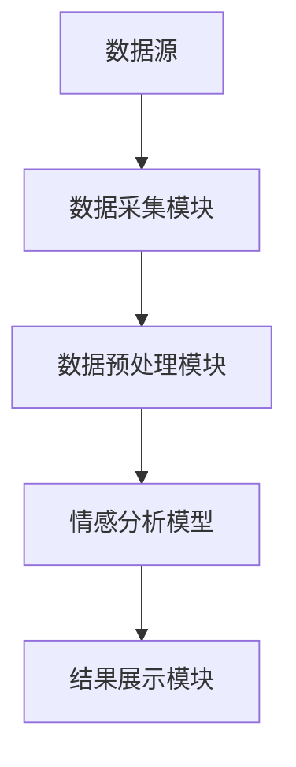

                 

# AI在金融市场情绪分析中的创新应用

> 关键词：AI，金融市场，情绪分析，自然语言处理，深度学习，金融数据挖掘，情感计算

> 摘要：本文探讨了人工智能在金融市场情绪分析中的创新应用。首先介绍了情绪分析的定义及其在金融领域的应用背景，接着详细分析了自然语言处理和深度学习在情绪分析中的作用。然后，深入探讨了基于LSTM和BERT等深度学习模型的创新算法，并通过实际案例展示了这些算法在金融情绪分析中的应用效果。最后，总结了当前研究的成果，并展望了未来的研究方向。

---

## 第一部分: 金融市场情绪分析的背景与概念

### 第1章: 金融市场情绪分析概述

#### 1.1 情绪分析的定义与背景

情绪分析（Sentiment Analysis）是一种自然语言处理技术，用于识别和分析文本中的情感倾向。在金融领域，情绪分析被广泛应用于股票市场预测、新闻分析、社交媒体监控等领域。通过分析新闻标题、公司财报、投资者评论等文本数据，情绪分析可以帮助投资者预测市场趋势，做出更明智的投资决策。

情绪分析在金融领域的应用具有重要意义。金融市场中的信息往往具有高度的不确定性和波动性，而情绪分析能够捕捉到市场参与者的心理状态，从而为投资决策提供额外的信息支持。例如，当市场情绪偏向乐观时，股票价格可能会上涨；反之，当市场情绪悲观时，股票价格可能会下跌。

近年来，随着人工智能技术的快速发展，情绪分析在金融领域的应用也得到了显著提升。传统的基于规则的情绪分析方法逐渐被深度学习模型取代，这些模型能够更准确地捕捉文本中的情感信息，并在复杂场景下表现出更好的性能。

---

#### 1.2 AI技术在情绪分析中的应用

AI技术的演进为情绪分析带来了许多创新。传统的基于规则的情绪分析方法依赖于人工定义的特征和规则，这种方法在面对复杂和多样化的文本数据时表现有限。而基于深度学习的情绪分析方法，如循环神经网络（RNN）、长短期记忆网络（LSTM）和Transformer模型，则能够自动学习文本中的语义信息，并在复杂任务中表现出色。

在金融领域，AI技术的应用主要体现在以下几个方面：

1. **股票价格预测**：通过分析新闻、社交媒体和公司财报中的情绪信息，预测股票价格的波动趋势。
2. **风险管理**：利用情绪分析识别市场中的潜在风险，帮助投资者制定风险管理策略。
3. **投资决策支持**：结合情绪分析和传统金融指标，为投资者提供更全面的投资决策支持。

---

### 第2章: 金融市场情绪分析的核心概念

#### 2.1 文本挖掘与自然语言处理

文本挖掘（Text Mining）是从大量文本数据中提取有用信息的技术，而自然语言处理（NLP）则是研究如何让计算机理解和生成人类语言的技术。在情绪分析中，文本挖掘和NLP技术是不可或缺的工具。

例如，文本挖掘可以帮助我们从大量的金融新闻中提取关键词和主题，而NLP技术则可以帮助我们分析文本的情感倾向。结合这两者，我们可以更准确地捕捉市场情绪的变化。

在金融领域，文本挖掘和NLP技术的应用场景包括：

- **新闻标题分析**：通过分析新闻标题的情感倾向，预测股票价格的变化。
- **社交媒体分析**：通过分析社交媒体上的投资者评论，了解市场情绪。
- **公司财报分析**：通过分析公司财报中的关键词和情感倾向，评估公司的财务状况和市场前景。

---

#### 2.2 情感计算与深度学习

情感计算（Affective Computing）是研究如何将情感信息整合到计算系统中的一项技术。在情绪分析中，情感计算可以帮助我们更准确地识别和分类情感信息。

深度学习（Deep Learning）是一种基于人工神经网络的机器学习技术，其在情绪分析中的应用尤为广泛。例如，循环神经网络（RNN）和长短期记忆网络（LSTM）可以处理序列数据，如文本，从而捕捉文本中的语义信息。

在金融市场中，深度学习模型的应用场景包括：

- **股票价格预测**：通过分析新闻、社交媒体和公司财报中的情感信息，预测股票价格的变化。
- **风险预警**：通过分析市场情绪的变化，识别潜在的市场风险。
- **投资组合优化**：通过分析市场情绪和资产相关性，优化投资组合的配置。

---

#### 2.3 金融市场情绪分析的系统架构

金融市场情绪分析的系统架构通常包括以下几个部分：

1. **数据采集**：从新闻、社交媒体、公司财报等来源获取文本数据。
2. **数据预处理**：对文本数据进行清洗、分词和特征提取。
3. **模型训练**：使用深度学习模型（如LSTM、BERT）对数据进行训练，生成情感分析结果。
4. **结果展示**：将情感分析结果可视化，帮助投资者做出决策。

以下是一个简单的金融市场情绪分析系统的架构图：

---

## 第二部分: 情绪分析的核心算法与模型

### 第3章: 情绪分析的核心算法与模型

#### 3.1 传统机器学习模型

传统机器学习模型（如支持向量机、随机森林）在情绪分析中的应用相对有限，主要因为它们依赖于人工提取的特征，并且在处理长文本时表现不佳。

- **线性回归模型**：用于预测情感极性，通常用于简单的文本分类任务。
- **支持向量机（SVM）**：一种常用的分类算法，适用于小规模数据集。
- **随机森林**：一种基于决策树的集成学习算法，适用于特征较多的场景。

#### 3.2 深度学习模型

深度学习模型在情绪分析中的应用越来越广泛，主要得益于其强大的语义理解和特征学习能力。

- **循环神经网络（RNN）**：适用于处理序列数据，如文本。
- **长短期记忆网络（LSTM）**：一种改进的RNN，能够更好地捕捉长距离依赖。
- **Transformer模型**：基于自注意力机制，适用于处理长文本和并行计算。

#### 3.3 创新算法

创新算法（如情感传播网络、基于强化学习的情绪分析模型）是当前研究的热点。

- **情感传播网络**：通过构建情感传播网络，分析情感信息在市场中的传播和影响。
- **强化学习模型**：通过强化学习算法，优化情感分析模型的性能。

---

## 第三部分: 情绪分析的数学模型与公式

### 第4章: 情绪分析的数学模型与公式

#### 4.1 传统机器学习模型

- **线性回归模型**
$$y = \beta_0 + \beta_1x_1 + \beta_2x_2 + \ldots + \beta_nx_n + \epsilon$$

- **支持向量机模型**
$$\text{max} \frac{1}{2}||\beta||^2$$
$$\text{subject to} \ y_i(\beta^T x_i + \beta_0) \geq 1, \forall i$$

#### 4.2 深度学习模型

- **LSTM模型结构**
$$f_t = \sigma(W_f \cdot [h_{t-1}, x_t] + b_f)$$
$$i_t = \sigma(W_i \cdot [h_{t-1}, x_t] + b_i)$$
$$o_t = \sigma(W_o \cdot [h_{t-1}, x_t] + b_o)$$
$$c_t = f_t \cdot c_{t-1} + i_t \cdot x_t$$
$$h_t = o_t \cdot \tanh(c_t)$$

- **BERT模型**
$$\text{BERT}(

---

## 第四部分: 项目实战

### 第5章: 项目实战

#### 5.1 环境安装与数据采集

- 安装必要的Python库：`numpy`, `pandas`, `tensorflow`, `transformers`。
- 从新闻网站、社交媒体等来源获取金融文本数据。

#### 5.2 数据预处理

- 文本清洗：去除停用词、标点符号。
- 分词：使用`jieba`或`spaCy`进行分词。
- 特征提取：使用TF-IDF或Word2Vec提取文本特征。

#### 5.3 模型训练

- 使用LSTM或BERT模型进行训练。
- 定义损失函数（如交叉熵损失）和优化器（如Adam）。
- 训练模型并保存最优模型。

#### 5.4 结果展示

- 将情感分析结果可视化，如绘制市场情绪指数图。
- 对比不同模型的性能，选择最优模型进行部署。

---

## 第五部分: 总结与展望

### 第6章: 总结与展望

#### 6.1 总结

本文详细介绍了AI在金融市场情绪分析中的创新应用，从核心概念、算法模型到项目实战，全面探讨了情绪分析在金融领域的应用潜力。通过深度学习模型的应用，我们能够更准确地捕捉市场情绪的变化，并为投资决策提供有力支持。

#### 6.2 展望

未来的研究可以进一步探索以下方向：

1. **跨模态融合**：结合文本、图像等多模态数据，提升情绪分析的准确性。
2. **实时情绪监控**：开发实时情绪监控系统，帮助投资者及时捕捉市场动态。
3. **强化学习应用**：探索强化学习在情绪分析中的应用，进一步优化模型性能。

---

## 作者：AI天才研究院 & 禅与计算机程序设计艺术

作者简介：

- **AI天才研究院**：专注于人工智能领域的研究与应用，致力于推动AI技术在金融、医疗等领域的创新应用。
- **禅与计算机程序设计艺术**：倡导将禅学思想融入计算机程序设计，追求技术与艺术的完美结合。

---

以上是《AI在金融市场情绪分析中的创新应用》的完整内容，涵盖了从基础概念到实际应用的各个方面。通过本文的分析，读者可以深入了解AI在金融市场情绪分析中的创新应用，并为未来的进一步研究提供参考。

