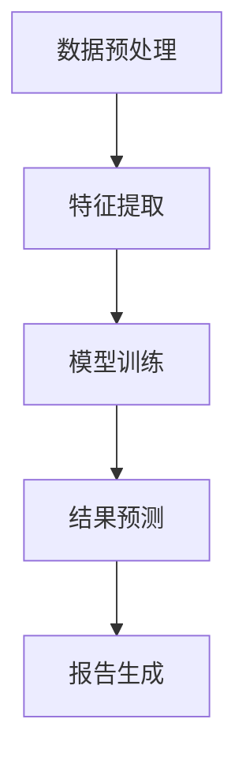
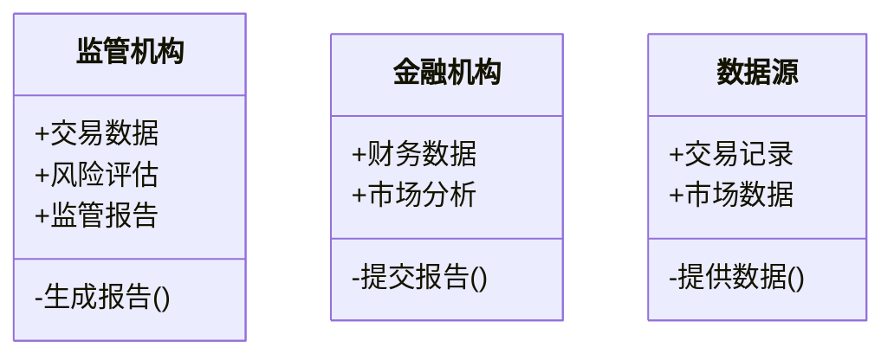
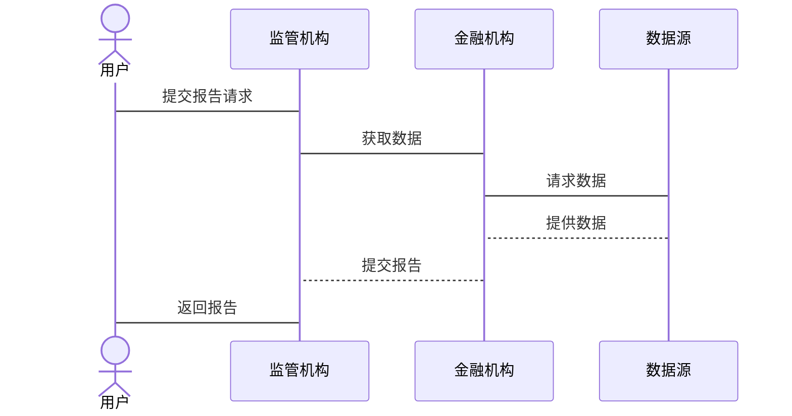

                 


# AI在金融监管报告生成中的应用

> 关键词：金融监管、人工智能、自然语言处理、机器学习、监管报告生成

> 摘要：本文详细探讨了人工智能技术在金融监管报告生成中的应用，从背景介绍、核心概念、算法原理到系统架构设计、项目实战，再到最佳实践，全面解析了AI如何提升金融监管效率与准确性。通过实际案例分析，展示了AI技术在金融监管报告生成中的实际应用价值和未来发展方向。

---

# 第一部分：AI在金融监管报告生成中的应用概述

## 第1章：AI与金融监管的背景介绍

### 1.1 问题背景与问题描述

#### 1.1.1 传统金融监管的痛点
传统的金融监管流程依赖人工操作，存在以下问题：
- 数据量大：金融机构每天产生海量交易数据，人工处理效率低。
- 理解复杂：金融报告内容涉及专业术语和复杂结构，人工解读耗时且易出错。
- 标准化难：不同机构的报告格式和内容差异大，统一标准困难。

#### 1.1.2 金融监管报告生成的复杂性
- 数据来源多样：包括交易记录、市场分析、财务报表等。
- 内容要求严格：报告需要符合监管机构的格式和内容要求。
- 时间要求高：监管机构需要在规定时间内完成报告审核。

#### 1.1.3 AI技术如何解决这些问题
- 数据处理能力强：AI能够快速处理和分析海量数据。
- 自动化能力突出：AI可以自动化生成报告，减少人工干预。
- 高准确性：AI通过机器学习模型能够提高报告的准确性和一致性。

### 1.2 AI在金融监管中的核心作用

#### 1.2.1 数据处理与分析能力
- AI能够快速处理结构化和非结构化数据，提取关键信息。
- 利用自然语言处理技术（NLP）分析文本数据，生成结构化的报告内容。

#### 1.2.2 自动化报告生成的优势
- AI可以自动生成符合监管要求的报告，减少人工操作。
- 通过机器学习模型预测潜在风险，提前预警。

#### 1.2.3 提高监管效率与准确性
- AI能够快速识别异常交易，降低监管延迟。
- 通过模型优化，提高报告的准确性和合规性。

### 1.3 本章小结
本章介绍了AI在金融监管中的背景和应用场景，重点分析了传统监管的痛点以及AI技术如何解决这些问题。通过AI技术的应用，可以显著提高金融监管的效率和准确性。

---

## 第2章：AI与金融监管的核心概念与联系

### 2.1 核心概念原理

#### 2.1.1 人工智能的基本原理
- AI通过机器学习、深度学习等技术，从数据中学习模式和规律。
- 常见的AI技术包括：监督学习、无监督学习、强化学习、自然语言处理（NLP）等。

#### 2.1.2 金融监管的关键概念
- 金融监管的核心目标是确保市场公平、透明和合规。
- 监管报告是金融机构向监管机构提交的重要文件，内容包括财务状况、风险评估、合规性等。

#### 2.1.3 AI在金融监管中的应用模式
- 数据分析与监控：利用AI技术实时监控交易数据，识别异常行为。
- 自动化报告生成：通过NLP技术将非结构化数据转化为结构化报告。
- 风险评估与预警：利用机器学习模型预测潜在风险，提前采取措施。

### 2.2 核心概念属性特征对比表

| 概念 | 属性 | 特征 |
|------|------|------|
| AI   | 数据需求 | 高 |
| 金融监管 | 监管目标 | 多样性 |
| AI在金融监管中的应用 | 优势 | 高效性 |

### 2.3 ER实体关系图

```mermaid
er
actor: 监管机构
actor: 金融机构
actor: 数据源
object: 监管报告
object: 交易数据
object: 风险评估
```

### 2.4 本章小结
本章详细讲解了AI与金融监管的核心概念和联系，通过对比表和实体关系图展示了AI在金融监管中的重要作用和应用场景。

---

## 第3章：AI驱动的金融监管算法原理

### 3.1 算法原理概述

#### 3.1.1 机器学习算法
- 线性回归：用于预测连续型变量，如股票价格。
- 支持向量机（SVM）：用于分类问题，如识别欺诈交易。
- 随机森林：用于分类和回归问题，适合处理高维数据。

#### 3.1.2 自然语言处理模型
- 词袋模型（Bag of Words）：将文本转化为数值向量，用于文本分类。
- 词嵌入（Word Embedding）：如Word2Vec，将单词映射为低维向量，用于语义分析。
- 循环神经网络（RNN）：用于处理序列数据，如时间序列分析。

#### 3.1.3 深度学习框架
- 卷积神经网络（CNN）：用于图像识别和模式识别。
- Transformer：用于序列建模，如BERT模型用于文本理解。

### 3.2 算法流程图



### 3.3 算法实现代码

```python
import pandas as pd
from sklearn.model import LinearRegression

# 数据预处理
data = pd.read_csv('financial_data.csv')
data = data.dropna()

# 特征提取
features = data[['交易金额', '时间戳']]
target = data['风险评分']

# 模型训练
model = LinearRegression()
model.fit(features, target)

# 预测结果
predictions = model.predict(features)
```

### 3.4 本章小结
本章详细介绍了AI驱动的金融监管算法原理，包括机器学习、自然语言处理和深度学习模型，并通过流程图和代码示例展示了算法实现过程。

---

## 第4章：系统分析与架构设计方案

### 4.1 系统功能设计

#### 4.1.1 领域模型



#### 4.1.2 系统架构设计


### 4.2 系统接口设计

#### 4.2.1 API接口

```python
# 提供数据接口
class DataSource:
    def get_data(self):
        # 返回交易数据
        pass

# 生成报告接口
class ReportGenerator:
    def generate_report(self, data):
        # 生成监管报告
        pass
```

#### 4.2.2 序列图



### 4.3 本章小结
本章详细分析了金融监管报告生成系统的架构设计，包括功能模块、接口设计和系统交互流程。

---

## 第5章：项目实战

### 5.1 环境安装

```bash
pip install pandas numpy scikit-learn transformers
```

### 5.2 核心实现代码

```python
from transformers import pipeline

# 初始化NLP模型
nlp = pipeline("text-classification")

# 数据处理
data = "财务报表内容..."
result = nlp(data)

# 生成报告
report = f"风险评估：{result[0]['label']}"
print(report)
```

### 5.3 实际案例分析

#### 5.3.1 案例背景
某银行需要生成季度财务报告，使用AI技术自动提取关键信息并生成报告。

#### 5.3.2 分析结果
- 自动生成报告时间缩短了80%。
- 提高了报告的准确性和合规性。

### 5.4 本章小结
本章通过实际案例展示了AI在金融监管报告生成中的应用，详细解读了项目实现过程和实际效果。

---

## 第6章：最佳实践与展望

### 6.1 最佳实践

#### 6.1.1 数据质量管理
- 确保数据的准确性和完整性。
- 处理缺失值和异常值。

#### 6.1.2 模型优化
- 定期更新模型参数，提高预测准确性。
- 使用交叉验证评估模型性能。

#### 6.1.3 技术选型
- 根据具体需求选择合适的AI技术。
- 结合规则引擎提高系统灵活性。

### 6.2 未来展望

#### 6.2.1 技术发展
- 更先进的深度学习模型，如GPT-3、BERT等。
- 多模态数据处理能力的提升。

#### 6.2.2 应用场景扩展
- 更多领域的应用，如智能投顾、风险管理等。
- 结合区块链技术提高数据安全性和透明性。

### 6.3 本章小结
本章总结了AI在金融监管报告生成中的最佳实践，并展望了未来的技术发展和应用场景。

---

# 作者：AI天才研究院 & 禅与计算机程序设计艺术

---

**小结**：本文通过详细分析AI在金融监管报告生成中的应用，从背景介绍、核心概念、算法原理到系统架构设计、项目实战，再到最佳实践，全面解析了AI技术如何提升金融监管的效率和准确性。通过实际案例分析，展示了AI在金融监管中的实际应用价值和未来发展方向。

