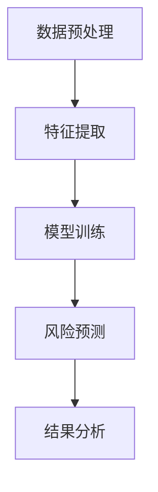
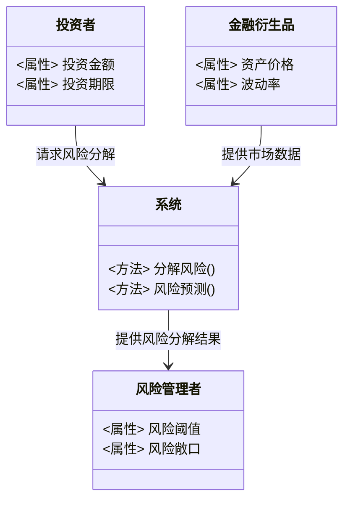
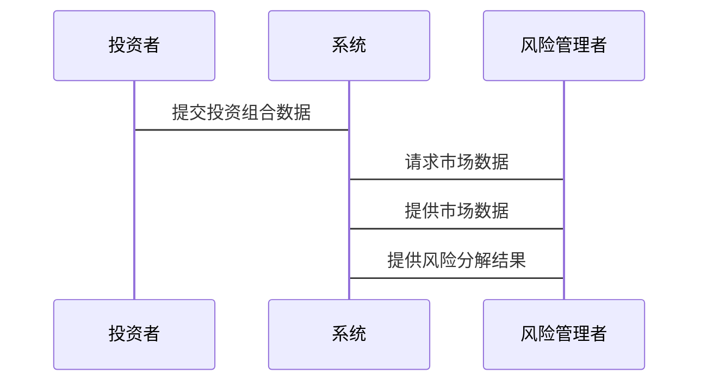

                 


# AI在金融衍生品组合风险分解中的创新应用

## 关键词：
- AI（人工智能）
- 金融衍生品
- 风险分解
- 组合风险
- 机器学习
- 数学建模
- 系统架构

## 摘要：
本文深入探讨了人工智能技术在金融衍生品组合风险分解中的创新应用。通过结合金融衍生品的基本概念、风险分解的核心原理以及AI技术的优势，详细阐述了如何利用AI算法实现对金融衍生品组合风险的高效分解。文章从理论基础到实际应用，全面解析了AI在金融风险管理中的潜力，并通过具体案例分析展示了AI技术的实际价值。

---

# 第一部分: 金融衍生品与组合风险分解的背景介绍

## 第1章: 金融衍生品与组合风险分解概述

### 1.1 金融衍生品的基本概念
#### 1.1.1 金融衍生品的定义与分类
金融衍生品（Financial Derivatives）是一类其价值依赖于基础资产（如股票、债券、商品等）的金融工具。常见的衍生品包括期货、期权、掉期和互换等。衍生品可以用于对冲风险，也可以作为投机工具。

- **期货**：约定在未来某一特定时间以预定价格购买或出售资产的合同。
- **期权**：赋予持有人在特定时间内以预定价格购买或出售资产的权利，而非义务。
- **掉期**：约定在未来某一时间交换资产或现金流的协议。
- **互换**：交易双方在约定时间内交换不同资产或现金流的协议。

#### 1.1.2 金融衍生品的市场现状
金融衍生品市场是全球最大的金融市场之一，市场规模超过数千亿美元。衍生品的广泛应用使得金融市场的复杂性急剧增加，同时也带来了更高的风险管理需求。

#### 1.1.3 金融衍生品的风险特征
衍生品的风险主要体现在以下几个方面：
- **市场风险**：价格波动可能导致损失。
- **信用风险**：交易对手违约的风险。
- **流动性风险**：衍生品可能难以快速变现。
- **操作风险**：交易和结算过程中的失误可能导致损失。

### 1.2 组合风险分解的必要性
#### 1.2.1 什么是组合风险
组合风险是指将多个金融资产或衍生品组合在一起时，整体组合可能面临的不确定性风险。组合风险的来源包括市场波动、资产相关性变化、模型假设偏差等。

#### 1.2.2 组合风险分解的意义
- **风险识别**：通过分解组合风险，可以识别出哪些资产或风险因素对整体风险贡献最大。
- **风险对冲**：分解后的风险可以用于制定更有效的对冲策略。
- **风险定价**：风险分解有助于更准确地对衍生品进行定价。

#### 1.2.3 传统风险分解方法的局限性
传统的风险分解方法通常依赖于统计方法（如VaR、CVaR）或线性回归模型，存在以下问题：
- **模型假设的限制**：传统方法通常假设资产回报服从正态分布，这在实际市场中并不成立。
- **计算复杂性**：对于复杂的衍生品组合，传统方法的计算效率较低。
- **动态风险变化**：传统方法难以捕捉市场动态变化中的非线性风险。

### 1.3 AI技术在金融衍生品中的应用前景
#### 1.3.1 AI技术在金融领域的应用现状
AI技术在金融领域的应用已涵盖股票交易、风险管理、客户画像等多个方面。AI算法（如机器学习、深度学习）能够处理海量数据，发现传统方法难以捕捉的模式和规律。

#### 1.3.2 AI在金融衍生品风险分解中的潜力
- **非线性关系建模**：AI算法能够捕捉复杂的非线性关系，更准确地分解组合风险。
- **实时风险监控**：AI技术可以实现实时数据分析，帮助交易员快速应对市场变化。
- **个性化风险管理**：基于AI的模型可以为不同投资者提供个性化的风险管理方案。

#### 1.3.3 本章小结
本章介绍了金融衍生品的基本概念、组合风险的定义及分解的必要性，并探讨了AI技术在金融衍生品风险分解中的潜力。AI技术的引入为金融衍生品风险管理带来了新的可能性。

---

# 第二部分: 核心概念与联系

## 第2章: 金融衍生品组合风险分解的核心概念

### 2.1 金融衍生品的组合风险分解原理
#### 2.1.1 风险分解的基本原理
风险分解的目标是将组合风险分解为多个基本风险因素的组合。这些基本风险因素可以是市场因子（如利率、汇率、波动率）或资产特异性风险。

#### 2.1.2 风险分解的关键步骤
- **数据收集**：收集衍生品组合的相关数据，包括资产价格、市场因子等。
- **特征提取**：提取影响组合风险的关键特征。
- **模型选择**：选择合适的AI算法对风险进行分解。
- **风险分解与分析**：通过模型输出分解后的风险因子，并进行分析。

#### 2.1.3 风险分解的数学模型
风险分解的数学模型可以表示为：
$$
R = \sum_{i=1}^{n} \beta_i F_i + \epsilon
$$
其中：
- \( R \) 是组合风险
- \( \beta_i \) 是因子载荷
- \( F_i \) 是基本风险因子
- \( \epsilon \) 是误差项

### 2.2 AI技术在风险分解中的应用原理
#### 2.2.1 AI算法的基本原理
AI算法通过学习海量数据，建立复杂的非线性模型，能够捕捉传统方法难以发现的模式和关系。例如，神经网络可以通过多层非线性变换，实现对复杂风险关系的建模。

#### 2.2.2 AI在风险分解中的优势
- **非线性建模能力**：AI算法能够捕捉复杂的非线性关系，提高风险分解的准确性。
- **自适应性**：AI模型可以动态调整参数，适应市场环境的变化。
- **数据处理能力**：AI技术能够处理海量数据，提取关键特征。

#### 2.2.3 AI与传统方法的对比分析
| 对比维度       | 传统方法                   | AI方法                     |
|----------------|---------------------------|---------------------------|
| 模型复杂性     | 线性模型为主               | 非线性模型为主             |
| 数据处理能力   | 适合小规模数据             | 适合大规模数据             |
| 风险捕捉能力   | 依赖于假设，可能遗漏非线性关系 | 能捕捉复杂非线性关系       |
| 计算效率       | 较低                      | 较高                      |

### 2.3 核心概念的ER实体关系图
```mermaid
erDiagram
    class 投资者 {
        <属性> 投资金额
        <属性> 投资期限
    }
    class 风险管理者 {
        <属性> 风险阈值
        <属性> 风险敞口
    }
    class 交易系统 {
        <属性> 交易数据
        <属性> 市场波动
    }
    投资者 --|{拥有} 投资组合 : 投资者拥有投资组合
    投资组合 --|{包含} 金融衍生品 : 投资组合包含多种金融衍生品
    风险管理者 --|{监控} 风险敞口 : 风险管理者监控风险敞口
    交易系统 --|{生成} 交易数据 : 交易系统生成交易数据
    交易数据 --> 市场波动 : 交易数据影响市场波动
```

#### 2.3.1 实体关系图的解释
- **投资者**：拥有投资组合，并通过投资组合持有金融衍生品。
- **投资组合**：由多种金融衍生品组成，是风险分解的对象。
- **风险管理者**：负责监控和管理投资组合的风险敞口。
- **交易系统**：生成交易数据，并根据交易数据计算市场波动。

### 2.4 本章小结
本章详细讲解了金融衍生品组合风险分解的核心概念，包括风险分解的基本原理、AI技术的应用原理以及相关实体关系图。通过对比分析，突出了AI技术在风险分解中的优势。

---

# 第三部分: 算法原理讲解

## 第3章: AI驱动的金融衍生品风险分解算法

### 3.1 基于机器学习的风险分解算法
#### 3.1.1 机器学习在风险分解中的应用
机器学习算法（如支持向量回归、随机森林）可以用于预测和分解组合风险。这些算法能够从历史数据中学习，建立风险分解的非线性模型。

#### 3.1.2 常见的机器学习算法选择
- **线性回归**：适用于线性关系的建模。
- **支持向量回归（SVR）**：适用于非线性关系的建模。
- **随机森林**：适用于特征重要性分析和非线性关系建模。

#### 3.1.3 算法实现步骤
1. **数据预处理**：清洗数据，处理缺失值和异常值。
2. **特征提取**：从原始数据中提取影响风险的关键特征。
3. **模型训练**：使用机器学习算法对数据进行训练。
4. **风险预测**：利用训练好的模型对组合风险进行预测。
5. **结果分析**：分析模型输出的结果，评估模型的准确性。

#### 3.1.4 机器学习算法的mermaid流程图


### 3.2 算法原理的数学模型和公式
#### 3.2.1 支持向量回归（SVR）模型
支持向量回归是一种基于支持向量机（SVM）的回归算法。其目标是最小化预测值与实际值之间的误差，同时保持模型的泛化能力。

数学模型如下：
$$
y = \sum_{i=1}^{n} \alpha_i x_i^T x + b
$$
其中：
- \( y \) 是预测的风险值
- \( x_i \) 是训练数据
- \( \alpha_i \) 是拉格朗日乘子
- \( b \) 是偏置项

#### 3.2.2 随机森林模型
随机森林是一种基于决策树的集成学习算法。每个决策树的预测结果进行投票或平均，最终得到一个预测结果。

数学模型如下：
$$
y = \frac{1}{n} \sum_{i=1}^{n} f_i(x)
$$
其中：
- \( y \) 是预测的风险值
- \( f_i(x) \) 是第i棵决策树的预测值
- \( n \) 是决策树的数量

#### 3.2.3 算法实现的Python代码
```python
import numpy as np
import pandas as pd
from sklearn.ensemble import RandomForestRegressor
from sklearn.model_selection import train_test_split
from sklearn.metrics import mean_squared_error

# 示例数据加载
data = pd.DataFrame({
    '资产价格': [100, 90, 80, 70, 60],
    '波动率': [0.1, 0.2, 0.15, 0.25, 0.12],
    '风险值': [0.05, 0.07, 0.04, 0.08, 0.06]
})

# 数据分割
X = data[['资产价格', '波动率']]
y = data['风险值']
X_train, X_test, y_train, y_test = train_test_split(X, y, test_size=0.2, random_state=42)

# 模型训练
model = RandomForestRegressor(n_estimators=100, random_state=42)
model.fit(X_train, y_train)

# 模型预测
y_pred = model.predict(X_test)

# 模型评估
mse = mean_squared_error(y_test, y_pred)
print(f'均方误差: {mse}')
```

### 3.3 本章小结
本章详细讲解了基于机器学习的金融衍生品风险分解算法，包括算法选择、实现步骤以及具体的数学模型和Python代码。通过实例分析，展示了如何利用机器学习算法实现对组合风险的高效分解。

---

# 第四部分: 系统分析与架构设计方案

## 第4章: 系统分析与架构设计

### 4.1 问题场景介绍
金融衍生品组合风险分解系统的目标是对投资者的投资组合进行风险分解，帮助投资者和风险管理者更好地理解和管理风险。

### 4.2 项目介绍
本项目旨在开发一个基于AI的金融衍生品组合风险分解系统，利用机器学习算法对投资组合的风险进行分解和预测。

### 4.3 系统功能设计
#### 4.3.1 领域模型（mermaid类图）


### 4.4 系统架构设计
#### 4.4.1 系统架构图（mermaid架构图）


### 4.5 系统接口设计
系统接口包括：
- **输入接口**：接收投资者的投资组合数据和市场数据。
- **输出接口**：提供风险分解结果和风险预测报告。

### 4.6 系统交互设计（mermaid序列图）


### 4.7 本章小结
本章从系统角度分析了金融衍生品组合风险分解的实现方案，包括系统功能设计、架构设计和交互设计。通过图形化的系统架构图和序列图，清晰地展示了系统的组成和交互过程。

---

# 第五部分: 项目实战

## 第5章: 项目实战

### 5.1 环境安装
- **Python版本**：建议使用Python 3.8及以上版本。
- **依赖库安装**：
  ```bash
  pip install numpy pandas scikit-learn matplotlib
  ```

### 5.2 系统核心实现源代码
#### 5.2.1 数据预处理代码
```python
import pandas as pd
import numpy as np

# 加载数据
data = pd.read_csv('derivative_data.csv')

# 处理缺失值
data = data.dropna()

# 标准化数据
from sklearn.preprocessing import StandardScaler
scaler = StandardScaler()
scaled_data = scaler.fit_transform(data)
```

#### 5.2.2 风险分解模型实现
```python
from sklearn.ensemble import RandomForestRegressor

# 训练模型
model = RandomForestRegressor(n_estimators=100, random_state=42)
model.fit(scaled_data[:, :-1], scaled_data[:, -1])

# 预测风险
test_data = scaled_data[-10:, :-1]
predicted_risk = model.predict(test_data)
```

### 5.3 代码应用解读与分析
- **数据预处理**：对数据进行清洗和标准化，确保模型输入的规范性。
- **模型训练**：使用随机森林算法训练风险分解模型。
- **风险预测**：利用训练好的模型对新的数据进行风险预测。

### 5.4 实际案例分析
假设我们有一个包含以下金融衍生品的投资组合：
- 股票期权
- 利率期货
- 货币互换

通过系统输入这些衍生品的市场数据，系统将输出每个衍生品的风险贡献值以及整体组合的风险分解结果。

### 5.5 项目小结
本章通过实际案例展示了如何利用AI技术实现金融衍生品组合风险分解。通过具体的代码实现和案例分析，帮助读者更好地理解AI在金融风险管理中的实际应用。

---

# 第六部分: 最佳实践、小结与拓展阅读

## 第6章: 最佳实践、小结与拓展阅读

### 6.1 最佳实践
- **数据质量**：确保数据的准确性和完整性。
- **模型选择**：根据具体问题选择合适的AI算法。
- **实时监控**：建立实时监控机制，及时应对市场变化。
- **风险管理**：定期评估和优化风险分解模型。

### 6.2 小结
本文详细探讨了AI技术在金融衍生品组合风险分解中的创新应用，从理论基础到实际应用，全面解析了AI在金融风险管理中的潜力。通过具体的案例分析和代码实现，展示了AI技术在金融衍生品风险管理中的实际价值。

### 6.3 拓展阅读
- **《机器学习在金融中的应用》**：深入探讨机器学习在金融领域的应用。
- **《风险管理与衍生品定价》**：系统讲解金融衍生品定价与风险管理。
- **《Python金融数据分析》**：利用Python进行金融数据分析的经典书籍。

---

# 作者：AI天才研究院/AI Genius Institute & 禅与计算机程序设计艺术 /Zen And The Art of Computer Programming

---

通过本文的系统阐述，读者可以全面了解AI技术在金融衍生品组合风险分解中的创新应用，并能够将其应用于实际的金融风险管理中。

