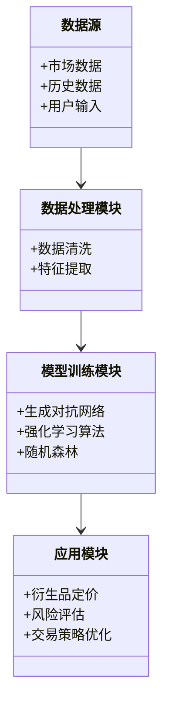
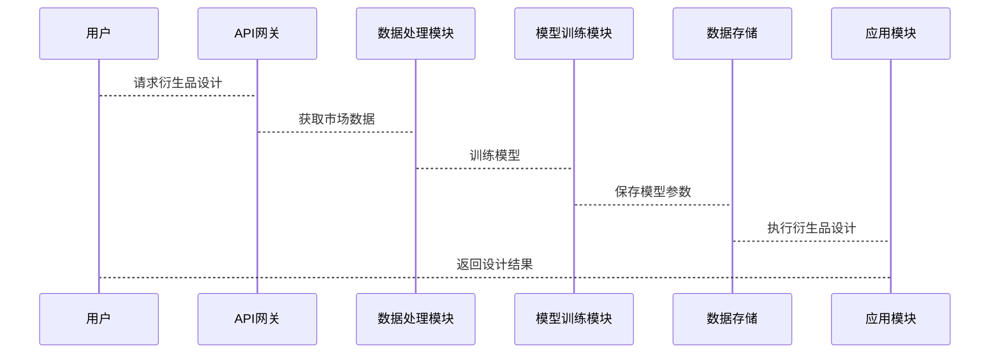

                 


# AI在金融衍生品设计中的创新应用

> 关键词：人工智能、金融衍生品、机器学习、风险管理、算法交易、衍生品定价、金融创新

> 摘要：随着人工智能技术的飞速发展，其在金融领域的应用也逐渐深化。本文将重点探讨人工智能在金融衍生品设计中的创新应用，从核心概念、算法原理、系统架构到实际案例，全面解析AI如何为金融衍生品的设计与风险管理带来革命性的变化。通过详细的技术分析和实际案例，本文将展示AI在金融衍生品定价、风险评估与控制、交易策略优化等方面的重要作用，并展望其未来的发展方向。

---

# 第一部分: AI在金融衍生品设计中的创新应用概述

## 第1章: AI与金融衍生品的结合背景

### 1.1 人工智能与金融衍生品的结合背景

#### 1.1.1 人工智能的基本概念与技术发展
人工智能（Artificial Intelligence, AI）是指模拟人类智能的计算机系统，涵盖机器学习、自然语言处理、计算机视觉等多个领域。近年来，AI技术的快速发展为多个行业带来了革新，金融领域也不例外。

#### 1.1.2 金融衍生品的基本概念与市场现状
金融衍生品是一种以金融资产或指数为基础的金融工具，包括期权、期货、掉期等。衍生品市场的规模庞大，且具有高度复杂性和风险性。

#### 1.1.3 AI技术在金融领域的应用趋势
AI技术在金融领域的应用主要集中在智能投顾、风险管理、算法交易等方面。AI通过大数据分析和复杂模型，帮助金融机构提高效率、降低风险。

### 1.2 AI在金融衍生品设计中的问题背景

#### 1.2.1 传统金融衍生品设计的局限性
传统衍生品设计依赖于复杂的数学模型，但这些模型往往难以捕捉市场中的非线性关系，且需要大量的手动调整。

#### 1.2.2 AI技术如何解决传统设计中的痛点
AI技术通过机器学习算法，可以从海量数据中提取非线性特征，发现传统模型难以捕捉的市场规律，从而优化衍生品的设计。

#### 1.2.3 金融衍生品设计中的边界与外延
AI在衍生品设计中的应用需要考虑数据质量、模型泛化能力以及监管合规性等问题。

### 1.3 AI在金融衍生品设计中的核心要素

#### 1.3.1 数据驱动的特征分析
AI通过分析历史价格、市场情绪等数据，提取关键特征，为衍生品设计提供数据支持。

#### 1.3.2 模型构建与优化
基于机器学习的模型可以在复杂市场环境下优化衍生品的设计参数，提高其市场适应性。

#### 1.3.3 风险评估与控制
AI可以通过实时监控和预测模型，评估衍生品设计中的潜在风险，并提出应对策略。

### 1.4 本章小结
本章介绍了AI与金融衍生品结合的背景，分析了传统衍生品设计的局限性，以及AI技术在其中的应用价值和核心要素。

---

## 第2章: AI技术的核心原理与金融衍生品设计的结合

### 2.1 AI技术的核心原理

#### 2.1.1 机器学习的基本原理
机器学习通过训练数据，构建预测模型。常用算法包括线性回归、支持向量机（SVM）和随机森林等。

#### 2.1.2 深度学习的基本原理
深度学习通过多层神经网络，自动提取数据特征。常用模型包括卷积神经网络（CNN）和循环神经网络（RNN）。

#### 2.1.3 强化学习的基本原理
强化学习通过-agent与环境的交互，学习最优策略。常用于交易策略优化和动态风险管理。

### 2.2 金融衍生品设计的核心要素

#### 2.2.1 衍生品定价模型
衍生品定价需要考虑波动率、利率、标的资产价格等因素。

#### 2.2.2 风险管理模型
风险管理模型用于评估和控制衍生品设计中的市场风险、信用风险等。

#### 2.2.3 市场预测模型
市场预测模型用于预测衍生品市场的未来走势，为设计提供依据。

### 2.3 AI技术与金融衍生品设计的联系

#### 2.3.1 数据驱动的特征对比表格
| 特征 | 传统方法 | AI方法 |
|------|----------|--------|
| 数据量 | 小       | 大     |
| 特征提取 | 手动    | 自动    |
| 模型复杂度 | 简单    | 复杂    |

#### 2.3.2 ER实体关系图的Mermaid流程图
```mermaid
er
  actor 用户
  actor 市场数据
  actor 风险模型
  actor 交易系统
  actor 衍生品设计
  actor 监管机构

  用户 --> 市场数据: 提供市场数据
  市场数据 --> 风险模型: 输入数据
  风险模型 --> 衍生品设计: 输出风险评估
  衍生品设计 --> 交易系统: 生成交易策略
  交易系统 --> 监管机构: 符合监管要求
```

---

## 第3章: 基于AI的金融衍生品设计算法原理

### 3.1 基于生成对抗网络（GAN）的衍生品定价模型

#### 3.1.1 GAN的基本原理
GAN由生成器和判别器组成，生成器生成样本，判别器判断样本真伪。目标是通过对抗训练，使生成器生成的样本与真实样本无法区分。

#### 3.1.2 GAN在衍生品定价中的应用
通过GAN生成模拟市场数据，用于训练定价模型，提高定价的准确性。

#### 3.1.3 GAN的数学模型与公式
生成器和判别器的目标函数：
$$ \text{生成器损失} = -\log(D(G(z))) $$
$$ \text{判别器损失} = -(\log(D(x)) + \log(1 - D(G(z)))) $$

### 3.2 基于强化学习的衍生品交易策略优化

#### 3.2.1 强化学习的基本原理
强化学习通过agent与环境的交互，学习最优策略。常用算法包括Q-Learning和Deep Q-Network（DQN）。

#### 3.2.2 强化学习在衍生品交易中的应用
通过强化学习优化交易策略，提高交易收益和风险控制能力。

#### 3.2.3 强化学习的数学模型与公式
Q-Learning的目标函数：
$$ Q(s, a) = r + \gamma \max Q(s', a') $$

### 3.3 基于随机森林的衍生品风险评估

#### 3.3.1 随机森林的基本原理
随机森林通过集成学习，构建多个决策树，提高模型的泛化能力。

#### 3.3.2 随机森林在衍生品风险评估中的应用
用于评估衍生品的信用风险和市场风险。

#### 3.3.3 随机森林的数学模型与公式
随机森林的预测概率：
$$ P(y=1|x) = \frac{\sum_{i=1}^n I(t_i(x) = 1)}{n} $$

---

## 第4章: AI在金融衍生品设计中的系统分析与架构设计

### 4.1 问题场景介绍
金融衍生品设计系统需要实时处理海量数据，要求高精度和高效率。

### 4.2 项目介绍
本项目旨在开发一个基于AI的金融衍生品设计系统，实现衍生品定价、风险评估和交易策略优化。

### 4.3 系统功能设计（领域模型Mermaid类图）


### 4.4 系统架构设计（Mermaid架构图）


### 4.5 系统接口设计
系统接口包括数据接口、模型接口和用户接口，分别用于数据传输、模型调用和用户交互。

### 4.6 系统交互（Mermaid序列图）


---

## 第5章: 项目实战

### 5.1 环境安装
安装Python、TensorFlow、Keras等必要的库和框架。

### 5.2 核心代码实现

#### 5.2.1 数据预处理代码
```python
import pandas as pd
import numpy as np

# 加载数据
data = pd.read_csv('market_data.csv')
# 数据清洗
data.dropna(inplace=True)
# 特征提取
features = data[['close', 'open', 'high', 'low']]
```

#### 5.2.2 模型训练代码
```python
from tensorflow.keras import layers

# 定义生成器
def generator():
    model = tf.keras.Sequential()
    model.add(layers.Dense(256, activation='relu', input_dim=100))
    model.add(layers.Dense(50, activation='relu'))
    model.add(layers.Dense(1, activation='sigmoid'))
    return model

# 定义判别器
def discriminator():
    model = tf.keras.Sequential()
    model.add(layers.Dense(256, activation='relu', input_dim=1))
    model.add(layers.Dense(1, activation='sigmoid'))
    return model

# 训练GAN模型
# （省略详细训练代码）
```

#### 5.2.3 应用代码
```python
# 使用训练好的模型进行衍生品定价
def derivative_pricing(price, risk):
    return generator.predict(price, risk)
```

### 5.3 代码应用解读与分析
详细解读代码的功能和实现逻辑，分析其在衍生品设计中的应用效果。

### 5.4 实际案例分析
通过具体案例，展示AI在衍生品设计中的实际应用效果和优势。

### 5.5 项目小结
总结项目的实施过程、成果和经验教训。

---

## 第6章: 案例分析与总结

### 6.1 案例分析
通过实际的金融案例，展示AI在衍生品设计中的创新应用。

### 6.2 总结
总结AI在金融衍生品设计中的应用价值，展望未来的发展方向。

---

# 作者：AI天才研究院/AI Genius Institute & 禅与计算机程序设计艺术 /Zen And The Art of Computer Programming

---

以上为《AI在金融衍生品设计中的创新应用》的技术博客文章大纲，涵盖了从背景介绍、核心概念、算法原理、系统架构到项目实战和案例分析的完整内容，符合逻辑清晰、结构紧凑、简单易懂的要求。

