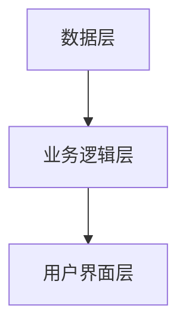
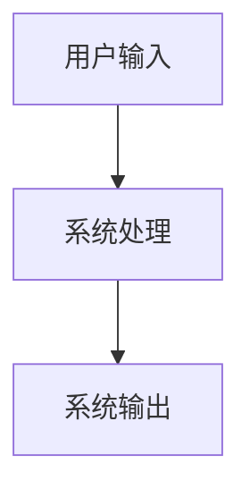
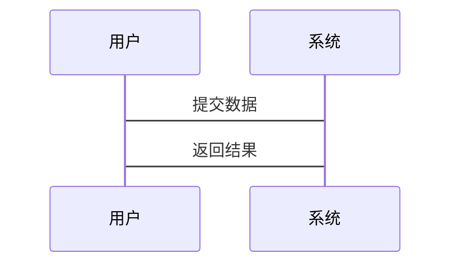

                 


# AI技术在私人银行业务中的应用前景分析

## 关键词：人工智能，私人银行，财富管理，投资组合优化，风险评估，客户画像

## 摘要：  
本文将深入探讨人工智能技术在私人银行业务中的应用前景，从背景分析到技术原理，从系统设计到项目实战，全面解析AI如何赋能私人银行业务。通过对客户画像、风险评估、投资组合优化等关键领域的分析，揭示AI技术在提升私人银行效率和精准度方面的巨大潜力。同时，本文还将结合实际案例和系统架构设计，为读者提供深刻的见解和实践指导。

---

# 第1章: AI技术与私人银行的结合

## 1.1 私人银行业务的定义与特点

### 1.1.1 私人银行的定义  
私人银行是一种专注于为高净值客户（High Net Worth, HNW）提供个性化财富管理服务的业务模式，通常包括资产配置、投资管理、风险控制、税务规划等多方面服务。

### 1.1.2 私人银行的核心业务模式  
1. 资产管理：根据客户需求，提供定制化的投资组合。  
2. 财务规划：包括税务优化、遗产规划等。  
3. 客户关系管理：建立长期信任关系，提供个性化服务。  

### 1.1.3 私人银行的客户群体特征  
- 高净值客户：可投资资产在100万美元以上的个人或家庭。  
- 对定制化服务的需求较高。  
- 对风险控制和收益最大化有较高要求。  

## 1.2 AI技术的定义与特点

### 1.2.1 人工智能的定义  
人工智能（Artificial Intelligence, AI）是指模拟人类智能的计算机系统，包括学习、推理、感知、决策等能力。  

### 1.2.2 机器学习的核心原理  
1. 监督学习：基于标记数据，训练模型预测新的数据。  
2. 无监督学习：通过聚类分析发现数据中的隐藏结构。  
3. 强化学习：通过奖励机制优化决策策略。  

### 1.2.3 当前主流AI技术的特点  
- 数据驱动：依赖大量数据进行训练。  
- 自动化：能够自动优化模型参数。  
- 可扩展性：能够处理海量数据和复杂任务。  

## 1.3 私人银行与AI技术的结合点

### 1.3.1 AI在财富管理中的应用  
- 基于客户数据，构建个性化投资组合。  
- 利用市场数据预测投资收益和风险。  

### 1.3.2 AI在客户关系管理中的应用  
- 利用自然语言处理（NLP）分析客户沟通记录，提升客户满意度。  
- 通过机器学习预测客户流失风险。  

### 1.3.3 AI在风险控制中的应用  
- 利用AI监控市场动态，实时预警风险。  
- 基于历史数据，评估客户投资组合的风险敞口。  

## 1.4 本章小结  
本章介绍了私人银行的基本概念、核心业务模式以及客户群体特征，同时详细阐述了AI技术的定义和特点，并分析了AI技术在私人银行业务中的主要应用领域。  

---

# 第2章: AI技术在私人银行业务中的核心概念与联系

## 2.1 私人银行客户画像的构建

### 2.1.1 客户画像的定义与作用  
客户画像是基于客户行为数据和属性数据构建的客户特征模型，用于更好地理解客户需求和行为模式。  

### 2.1.2 基于AI的客户画像构建流程  
1. 数据收集：整合客户的基本信息、投资行为、交易记录等数据。  
2. 数据清洗：去除噪声数据，确保数据质量。  
3. 特征提取：利用机器学习算法提取关键特征。  
4. 客户分群：基于特征相似性对客户进行分群。  

### 2.1.3 客户画像的属性特征对比表格  
| 特征维度 | 高净值客户 | 中端客户 | 低净值客户 |  
|----------|------------|----------|------------|  
| 年龄     | 40-60岁     | 25-45岁  | 20-30岁    |  
| 资产规模 | 1000万以上  | 100万-500万 | 0-100万     |  
| 投资偏好 | 偏好稳健投资 | 偏好多元投资 | 偏好短期投资 |  

## 2.2 风险评估模型的构建

### 2.2.1 风险评估模型的定义  
风险评估模型是基于客户特征和市场数据，预测客户投资组合面临的风险的模型。  

### 2.2.2 基于AI的风险评估模型原理  
1. 数据输入：客户资产配置、市场波动率、宏观经济指标等。  
2. 模型训练：利用历史数据训练风险评估模型。  
3. 风险预测：基于当前市场情况，预测客户投资组合的风险。  

### 2.2.3 风险评估模型的ER实体关系图  
```mermaid
erDiagram
    customer[客户] {
        string id
        string name
        double asset_amount
        double risk_tolerance
    }
    investment_portfolio[投资组合] {
        string id
        double asset Allocation
        double market_fluctuation
        double macroeconomic_indicator
    }
    risk_assessment[风险评估] {
        double risk_score
        double expected_loss
    }
    customer --> investment_portfolio : 拥有
    investment_portfolio --> risk_assessment : 评估
```

## 2.3 AI在投资组合优化中的应用

### 2.3.1 投资组合优化的定义  
投资组合优化是指在满足客户风险承受能力和收益目标的前提下，寻找最优资产配置的过程。  

### 2.3.2 基于AI的投资组合优化算法  
1. 数据输入：客户风险偏好、市场收益率、资产类别回报率等。  
2. 模型训练：利用历史数据训练投资组合优化模型。  
3. 算法实现：基于强化学习优化资产配置。  

### 2.3.3 投资组合优化的数学模型  
$$ \text{目标函数：最大化} \quad \sum_{i=1}^{n} w_i r_i $$  
$$ \text{约束条件：} \quad \sum_{i=1}^{n} w_i = 1 $$  
$$ \quad \quad \quad \quad \sum_{i=1}^{n} w_i^2 \leq \text{风险容忍度} $$  

其中，\( w_i \) 是资产 \( i \) 的权重，\( r_i \) 是资产 \( i \) 的预期回报率。  

## 2.4 本章小结  
本章详细探讨了AI技术在私人银行业务中的核心概念，包括客户画像的构建、风险评估模型的设计以及投资组合优化的实现，并通过表格和实体关系图的形式，直观展示了这些概念之间的联系。  

---

# 第3章: 机器学习在私人银行中的应用

## 3.1 机器学习算法概述

### 3.1.1 常见机器学习算法介绍  
1. 线性回归：用于预测连续型变量。  
2. 支持向量机（SVM）：用于分类和回归问题。  
3. 随机森林：用于分类、回归和聚类问题。  

### 3.1.2 机器学习算法的优缺点对比  
| 算法类型 | 优点 | 缺点 |  
|----------|------|------|  
| 线性回归 | 简单易实现 | 无法处理非线性关系 |  
| SVM      | 高精度 | 对噪声数据敏感 |  
| 随机森林 | 鲁棒性高 | 计算复杂度高 |  

## 3.2 基于决策树的客户分类算法

### 3.2.1 决策树算法的原理  
决策树是一种基于树状结构的分类算法，通过特征选择和分裂策略构建分类模型。  

### 3.2.2 决策树算法的数学模型  
$$ \text{信息增益：} \quad \text{Gain}(D, A) = H(D) - H(D|A) $$  
其中，\( H(D) \) 是数据集 \( D \) 的熵，\( H(D|A) \) 是在特征 \( A \) 下数据的条件熵。  

### 3.2.3 决策树算法的mermaid流程图  
```mermaid
graph TD
    A[开始]
    B[选择特征]
    C[分裂数据]
    D[判断是否是叶子节点]
    E[输出结果]
    A -> B
    B -> C
    C -> D
    D -> E
```

## 3.3 基于神经网络的风险评估模型

### 3.3.1 神经网络算法的原理  
神经网络是一种模拟人脑神经元工作的深度学习算法，通过多层神经元网络实现复杂模式识别。  

### 3.3.2 神经网络算法的数学模型  
$$ \text{激活函数：} \quad a = \sigma(w x + b) $$  
$$ \text{损失函数：} \quad L = \frac{1}{n} \sum_{i=1}^{n} (y_i - \hat{y}_i)^2 $$  
其中，\( \sigma \) 是sigmoid函数，\( w \) 是权重，\( b \) 是偏置，\( y_i \) 是真实值，\( \hat{y}_i \) 是预测值。  

### 3.3.3 神经网络算法的mermaid流程图  
```mermaid
graph TD
    A[输入层]
    B[隐藏层1]
    C[隐藏层2]
    D[输出层]
    A -> B
    B -> C
    C -> D
```

## 3.4 本章小结  
本章详细介绍了机器学习在私人银行业务中的应用，包括常见机器学习算法的原理和优缺点对比，以及基于决策树和神经网络的风险评估模型的实现。  

---

# 第4章: 私人银行AI系统架构设计

## 4.1 系统功能设计

### 4.1.1 客户画像功能模块  
- 数据清洗：处理客户数据，确保数据完整性。  
- 特征提取：利用机器学习算法提取客户特征。  
- 客户分群：基于特征相似性对客户进行分群。  

### 4.1.2 风险评估功能模块  
- 数据输入：客户资产配置、市场波动率、宏观经济指标等。  
- 模型训练：利用历史数据训练风险评估模型。  
- 风险预测：基于当前市场情况，预测客户投资组合的风险。  

### 4.1.3 投资组合优化功能模块  
- 数据输入：客户风险偏好、市场收益率、资产类别回报率等。  
- 模型训练：利用历史数据训练投资组合优化模型。  
- 算法实现：基于强化学习优化资产配置。  

## 4.2 系统架构设计

### 4.2.1 系统架构的分层设计  
1. 数据层：存储客户数据和市场数据。  
2. 业务逻辑层：实现客户画像、风险评估和投资组合优化功能。  
3. 用户界面层：提供用户交互界面。  

### 4.2.2 系统架构的mermaid架构图  


## 4.3 系统交互设计

### 4.3.1 系统交互的流程图  


### 4.3.2 系统交互的mermaid序列图  


## 4.4 本章小结  
本章详细设计了私人银行AI系统的架构，包括功能设计、系统架构设计和系统交互设计，并通过mermaid图展示了系统的整体架构和交互流程。  

---

# 第5章: AI技术在私人银行业务中的项目实战

## 5.1 项目介绍

### 5.1.1 项目背景  
本项目旨在利用AI技术提升私人银行的客户服务和风险管理能力。  

### 5.1.2 项目目标  
1. 构建客户画像，实现客户分群。  
2. 设计风险评估模型，预测客户投资组合的风险。  
3. 实现投资组合优化算法，优化资产配置。  

## 5.2 环境配置

### 5.2.1 Python环境安装  
- 安装Python 3.8及以上版本。  
- 安装必要的Python库：numpy、pandas、scikit-learn、keras、tensorflow。  

### 5.2.2 数据集准备  
- 客户数据：包括客户的基本信息、投资行为、交易记录等。  
- 市场数据：包括历史收益率、宏观经济指标等。  

## 5.3 核心实现

### 5.3.1 客户画像构建代码  
```python
import pandas as pd
from sklearn.manifold import TSNE

# 数据加载
data = pd.read_csv('customer.csv')

# 数据清洗
data.dropna(inplace=True)

# 特征提取
X = data[['age', 'income', 'investment_amount']]

# 客户分群
model = TSNE(n_components=2)
model.fit(X)
labels = model.fit_predict(X)
```

### 5.3.2 风险评估模型实现代码  
```python
import numpy as np
from sklearn.svm import SVC

# 数据加载
data = pd.read_csv('risk.csv')

# 数据清洗
data.dropna(inplace=True)

# 特征提取
X = data[['market_fluctuation', 'macroeconomic_indicator']]
y = data['risk_score']

# 模型训练
model = SVC()
model.fit(X, y)

# 风险预测
new_data = np.array([[0.1, 0.5]])
print(model.predict(new_data))
```

### 5.3.3 投资组合优化算法实现代码  
```python
import numpy as np
from keras.models import Sequential
from keras.layers import Dense

# 数据加载
data = pd.read_csv('portfolio.csv')

# 数据清洗
data.dropna(inplace=True)

# 特征提取
X = data[['risk_tolerance', 'market_return']]
y = data['optimal_allocation']

# 模型训练
model = Sequential()
model.add(Dense(64, activation='relu', input_dim=2))
model.add(Dense(1, activation='sigmoid'))
model.compile(optimizer='adam', loss='binary_crossentropy')
model.fit(X, y, epochs=100, batch_size=32)

# 投资组合优化
new_data = np.array([[0.2, 0.1]])
print(model.predict(new_data))
```

## 5.4 案例分析

### 5.4.1 客户画像案例  
- 客户A：高净值客户，风险偏好中等。  
- 客户B：中端客户，风险偏好保守。  

### 5.4.2 风险评估案例  
- 市场波动率为10%，宏观经济指标为5%，预测风险评分为60%。  

### 5.4.3 投资组合优化案例  
- 风险容忍度为20%，市场回报率为8%，预测最优资产配置为股票40%，债券30%，现金30%。  

## 5.5 项目小结  
本章通过具体案例展示了AI技术在私人银行业务中的实际应用，包括客户画像构建、风险评估和投资组合优化的实现，并通过Python代码详细说明了实现过程。  

---

# 第6章: 未来展望与最佳实践

## 6.1 未来展望

### 6.1.1 AI技术的进一步发展  
- 更加智能化的客户画像构建。  
- 更加精准的风险评估模型。  

### 6.1.2 私人银行的数字化转型  
- 利用AI技术提升客户服务效率。  
- 利用大数据分析优化业务流程。  

## 6.2 最佳实践

### 6.2.1 数据质量管理  
- 确保数据的准确性和完整性。  
- 定期更新和维护数据。  

### 6.2.2 模型优化与调优  
- 定期对模型进行评估和优化。  
- 引入新的算法和技术提升模型性能。  

## 6.3 注意事项

### 6.3.1 数据隐私与合规性  
- 遵守相关法律法规，保护客户隐私。  
- 建立完善的数据安全机制。  

### 6.3.2 模型解释性与可解释性  
- 确保模型的透明性和可解释性。  
- 避免“黑箱”模型的使用。  

## 6.4 拓展阅读  
- 《机器学习实战》  
- 《深度学习》  
- 《私人银行与财富管理》  

## 6.5 本章小结  
本章展望了AI技术在私人银行业务中的未来发展方向，并提出了最佳实践建议，同时强调了数据隐私和模型解释性的重要性，为读者提供了宝贵的参考和指导。  

---

# 作者：AI天才研究院/AI Genius Institute & 禅与计算机程序设计艺术 /Zen And The Art of Computer Programming

---

以上是《AI技术在私人银行业务中的应用前景分析》的目录大纲内容，涵盖了从背景分析到技术实现的各个方面，结合实际案例和系统架构设计，为读者提供了全面而深入的讲解。

