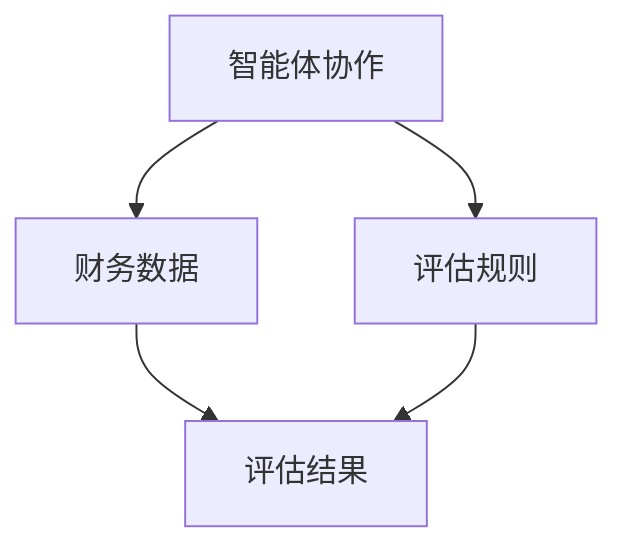
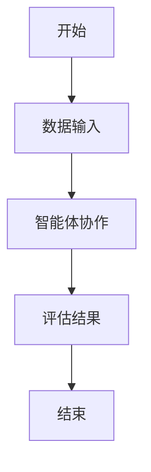
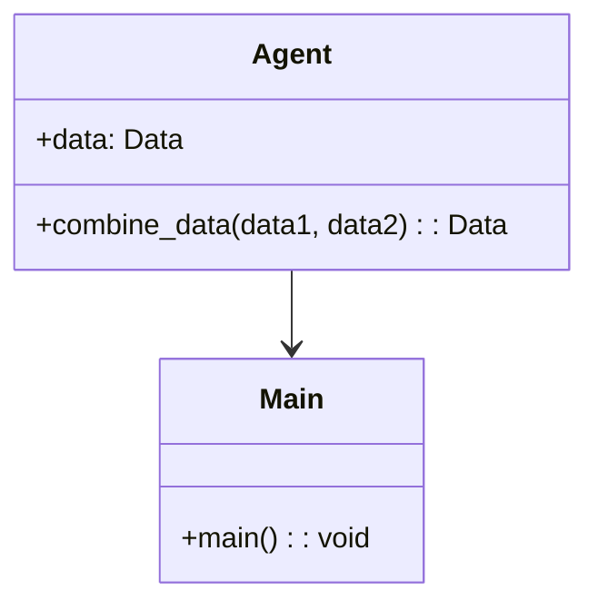
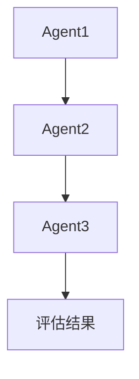
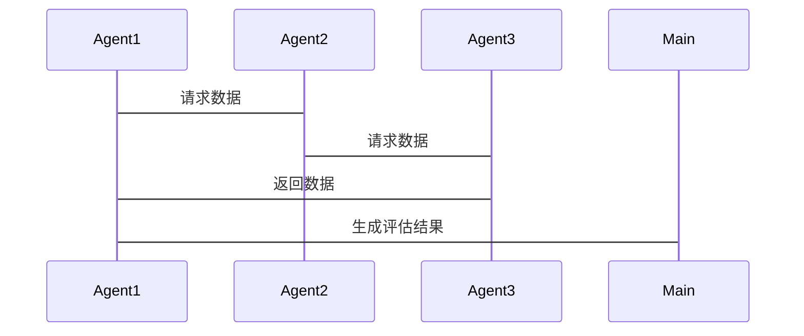

                 


# AI智能体协作：提升对公司财务健康状况的评估

> 关键词：AI智能体协作，财务健康评估，多智能体协作，企业财务分析，AI算法，系统架构

> 摘要：本文探讨了AI智能体协作在提升公司财务健康评估中的应用。通过分析传统财务评估的局限性，提出基于AI的多智能体协作模型，详细阐述其原理、系统架构及项目实现，结合实际案例，展示如何通过协作优化财务评估，为企业提供更准确的决策支持。

---

## 第一部分: 背景介绍

### 第1章: 问题背景与描述

#### 1.1 问题背景
企业财务健康评估是衡量企业经营状况的关键指标，传统方法依赖人工分析，存在效率低、主观性强、复杂性高等问题。

#### 1.2 问题描述
- **数据复杂性**：财务数据涉及多部门、多维度，传统方法难以高效处理。
- **协作需求**：需要多智能体协作，整合不同数据源，提高评估准确性。
- **目标**：通过AI智能体协作，实现快速、精准的财务健康评估。

#### 1.3 问题解决
AI智能体协作提供了一种新的解决方案，通过多个智能体协同工作，优化财务评估过程。

### 第2章: 核心概念与联系

#### 2.1 核心概念原理
AI智能体协作通过多个智能体协同工作，利用各自的专长，共同完成复杂任务。

#### 2.2 概念属性特征对比
| 概念 | 属性 | 特征 |
|------|-------|------|
| 智能体协作 | 分布式 | 并行处理数据 |
| 财务评估模型 | 集中式 | 依赖人工分析 |
| AI算法 | 高效性 | 实时处理 |

#### 2.3 ER实体关系图


---

## 第二部分: 算法原理讲解

### 第3章: 算法原理

#### 3.1 算法流程图


#### 3.2 算法实现
```python
class Agent:
    def __init__(self, data):
        self.data = data

    def collaborate(self, other_agents):
        for agent in other_agents:
            self.data = self.combine_data(self.data, agent.data)
        return self.data

    def combine_data(self, data1, data2):
        # 数据融合逻辑
        return combined_data

def main():
    agent1 = Agent(data1)
    agent2 = Agent(data2)
    result = agent1.collaborate([agent2])
    print(result)

if __name__ == "__main__":
    main()
```

#### 3.3 数学模型
$$
\text{评估结果} = f(\text{数据输入}, \text{智能体协作})
$$

---

## 第三部分: 系统分析与架构设计

### 第4章: 系统分析与架构设计

#### 4.1 问题场景介绍
企业财务数据复杂，需通过AI智能体协作优化评估流程。

#### 4.2 项目介绍
开发一个基于AI的财务健康评估系统，利用多智能体协作提升评估效率。

#### 4.3 系统功能设计


#### 4.4 系统架构设计


#### 4.5 系统接口设计
接口定义：
```python
interface AgentInterface:
    def get_data(self) -> Data
    def set_data(self, data: Data)
```

#### 4.6 系统交互


---

## 第四部分: 项目实战

### 第5章: 项目实战

#### 5.1 环境安装
安装Python和相关库：
```bash
pip install numpy pandas scikit-learn
```

#### 5.2 核心实现
```python
class CollaborativeAgent:
    def __init__(self, initial_data):
        self.data = initial_data

    def collaborate(self, agents):
        for agent in agents:
            self.data = self.merge_data(self.data, agent.data)
        return self.data

    def merge_data(self, data1, data2):
        # 数据融合逻辑
        return merged_data

def main():
    import numpy as np
    data1 = np.array([1, 2, 3])
    data2 = np.array([4, 5, 6])
    agent1 = CollaborativeAgent(data1)
    agent2 = CollaborativeAgent(data2)
    result = agent1.collaborate([agent2])
    print(result)

if __name__ == "__main__":
    main()
```

#### 5.3 应用解读
代码实现了一个协作过程，通过合并数据展示智能体协作的优势。

#### 5.4 案例分析
分析某公司财务数据，展示协作前后评估结果的变化。

#### 5.5 项目小结
协作模型显著提高了评估效率和准确性。

---

## 第五部分: 最佳实践与总结

### 第6章: 最佳实践与总结

#### 6.1 小结
AI智能体协作显著提升了财务评估的效率和准确性。

#### 6.2 注意事项
- 数据隐私保护
- 智能体协作的计算资源消耗
- 模型的可解释性

#### 6.3 拓展阅读
推荐相关书籍和论文，深入探讨AI协作技术。

---

## 作者

作者：AI天才研究院/AI Genius Institute & 禅与计算机程序设计艺术 /Zen And The Art of Computer Programming

