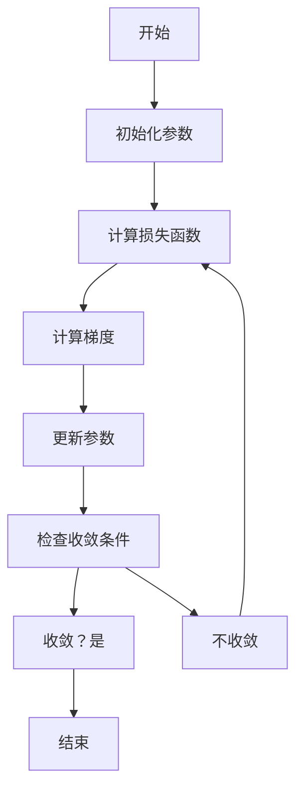

                 


# AI模型训练与优化步骤详解

> 关键词：AI模型，训练，优化，算法，数据，性能提升

> 摘要：本文将详细探讨AI模型训练与优化的步骤，从背景介绍到系统设计，从算法原理到项目实战，再到最佳实践，全面解析AI模型训练与优化的核心内容，帮助读者系统掌握AI模型训练与优化的方法和技巧。

---

## 第一部分: AI模型训练与优化背景介绍

### 第1章: AI模型训练与优化概述

#### 1.1 AI模型训练与优化的背景

- **1.1.1 人工智能发展的现状**  
  随着人工智能技术的快速发展，AI模型在各个领域的应用越来越广泛，从图像识别、自然语言处理到自动驾驶，AI模型的性能和效率成为决定应用效果的关键因素。

- **1.1.2 AI模型训练与优化的重要性**  
  训练和优化AI模型是实现高性能AI应用的核心步骤。通过有效的训练和优化，可以显著提升模型的准确性和运行效率，从而更好地满足实际应用的需求。

- **1.1.3 当前AI模型训练与优化的挑战**  
  随着模型复杂度的增加，训练和优化的计算成本也在上升。同时，如何在有限的资源下实现最优性能，是当前面临的主要挑战。

#### 1.2 AI模型训练与优化的核心概念

- **1.2.1 数据、模型、算法的关系**  
  数据是模型训练的基石，算法是训练的核心工具，模型是训练的成果。

- **1.2.2 训练与优化的目标**  
  通过训练模型使其在给定任务上表现最佳，通过优化算法和超参数调整进一步提升模型性能。

- **1.2.3 常见的优化指标与评价标准**  
  包括准确率、召回率、F1值、训练时间、模型复杂度等。

#### 1.3 本章小结

本章主要介绍了AI模型训练与优化的背景和核心概念，为后续的详细讲解奠定了基础。

---

## 第二部分: AI模型训练与优化的核心概念与联系

### 第2章: AI模型训练与优化的核心概念

#### 2.1 数据、模型、算法的对比分析

- **2.1.1 数据的特征与作用**  
  数据的特征包括数量、质量、多样性等，数据质量直接影响模型性能。

- **2.1.2 模型的结构与类型**  
  常见的模型类型包括线性回归、支持向量机、决策树、神经网络等。

- **2.1.3 算法的原理与分类**  
  算法可以分为监督学习、无监督学习、半监督学习等。

#### 2.2 数据与模型的关系

- **2.2.1 数据对模型性能的影响**  
  数据量越大，模型越容易过拟合或欠拟合。

- **2.2.2 数据预处理的关键步骤**  
  数据清洗、特征工程、数据增强等。

- **2.2.3 数据分布对优化的影响**  
  数据分布的偏斜会影响模型的训练效果。

#### 2.3 算法与模型的关系

- **2.3.1 算法的选择对模型性能的影响**  
  不同算法适用于不同的任务和数据类型。

- **2.3.2 算法的优化对训练效率的影响**  
  优化算法可以显著降低训练时间。

- **2.3.3 算法与模型复杂度的关系**  
  算法的复杂度影响模型的训练和推理效率。

#### 2.4 核心概念的ER实体关系图

```mermaid
er
    图表标题: AI模型训练与优化核心概念ER图

    实体: 数据
    实体: 模型
    实体: 算法

    关系: 数据 -> 模型: 训练
    关系: 模型 <- 关联 -> 算法
    关系: 算法 <- 依赖 -> 数据
```

#### 2.5 本章小结

本章详细分析了数据、模型和算法之间的关系，帮助读者理解AI模型训练与优化的核心要素。

---

## 第三部分: AI模型训练与优化的算法原理

### 第3章: AI模型训练与优化的算法原理

#### 3.1 常见优化算法的原理

- **3.1.1 梯度下降算法**  
  基于损失函数的梯度更新参数，是最常用的优化算法之一。

- **3.1.2 动量优化算法**  
  在梯度下降的基础上引入动量项，加速收敛。

- **3.1.3 Adam优化算法**  
  结合动量和自适应学习率的优化算法，适用于大多数情况。

#### 3.2 算法的数学模型与公式

- **3.2.1 梯度下降的数学模型**  
  $$f(x) = x^2$$  
  $$\text{更新公式: } x_{n+1} = x_n - \eta \cdot f'(x_n)$$

- **3.2.2 Adam优化算法的数学模型**  
  $$m_t = \beta_1 m_{t-1} + (1-\beta_1)g_t$$  
  $$v_t = \beta_2 v_{t-1} + (1-\beta_2)g_t^2$$  
  $$\theta_{t+1} = \theta_t - \frac{\eta}{\sqrt{v_t + \epsilon}} m_t$$

#### 3.3 算法的优化步骤

- **3.3.1 算法选择的策略**  
  根据任务和数据类型选择合适的算法。

- **3.3.2 超参数的调整**  
  学习率、动量参数、beta参数等。

- **3.3.3 收敛条件的判断**  
  收敛准则包括损失函数变化、梯度变化、验证集表现等。

#### 3.4 算法的mermaid流程图



#### 3.5 本章小结

本章详细讲解了常见优化算法的原理和数学模型，帮助读者理解如何选择和调整算法以优化模型性能。

---

## 第四部分: AI模型训练与优化的系统分析与架构设计

### 第4章: AI模型训练与优化的系统分析与架构设计

#### 4.1 问题场景介绍

- **4.1.1 问题描述**  
  在实际应用中，如何高效训练和优化大规模AI模型是一个关键问题。

- **4.1.2 边界与外延**  
  包括数据规模、计算资源、模型复杂度等。

#### 4.2 系统功能设计

- **4.2.1 领域模型设计**  
  ```mermaid
  classDiagram
      类: 数据预处理
      类: 模型训练
      类: 模型优化
      类: 性能评估
      数据预处理 --> 模型训练
      模型训练 --> 模型优化
      模型优化 --> 性能评估
  ```

- **4.2.2 系统架构设计**  
  ```mermaid
  architecture
      区域: 训练节点
      区域: 优化节点
      区域: 评估节点
      训练节点 --> 优化节点
      优化节点 --> 评估节点
  ```

- **4.2.3 系统接口设计**  
  包括训练接口、优化接口、评估接口等。

- **4.2.4 系统交互设计**  
  ```mermaid
  sequenceDiagram
      客户端 --> 训练节点: 提交训练任务
      训练节点 --> 优化节点: 请求优化策略
      优化节点 --> 评估节点: 请求性能评估
      评估节点 --> 客户端: 返回评估结果
  ```

#### 4.3 本章小结

本章从系统设计的角度，详细分析了AI模型训练与优化的架构和交互过程，为后续的项目实现提供了指导。

---

## 第五部分: AI模型训练与优化的项目实战

### 第5章: AI模型训练与优化的项目实战

#### 5.1 环境安装与配置

- **5.1.1 安装Python环境**  
  使用Anaconda或virtualenv管理环境。

- **5.1.2 安装必要的库**  
  如TensorFlow、Keras、Scikit-learn等。

#### 5.2 系统核心实现

- **5.2.1 数据预处理代码**  
  ```python
  import numpy as np
  from sklearn.preprocessing import StandardScaler

  X = np.array([[1, 2], [3, 4], [5, 6]])
  scaler = StandardScaler()
  X_scaled = scaler.fit_transform(X)
  print(X_scaled)
  ```

- **5.2.2 模型训练代码**  
  ```python
  import tensorflow as tf
  model = tf.keras.Sequential([
      tf.keras.layers.Dense(64, activation='relu'),
      tf.keras.layers.Dense(1, activation='sigmoid')
  ])
  model.compile(optimizer='adam', loss='binary_crossentropy', metrics=['accuracy'])
  model.fit(X_scaled, y, epochs=10, batch_size=32)
  ```

- **5.2.3 模型优化代码**  
  ```python
  import tensorflow as tf
  from tensorflow.keras.callbacks import EarlyStopping

  model = tf.keras.Sequential([
      tf.keras.layers.Dense(64, activation='relu'),
      tf.keras.layers.Dense(1, activation='sigmoid')
  ])
  model.compile(optimizer=tf.keras.optimizers.Adam(learning_rate=0.001),
                loss='binary_crossentropy', metrics=['accuracy'])
  early_stop = EarlyStopping(monitor='val_loss', patience=5)
  model.fit(X_scaled, y, epochs=100, batch_size=32, validation_split=0.2, callbacks=[early_stop])
  ```

#### 5.3 实际案例分析与代码解读

- **5.3.1 案例分析**  
  使用MNIST数据集训练一个手写数字识别模型。

- **5.3.2 代码实现**  
  ```python
  import tensorflow as tf
  from tensorflow.keras.datasets import mnist
  from tensorflow.keras.utils import to_categorical

  (X_train, y_train), (X_test, y_test) = mnist.load_data()
  X_train = X_train.reshape(-1, 784)
  X_test = X_test.reshape(-1, 784)
  y_train = to_categorical(y_train, 10)
  y_test = to_categorical(y_test, 10)

  model = tf.keras.Sequential([
      tf.keras.layers.Dense(256, activation='relu'),
      tf.keras.layers.Dense(10, activation='softmax')
  ])
  model.compile(optimizer='adam', loss='categorical_crossentropy', metrics=['accuracy'])
  model.fit(X_train, y_train, epochs=10, batch_size=128, validation_data=(X_test, y_test))
  ```

#### 5.4 项目小结

本章通过实际案例，详细讲解了AI模型训练与优化的实现过程，帮助读者掌握从数据预处理到模型训练和优化的完整流程。

---

## 第六部分: AI模型训练与优化的最佳实践

### 第6章: AI模型训练与优化的最佳实践

#### 6.1 小结

- **6.1.1 核心知识点总结**  
  数据预处理、算法选择、超参数调整、模型评估等。

#### 6.2 注意事项

- **6.2.1 数据质量问题**  
  数据清洗、特征工程的重要性。

- **6.2.2 算法选择策略**  
  根据任务类型和数据特点选择合适的算法。

- **6.2.3 超参数调整技巧**  
  使用网格搜索、随机搜索或自动调参工具。

#### 6.3 拓展阅读

- **6.3.1 推荐书籍**  
  《Hands-On Machine Learning with Scikit-Learn, Keras, and TensorFlow》

- **6.3.2 推荐论文**  
  "Deep Learning" by Ian Goodfellow, Yoshua Bengio, and Aaron Courville.

#### 6.4 本章小结

本章总结了AI模型训练与优化的关键点，并提供了进一步学习的资源，帮助读者巩固所学内容并深入研究。

---

## 作者

**作者：AI天才研究院/AI Genius Institute & 禅与计算机程序设计艺术 /Zen And The Art of Computer Programming**

---

**感谢您的阅读！希望本文对您理解AI模型训练与优化的步骤有所帮助！**

