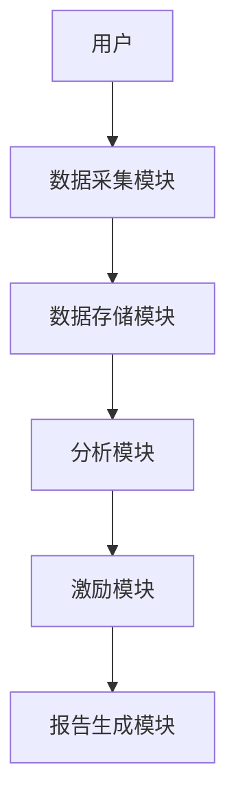
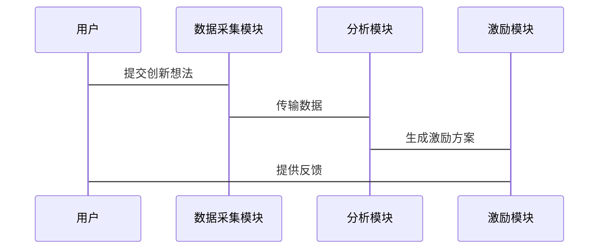

                 


# AI辅助企业创新文化培养：创新活动参与度分析与激励

> 关键词：企业创新、人工智能、员工参与度、激励机制、数据分析、创新文化

> 摘要：本文探讨了如何利用人工智能技术分析企业创新活动参与度，并提出有效的激励机制来促进企业创新文化。文章首先介绍创新文化的定义与重要性，接着分析创新活动参与度的背景与问题，然后详细讲解AI辅助分析的算法与模型，最后设计系统架构并提供项目实战案例，最终总结最佳实践和未来方向。

---

## 正文

### 第一部分: 背景介绍

#### 第1章: 创新文化的定义与重要性

##### 1.1 创新文化的内涵
创新文化是指企业在内部营造的一种鼓励员工提出新想法、新方法和新产品的工作氛围。它强调开放性、包容性和创造性，旨在激发员工的潜能，推动企业的持续发展。

##### 1.2 AI在企业创新中的作用
人工智能技术可以通过数据分析、模式识别和自然语言处理等手段，帮助企业识别创新机会、优化创新流程并提升创新效率。例如，AI可以分析员工的行为数据，预测其创新潜力，并提供个性化激励方案。

##### 1.3 创新文化的核心要素
- **开放性**：鼓励员工表达不同意见和建议。
- **包容性**：尊重多样性和失败文化。
- **激励性**：通过奖励机制激发员工的创新动力。

#### 第2章: 创新活动参与度分析的背景与问题

##### 2.1 创新活动的重要性
创新活动是企业保持竞争优势的关键。通过创新，企业可以推出新产品、改进服务流程或优化管理模式。

##### 2.2 创新活动参与度分析的必要性
- **识别高潜力员工**：通过分析员工的创新行为，发现企业的创新骨干。
- **优化资源配置**：根据参与度分配资源，提升整体创新效率。
- **提升员工满意度**：通过个性化激励机制，增强员工的归属感和工作积极性。

##### 2.3 创新活动参与度分析的目标
- **量化创新行为**：通过数据指标衡量员工的创新贡献。
- **预测创新潜力**：利用AI模型预测员工未来的创新表现。
- **制定激励策略**：基于分析结果设计有效的激励机制。

---

### 第二部分: 创新活动参与度分析的算法与模型

#### 第3章: 创新活动参与度分析的算法原理

##### 3.1 数据预处理
在分析创新活动参与度之前，需要对原始数据进行清洗和标准化处理。例如，去除噪声数据、填补缺失值等。

##### 3.2 特征选择
选择与创新活动相关的特征，如员工的绩效指标、历史创新记录、参与创新项目次数等。

##### 3.3 模型选择
常用的机器学习算法包括线性回归、决策树、随机森林等。以下是一个简单的线性回归模型：

$$ y = \beta_0 + \beta_1 x_1 + \beta_2 x_2 + \ldots + \beta_n x_n + \epsilon $$

其中，$y$ 表示创新活动参与度，$x_i$ 表示各个特征变量。

##### 3.4 模型训练
通过训练数据集训练模型，调整参数以最小化预测误差。

##### 3.5 模型评估
使用测试数据集评估模型的性能，常用指标包括均方误差（MSE）、决定系数（R²）等。

##### 3.6 模型优化
通过交叉验证和超参数调优提升模型的预测精度。

---

#### 第4章: 基于AI的创新活动分析系统架构

##### 4.1 系统功能设计
- **数据采集模块**：收集员工的创新行为数据，如提交的想法数量、参与的项目数等。
- **分析模块**：利用机器学习算法分析数据，生成创新参与度报告。
- **激励模块**：根据分析结果设计个性化激励方案。

##### 4.2 系统架构设计



##### 4.3 系统接口设计
- **数据接口**：提供API供其他系统调用数据。
- **用户接口**：供员工查看自己的创新参与度和激励方案。

##### 4.4 系统交互设计



---

### 第三部分: 项目实战

#### 第5章: 创新活动参与度分析的项目实战

##### 5.1 环境搭建
- **安装Python**：`python --version`
- **安装依赖库**：`pip install numpy pandas scikit-learn`

##### 5.2 数据采集与处理
以下是一个简单的数据处理代码示例：

```python
import pandas as pd

# 加载数据
data = pd.read_csv('innovation.csv')

# 查看数据摘要
print(data.describe())

# 处理缺失值
data = data.dropna()
```

##### 5.3 模型实现
以下是基于线性回归的模型实现：

```python
from sklearn.linear_model import LinearRegression
from sklearn.metrics import mean_squared_error

# 初始化模型
model = LinearRegression()

# 训练模型
model.fit(X_train, y_train)

# 预测
y_pred = model.predict(X_test)

# 评估
mse = mean_squared_error(y_test, y_pred)
print('均方误差:', mse)
```

##### 5.4 案例分析
假设某企业收集了员工的创新想法数量、项目参与度和绩效评分等数据，通过模型分析发现，绩效评分和项目参与度是创新活动的重要影响因素。企业可以据此设计更有针对性的激励机制。

---

### 第四部分: 总结与展望

#### 第6章: 最佳实践与总结

##### 6.1 总结
本文详细探讨了如何利用人工智能技术分析企业创新活动参与度，并提出了有效的激励机制。通过算法和系统的结合，企业可以更好地推动创新文化建设。

##### 6.2 注意事项
- 数据隐私保护：在处理员工数据时，需遵守相关法律法规。
- 模型解释性：选择可解释性较强的模型，便于企业理解和应用。

##### 6.3 未来研究方向
- **结合NLP技术**：利用自然语言处理技术分析员工的创新想法内容。
- **动态调整模型**：根据企业创新需求实时更新模型参数。

---

### 作者

作者：AI天才研究院/AI Genius Institute & 禅与计算机程序设计艺术 /Zen And The Art of Computer Programming

