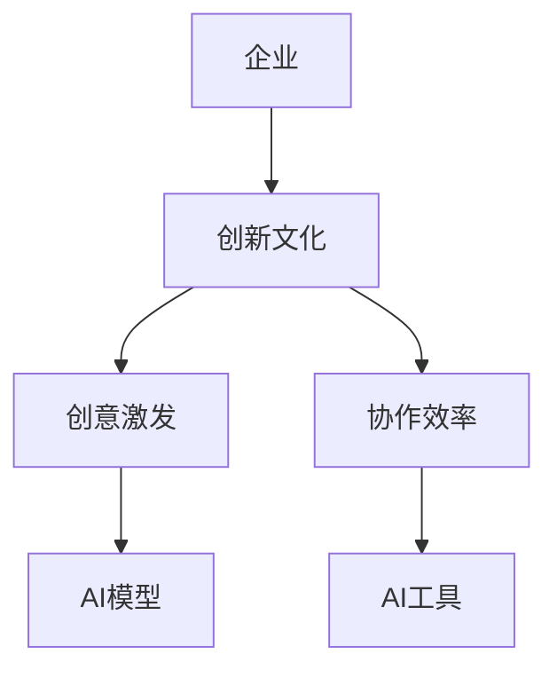
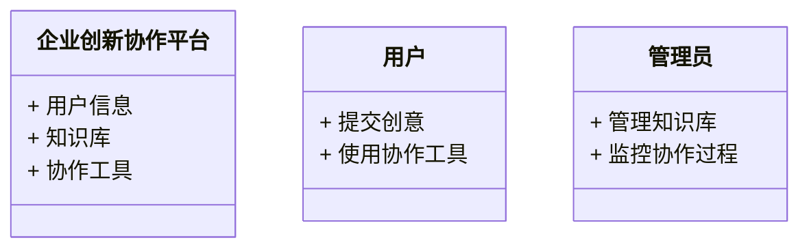
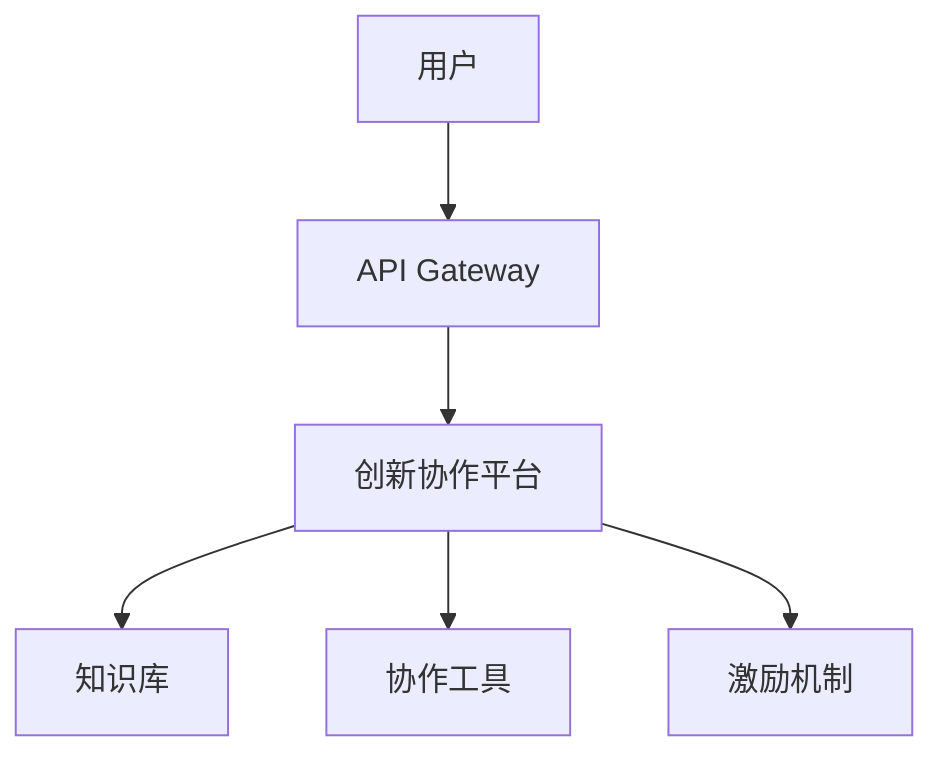
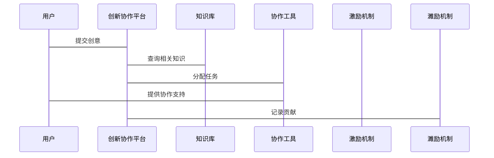

                 


# AI辅助企业创新文化建设：激发创意与促进协作

## 关键词：
- 企业创新文化
- 人工智能
- 协作效率
- 创意激发
- 系统架构

## 摘要：
本文探讨了人工智能在企业创新文化建设中的应用，重点分析了如何通过AI技术激发员工创意并促进团队协作。文章从问题背景、核心概念、算法原理、系统架构到项目实战，全面解析了AI在企业创新中的作用，并通过实际案例展示了其在提升协作效率和激发创意方面的潜力。最后，文章总结了AI辅助企业创新文化建设的最佳实践和未来发展趋势。

---

## 第1章：AI辅助企业创新文化建设的背景与意义

### 1.1 问题背景
#### 1.1.1 传统企业创新面临的挑战
企业在创新过程中常常面临知识孤岛、协作低效和创意枯竭的问题。传统的企业创新文化依赖于员工的个人经验和团队的默契协作，但这种模式难以突破瓶颈，特别是在复杂多变的市场环境中，创新速度和质量难以满足需求。

#### 1.1.2 创意激发与协作效率的痛点
- 创意激发：员工在缺乏灵感或知识支持的情况下，难以高效产生创新想法。
- 协作效率：跨部门协作中，信息传递不畅，导致效率低下，甚至产生冲突。
- 企业创新文化：传统的企业文化可能过于注重效率，忽视了员工的创造力和参与感。

#### 1.1.3 企业创新文化的核心要素
企业创新文化的核心要素包括：
- **开放性**：鼓励员工提出新想法。
- **协作性**：促进跨部门合作。
- **包容性**：接受失败，鼓励尝试。

### 1.2 问题描述
#### 1.2.1 创意激发的困难与解决方案
员工在创新过程中常常面临知识不足或灵感匮乏的问题，传统的方法难以系统性地激发创意。

#### 1.2.2 协作效率低下对企业创新的阻碍
低效的协作流程和信息孤岛导致创新周期延长，企业难以快速响应市场变化。

#### 1.2.3 企业创新文化与AI技术的结合点
AI技术可以通过数据分析和模式识别，帮助员工发现潜在的创新机会，并提供协作工具以提高效率。

### 1.3 问题解决
#### 1.3.1 AI技术在创意激发中的应用
AI可以通过分析历史数据和市场趋势，提供灵感和创意建议。

#### 1.3.2 AI技术在协作效率提升中的作用
AI工具可以优化协作流程，减少信息传递中的障碍。

#### 1.3.3 企业创新文化AI辅助的实现路径
1. **知识共享**：利用AI技术建立知识库，促进知识共享。
2. **协作工具**：开发AI辅助的协作工具，提高协作效率。
3. **激励机制**：通过AI分析员工贡献，制定合理的激励机制。

### 1.4 本章小结
本章从背景和问题出发，分析了传统企业创新文化中的痛点，并提出了AI技术在创新文化建设中的潜在解决方案。

---

## 第2章：AI辅助企业创新的核心概念与联系

### 2.1 核心概念原理
#### 2.1.1 创意激发的AI模型
AI模型可以通过分析历史数据和市场趋势，预测未来的创新方向。

#### 2.1.2 协作效率提升的AI工具
AI工具可以优化协作流程，减少信息传递中的障碍。

#### 2.1.3 企业创新文化的AI辅助框架
AI辅助的创新文化框架包括知识共享、协作工具和激励机制三个部分。

### 2.2 核心概念对比分析
#### 2.2.1 创意激发与协作效率的对比
- 创意激发注重的是想法的产生，而协作效率注重的是想法的实现。

#### 2.2.2 不同AI技术在企业创新中的应用对比
- **协同过滤**：基于用户行为推荐创新方向。
- **聚类分析**：将相似的想法分组，发现潜在的创新机会。

#### 2.2.3 企业创新文化与传统管理方式的对比
- **传统管理方式**：依赖个人经验和主观判断。
- **AI辅助方式**：基于数据和算法，提供客观支持。

### 2.3 ER实体关系图


### 2.4 本章小结
本章通过对比分析，明确了AI技术在企业创新文化中的核心作用，并通过ER图展示了各实体之间的关系。

---

## 第3章：AI辅助企业创新的算法原理

### 3.1 协同过滤算法
协同过滤是一种基于用户行为推荐相似内容的算法。

#### 3.1.1 算法原理
协同过滤通过分析用户的相似性，推荐用户可能感兴趣的内容。

#### 3.1.2 代码实现
```python
import numpy as np

def collaborative_filtering(user_similarity, user_rating):
    # 预测用户评分
    predicted_rating = np.dot(user_similarity, user_rating) / np.sum(user_similarity, axis=1)
    return predicted_rating
```

#### 3.1.3 应用实例
协同过滤可以用于推荐系统，帮助用户发现潜在的创新方向。

### 3.2 聚类分析算法
聚类分析是一种将数据分为若干组的技术。

#### 3.2.1 算法原理
聚类分析通过分析数据的相似性，将数据分为若干组。

#### 3.2.2 代码实现
```python
from sklearn.cluster import KMeans

def kmeans_clustering(data, num_clusters):
    model = KMeans(n_clusters=num_clusters)
    model.fit(data)
    return model.labels_
```

#### 3.2.3 应用实例
聚类分析可以用于将相似的想法分组，发现潜在的创新机会。

### 3.3 本章小结
本章详细讲解了协同过滤和聚类分析两种算法，并通过代码实现和应用实例展示了其在企业创新中的应用。

---

## 第4章：AI辅助企业创新的系统架构

### 4.1 问题场景介绍
本章以一个企业创新协作平台为例，介绍AI辅助系统的设计与实现。

### 4.2 系统功能设计
系统功能包括知识共享、协作工具和激励机制。

#### 4.2.1 领域模型


#### 4.2.2 系统架构


#### 4.2.3 系统接口设计
系统接口包括用户认证、创意提交、协作工具调用等。

#### 4.2.4 系统交互


### 4.3 本章小结
本章通过系统架构图和交互图，展示了AI辅助企业创新协作平台的设计与实现。

---

## 第5章：AI辅助企业创新的项目实战

### 5.1 环境安装
需要安装Python、TensorFlow和相关库。

### 5.2 核心代码实现
#### 5.2.1 创意生成模块
```python
import tensorflow as tf

model = tf.keras.Sequential([
    tf.keras.layers.Dense(128, activation='relu'),
    tf.keras.layers.Dense(1, activation='sigmoid')
])
model.compile(optimizer='adam', loss='binary_crossentropy')
model.fit(x_train, y_train, epochs=10)
```

#### 5.2.2 协作优化模块
```python
from sklearn.metrics.pairwise import cosine_similarity

similarity_matrix = cosine_similarity(embeddings)
```

### 5.3 代码应用解读与分析
通过训练模型，我们可以生成创意并优化协作流程。

### 5.4 案例分析
以一家科技公司为例，展示如何利用AI技术优化创新协作流程。

### 5.5 本章小结
本章通过实际项目实战，展示了AI技术在企业创新中的具体应用。

---

## 第6章：AI辅助企业创新的最佳实践与小结

### 6.1 最佳实践
- **数据隐私**：确保数据安全。
- **团队协作**：培养员工的协作习惯。
- **持续优化**：定期更新AI模型。

### 6.2 小结
本文从背景、核心概念、算法原理、系统架构到项目实战，全面解析了AI在企业创新文化建设中的应用。

### 6.3 注意事项
- 数据隐私和安全是需要重点关注的问题。
- 在实际应用中，需要根据具体需求调整算法和系统设计。

### 6.4 拓展阅读
推荐相关书籍和论文，供读者进一步学习。

---

## 作者：AI天才研究院/AI Genius Institute & 禅与计算机程序设计艺术 /Zen And The Art of Computer Programming

---

本文通过详细分析AI技术在企业创新文化建设中的应用，展示了如何通过AI技术激发创意和促进协作。希望本文能够为企业创新提供新的思路和实践指导。

