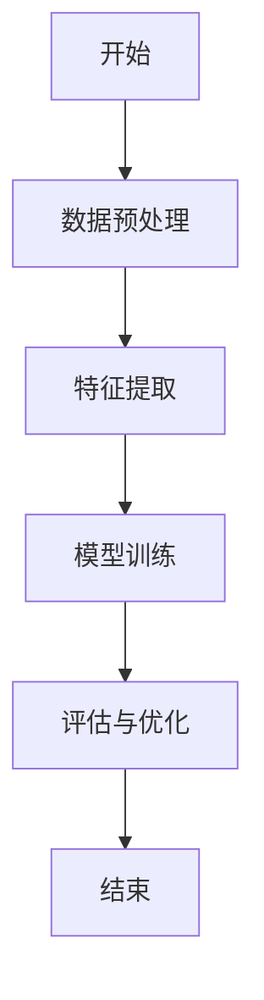
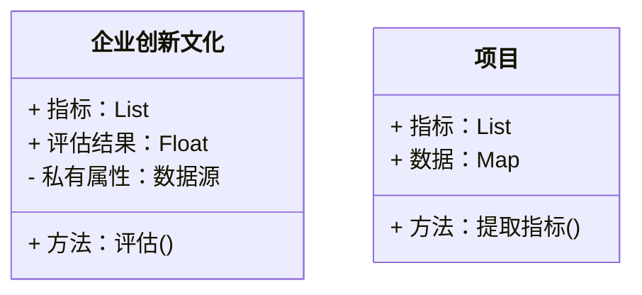
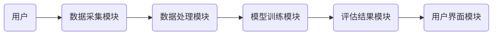

                 


# AI辅助企业创新文化评估：定量与定性指标分析

> 关键词：AI技术、企业创新文化、定量指标、定性指标、评估模型

> 摘要：本文探讨了如何利用人工智能技术辅助企业创新文化评估，重点分析了定量与定性指标的结合方法，并提出了基于AI的评估模型的设计与实现方案。

---

# 第一部分：AI辅助企业创新文化评估概述

## 第1章：背景介绍

### 1.1 问题背景

#### 1.1.1 企业创新文化的重要性
企业创新文化是企业持续发展的核心动力，它影响着企业的研发投入、员工创造力以及市场竞争力。然而，如何量化和评估创新文化一直是企业管理中的难题。

#### 1.1.2 当前企业创新文化评估的挑战
传统的评估方法主要依赖于主观判断，缺乏客观性和量化标准。此外，创新文化涉及多个维度，包括员工满意度、研发投入、创新成果等，如何将这些定性与定量指标结合起来是关键。

#### 1.1.3 AI技术在企业创新文化评估中的作用
人工智能技术可以通过大数据分析和机器学习算法，将定性与定量指标相结合，提供更客观、全面的评估结果。

### 1.2 问题描述

#### 1.2.1 创新文化评估的复杂性
创新文化评估需要考虑多个维度，包括员工行为、组织结构、外部环境等，这些因素相互影响，使得评估过程复杂。

#### 1.2.2 定量与定性指标的结合
定量指标（如研发投入、专利数量）和定性指标（如员工满意度、团队协作）需要有机结合，才能全面反映创新文化的现状。

#### 1.2.3 AI辅助评估的优势
AI技术可以通过数据挖掘和机器学习，自动分析大量数据，发现潜在规律，提供更精准的评估结果。

### 1.3 问题解决

#### 1.3.1 AI辅助评估的核心思路
通过收集和分析企业内外部数据，构建数学模型，量化创新文化的表现，并结合专家意见进行综合评估。

#### 1.3.2 定量与定性指标的结合方法
采用层次分析法（AHP）等方法，将定量和定性指标进行权重分配，综合计算得出评估结果。

#### 1.3.3 评估模型的设计与实现
设计一个基于机器学习的评估模型，输入定量和定性数据，输出创新文化评估结果。

### 1.4 边界与外延

#### 1.4.1 企业创新文化评估的边界
评估范围主要集中在企业的内部创新能力和员工创新行为，不涉及外部市场环境。

#### 1.4.2 AI辅助评估的适用范围
适用于有一定数据基础的企业，特别适合需要量化评估创新文化表现的企业。

#### 1.4.3 相关概念的区分
区分创新文化评估与企业绩效评估，明确创新文化评估的独特性和侧重点。

### 1.5 概念结构与核心要素组成

#### 1.5.1 创新文化的层次结构
创新文化可以分为三个层次：基础层（创新氛围）、中间层（创新机制）和顶层（创新成果）。

#### 1.5.2 AI辅助评估的核心要素
数据采集、模型构建、评估结果输出。

#### 1.5.3 评估模型的逻辑框架
数据预处理 → 指标提取 → 权重分配 → 综合评估 → 结果分析。

---

## 第2章：核心概念与联系

### 2.1 核心概念原理

#### 2.1.1 创新文化的定义与特征
创新文化是指企业在创新过程中的行为方式和价值观，具有开放性、协作性和前瞻性等特征。

#### 2.1.2 AI技术在评估中的应用原理
通过机器学习算法，AI可以从大量数据中提取有用信息，帮助评估创新文化的各项指标。

#### 2.1.3 定量与定性指标的综合分析
定量指标提供具体数值，定性指标提供行为描述，两者结合可以全面反映创新文化的现状。

### 2.2 定量与定性指标对比表格

| 指标类型 | 定量指标 | 定性指标 |
|----------|----------|----------|
| 创新投入 | 研发经费、专利数量 | 创新意识、员工满意度 |
| 创新成果 | 创新产品数量、市场份额 | 团队协作、创新文化氛围 |

### 2.3 ER实体关系图

```mermaid
er
    企业创新文化
    项目
    指标
    评估结果
    企业创新文化 --|> 项目: 包含
    项目 --|> 指标: 评估
    指标 --|> 评估结果: 得分
```

---

## 第3章：算法原理讲解

### 3.1 算法流程图



### 3.2 算法原理

#### 3.2.1 数据预处理
数据清洗、标准化和特征提取。

#### 3.2.2 指标提取
从数据中提取关键指标，如研发投入、员工满意度等。

#### 3.2.3 模型训练
使用机器学习算法（如随机森林、支持向量机）进行模型训练。

#### 3.2.4 评估与优化
通过交叉验证优化模型参数，评估模型性能。

#### 3.2.5 最终评估
将模型应用于实际数据，输出创新文化评估结果。

---

## 第4章：系统分析与架构设计方案

### 4.1 问题场景介绍

#### 4.1.1 项目介绍
构建一个基于AI的企业创新文化评估系统，实现定量与定性指标的综合评估。

### 4.2 系统功能设计

#### 4.2.1 领域模型



### 4.3 系统架构设计



### 4.4 系统接口设计

#### 4.4.1 API接口
提供RESTful API，支持数据上传、指标查询和评估结果获取。

---

## 第5章：项目实战

### 5.1 环境安装

#### 5.1.1 安装Python和必要的库
```bash
pip install numpy pandas scikit-learn
```

### 5.2 核心代码实现

#### 5.2.1 数据预处理代码
```python
import pandas as pd
from sklearn.preprocessing import StandardScaler

data = pd.read_csv('innovation.csv')
data.dropna(inplace=True)
scaler = StandardScaler()
data_scaled = scaler.fit_transform(data)
```

#### 5.2.2 模型训练代码
```python
from sklearn.ensemble import RandomForestClassifier
model = RandomForestClassifier()
model.fit(data_scaled, labels)
```

### 5.3 实际案例分析

#### 5.3.1 案例分析
某科技公司通过该系统评估创新文化，结果显示员工满意度较高，但研发投入不足，建议增加研发预算。

### 5.4 项目小结
通过AI技术实现企业创新文化评估，提高了评估的客观性和准确性，为企业管理者提供了有力支持。

---

## 第6章：最佳实践与注意事项

### 6.1 最佳实践Tips
- 数据质量是关键，确保数据准确性和完整性。
- 组合使用多种算法，提高评估结果的准确性。
- 定期更新模型，适应企业创新文化的变化。

### 6.2 小结
本文详细介绍了AI辅助企业创新文化评估的方法和实现步骤，为企业管理者提供了有价值的参考。

### 6.3 注意事项
- 数据隐私保护，确保企业数据的安全性。
- 模型解释性，便于企业理解评估结果。
- 持续优化模型，提升评估效果。

### 6.4 拓展阅读
推荐阅读《机器学习实战》和《企业创新管理》等书籍，深入理解AI在企业管理中的应用。

---

# 结语

通过本文的详细讲解，读者可以了解到如何利用AI技术辅助企业创新文化评估，从理论到实践，全面掌握定量与定性指标的结合方法。希望本文能为企业管理者和技术人员提供有价值的参考和启发。

---

作者：AI天才研究院/AI Genius Institute & 禅与计算机程序设计艺术 /Zen And The Art of Computer Programming

