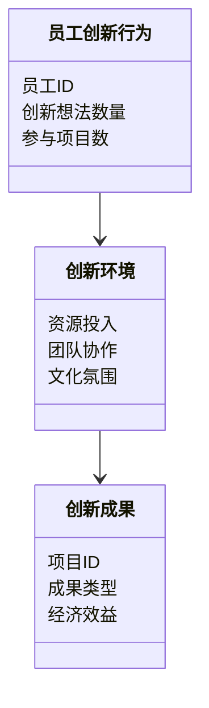
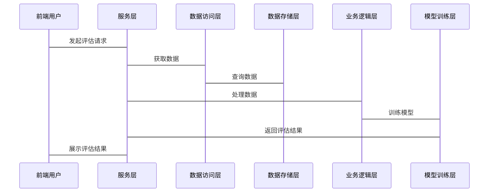

                 


---

# AI辅助企业创新文化评估：定量与定性指标分析的智能化

> 关键词：AI辅助，企业创新文化，定量与定性指标，智能化，数据驱动，文化评估

> 摘要：企业创新文化是推动企业持续发展的核心动力，而AI技术的引入为创新文化评估提供了新的思路。本文将从AI辅助企业创新文化评估的背景出发，详细探讨定量与定性指标分析的智能化方法，结合实际案例，分析AI在企业创新文化评估中的应用价值与实现路径。

---

# 第一部分: 企业创新文化评估的背景与意义

## 第1章: 企业创新文化评估的背景与问题

### 1.1 企业创新文化的定义与特征
#### 1.1.1 企业创新文化的定义
企业创新文化是指企业在经营过程中，通过鼓励创新思维、开放沟通、协作共享等方式，形成的一种支持员工主动探索、勇于尝试、持续改进的工作氛围。创新文化的核心在于激发员工的创造力和主动性，推动企业不断进步。

#### 1.1.2 企业创新文化的特征
- **开放性**：鼓励员工提出新想法，容忍失败。
- **协作性**：强调团队合作，促进知识共享。
- **目标导向性**：创新活动围绕企业战略目标展开。
- **持续性**：创新文化是一个长期积累和优化的过程。

#### 1.1.3 企业创新文化的核心要素
- 创新意识：员工对创新的认同与追求。
- 创新能力：员工解决复杂问题的能力。
- 创新环境：支持创新的组织结构与资源。

### 1.2 企业创新文化评估的现状与挑战
#### 1.2.1 传统企业创新文化评估方法的局限性
- **主观性**：传统评估多依赖管理者主观判断，缺乏客观数据支持。
- **片面性**：难以全面覆盖创新文化的多个维度。
- **动态性**：创新文化是一个动态变化的过程，静态评估难以捕捉其变化。

#### 1.2.2 数据驱动评估的必要性
- 利用大数据技术，可以从员工行为数据、项目数据、绩效数据等多维度提取创新文化特征。
- 数据驱动的评估方法可以提供更客观、更全面的评估结果。

#### 1.2.3 AI辅助评估的优势与潜力
- AI技术可以通过自然语言处理（NLP）分析员工反馈、文档数据。
- 通过机器学习算法，可以发现隐藏在数据中的创新文化模式。
- AI还可以实时监测创新文化的动态变化，提供及时反馈。

---

## 第2章: AI在企业创新文化评估中的作用

### 2.1 AI技术对企业创新文化评估的支持
- **数据整合**：AI可以整合来自不同渠道的数据，如员工反馈、项目文档、绩效数据等。
- **模式识别**：通过机器学习算法，AI可以识别创新文化的关键特征和潜在问题。
- **预测分析**：AI可以基于历史数据，预测未来的创新趋势和潜在风险。

### 2.2 AI辅助评估的创新性与高效性
- **高效性**：AI可以在短时间内处理大量数据，显著提高评估效率。
- **创新性**：通过深度学习技术，AI可以挖掘出传统方法难以发现的创新模式。
- **实时性**：AI系统可以实时监测创新文化的动态变化，提供及时反馈。

### 2.3 未来发展趋势与应用前景
- 随着AI技术的不断发展，企业创新文化评估将更加智能化、数据化。
- AI与区块链等技术的结合，将为企业创新文化评估提供更安全、更透明的解决方案。

---

# 第二部分: 企业创新文化评估的指标体系

## 第3章: 定量与定性指标的构建

### 3.1 定量指标的定义与选择
#### 3.1.1 员工创新行为指标
- 员工提出的新想法数量。
- 员工参与创新项目的情况。
- 员工提交的创新提案数量。

#### 3.1.2 创新成果指标
- 新产品或服务的数量。
- 创新项目的成功率。
- 创新带来的经济效益。

#### 3.1.3 创新环境指标
- 创新资源的投入情况。
- 创新团队的协作效率。
- 创新文化的传播广度。

### 3.2 定性指标的定义与选择
#### 3.2.1 员工满意度
- 对创新文化的认可度。
- 员工对创新环境的满意度。
- 员工对创新项目的参与积极性。

#### 3.2.2 创新文化氛围
- 员工之间的沟通与协作情况。
- 员工对创新风险的容忍度。
- 员工的创新意识与能力。

#### 3.2.3 创新领导力
- 领导层对创新的支持力度。
- 领导层的创新决策能力。
- 领导层的创新示范作用。

### 3.3 指标权重的分配与计算
#### 3.3.1 指标权重的确定方法
- 层次分析法（AHP）。
- 专家评分法。
- 数据驱动的权重计算方法。

#### 3.3.2 指标权重的计算步骤
1. 确定评估指标体系。
2. 构建比较判断矩阵。
3. 计算各指标的权重。
4. 验证权重的合理性。

---

## 第4章: 数据采集与处理

### 4.1 数据来源与采集方式
#### 4.1.1 员工数据
- 员工档案数据。
- 员工绩效数据。
- 员工满意度调查数据。

#### 4.1.2 项目数据
- 创新项目记录。
- 创新成果数据。
- 创新过程文档。

#### 4.1.3 组织数据
- 创新资源投入数据。
- 创新政策文件。
- 创新文化宣传资料。

### 4.2 数据清洗与预处理
#### 4.2.1 数据清洗
- 去除重复数据。
- 处理缺失值。
- 标准化数据格式。

#### 4.2.2 数据预处理
- 数据分组与分类。
- 数据特征提取。
- 数据标注与分类。

### 4.3 数据特征提取与分析
#### 4.3.1 文本数据处理
- 关键词提取。
- 情感分析。
- 主题建模。

#### 4.3.2 结构化数据处理
- 数据汇总与统计。
- 数据可视化。
- 数据关联分析。

---

## 第5章: AI模型的构建与训练

### 5.1 模型选择与优化
#### 5.1.1 机器学习模型
- 线性回归。
- 支持向量机（SVM）。
- 随机森林。

#### 5.1.2 深度学习模型
- 卷积神经网络（CNN）。
- 循环神经网络（RNN）。
- Transformer模型。

### 5.2 数据标注与训练
#### 5.2.1 数据标注
- 文本数据标注。
- 标签设计与分配。
- 标注一致性检验。

#### 5.2.2 模型训练
- 训练集、验证集与测试集的划分。
- 模型参数调优。
- 模型训练过程监控。

### 5.3 模型评估与验证
#### 5.3.1 评估指标
- 准确率。
- 召回率。
- F1分数。

#### 5.3.2 模型验证
- k折交叉验证。
- 模型鲁棒性测试。
- 模型解释性分析。

---

# 第三部分: 企业创新文化评估的系统分析与架构设计

## 第6章: 系统功能设计

### 6.1 问题场景介绍
- 创新文化评估的多维度需求。
- 数据来源的多样性和复杂性。
- 模型的实时性和动态性要求。

### 6.2 领域模型设计
#### 6.2.1 领域模型构建


### 6.3 系统架构设计


### 6.4 系统接口设计
- 数据接口：与企业系统对接，获取员工数据和项目数据。
- 模型接口：与AI模型对接，获取评估结果。
- 用户接口：与用户交互，展示评估结果。

### 6.5 系统交互设计


---

# 第四部分: 项目实战与案例分析

## 第7章: 项目实战

### 7.1 环境搭建
#### 7.1.1 工具安装
- 安装Python。
- 安装TensorFlow、Keras等机器学习库。
- 安装数据处理工具（如Pandas、NumPy）。

#### 7.1.2 数据准备
- 收集员工数据、项目数据和环境数据。
- 数据清洗与预处理。

### 7.2 系统核心实现
#### 7.2.1 模型实现
```python
import tensorflow as tf
from tensorflow.keras import layers

model = tf.keras.Sequential([
    layers.Dense(64, activation='relu'),
    layers.Dense(1, activation='sigmoid')
])
model.compile(optimizer='adam', loss='binary_crossentropy', metrics=['accuracy'])
```

#### 7.2.2 数据分析与可视化
```python
import pandas as pd
import matplotlib.pyplot as plt

df = pd.read_csv('data.csv')
df['创新意识'].hist(bins=5)
plt.show()
```

### 7.3 实际案例分析
#### 7.3.1 案例背景
- 某科技公司希望提升员工创新文化。
- 通过AI评估模型，发现员工创新行为的瓶颈。

#### 7.3.2 分析过程
- 数据清洗与特征提取。
- 模型训练与结果验证。
- 案例分析与总结。

### 7.4 项目小结
- 项目实现的关键点。
- 项目中的难点与解决方案。
- 项目成果与经验总结。

---

# 第五部分: 最佳实践与总结

## 第8章: 最佳实践

### 8.1 小结
- AI辅助企业创新文化评估的核心价值。
- 数据驱动评估的优势与局限。
- 持续优化与改进的方向。

### 8.2 注意事项
- 数据隐私与安全保护。
- 模型的可解释性与透明度。
- 创新文化的动态性与复杂性。

### 8.3 拓展阅读
- 推荐相关书籍与文献。
- 推荐学习资源与工具。

---

# 结语

企业创新文化评估是一项复杂的系统工程，而AI技术的引入为这一领域带来了新的可能性。通过定量与定性指标的智能化分析，企业可以更全面、更深入地理解自身创新文化的状态，从而制定更有针对性的改进策略。未来，随着AI技术的不断发展，企业创新文化评估将变得更加精准、高效和动态化。

---

# 作者：AI天才研究院/AI Genius Institute & 禅与计算机程序设计艺术 /Zen And The Art of Computer Programming

