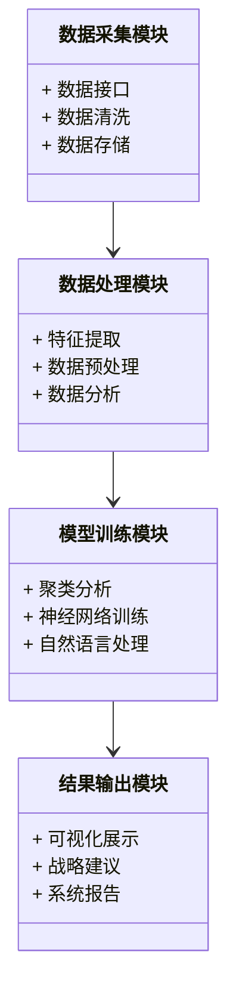

                 


# AI辅助企业品牌定位与差异化战略制定

> 关键词：AI技术，品牌定位，差异化战略，企业战略，人工智能，算法实现

> 摘要：本文详细探讨了AI技术在企业品牌定位与差异化战略制定中的应用。通过分析消费者行为、竞争对手策略和市场趋势，AI能够为企业提供精准的品牌定位和差异化的战略建议。文章从AI的基本概念入手，逐步解析其在品牌定位中的具体应用，详细阐述了基于聚类分析、神经网络和自然语言处理的算法实现，并通过实际案例展示了AI在品牌定位和差异化战略中的实际应用效果。最后，文章总结了AI在品牌定位与差异化战略中的优势和未来发展趋势。

---

## 第一部分: AI辅助企业品牌定位与差异化战略的理论基础

### 第1章: 品牌定位与差异化战略的理论基础

#### 1.1 品牌定位的定义与重要性

品牌定位是指企业在市场中确定自身品牌的位置，使其在目标客户心中占据独特的位置。它是企业与竞争对手区分开来的关键点。品牌定位的重要性体现在以下几个方面：

- **目标客户的选择**：品牌定位决定了企业吸引哪些客户群体。
- **市场定位的精准性**：通过品牌定位，企业可以更精准地满足目标客户的需求。
- **竞争优势的建立**：品牌定位帮助企业建立独特的竞争优势，吸引更多的客户。

品牌定位的核心要素包括目标客户、核心价值、品牌主张和市场位置。

#### 1.2 差异化战略的定义与应用

差异化战略是指企业通过提供与众不同的产品或服务，以区别于竞争对手的战略。其核心在于通过独特的价值主张，满足特定客户群体的需求。差异化战略的应用可以体现在产品质量、服务、价格、品牌形象等多个方面。

差异化战略的优势在于：

- **提高客户忠诚度**：通过提供独特的价值，客户更容易对企业产生忠诚。
- **增强市场竞争力**：差异化战略帮助企业从激烈的竞争中脱颖而出。
- **提高利润率**：通过差异化，企业可以实现更高的定价策略，从而提高利润率。

#### 1.3 AI在品牌定位与差异化战略中的作用

AI技术通过分析海量数据，帮助企业更精准地进行品牌定位和差异化战略的制定。AI在品牌定位中的应用场景包括：

- **消费者行为分析**：通过AI技术分析消费者的行为数据，帮助企业更好地理解消费者需求。
- **市场趋势预测**：通过AI技术预测市场趋势，帮助企业提前制定品牌定位策略。
- **竞争对手分析**：通过AI技术分析竞争对手的策略，帮助企业制定差异化的竞争策略。

---

### 第2章: 企业品牌定位的AI分析框架

#### 2.1 品牌定位的AI分析模型

品牌定位的AI分析模型是一个综合性的框架，结合了机器学习、自然语言处理和大数据分析等技术。模型的基本框架包括数据采集、数据预处理、特征提取、模型训练和结果输出等步骤。

模型的核心算法包括聚类分析、神经网络和自然语言处理等。通过这些算法，AI可以帮助企业识别目标客户群体、分析市场趋势，并制定精准的品牌定位策略。

#### 2.2 基于AI的消费者行为分析

消费者行为分析是品牌定位的重要组成部分。通过AI技术，企业可以分析消费者的行为数据，包括购买记录、浏览行为、搜索记录等。这些数据可以帮助企业更好地理解消费者的需求和偏好。

AI在消费者行为分析中的应用包括：

- **聚类分析**：通过聚类分析，将消费者分为不同的群体，帮助企业识别目标客户群体。
- **情感分析**：通过自然语言处理技术，分析消费者对品牌的评价，帮助企业了解消费者的情感倾向。
- **预测分析**：通过机器学习模型，预测消费者的购买行为，帮助企业制定精准的营销策略。

#### 2.3 基于AI的竞争对手分析

竞争对手分析是差异化战略的重要组成部分。通过AI技术，企业可以分析竞争对手的产品、价格、服务和市场策略，从而制定差异化的竞争策略。

AI在竞争对手分析中的应用包括：

- **市场趋势预测**：通过分析竞争对手的历史数据，预测未来的市场趋势。
- **产品差异化分析**：通过分析竞争对手的产品特点，识别自身的差异化竞争优势。
- **策略调整建议**：通过AI技术，为企业提供竞争对手策略调整的建议。

---

### 第3章: 品牌定位与差异化战略的AI算法实现

#### 3.1 基于聚类分析的品牌定位算法

聚类分析是一种常用的机器学习算法，用于将数据分为不同的类别。在品牌定位中，聚类分析可以用于分析消费者的行为数据，识别目标客户群体。

**算法实现步骤：**

1. **数据采集**：收集消费者的行为数据，包括购买记录、浏览行为、搜索记录等。
2. **数据预处理**：对数据进行清洗、归一化处理，确保数据质量。
3. **特征提取**：提取数据中的关键特征，如购买频率、购买金额、浏览时间等。
4. **聚类分析**：使用聚类算法，如K-means，将消费者分为不同的群体。
5. **结果分析**：分析每个群体的特征，识别目标客户群体。

**数学模型：**

K-means算法的目标是最小化簇内平方误差之和，公式如下：

$$
\text{目标函数} = \sum_{i=1}^{k} \sum_{j=1}^{n_i} (x_j - \mu_i)^2
$$

其中，$k$是簇的数量，$n_i$是第$i$个簇中的样本数量，$x_j$是样本，$\mu_i$是第$i$个簇的中心点。

#### 3.2 基于神经网络的差异化战略算法

神经网络是一种强大的机器学习模型，可以用于分析复杂的市场数据，制定差异化的战略。在差异化战略中，神经网络可以用于预测市场趋势、分析竞争对手策略等。

**算法实现步骤：**

1. **数据采集**：收集市场数据，包括竞争对手的产品、价格、服务等。
2. **数据预处理**：对数据进行清洗、归一化处理，确保数据质量。
3. **特征提取**：提取数据中的关键特征，如产品特点、价格、服务评分等。
4. **神经网络训练**：使用神经网络模型，训练数据，提取特征。
5. **结果分析**：分析神经网络的输出，制定差异化的战略。

**数学模型：**

神经网络的损失函数通常使用交叉熵损失函数，公式如下：

$$
\text{损失函数} = -\sum_{i=1}^{m} y_i \log(p_i) + (1 - y_i) \log(1 - p_i)
$$

其中，$m$是样本数量，$y_i$是真实标签，$p_i$是预测概率。

#### 3.3 基于自然语言处理的品牌定位优化算法

自然语言处理技术可以用于分析消费者对品牌的评价，帮助企业优化品牌定位。在品牌定位优化中，自然语言处理可以用于情感分析、主题分析等。

**算法实现步骤：**

1. **数据采集**：收集消费者对品牌的评价数据。
2. **数据预处理**：对数据进行清洗、分词处理，确保数据质量。
3. **情感分析**：使用自然语言处理技术，分析消费者的情感倾向。
4. **主题分析**：识别消费者评价中的主要主题，帮助企业优化品牌定位。
5. **结果分析**：根据分析结果，优化品牌定位策略。

**数学模型：**

情感分析中常用的损失函数是交叉熵损失函数，公式如下：

$$
\text{损失函数} = -\sum_{i=1}^{m} y_i \log(p_i) + (1 - y_i) \log(1 - p_i)
$$

其中，$m$是样本数量，$y_i$是真实标签，$p_i$是预测概率。

---

## 第四部分: 项目实战与案例分析

### 第4章: 项目实战: 基于AI的品牌定位系统开发

#### 4.1 系统介绍

本项目旨在开发一个基于AI的品牌定位系统，帮助企业进行精准的品牌定位和差异化战略制定。系统包括数据采集、数据处理、模型训练和结果输出等模块。

#### 4.2 系统功能设计

**系统功能设计图：**



---

#### 4.3 系统架构设计

**系统架构图：**


---

#### 4.4 系统接口设计

系统接口设计包括数据接口、模型接口和结果接口。数据接口用于与外部数据源对接，模型接口用于调用AI模型，结果接口用于输出分析结果。

---

#### 4.5 系统交互设计

系统交互设计包括用户输入、数据处理、模型调用和结果展示等步骤。

**系统交互流程图：**

```mermaid
sequenceDiagram
    用户 --> 数据采集模块: 提供数据源
    数据采集模块 --> 数据处理模块: 数据预处理
    数据处理模块 --> 模型训练模块: 提供特征数据
    模型训练模块 --> 数据处理模块: 返回模型结果
    数据处理模块 --> 可视化界面: 展示结果
    用户 <-- 可视化界面: 查看结果
```

---

## 第五部分: 总结与展望

### 第5章: 总结与展望

#### 5.1 本章总结

本文详细探讨了AI技术在企业品牌定位与差异化战略制定中的应用。通过分析消费者行为、竞争对手策略和市场趋势，AI能够为企业提供精准的品牌定位和差异化的战略建议。文章从AI的基本概念入手，逐步解析其在品牌定位中的具体应用，详细阐述了基于聚类分析、神经网络和自然语言处理的算法实现，并通过实际案例展示了AI在品牌定位和差异化战略中的实际应用效果。

#### 5.2 未来展望

随着AI技术的不断发展，其在品牌定位与差异化战略中的应用将更加广泛和深入。未来，AI技术可以帮助企业更精准地进行市场分析、竞争对手分析和消费者行为分析，从而制定更加科学和有效的品牌定位和差异化战略。同时，随着自然语言处理和深度学习技术的不断进步，AI在品牌定位中的应用将更加智能化和自动化。

---

## 作者：AI天才研究院/AI Genius Institute & 禅与计算机程序设计艺术 /Zen And The Art of Computer Programming

---

**注意事项：**

1. 本文中的AI算法实现和系统设计均为理论探讨，实际应用中需要根据具体需求进行调整和优化。
2. 数据采集和处理过程中，需要注意数据隐私和合规性问题。
3. 系统设计和实现需要根据企业的具体需求进行定制化开发。

---

**拓展阅读：**

- 《机器学习实战》
- 《深度学习》
- 《自然语言处理入门》
- 《品牌管理》
- 《企业战略管理》

--- 

**结束语：** 通过AI技术的应用，企业可以更加精准地进行品牌定位和差异化战略的制定，从而在激烈的市场竞争中获得更大的竞争优势。

