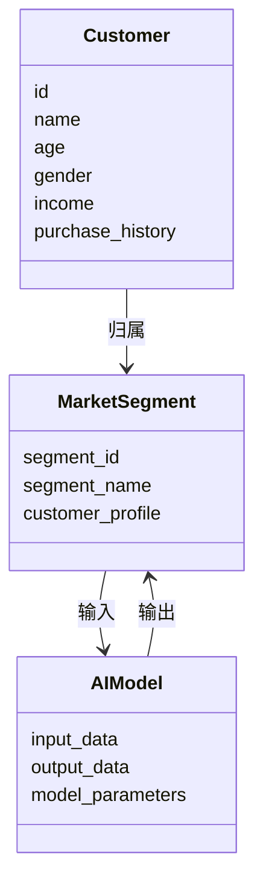

                 


# AI辅助企业品牌定位：市场细分与差异化战略

---

## 关键词
AI技术，品牌定位，市场细分，差异化战略，机器学习，客户画像，数据驱动

---

## 摘要
随着人工智能技术的快速发展，企业品牌定位的传统方法逐渐被数据驱动的智能化方法所取代。本文将深入探讨AI技术在市场细分与差异化战略中的应用，结合具体的算法原理、系统架构设计和实际案例，为企业提供一套基于AI的品牌定位解决方案。文章内容涵盖背景介绍、核心概念、算法原理、系统分析与架构设计、项目实战以及最佳实践，帮助读者全面理解AI在品牌定位中的价值和应用方式。

---

## 第一部分: AI与品牌定位的结合

### 第1章: AI与品牌定位的结合

#### 1.1 品牌定位的定义与重要性

##### 1.1.1 品牌定位的定义
品牌定位是指企业在目标市场中确定自身位置的过程，旨在通过差异化策略，吸引目标客户并建立品牌认知。传统品牌定位方法依赖于市场调研和人工分析，效率较低且难以捕捉复杂市场环境中的细微变化。

##### 1.1.2 品牌定位的重要性
- **市场竞争加剧**：在现代商业环境中，市场竞争日益激烈，品牌定位是企业在市场中生存和发展的关键。
- **客户需求变化**：消费者的需求日益多样化，传统的定位方法难以满足精准定位的需求。
- **数据驱动决策**：通过AI技术，企业可以更高效地分析市场数据，制定科学的品牌定位策略。

##### 1.1.3 传统品牌定位方法的局限性
- **数据量不足**：传统方法依赖于少量样本数据，难以全面反映市场的真实情况。
- **分析效率低**：人工分析耗时长，难以快速响应市场变化。
- **精准度有限**：传统方法难以捕捉客户行为的细微差异，导致定位不够精准。

#### 1.2 AI技术在品牌定位中的作用

##### 1.2.1 AI技术的基本概念
人工智能（AI）是指计算机系统模拟人类智能的能力，包括学习、推理、感知和决策等能力。AI技术可以处理海量数据，发现数据中的模式和规律，为品牌定位提供科学依据。

##### 1.2.2 AI在市场分析中的优势
- **数据处理能力**：AI能够快速处理大量数据，发现市场中的潜在规律。
- **精准预测**：通过机器学习算法，AI可以预测市场趋势和客户行为。
- **实时反馈**：AI系统能够实时分析市场数据，提供即时反馈，帮助企业在市场变化中快速调整策略。

##### 1.2.3 AI如何辅助品牌定位
AI通过分析客户数据、市场趋势和竞争环境，帮助企业在市场中找到合适的位置。具体表现为：
- **客户画像构建**：通过AI技术，企业可以精准描绘目标客户的特征，制定针对性的营销策略。
- **市场细分优化**：AI可以帮助企业将市场细分为更小的、更具针对性的群体，提升定位的精准度。
- **差异化策略制定**：基于AI分析的结果，企业可以制定更具针对性的差异化战略，提升市场竞争力。

---

## 第二部分: 市场细分与差异化战略

### 第2章: 市场细分与差异化战略

#### 2.1 市场细分的定义与方法

##### 2.1.1 市场细分的定义
市场细分是指将整体市场划分为多个具有相似需求和特征的客户群体的过程。通过市场细分，企业可以更好地理解客户需求，制定更有针对性的营销策略。

##### 2.1.2 常见的市场细分方法
- **地理细分**：根据地理位置划分市场，例如按区域、城市或国家进行细分。
- **人口细分**：根据人口统计特征（如年龄、性别、收入等）进行细分。
- **行为细分**：根据客户的购买行为、消费习惯等进行细分。
- **心理细分**：根据客户的消费心理和价值观进行细分。

##### 2.1.3 数据驱动的市场细分
- **数据来源**：企业可以通过问卷调查、社交媒体数据、销售记录等多种渠道获取客户数据。
- **数据清洗与预处理**：对数据进行去重、缺失值处理、标准化等预处理，确保数据质量。
- **数据特征提取**：通过数据分析技术，提取客户行为、偏好等关键特征。

#### 2.2 差异化战略的核心要素

##### 2.2.1 差异化战略的定义
差异化战略是指企业通过提供独特的产品或服务，与竞争对手形成差异化竞争的一种战略。通过差异化，企业可以在市场中建立独特的品牌形象，吸引目标客户。

##### 2.2.2 差异化战略的实施步骤
1. **市场调研**：了解市场需求和竞争环境，确定差异化的机会。
2. **客户分析**：分析客户的需求和偏好，找出差异化的核心点。
3. **产品定位**：根据差异化的核心点，制定产品或服务的定位策略。
4. **营销推广**：通过营销活动推广差异化策略，提升品牌知名度和客户忠诚度。

##### 2.2.3 差异化战略的成功案例
- **苹果公司**：通过创新的产品设计和品牌营销，成功塑造了高端、创新的品牌形象。
- **特斯拉**：通过提供电动化、智能化的汽车产品，与传统汽车品牌形成差异化竞争。

#### 2.3 基于AI的市场细分与差异化战略

##### 2.3.1 数据驱动的市场细分
- **客户画像构建**：通过AI技术，企业可以精准描绘客户的特征，例如年龄、性别、收入、消费习惯等。
- **聚类分析**：利用聚类算法，将客户划分为不同的群体，每个群体具有相似的需求和特征。
- **预测客户行为**：通过机器学习算法，预测客户的购买行为和偏好，制定更有针对性的营销策略。

##### 2.3.2 AI驱动的差异化战略
- **个性化营销**：根据客户的特征和需求，制定个性化的营销策略，例如定制化的广告投放、精准的优惠券推送等。
- **动态调整策略**：通过实时数据分析，动态调整市场细分和差异化战略，确保策略的有效性。

---

## 第三部分: AI辅助市场细分与差异化战略的实现

### 第3章: AI辅助市场细分的实现

#### 3.1 数据收集与处理

##### 3.1.1 数据来源
- **客户数据**：包括客户的基本信息、购买记录、消费习惯等。
- **市场数据**：包括行业趋势、竞争对手分析、市场调研报告等。
- **社交媒体数据**：通过社交媒体平台获取客户的评论、点赞、分享等行为数据。

##### 3.1.2 数据清洗与预处理
- **去重**：去除重复的客户记录。
- **缺失值处理**：对缺失的数据进行插值或删除处理。
- **标准化**：对数据进行标准化处理，确保数据的一致性。

##### 3.1.3 数据特征提取
- **客户行为特征**：例如客户的购买频率、购买金额、偏好产品类型等。
- **客户人口特征**：例如客户的年龄、性别、收入水平等。
- **客户情感特征**：通过自然语言处理技术，分析客户对品牌或产品的评价情感。

#### 3.2 市场细分的算法选择

##### 3.2.1 聚类分析
- **K-means聚类**：将客户划分为K个簇，每个簇内的客户具有相似的特征。
- **层次聚类**：通过层次化的方法，逐步将客户划分为不同的簇。

##### 3.2.2 分类算法
- **决策树**：通过构建决策树模型，对客户进行分类。
- **支持向量机（SVM）**：通过SVM算法，对客户进行分类。

##### 3.2.3 回归分析
- **线性回归**：通过线性回归模型，预测客户的购买行为。
- **逻辑回归**：通过逻辑回归模型，预测客户的购买意愿。

#### 3.3 AI驱动的市场细分流程

##### 3.3.1 数据输入与模型训练
- **数据输入**：将客户数据输入AI系统，进行特征提取和数据清洗。
- **模型训练**：通过机器学习算法，对数据进行训练，生成客户分群模型。
- **模型评估**：通过评估指标（如准确率、召回率等），评估模型的性能。

##### 3.3.2 模型评估与优化
- **评估指标**：通过准确率、召回率、F1分数等指标，评估模型的性能。
- **模型优化**：通过参数调优、特征选择等方法，优化模型的性能。

##### 3.3.3 结果可视化与解读
- **可视化工具**：使用图表、热图等工具，直观展示客户分群结果。
- **结果解读**：根据客户分群结果，制定针对性的市场细分策略。

### 第4章: 基于AI的差异化战略制定

#### 4.1 差异化战略的AI辅助方法

##### 4.1.1 客户画像构建
- **客户画像**：通过AI技术，构建客户的三维画像，包括人口特征、行为特征和情感特征。
- **画像分析**：通过分析客户画像，确定差异化的核心点。

##### 4.1.2 个性化营销策略
- **个性化推荐**：根据客户的画像，推荐个性化的产品或服务。
- **精准营销**：通过精准的广告投放和优惠券推送，吸引目标客户。

##### 4.1.3 动态调整策略
- **实时数据分析**：通过实时数据分析，动态调整市场细分和差异化战略。
- **策略优化**：通过反馈数据，不断优化差异化战略，提升市场竞争力。

#### 4.2 AI驱动的差异化战略流程

##### 4.2.1 数据输入与模型训练
- **数据输入**：将客户数据输入AI系统，进行特征提取和数据清洗。
- **模型训练**：通过机器学习算法，对数据进行训练，生成客户分群模型。
- **模型评估**：通过评估指标，评估模型的性能。

##### 4.2.2 策略制定与执行
- **策略制定**：根据客户分群结果，制定针对性的差异化战略。
- **策略执行**：通过营销活动、广告投放等方式，执行差异化战略。

##### 4.2.3 结果分析与优化
- **结果分析**：通过数据分析，评估差异化战略的效果。
- **策略优化**：根据分析结果，优化差异化战略，提升市场竞争力。

---

## 第四部分: 项目实战

### 第5章: 项目实战

#### 5.1 项目背景与目标

##### 5.1.1 项目背景
- **行业背景**：选择一个具体的行业，例如电子商务、零售业等。
- **企业背景**：假设一家中型电商企业，希望通过AI技术优化品牌定位。

##### 5.1.2 项目目标
- **市场细分**：通过AI技术，将客户划分为不同的群体。
- **差异化战略**：根据市场细分结果，制定针对性的差异化战略。

#### 5.2 系统功能设计

##### 5.2.1 领域模型


##### 5.2.2 系统架构
```mermaid
server
    database
    AIModel
    frontend
```

##### 5.2.3 接口设计
- **数据接口**：与数据库交互，获取客户数据。
- **模型接口**：与AI模型交互，进行数据处理和模型训练。
- **前端接口**：与用户交互，展示市场细分结果和差异化战略建议。

#### 5.3 项目实现

##### 5.3.1 环境安装
- **Python环境**：安装Python 3.8及以上版本。
- **机器学习库**：安装scikit-learn、TensorFlow等机器学习库。
- **数据可视化库**：安装Matplotlib、Seaborn等数据可视化库。

##### 5.3.2 核心代码实现
```python
from sklearn.cluster import KMeans
from sklearn.preprocessing import StandardScaler
import pandas as pd

# 数据预处理
data = pd.read_csv('customer_data.csv')
scaler = StandardScaler()
scaled_data = scaler.fit_transform(data)

# 聚类分析
model = KMeans(n_clusters=3, random_state=42)
model.fit(scaled_data)

# 获取聚类结果
clusters = model.predict(scaled_data)
data['cluster'] = clusters

# 可视化
import matplotlib.pyplot as plt

plt.scatter(data['x'], data['y'], c=data['cluster'])
plt.xlabel('X')
plt.ylabel('Y')
plt.title('Market Segmentation')
plt.show()
```

##### 5.3.3 实验结果与分析
- **实验结果**：通过K-means聚类算法，将客户划分为3个群体。
- **结果分析**：每个群体的特征和需求不同，制定针对性的差异化战略。

#### 5.4 项目小结
- **项目总结**：通过AI技术，成功实现了市场细分和差异化战略。
- **经验总结**：在项目实施过程中，需要注意数据质量和模型优化。

---

## 第五部分: 最佳实践

### 第6章: 最佳实践

#### 6.1 数据质量的重要性
- **数据清洗**：确保数据的完整性和准确性。
- **数据标注**：对数据进行标注，确保模型训练的有效性。

#### 6.2 模型调优
- **参数调整**：通过网格搜索等方法，优化模型参数。
- **特征选择**：选择最具代表性的特征，提升模型性能。

#### 6.3 业务与技术结合
- **业务需求分析**：深入了解业务需求，确保技术解决方案的有效性。
- **技术实现**：将技术方案与业务需求相结合，制定科学的市场细分和差异化战略。

#### 6.4 小结与注意事项
- **小结**：通过AI技术，企业可以更高效地进行市场细分和差异化战略。
- **注意事项**：在实际应用中，需要注意数据隐私和模型的可解释性。

---

## 作者信息

作者：AI天才研究院/AI Genius Institute & 禅与计算机程序设计艺术/Zen And The Art of Computer Programming

