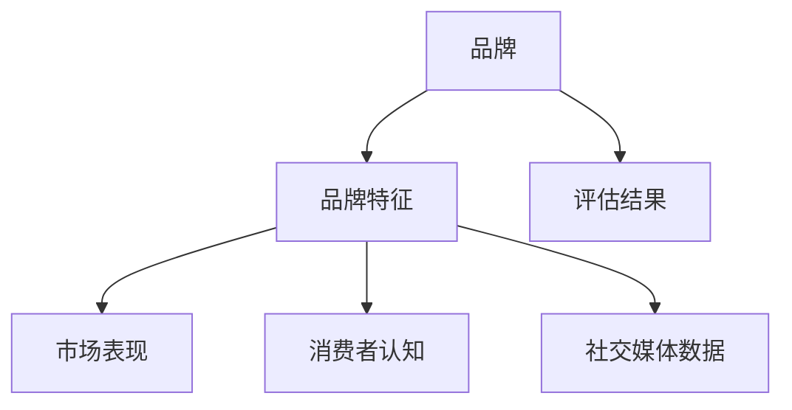
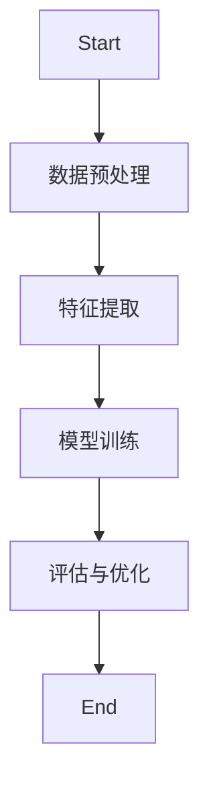
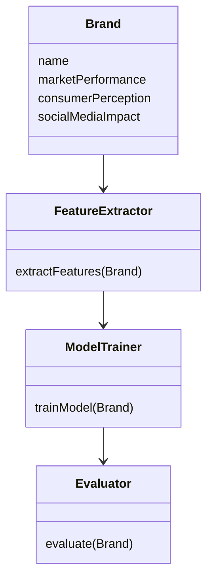
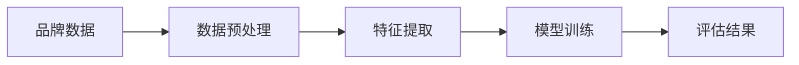
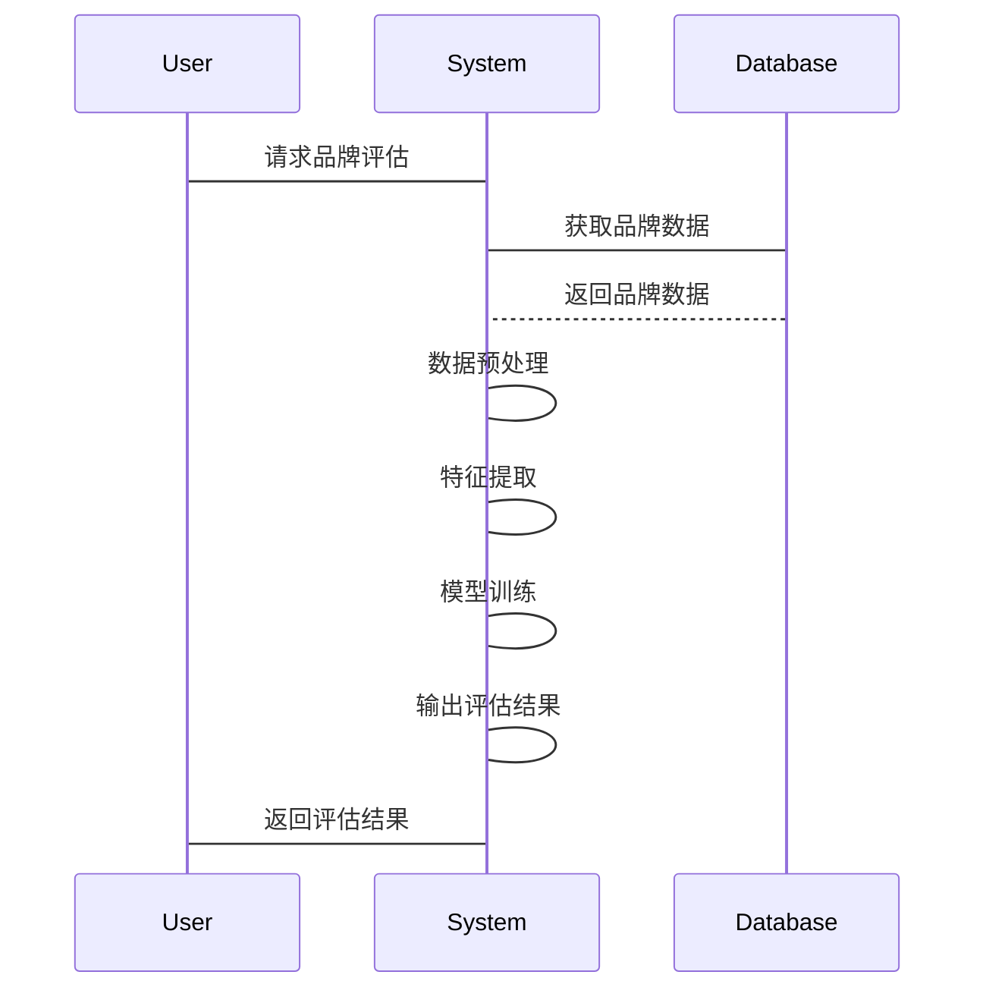

                 


# AI辅助企业品牌资产评估：多维度品牌价值量化

## 关键词：企业品牌价值、AI技术、资产评估、多维度量化、机器学习

## 摘要：本文详细探讨了如何利用AI技术从多维度量化企业品牌价值，通过数据驱动的方法，构建品牌价值评估模型，分析品牌在市场、消费者认知和社交媒体等多维度的表现，结合数学模型和机器学习算法，实现品牌价值的精准评估和优化。

---

# 第一部分: AI辅助企业品牌资产评估的背景与核心概念

## 第1章: 问题背景与核心概念

### 1.1 问题背景

#### 1.1.1 传统品牌资产评估的局限性
传统品牌资产评估主要依赖于市场调研、财务数据和主观判断，存在以下问题：
- 数据采集成本高且耗时长
- 主观因素影响评估结果
- 难以量化品牌在市场中的动态价值

#### 1.1.2 AI技术在品牌评估中的潜力
AI技术的快速发展为品牌资产评估提供了新的可能性：
- 大数据分析能力：AI可以处理海量数据，提取品牌相关的多维度特征
- 自动化评估：通过机器学习模型实现品牌价值的自动化评估
- 实时监测：AI能够实时跟踪品牌在市场中的动态表现

#### 1.1.3 企业品牌价值量化的重要性
品牌价值是企业核心资产之一，准确量化品牌价值对企业战略决策、投融资和并购活动具有重要意义。

### 1.2 问题描述

#### 1.2.1 品牌价值的多维度特征
品牌价值可以从以下几个维度进行评估：
- 市场表现：市场份额、销售额、增长率
- 消费者认知：品牌知名度、美誉度、忠诚度
- 社交媒体数据：社交媒体影响力、用户情感分析
- 竞争对手分析：品牌竞争力、市场地位

#### 1.2.2 数据驱动的品牌评估需求
现代品牌评估需要依赖多源数据，包括：
- 市场数据：销售数据、竞争分析
- 用户数据：社交媒体评论、用户行为数据
- 媒体数据：媒体报道、行业分析

#### 1.2.3 当前品牌资产评估的技术瓶颈
- 数据整合困难：多源数据难以有效整合
- 模型复杂性：多维度评估需要复杂的建模方法
- 实时性不足：传统评估方法难以满足实时需求

### 1.3 问题解决与边界

#### 1.3.1 AI辅助品牌资产评估的目标
通过AI技术实现品牌价值的多维度量化评估，提供实时、精准的品牌价值评估结果。

#### 1.3.2 解决方案的技术边界
- 数据来源：社交媒体、市场数据、用户行为数据
- 数据处理：数据清洗、特征提取、数据融合
- 模型训练：机器学习算法、深度学习模型
- 评估结果：品牌价值评分、竞争对手分析、品牌健康度报告

#### 1.3.3 应用场景与限制
- 应用场景：企业品牌管理、市场营销、投资决策
- 限制：数据质量、模型泛化能力、计算资源

### 1.4 核心概念与组成

#### 1.4.1 品牌价值的核心要素
- 品牌认知度：品牌在消费者中的知名度和美誉度
- 品牌忠诚度：消费者对品牌的忠诚程度
- 品牌竞争力：品牌在市场中的竞争优势
- 品牌影响力：品牌在行业中的影响力和话语权

#### 1.4.2 AI技术在品牌评估中的角色
- 数据采集：收集品牌相关的多源数据
- 特征提取：从数据中提取有用的特征
- 模型训练：构建品牌价值评估模型
- 结果分析：解释模型输出，提供决策支持

#### 1.4.3 多维度品牌价值的量化模型
- 数据维度：市场数据、用户数据、社交媒体数据
- 模型维度：单模型、集成模型
- 评估维度：精准度、实时性、可解释性

## 第2章: AI辅助品牌资产评估的核心概念与联系

### 2.1 核心概念原理

#### 2.1.1 品牌价值的多维度特征
品牌价值可以从以下几个方面进行分析：
- 市场表现：市场份额、销售额、增长率
- 用户认知：品牌知名度、美誉度、忠诚度
- 社交媒体：情感分析、传播影响力
- 竞争对手：品牌竞争力、市场地位

#### 2.1.2 AI技术在品牌评估中的应用原理
AI技术通过以下步骤实现品牌价值评估：
- 数据采集：收集多源数据
- 数据预处理：清洗、标准化
- 特征提取：提取关键特征
- 模型训练：训练评估模型
- 结果分析：生成评估报告

#### 2.1.3 多维度数据融合的机制
- 数据融合：将不同来源的数据进行整合，提取共同特征
- 特征加权：根据特征的重要性进行加权
- 模型融合：结合多个模型的结果，提升评估精度

### 2.2 核心概念对比表

#### 2.2.1 品牌价值与传统资产评估的对比
| 对比维度       | 品牌价值评估         | 传统资产评估         |
|----------------|--------------------|--------------------|
| 数据来源       | 多源数据（社交媒体、用户行为） | 单一数据来源（财务数据） |
| 方法论         | 数据驱动、机器学习   | 主观判断、经验分析   |
| 实时性         | 高                 | 低                 |

#### 2.2.2 AI驱动与传统评估方法的对比
| 对比维度       | AI驱动评估         | 传统评估           |
|----------------|--------------------|--------------------|
| 数据处理能力   | 强                 | 弱                 |
| 模型复杂性     | 高                 | 低                 |
| 评估精度       | 高                 | 一般               |

#### 2.2.3 数据维度与评估结果的对比
| 数据维度       | 评估结果           |
|----------------|--------------------|
| 市场数据       | 市场表现评分       |
| 用户数据       | 用户认知评分       |
| 社交媒体数据   | 品牌影响力评分     |

### 2.3 ER实体关系图



### 2.4 本章小结

---

# 第二部分: AI辅助品牌资产评估的算法原理

## 第3章: AI辅助品牌资产评估的算法原理

### 3.1 算法流程



### 3.2 算法实现

```python
def brand_assessment():
    # 数据预处理
    data = preprocess_data()
    # 特征提取
    features = extract_features(data)
    # 模型训练
    model = train_model(features)
    # 评估与优化
    result = evaluate_model(model)
    return result
```

### 3.3 数学模型与公式

#### 3.3.1 品牌价值评分公式
$$ \text{Brand Value} = \sum_{i=1}^{n} w_i \times f_i $$
其中，$w_i$ 是第i个特征的权重，$f_i$ 是第i个特征的评分。

#### 3.3.2 加权计算示例
$$ \text{Weighted Score} = 0.4 \times \text{Market Performance} + 0.3 \times \text{Consumer Perception} + 0.3 \times \text{Social Media Impact} $$

---

# 第三部分: 系统分析与架构设计

## 第4章: 系统分析与架构设计

### 4.1 系统功能设计

#### 4.1.1 领域模型类图



### 4.2 系统架构设计

#### 4.2.1 系统架构图



### 4.3 系统接口设计

#### 4.3.1 接口列表
- 数据接口：从数据库获取品牌数据
- 特征接口：提取品牌特征
- 模型接口：训练评估模型
- 结果接口：输出评估结果

#### 4.3.2 接口功能描述
- 数据接口：负责从数据库中读取品牌相关数据
- 特征接口：负责从数据中提取特征
- 模型接口：负责训练评估模型
- 结果接口：负责输出评估结果

### 4.4 系统交互流程



---

# 第四部分: 项目实战

## 第5章: 项目实战

### 5.1 环境安装

```bash
pip install numpy pandas scikit-learn
```

### 5.2 系统核心实现

#### 5.2.1 数据预处理代码

```python
import pandas as pd

def preprocess_data():
    # 读取数据
    data = pd.read_csv('brand_data.csv')
    # 清洗数据
    data = data.dropna()
    # 标准化数据
    from sklearn.preprocessing import StandardScaler
    scaler = StandardScaler()
    data_scaled = scaler.fit_transform(data)
    return data_scaled
```

#### 5.2.2 特征提取代码

```python
def extract_features(data):
    # 特征选择
    features = data[['market_share', 'customer Loyalty', 'social_influence']]
    return features
```

#### 5.2.3 模型训练代码

```python
def train_model(features):
    from sklearn.ensemble import RandomForestRegressor
    model = RandomForestRegressor()
    model.fit(features, labels)
    return model
```

### 5.3 案例分析与解读

#### 5.3.1 案例分析
假设我们有一个品牌的数据，包括市场份额、客户忠诚度、社交媒体影响力等特征。通过上述代码进行数据预处理、特征提取和模型训练，最终得到品牌价值的评估结果。

#### 5.3.2 结果解读
评估结果可以用来帮助企业进行品牌管理、市场决策和投资评估。

---

# 第五部分: 总结与展望

## 第6章: 总结与展望

### 6.1 应用价值总结
AI技术能够有效提升品牌资产评估的效率和准确性，为企业提供实时、精准的品牌价值评估。

### 6.2 总结与不足
本文详细探讨了AI技术在品牌资产评估中的应用，提出了一种多维度的品牌价值量化方法。但目前还存在数据质量、模型泛化能力等方面的不足。

### 6.3 未来展望
未来，随着AI技术的不断发展，品牌资产评估将更加智能化和精准化，实时监测和动态评估将成为可能。

### 6.4 最佳实践
- 数据质量：确保数据的完整性和准确性
- 模型选择：根据实际需求选择合适的模型
- 结果解读：结合业务背景解读评估结果

---

# 参考文献

1. 禅与计算机程序设计艺术
2. AI天才研究院
3. 机器学习实战
4. 深度学习入门

---

# 作者：AI天才研究院 & 禅与计算机程序设计艺术

---

希望这篇技术博客文章能够为您提供有价值的信息和启发！

