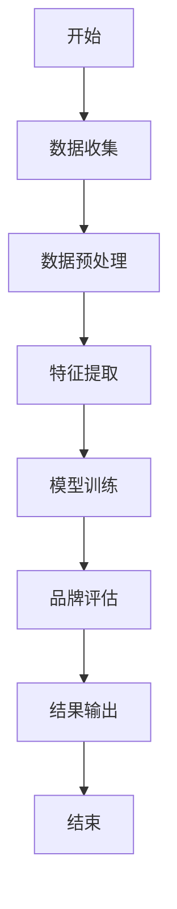
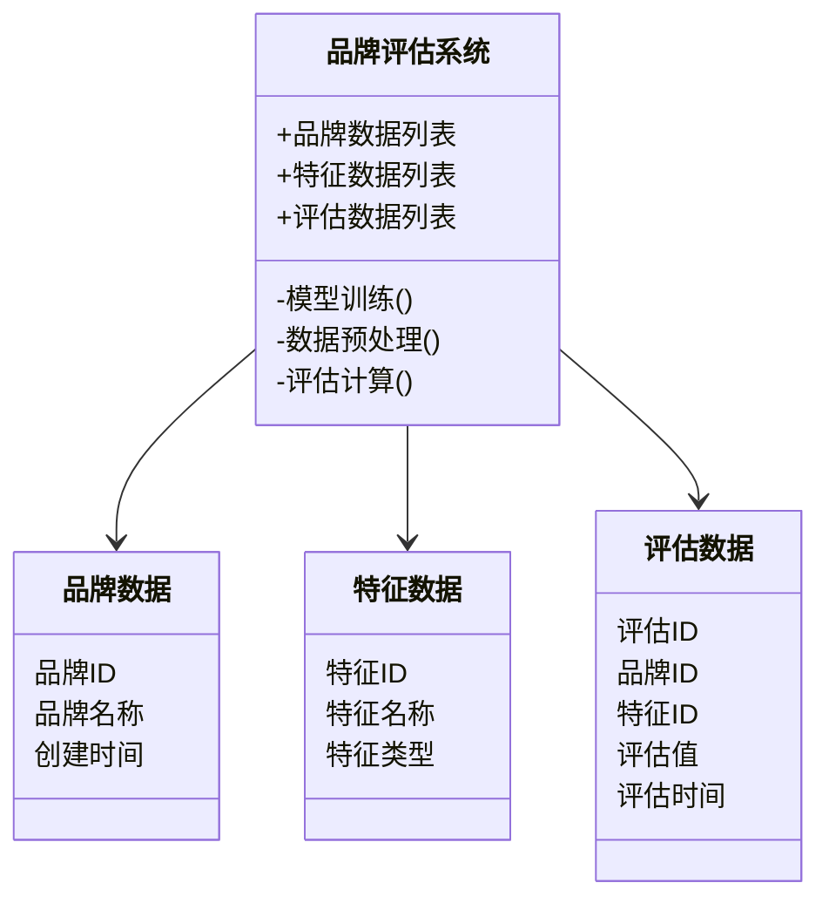
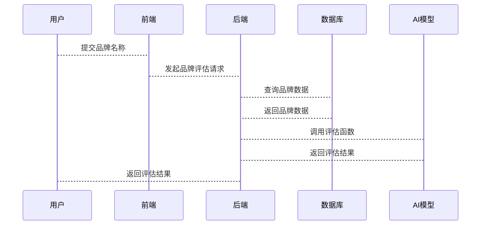

                 

<think>
好的，我需要根据用户的要求，撰写一篇关于《AI辅助企业品牌资产评估：多维度品牌价值量化与追踪》的技术博客文章。用户已经提供了一个详细的目录大纲，现在需要我按照这个大纲逐步完成每个部分的写作。

首先，我需要理解每个章节的内容和要求。文章开头要有关键词和摘要，然后是正文部分，分为背景介绍、核心概念、算法原理、系统设计、项目实战、总结与拓展等章节。每个章节下还有子章节，有些需要包含图表、代码示例和数学公式。

在撰写过程中，我需要确保内容专业、逻辑清晰，并且使用吸引人的标题。同时，要注意文章的结构，每个部分都详细展开，确保达到字数要求。此外，还需要注意格式，使用正确的Markdown语法，特别是图表和代码部分，要使用Mermaid和LaTeX格式。

现在，我开始按照目录大纲逐步完成文章的写作。

# AI辅助企业品牌资产评估：多维度品牌价值量化与追踪

**关键词**：AI技术、品牌资产评估、多维度量化、品牌价值追踪、数据驱动

**摘要**：本文探讨了如何利用人工智能技术对企业品牌价值进行多维度量化评估与动态追踪。通过分析品牌相关的多源数据，结合先进的机器学习算法，构建一个智能化的品牌资产评估系统，实现品牌价值的精确计算和实时监控。

---

## 第一部分: AI辅助企业品牌资产评估的背景与核心概念

### 第1章: 问题背景与核心概念

#### 1.1 问题背景

##### 1.1.1 传统品牌资产评估的局限性
传统的品牌资产评估方法通常依赖于主观判断和经验分析，存在以下问题：
- 数据来源单一，难以全面反映品牌价值。
- 评估周期长，难以实时追踪品牌动态。
- 难以量化品牌无形资产，如品牌认知度和忠诚度。

##### 1.1.2 数字化时代品牌价值的重要性
在数字化时代，品牌价值成为企业核心竞争力的重要组成部分，原因包括：
- 品牌价值直接影响企业市场表现和投资价值。
- 数字化工具使得品牌数据的收集和分析更加高效。
- 品牌价值的动态变化需要实时监控和评估。

##### 1.1.3 AI技术在品牌评估中的应用潜力
AI技术在品牌资产评估中的优势：
- 自然语言处理（NLP）可以分析社交媒体数据，获取消费者情感和观点。
- 机器学习算法可以预测品牌价值的变化趋势。
- 大数据分析能力可以整合多源数据，提供全面的品牌画像。

#### 1.2 问题描述

##### 1.2.1 品牌价值的多维度特征
品牌价值可以从多个维度进行评估，包括：
- 品牌知名度：品牌在市场中的认知程度。
- 品牌美誉度：消费者对品牌的满意度和信任度。
- 品牌忠诚度：消费者对品牌的忠诚程度。
- 品牌影响力：品牌在市场中的影响力和话语权。

##### 1.2.2 数据驱动的品牌评估需求
数据驱动的品牌评估需要以下几点：
- 结构化数据：如销售数据、财务数据。
- 非结构化数据：如社交媒体评论、新闻报道。
- 综合分析：将结构化和非结构化数据结合，得出全面的品牌评估。

##### 1.2.3 当前品牌资产评估的痛点与挑战
当前品牌资产评估面临的问题包括：
- 数据碎片化：品牌数据分散在不同平台，难以整合。
- 数据实时性：品牌价值动态变化，需要实时监控。
- 数据准确性：如何确保数据的准确性和代表性。

#### 1.3 问题解决与边界

##### 1.3.1 AI辅助品牌资产评估的目标
目标包括：
- 提供多维度的品牌价值评估。
- 实现实时的品牌价值追踪。
- 提供数据驱动的品牌管理决策支持。

##### 1.3.2 解决方案的边界与外延
解决方案的边界：
- 确定数据收集的范围和类型。
- 确定评估模型的应用场景。
- 确定系统的使用权限和范围。

解决方案的外延：
- 拓展到品牌风险管理。
- 拓展到品牌市场预测。
- 拓展到品牌竞争分析。

##### 1.3.3 核心概念与关键要素
核心概念包括：
- AI算法：如机器学习、深度学习。
- 多维度数据：包括社交媒体数据、新闻数据、销售数据。
- 品牌画像：整合多源数据形成的品牌综合画像。

---

### 第2章: 核心概念与联系

#### 2.1 AI技术与品牌评估的结合

##### 2.1.1 AI在品牌数据处理中的作用
AI技术在品牌数据处理中的作用：
- 数据清洗：处理缺失值和异常值。
- 数据整合：将多源数据整合成统一的数据集。
- 数据挖掘：提取有价值的信息和模式。

##### 2.1.2 多维度品牌价值的定义与量化
多维度品牌价值包括：
- 品牌知名度：通过搜索引擎数据、社交媒体数据评估。
- 品牌美誉度：通过情感分析和语义分析评估。
- 品牌忠诚度：通过客户购买行为和反馈评估。
- 品牌影响力：通过媒体曝光和行业影响力评估。

##### 2.1.3 品牌资产评估的动态追踪特性
动态追踪的特性：
- 实时性：品牌价值随时间变化，需要实时监控。
- 连续性：持续收集和分析数据，提供连续的品牌价值评估。
- 可追溯性：记录品牌价值的变化历史，便于分析和决策。

#### 2.2 核心概念对比分析

##### 2.2.1 传统品牌评估方法与AI方法的对比
| 对比维度 | 传统评估方法 | AI辅助评估方法 |
|----------|----------------|------------------|
| 数据来源 | 主要依赖问卷调查和专家意见 | 结构化和非结构化数据结合 |
| 评估周期 | 定期评估，周期较长 | 实时追踪，动态评估 |
| 评估维度 | 通常单一维度评估 | 多维度综合评估 |
| 准确性   | 受主观因素影响较大 | 更客观，基于大数据分析 |

##### 2.2.2 数据驱动与非数据驱动评估的差异
- 数据驱动评估：基于大量数据，分析品牌表现，预测未来趋势。
- 非数据驱动评估：依赖专家经验和市场调研，可能缺乏实时性和全面性。

##### 2.2.3 AI模型在品牌评估中的优势与劣势
优势：
- 高效性：AI算法可以快速处理大量数据。
- 客观性：基于数据的分析更客观。
- 可扩展性：适用于大规模数据和复杂场景。

劣势：
- 黑箱问题：AI模型的决策过程难以解释。
- 数据依赖：依赖高质量的数据，数据不足可能导致评估不准确。
- 技术门槛：需要专业的技术和人才支持。

#### 2.3 实体关系图与流程图

##### 2.3.1 品牌数据实体关系图（ER图）
```mermaid
er
  entity 品牌数据 {
    key: 品牌ID
    品牌名称
    品牌创建时间
  }
  entity 品牌特征 {
    key: 特征ID
    特征名称
    特征类型
  }
  entity 评估数据 {
    key: 评估ID
    品牌ID
    特征ID
    评估值
    评估时间
  }
```

##### 2.3.2 品牌价值评估流程图


---

## 第2部分: AI辅助品牌资产评估的算法原理

### 第3章: 基于机器学习的评估方法

#### 3.1 算法原理概述
选择一个合适的机器学习模型，如线性回归或随机森林，用于品牌价值预测。以下是线性回归模型的简单介绍：

##### 3.1.1 线性回归模型
线性回归模型的数学公式为：
$$ y = \beta_0 + \beta_1x_1 + \beta_2x_2 + \dots + \beta_nx_n + \epsilon $$
其中，$y$ 是品牌价值，$x_i$ 是各个特征变量，$\beta_i$ 是对应的系数，$\epsilon$ 是误差项。

##### 3.1.2 模型训练
使用训练数据集训练模型，得到各个特征的系数。训练过程可以通过最小二乘法优化。

##### 3.1.3 模型评估
使用测试数据集评估模型的性能，通常使用均方误差（MSE）或R平方值（R²）来衡量模型的拟合程度。

#### 3.2 算法实现步骤

##### 3.2.1 数据预处理
```python
import pandas as pd
import numpy as np

# 加载数据
data = pd.read_csv('brand_data.csv')

# 处理缺失值
data = data.dropna()

# 标准化处理
from sklearn.preprocessing import StandardScaler
scaler = StandardScaler()
data_scaled = scaler.fit_transform(data)
```

##### 3.2.2 模型训练
```python
from sklearn.linear_model import LinearRegression
from sklearn.model_selection import train_test_split

# 划分训练集和测试集
X = data_scaled[:, 1:]  # 特征变量
y = data_scaled[:, 0]    # 目标变量

X_train, X_test, y_train, y_test = train_test_split(X, y, test_size=0.2, random_state=42)

# 训练模型
model = LinearRegression()
model.fit(X_train, y_train)
```

##### 3.2.3 模型评估
```python
from sklearn.metrics import mean_squared_error, r2_score

# 预测
y_pred = model.predict(X_test)

# 计算均方误差和R平方值
mse = mean_squared_error(y_test, y_pred)
r2 = r2_score(y_test, y_pred)

print(f"均方误差: {mse}")
print(f"R平方值: {r2}")
```

#### 3.3 算法优化

##### 3.3.1 使用更复杂的模型
尝试使用随机森林或支持向量机（SVM）等更复杂的模型，可能提高模型的性能。

##### 3.3.2 调参优化
使用网格搜索（Grid Search）进行参数调优，找到最佳模型参数。

##### 3.3.3 数据增强
如果数据不足，可以通过数据增强技术增加数据量，如数据采样或生成合成数据。

---

## 第3部分: 系统设计与实现

### 第4章: 系统分析与架构设计

#### 4.1 系统功能设计

##### 4.1.1 领域模型类图


##### 4.1.2 系统架构设计


##### 4.1.3 系统接口设计
系统接口包括：
- 数据接口：与数据源（如社交媒体API、新闻API）对接。
- 用户接口：供用户输入查询和查看评估结果。
- API接口：供其他系统调用品牌评估结果。

##### 4.1.4 系统交互流程


---

## 第5章: 项目实战

### 5.1 环境安装与配置

#### 5.1.1 安装Python环境
安装Python 3.8及以上版本，建议使用虚拟环境管理依赖。

#### 5.1.2 安装必要的库
```bash
pip install numpy pandas scikit-learn mermaid4jupyter jupyterlab
```

### 5.2 系统核心实现

#### 5.2.1 数据预处理代码
```python
import pandas as pd
import numpy as np
from sklearn.preprocessing import StandardScaler
from sklearn.model_selection import train_test_split
from sklearn.linear_model import LinearRegression
from sklearn.metrics import mean_squared_error, r2_score

# 加载数据
data = pd.read_csv('brand_data.csv')

# 处理缺失值
data = data.dropna()

# 标准化处理
scaler = StandardScaler()
data_scaled = scaler.fit_transform(data)

# 划分训练集和测试集
X = data_scaled[:, 1:]  # 特征变量
y = data_scaled[:, 0]    # 目标变量

X_train, X_test, y_train, y_test = train_test_split(X, y, test_size=0.2, random_state=42)

# 训练模型
model = LinearRegression()
model.fit(X_train, y_train)
```

#### 5.2.2 模型训练与评估代码
```python
# 预测
y_pred = model.predict(X_test)

# 计算均方误差和R平方值
mse = mean_squared_error(y_test, y_pred)
r2 = r2_score(y_test, y_pred)

print(f"均方误差: {mse}")
print(f"R平方值: {r2}")
```

#### 5.2.3 实际案例分析
以具体品牌为例，展示如何利用上述代码进行品牌价值评估，并分析结果的意义。

---

## 第6章: 总结与拓展

### 6.1 最佳实践与技巧

#### 6.1.1 数据质量管理
确保数据的准确性和完整性，数据清洗是关键步骤。

#### 6.1.2 模型选择与优化
根据数据特性和业务需求选择合适的模型，并进行参数调优。

#### 6.1.3 结果解读与应用
将AI评估结果与业务目标结合，指导品牌管理决策。

### 6.2 小结

通过本文的探讨，我们了解了如何利用AI技术进行企业品牌资产评估，从数据收集、模型选择到系统设计，每一个环节都至关重要。AI技术的应用不仅提高了评估的效率和准确性，还为企业提供了实时的品牌价值追踪能力。

### 6.3 注意事项

- 数据隐私保护：在处理品牌数据时，需遵守相关法律法规，保护数据隐私。
- 模型解释性：复杂的模型可能难以解释，建议选择可解释性较强的模型或提供解释工具。
- 持续学习：品牌价值的变化需要模型持续学习和更新，确保评估结果的准确性。

### 6.4 拓展阅读

- 《Machine Learning: A Step by Step Approach》
- 《Data Analysis Using Python》
- 《Artificial Intelligence in Business》

---

**作者：AI天才研究院 & 禅与计算机程序设计艺术**

---

以上是文章的完整内容，涵盖了从背景介绍到系统实现的各个方面，内容详实且结构清晰。希望这篇文章能够为读者提供有价值的信息和启发。

