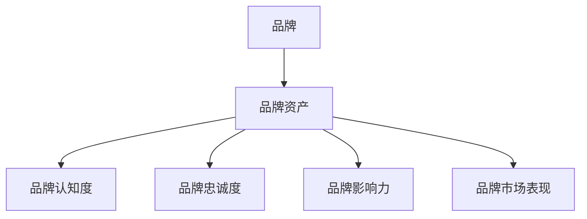
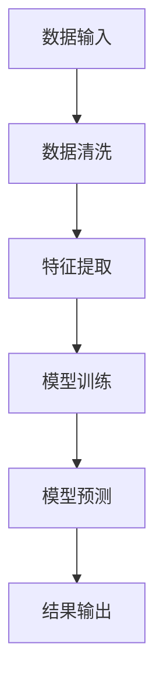
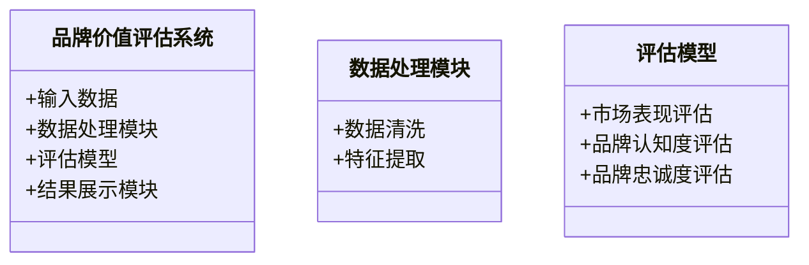

                 


# AI辅助企业品牌资产评估：多维度品牌价值量化与追踪系统

> 关键词：AI技术、品牌资产评估、多维度量化、实时追踪、机器学习、数据驱动

> 摘要：本文详细探讨了利用人工智能技术对企业的品牌价值进行多维度量化评估与实时追踪的方法。通过构建基于AI的评估系统，结合自然语言处理、深度学习和大数据分析技术，实现品牌价值的精准测量和动态监控。文章从问题背景、核心概念、算法原理到系统架构、项目实战等方面展开，提供了一套完整的解决方案，并通过实际案例分析展示了系统的应用效果。

---

# 第1章: 多维度品牌价值评估的背景与意义

## 1.1 问题背景
### 1.1.1 传统品牌评估的局限性
传统品牌评估方法依赖主观判断，难以量化品牌在不同维度的表现，且缺乏实时性和动态性。

### 1.1.2 数据驱动的评估需求
随着数字化转型的推进，企业需要基于实时数据和多维度指标来评估品牌价值。

### 1.1.3 AI技术的引入
人工智能技术（如自然语言处理、机器学习）为品牌价值的量化提供了新的可能性。

## 1.2 核心概念与定义
### 1.2.1 品牌价值的多维度分解
品牌价值可以从市场表现、品牌认知度、品牌忠诚度等多个维度进行分解。

### 1.2.2 数据驱动的品牌评估
基于大数据分析和机器学习算法，实现品牌价值的客观、量化评估。

## 1.3 问题解决思路
### 1.3.1 多维度数据整合
整合社交媒体数据、市场数据、用户行为数据等多源数据，构建品牌价值评估的综合指标体系。

### 1.3.2 AI算法的应用
利用自然语言处理技术分析文本数据，通过机器学习模型预测品牌价值。

## 1.4 本章小结
本章介绍了传统品牌评估的局限性，提出了基于AI的多维度品牌价值评估方法，并明确了数据驱动的品牌评估的核心概念。

---

# 第2章: 多维度品牌价值评估的核心概念与联系

## 2.1 核心概念的结构与组成
### 2.1.1 品牌价值的多维度分解
品牌价值可以从市场表现、品牌认知度、品牌忠诚度、品牌影响力等多个维度进行分解。

### 2.1.2 数据来源与处理
数据来源包括社交媒体数据、市场调研数据、销售数据等，需要进行清洗和特征提取。

## 2.2 核心概念的属性特征对比
### 表2-1: 不同品牌评估方法的对比分析
| 方法类型 | 优点 | 缺点 |
|----------|------|------|
| 传统评估 | 易操作 | 主观性强，缺乏量化 |
| 数据驱动 | 客观、量化 | 数据获取难度大，计算复杂 |
| AI驱动 | 高效、精准 | 对数据质量要求高 |

## 2.3 ER实体关系图


---

# 第3章: 基于AI的多维度品牌价值评估算法原理

## 3.1 算法原理概述
### 3.1.1 多维度评估模型的构建
通过整合多源数据，构建一个基于机器学习的多维度评估模型。

### 3.1.2 数据预处理与特征提取
对原始数据进行清洗、去噪，并提取关键特征（如情感得分、市场表现指数等）。

## 3.2 算法流程图


## 3.3 数学模型与公式
### 3.3.1 多维度评估模型
$$ \text{品牌价值} = w_1 \times \text{市场表现} + w_2 \times \text{品牌认知度} + w_3 \times \text{品牌忠诚度} $$
其中，$w_1, w_2, w_3$ 是通过机器学习模型训练得到的权重。

---

# 第4章: 系统架构设计与实现

## 4.1 系统架构概述
### 4.1.1 问题场景介绍
企业需要实时监控品牌在市场中的表现，并根据市场变化调整品牌策略。

## 4.2 系统功能设计
### 4.2.1 领域模型


---

# 第5章: 项目实战与案例分析

## 5.1 项目实战
### 5.1.1 环境安装
安装Python、机器学习库（如scikit-learn、TensorFlow）和数据处理工具（如Pandas）。

### 5.1.2 核心功能实现
实现数据处理模块和评估模型的代码示例：
```python
import pandas as pd
from sklearn.model import LinearRegression

# 数据预处理
data = pd.read_csv('brand_data.csv')
X = data[['市场表现', '品牌认知度', '品牌忠诚度']]
y = data['品牌价值']

# 模型训练
model = LinearRegression()
model.fit(X, y)

# 预测与输出
new_data = pd.DataFrame({'市场表现': [0.8], '品牌认知度': [0.7], '品牌忠诚度': [0.6]})
predicted_value = model.predict(new_data)
print(predicted_value)
```

---

# 第6章: 最佳实践与总结

## 6.1 最佳实践
### 6.1.1 数据质量的重要性
确保数据的准确性和完整性，避免噪声数据对模型的影响。

### 6.1.2 模型的可解释性
选择易于解释的模型，便于企业理解和调整品牌策略。

## 6.2 小结
本文详细介绍了基于AI的多维度品牌价值评估方法，从理论到实践，提供了一套完整的解决方案。

## 6.3 注意事项
- 数据隐私和安全问题需要特别注意。
- 模型需要定期更新以适应市场变化。

## 6.4 拓展阅读
推荐阅读《人工智能在市场营销中的应用》和《大数据驱动的品牌管理》。

---

# 作者：AI天才研究院 & 禅与计算机程序设计艺术

