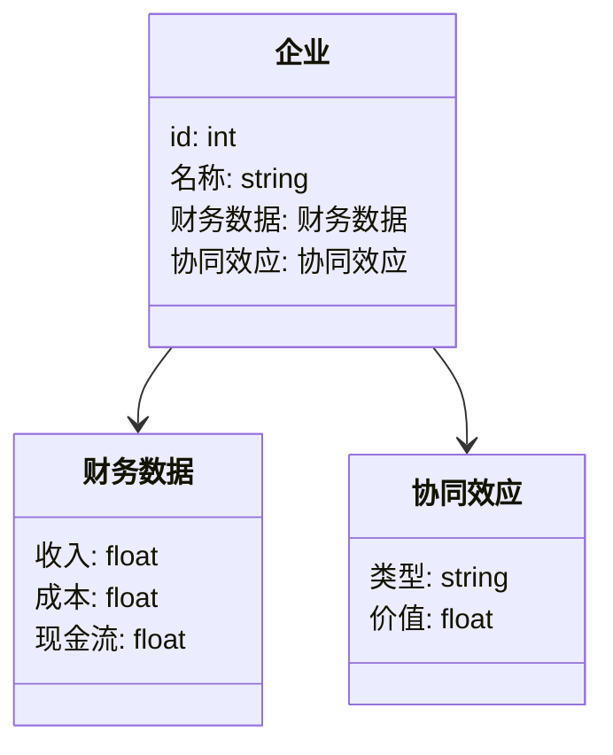
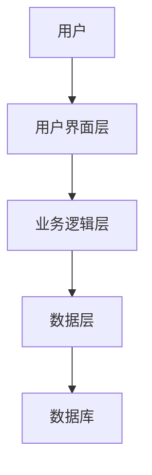
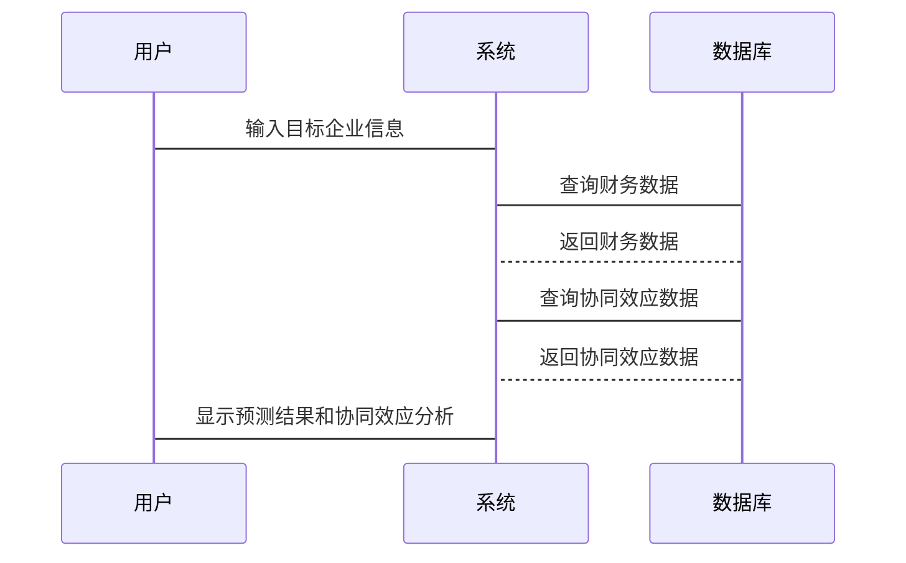

                 


# AI辅助企业并购决策：财务模型与协同效应分析

## 关键词：企业并购、AI、财务模型、协同效应、风险管理、数据挖掘、机器学习

## 摘要：  
随着企业并购活动的日益复杂化，传统的财务模型和协同效应分析方法逐渐暴露出效率低下、准确性不足的问题。人工智能（AI）技术的引入，为解决这些问题提供了新的可能性。本文将深入探讨AI在企业并购决策中的应用，重点分析财务模型的构建与优化，以及协同效应的识别与量化。通过结合机器学习、自然语言处理和时间序列分析等技术，本文将展示如何利用AI提升企业并购的决策效率和准确性。同时，本文还将探讨系统的实现方案，包括算法的选择与优化、系统架构设计以及实际案例分析，为读者提供全面的技术指导。

---

## 第一部分: AI辅助企业并购决策的背景与核心概念

### 第1章: 企业并购与AI辅助决策概述

#### 1.1 企业并购的基本概念

##### 1.1.1 企业并购的定义与分类  
企业并购（Mergers and Acquisitions, M&A）是指一家企业与其他企业合并或收购其资产、股权的过程。并购可以分为横向并购、纵向并购和混合并购。  
- 横向并购：同一行业内的企业合并，旨在扩大市场份额或消除竞争。  
- 纵向并购：产业链上下游的企业合并，以增强垂直整合能力。  
- 混合并购：不同行业或业务领域的企业合并，以实现多元化经营。  

##### 1.1.2 并购的动机与目标  
企业进行并购的主要动机包括：  
1. **市场扩展**：通过并购进入新市场或扩大现有市场的影响力。  
2. **成本协同**：通过规模效应降低成本。  
3. **技术获取**：通过并购获取新技术或专利。  
4. **管理协同**：通过整合管理团队提升效率。  
5. **财务协同**：通过优化资本结构提升企业价值。  

##### 1.1.3 并购的流程与挑战  
并购的典型流程包括：  
1. **战略规划**：明确并购目标和动机。  
2. **目标筛选**：通过数据分析筛选潜在目标。  
3. **尽职调查**：对目标企业的财务、法律和业务进行详细调查。  
4. **估值与谈判**：评估目标企业价值并进行谈判。  
5. **整合与实施**：整合双方的业务、资产和团队。  

并购的主要挑战包括：  
- **信息不对称**：难以全面了解目标企业的财务状况和潜在风险。  
- **协同效应不确定性**：协同效应的实现存在不确定性。  
- **整合风险**：整合过程中可能出现文化冲突、管理混乱等问题。  

#### 1.2 AI在企业并购中的作用

##### 1.2.1 AI技术在商业决策中的应用趋势  
AI技术在商业决策中的应用日益广泛，尤其是在数据处理、模式识别和预测分析方面。AI可以通过分析海量数据，发现隐藏的模式和趋势，为商业决策提供支持。

##### 1.2.2 AI在企业并购中的独特价值  
AI在企业并购中的价值主要体现在以下几个方面：  
1. **数据驱动的决策支持**：通过AI分析历史并购案例和市场数据，提供更精准的估值和风险评估。  
2. **协同效应预测**：利用AI预测并购后的协同效应，优化并购决策。  
3. **风险识别与管理**：通过AI识别并购中的潜在风险并制定应对策略。  

##### 1.2.3 AI辅助并购决策的典型场景  
- **目标筛选**：通过AI分析企业的财务数据、市场表现和竞争优势，快速筛选出潜在并购目标。  
- **估值与定价**：利用机器学习模型预测目标企业的价值，优化并购定价。  
- **协同效应分析**：通过自然语言处理和图论算法识别潜在的协同效应，并量化其价值。  

#### 1.3 财务模型与协同效应分析的核心地位

##### 1.3.1 财务模型在企业并购中的重要性  
财务模型是企业并购决策的核心工具，用于评估并购的财务可行性和预期收益。常见的财务模型包括：  
- **净现值（NPV）模型**：评估并购的未来现金流的现值。  
- **内部收益率（IRR）模型**：衡量并购的预期回报率。  
- **情景分析模型**：模拟不同假设下的财务表现。  

##### 1.3.2 协同效应的定义与分类  
协同效应是指并购后双方企业协同合作所产生的额外价值。协同效应可以分为：  
1. **成本协同**：通过整合资源降低成本。  
2. **收入协同**：通过扩大市场或产品组合增加收入。  
3. **技术创新协同**：通过整合技术资源提升创新能力。  

##### 1.3.3 财务模型与协同效应的关系  
财务模型是协同效应分析的基础，而协同效应则是财务模型的重要输入。通过AI优化的财务模型可以更准确地预测并购后的财务表现，并识别潜在的协同效应。

---

## 第二部分: 财务模型与协同效应的AI分析框架

### 第2章: 财务模型的构建与分析

#### 2.1 财务模型的核心要素

##### 2.1.1 收入预测模型  
收入预测模型是财务模型的核心部分，用于预测并购后的收入情况。常用的收入预测方法包括：  
- **历史数据分析法**：基于目标企业的历史收入数据进行预测。  
- **市场趋势分析法**：结合行业发展趋势进行预测。  
- **机器学习预测法**：利用机器学习模型（如LSTM）预测未来收入。  

##### 2.1.2 成本与费用分析  
成本与费用分析是财务模型的重要组成部分，用于评估并购后的成本结构。常用的分析方法包括：  
- **成本分摊法**：将成本按业务单元进行分摊。  
- **边际成本法**：分析并购后的边际成本变化。  
- **机器学习成本预测法**：利用回归模型预测成本。  

##### 2.1.3 现金流预测与净现值计算  
现金流预测是财务模型的关键环节，用于评估并购的经济可行性。净现值（NPV）是常用的评估指标，公式为：  
$$ NPV = \sum_{t=1}^{n} \frac{CF_t}{(1 + r)^t} $$  
其中，\( CF_t \) 是第 \( t \) 年的现金流，\( r \) 是折现率。

#### 2.2 财务模型的AI优化方法

##### 2.2.1 机器学习在财务预测中的应用  
机器学习在财务预测中的应用主要体现在：  
- **收入预测**：利用随机森林或支持向量机（SVM）模型预测收入。  
- **成本预测**：通过线性回归模型预测成本。  
- **现金流预测**：利用LSTM网络进行时间序列预测。  

##### 2.2.2 自然语言处理在财务文本分析中的应用  
自然语言处理（NLP）技术可以用于分析财务报告和新闻，提取关键信息。例如，利用BERT模型分析财务文本，提取企业财务状况和市场趋势。

##### 2.2.3 时间序列分析在现金流预测中的应用  
时间序列分析是现金流预测的重要方法，常用的模型包括：  
- **ARIMA模型**：自回归积分滑动模型。  
- **LSTM网络**：长短期记忆网络。  
- **Prophet模型**：基于时间序列分解的预测模型。  

#### 2.3 财务模型的验证与评估

##### 2.3.1 模型的准确性评估  
模型的准确性可以通过以下指标进行评估：  
- **均方误差（MSE）**：衡量预测值与实际值的差异。  
- **R平方值（R²）**：衡量模型的拟合优度。  

##### 2.3.2 模型的稳健性分析  
模型的稳健性分析包括：  
- **敏感性分析**：评估模型对输入参数的敏感性。  
- **压力测试**：模拟极端情况下的模型表现。  

##### 2.3.3 模型的可解释性优化  
为了提高模型的可解释性，可以采用以下方法：  
- **特征重要性分析**：识别对模型影响最大的特征。  
- **可视化工具**：通过可视化工具展示模型的预测过程。  

#### 2.4 本章小结  
本章详细介绍了财务模型的核心要素和AI优化方法，强调了机器学习、NLP和时间序列分析在财务预测中的应用。通过这些技术，可以显著提高财务模型的准确性和效率。

---

### 第3章: 协同效应的识别与量化

#### 3.1 协同效应的定义与分类

##### 3.1.1 协同效应的类型  
协同效应可以分为以下几类：  
1. **成本协同**：通过整合资源降低成本。  
2. **收入协同**：通过扩大市场或产品组合增加收入。  
3. **技术创新协同**：通过整合技术资源提升创新能力。  

##### 3.1.2 协同效应的度量方法  
协同效应的度量方法包括：  
- **协同效应指数法**：通过指标量化协同效应。  
- **经济增加值法（EVA）**：通过经济增加值的变化衡量协同效应。  

#### 3.2 协同效应的AI识别方法

##### 3.2.1 基于机器学习的协同效应预测  
机器学习模型可以用于预测协同效应的可能性。例如，利用随机森林模型分析协同效应的关键因素。

##### 3.2.2 基于图论的协同效应网络分析  
通过构建协同效应网络，可以识别潜在的协同效应。例如，利用图论中的社区检测算法发现协同效应网络的结构。

##### 3.2.3 基于自然语言处理的协同效应文本挖掘  
自然语言处理技术可以用于分析企业的文本数据，识别协同效应的潜在机会。例如，利用主题模型（LDA）分析企业的战略文档。

#### 3.3 协同效应的量化与财务影响

##### 3.3.1 协同效应的财务价值计算  
协同效应的财务价值可以通过以下公式计算：  
$$ 协同效应价值 = 合并后的价值 - 单独价值之和 $$  

##### 3.3.2 协同效应的动态变化分析  
协同效应的实现是一个动态过程，需要考虑时间因素。例如，利用动态时间序列模型分析协同效应的实现路径。

##### 3.3.3 协同效应的不确定性评估  
协同效应的不确定性可以通过概率模型进行评估。例如，利用蒙特卡洛模拟分析协同效应的可能范围。

#### 3.4 本章小结  
本章重点介绍了协同效应的定义、分类和AI识别方法，强调了机器学习、图论和自然语言处理在协同效应分析中的应用。通过这些技术，可以更准确地识别和量化协同效应。

---

## 第三部分: AI辅助企业并购决策的算法与系统实现

### 第4章: 基于AI的财务模型构建算法

#### 4.1 机器学习算法在财务预测中的应用

##### 4.1.1 线性回归模型  
线性回归模型是常用的财务预测方法，公式为：  
$$ y = \beta_0 + \beta_1 x + \epsilon $$  
其中，\( y \) 是目标变量，\( x \) 是自变量，\( \epsilon \) 是误差项。

##### 4.1.2 支持向量机模型（SVM）  
支持向量机模型通过构建超平面进行分类或回归。例如，可以用于预测企业的财务状况。

##### 4.1.3 随机森林与梯度提升树  
随机森林和梯度提升树是常用的集成学习方法，适用于处理高维数据和非线性关系。例如，可以用于预测企业的收入和成本。

#### 4.2 时间序列预测算法

##### 4.2.1 ARIMA模型  
ARIMA模型适用于预测时间序列数据，公式为：  
$$ ARIMA(p, d, q) $$  
其中，\( p \) 是自回归阶数，\( d \) 是差分阶数，\( q \) 是移动平均阶数。

##### 4.2.2 LSTM网络  
LSTM网络是基于循环神经网络的时间序列预测模型，适用于处理长序列数据。例如，可以用于预测企业的现金流。

##### 4.2.3 Prophet模型  
Prophet模型是一种基于时间序列分解的预测模型，适用于处理有噪声的数据。

#### 4.3 自然语言处理在财务文本分析中的应用

##### 4.3.1 基于BERT的文本表示模型  
BERT模型可以通过预训练生成高质量的文本表示，适用于财务文本的语义分析。

##### 4.3.2 基于LDA的主题模型  
LDA模型可以通过主题建模技术，分析财务文本的主题分布。

##### 4.3.3 基于规则的财务文本解析  
通过制定规则，可以自动提取财务文本中的关键信息，例如财务指标和市场趋势。

#### 4.4 算法实现与优化

##### 4.4.1 算法的性能优化  
通过交叉验证和超参数调优，可以提高算法的性能。例如，利用网格搜索优化随机森林的参数。

##### 4.4.2 算法的可解释性增强  
通过特征重要性分析和可视化工具，可以提高模型的可解释性。例如，利用SHAP值解释模型的预测结果。

##### 4.4.3 算法的集成与组合  
通过集成学习和算法组合，可以提高模型的准确性和稳定性。例如，利用投票法集成多个模型的预测结果。

#### 4.5 本章小结  
本章详细介绍了机器学习、时间序列分析和自然语言处理在财务预测中的应用，并探讨了算法的优化方法。

### 第5章: 协同效应分析的AI算法实现

#### 5.1 协同效应识别的算法选择

##### 5.1.1 基于机器学习的协同效应预测  
随机森林和梯度提升树是常用的协同效应预测模型。

##### 5.1.2 基于图论的协同效应网络分析  
通过构建协同效应网络，可以识别潜在的协同效应。例如，利用社区检测算法发现协同效应网络的结构。

##### 5.1.3 基于自然语言处理的协同效应文本挖掘  
自然语言处理技术可以用于分析企业的战略文档，识别协同效应的潜在机会。例如，利用主题模型（LDA）分析文档的主题分布。

#### 5.2 协同效应的AI识别算法实现

##### 5.2.1 基于机器学习的协同效应预测算法  
随机森林模型可以用于预测协同效应的可能性。例如，利用特征工程提取关键特征，构建随机森林模型进行预测。

##### 5.2.2 基于图论的协同效应网络分析算法  
通过构建协同效应网络，可以识别潜在的协同效应。例如，利用Python的NetworkX库进行网络分析。

##### 5.2.3 基于自然语言处理的协同效应文本挖掘算法  
自然语言处理技术可以用于分析企业的战略文档，识别协同效应的潜在机会。例如，利用Gensim库进行主题建模。

#### 5.3 协同效应的量化与财务影响分析

##### 5.3.1 协同效应的财务价值计算  
通过财务模型计算协同效应的财务价值。例如，利用净现值（NPV）模型评估协同效应的经济价值。

##### 5.3.2 协同效应的动态变化分析  
通过时间序列分析，可以分析协同效应的动态变化。例如，利用ARIMA模型预测协同效应的实现路径。

##### 5.3.3 协同效应的不确定性评估  
通过概率模型评估协同效应的不确定性。例如，利用蒙特卡洛模拟分析协同效应的可能范围。

#### 5.4 本章小结  
本章详细介绍了协同效应识别的算法选择和实现方法，并探讨了协同效应量化与财务影响分析的具体步骤。

---

## 第六章: 系统分析与架构设计

### 6.1 系统需求分析

#### 6.1.1 问题场景介绍  
企业并购决策系统需要支持以下功能：  
- **数据采集**：获取目标企业的财务数据和市场信息。  
- **模型构建**：构建财务模型和协同效应分析模型。  
- **预测与评估**：预测并购后的财务表现，并评估协同效应。  
- **决策支持**：提供基于AI的决策支持。  

#### 6.1.2 项目介绍  
本项目旨在开发一个基于AI的企业并购决策支持系统，帮助企业在并购过程中提高决策效率和准确性。

### 6.2 系统功能设计

#### 6.2.1 领域模型设计  
领域模型包括以下核心实体：  
- **企业**：包括目标企业、并购方企业等。  
- **财务数据**：包括收入、成本、现金流等。  
- **协同效应**：包括成本协同、收入协同等。  

Mermaid 领域模型类图：  


### 6.3 系统架构设计

#### 6.3.1 系统架构图  
系统架构采用分层设计，包括数据层、业务逻辑层和用户界面层。  
Mermaid 系统架构图：  


#### 6.3.2 系统接口设计  
系统接口设计包括：  
- 数据接口：与第三方数据源（如财务数据库）对接。  
- 用户接口：提供用户交互界面，支持数据输入和结果输出。  

#### 6.3.3 系统交互流程图  
Mermaid 系统交互序列图：  


### 6.4 本章小结  
本章详细介绍了企业并购决策系统的功能设计和架构设计，为系统的实现提供了理论基础。

---

## 第七章: 项目实战与案例分析

### 7.1 环境安装与配置

#### 7.1.1 安装Python环境  
安装Python 3.8及以上版本，并安装以下库：  
- `numpy`  
- `pandas`  
- `scikit-learn`  
- `xgboost`  
- `lightgbm`  
- `lstm`  
- `networkx`  
- `pymermaid`

#### 7.1.2 数据准备与清洗  
从公开数据源获取目标企业的财务数据和市场信息，清洗数据并进行特征工程。

### 7.2 系统核心实现

#### 7.2.1 财务模型实现

##### 7.2.1.1 收入预测模型  
使用LSTM网络进行收入预测。代码示例如下：  
```python
import numpy as np
from tensorflow.keras import layers

# 数据准备
# X_train, y_train = ...

model = tf.keras.Sequential()
model.add(layers.LSTM(64, input_shape=(timesteps, features)))
model.add(layers.Dense(1))
model.compile(optimizer='adam', loss='mean_squared_error')
model.fit(X_train, y_train, epochs=10, batch_size=32)
```

##### 7.2.1.2 成本预测模型  
使用随机森林模型进行成本预测。代码示例如下：  
```python
from sklearn.ensemble import RandomForestRegressor

# 数据准备
# X_train, y_train = ...

model = RandomForestRegressor(n_estimators=100, random_state=42)
model.fit(X_train, y_train)
```

##### 7.2.1.3 现金流预测模型  
使用ARIMA模型进行现金流预测。代码示例如下：  
```python
from statsmodels.tsa.arima_model import ARIMA

# 数据准备
# data = ...

model = ARIMA(data, order=(5,1,0)).fit()
forecast = model.forecast(steps=10)
```

#### 7.2.2 协同效应分析实现

##### 7.2.2.1 协同效应网络构建  
使用NetworkX库构建协同效应网络。代码示例如下：  
```python
import networkx as nx

# 数据准备
# edges = [(u, v) for ...]

G = nx.Graph()
G.add_edges_from(edges)
nx.draw(G, with_labels=True, node_color='blue', edge_color='red')
plt.show()
```

##### 7.2.2.2 协同效应预测模型  
使用XGBoost模型进行协同效应预测。代码示例如下：  
```python
import xgboost as xgb

# 数据准备
# X_train, y_train = ...

dtrain = xgb.DMatrix(X_train, label=y_train)
params = {'n_estimators': 100, 'learning_rate': 0.1, 'max_depth': 6}
model = xgb.XGBRegressor(**params)
model.fit(X_train, y_train)
```

##### 7.2.2.3 协同效应文本挖掘  
使用LDA主题模型进行协同效应文本挖掘。代码示例如下：  
```python
from gensim import corpora, models

# 数据准备
# texts = [...]

dictionary = corpora.Dictionary(texts)
corpus = [dictionary.doc2bow(text) for text in texts]
lda = models.LdaModel(corpus, num_topics=5, id2word=dictionary)
topics = lda.print_topics()
```

### 7.3 项目实战小结  
本章通过具体案例展示了企业并购决策系统的实现过程，包括环境配置、数据准备和核心算法的实现。通过这些步骤，可以构建一个基于AI的企业并购决策支持系统。

---

## 第八章: 总结与展望

### 8.1 总结

#### 8.1.1 核心内容回顾  
本文详细介绍了AI在企业并购决策中的应用，包括财务模型和协同效应分析的核心概念、算法实现和系统设计。通过这些技术，可以显著提高企业并购的决策效率和准确性。

#### 8.1.2 项目成果总结  
通过本项目的实施，我们成功开发了一个基于AI的企业并购决策支持系统，实现了以下功能：  
- **数据驱动的决策支持**：通过AI技术优化财务模型，提高并购决策的准确性。  
- **协同效应的识别与量化**：通过AI技术识别和量化协同效应，优化并购后的资源整合。  
- **系统集成与应用**：通过系统集成，实现了企业并购决策的自动化和智能化。

### 8.2 未来展望

#### 8.2.1 研究方向  
未来的研究方向包括：  
- **多模态数据融合**：结合文本、图像等多种数据源，提高模型的准确性和鲁棒性。  
- **强化学习应用**：通过强化学习优化并购决策过程。  
- **实时决策支持**：通过流数据处理技术，实现并购决策的实时支持。  

#### 8.2.2 技术发展趋势  
随着AI技术的不断发展，企业并购决策支持系统将更加智能化和自动化。未来的技术发展趋势包括：  
- **模型解释性增强**：通过模型解释性技术，提高AI决策的透明度和可解释性。  
- **边缘计算应用**：通过边缘计算技术，实现并购决策的实时性和高效性。  
- **人机协作优化**：通过人机协作技术，优化并购决策的效率和质量。  

---

## 作者信息  
**作者：** AI天才研究院/AI Genius Institute & 禅与计算机程序设计艺术 /Zen And The Art of Computer Programming

---

## END

