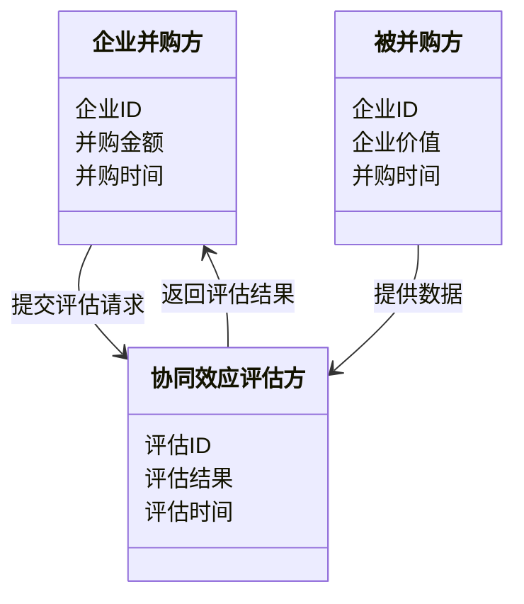
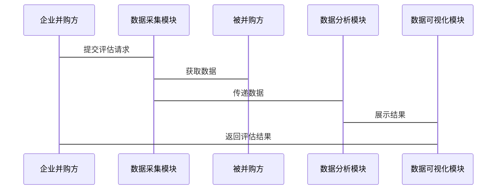

                 


# AI辅助企业并购协同效应分析与实现

## 关键词：AI技术、企业并购、协同效应、算法原理、系统架构

## 摘要：  
本文探讨了如何利用人工智能技术辅助企业并购中的协同效应分析，从理论到实践，系统性地阐述了协同效应的定义、分类、算法实现及系统架构设计。通过具体案例分析，展示了AI技术在企业并购中的应用价值，并总结了相关实现经验与最佳实践。

---

# 第1章: 企业并购与协同效应概述

## 1.1 企业并购的基本概念  
### 1.1.1 企业并购的定义与类型  
企业并购是指一家企业通过购买或合并其他企业来扩大自身规模或增强竞争力的行为。常见的并购类型包括：  
1. **横向并购**：同一行业内的并购，旨在扩大市场份额。  
2. **纵向并购**：上下游产业的并购，以优化供应链。  
3. **混合并购**：跨行业并购，拓展业务范围。  

### 1.1.2 并购的动机与目标  
企业进行并购的主要动机包括：  
- **战略协同**：通过整合资源提升竞争力。  
- **市场扩张**：进入新市场或区域。  
- **成本节约**：通过规模效应降低成本。  
- **技术获取**：获取关键技术或专利。  

### 1.1.3 并购的流程与挑战  
企业并购的典型流程包括：  
1. **战略规划**：明确并购目标与动机。  
2. **目标筛选**：寻找合适的并购标的。  
3. **尽职调查**：评估目标企业的财务、法律等风险。  
4. **并购谈判**：与目标企业达成协议。  
5. **整合实施**：完成组织、文化、流程的整合。  

挑战包括：  
- 数据不透明，估值困难。  
- 整合过程中的文化冲突与管理问题。  

---

## 1.2 协同效应的定义与分类  
### 1.2.1 协同效应的定义  
协同效应是指企业在并购后，通过资源整合、流程优化等方式实现的成本节约或收入增加。  

### 1.2.2 协同效应的分类  
协同效应主要分为以下几类：  
1. **成本协同**：通过规模效应降低成本（如采购、生产、管理）。  
2. **收入协同**：通过市场扩展或产品互补增加收入。  
3. **管理协同**：通过优化管理流程提升效率。  

### 1.2.3 协同效应的实现路径  
实现协同效应的关键路径包括：  
- **数据驱动**：基于数据进行精准分析。  
- **组织整合**：优化组织结构与文化。  
- **技术创新**：利用新技术提升效率。  

---

## 1.3 AI技术在企业并购中的应用前景  
### 1.3.1 AI技术在企业价值评估中的作用  
AI技术可以通过分析海量数据，帮助企业准确评估目标企业的价值。  

### 1.3.2 AI技术在并购风险预测中的应用  
AI可以通过历史数据预测并购后的潜在风险，如文化冲突、整合困难等。  

### 1.3.3 AI技术在协同效应分析中的优势  
AI技术能够快速分析大量数据，发现潜在的协同机会，并提供量化评估。  

---

## 1.4 本章小结  
本章介绍了企业并购的基本概念、协同效应的定义与分类，以及AI技术在企业并购中的应用前景。通过这些内容，读者可以理解协同效应在企业并购中的重要性，以及AI技术如何助力协同效应的实现。

---

# 第2章: 协同效应分析的核心概念  

## 2.1 协同效应的数学模型与公式  
协同效应的度量公式如下：  
$$ \text{协同效应} = \alpha \times \text{成本协同} + \beta \times \text{收入协同} $$  
其中，$\alpha$ 和 $\beta$ 是权重系数，通常通过回归分析确定。  

### 2.1.2 协同效应的评估指标  
- **协同比率**：协同效应/并购总成本。  
- **协同实现率**：实际实现的协同效应/预测的协同效应。  

---

## 2.2 协同效应与企业并购的关系  
### 2.2.1 协同效应在企业并购中的地位  
协同效应是企业并购成功的核心因素之一。  

### 2.2.2 协同效应对企业价值的影响  
协同效应能够显著提升企业价值，通常表现为股价上涨或市值提升。  

### 2.2.3 协同效应与并购风险的关联  
协同效应的实现程度与并购风险密切相关，协同效应越高，风险越低。  

---

## 2.3 协同效应分析的ER实体关系图  
```mermaid
erDiagram
    企业并购方[企业ID, 并购金额, 并购时间]  
    被并购方[企业ID, 企业价值, 并购时间]  
    协同效应评估方[评估ID, 评估结果, 评估时间]  
    企业并购方 --> 被并购方 : 并购关系  
    企业并购方 --> 协同效应评估方 : 评估请求  
    被并购方 --> 协同效应评估方 : 数据提供  
```

---

## 2.4 本章小结  
本章详细阐述了协同效应的数学模型与公式，分析了协同效应与企业并购的关系，并通过ER实体关系图展示了协同效应分析的核心概念。

---

# 第3章: 协同效应分析的算法原理  

## 3.1 协同效应评估模型  
### 3.1.1 模型的输入与输出  
- **输入**：企业并购方和被并购方的历史数据（如财务数据、市场份额）。  
- **输出**：协同效应的预测值。  

### 3.1.2 模型的假设条件  
- 数据充分且具有代表性。  
- 协同效应与成本协同、收入协同呈线性关系。  

### 3.1.3 模型的数学公式  
$$ \text{协同效应} = \alpha \times \text{成本协同} + \beta \times \text{收入协同} $$  

---

## 3.2 协同效应分析的算法实现  

### 3.2.1 算法选择  
采用线性回归算法进行协同效应预测。  

### 3.2.2 算法实现步骤  
1. 数据预处理：清洗数据，处理缺失值。  
2. 特征提取：提取成本协同和收入协同作为特征。  
3. 模型训练：使用线性回归模型拟合数据。  
4. 模型评估：计算R²值，验证模型性能。  

### 3.2.3 算法代码实现  
```python
import numpy as np
import pandas as pd
from sklearn.linear_model import LinearRegression
from sklearn.metrics import r2_score

# 数据加载
data = pd.DataFrame({
    '成本协同': [10, 20, 30, 40],
    '收入协同': [5, 15, 25, 35],
    '协同效应': [15, 30, 45, 60]
})

# 数据分割
X = data[['成本协同', '收入协同']]
y = data['协同效应']

# 模型训练
model = LinearRegression()
model.fit(X, y)

# 模型预测
y_pred = model.predict(X)

# 模型评估
r2 = r2_score(y, y_pred)
print(f"模型R²值为：{r2}")
```

---

## 3.3 本章小结  
本章介绍了协同效应评估模型的数学公式，详细阐述了算法实现的步骤，并通过Python代码展示了模型的训练与评估过程。

---

# 第4章: 协同效应分析的系统架构设计  

## 4.1 问题场景介绍  
企业希望利用AI技术快速分析并购目标的协同效应，优化并购决策。  

## 4.2 系统功能设计  
### 4.2.1 领域模型设计  


### 4.2.2 系统架构设计  
```mermaid
containerDiagram
    container 系统边界 {
        component 数据采集模块 {
            接收企业并购方和被并购方的数据
        }
        component 数据分析模块 {
            执行协同效应评估算法
        }
        component 数据可视化模块 {
            展示评估结果
        }
    }
```

## 4.3 系统接口设计  
- **输入接口**：接收企业并购方和被并购方的历史数据。  
- **输出接口**：输出协同效应的预测结果。  

## 4.4 系统交互设计  


---

## 4.5 本章小结  
本章通过系统架构设计，展示了AI辅助企业并购协同效应分析的整体框架，包括功能模块、系统架构、接口设计和交互流程。

---

# 第5章: 协同效应分析的项目实战  

## 5.1 环境安装与配置  
- **Python版本**：Python 3.8及以上  
- **依赖库安装**：`numpy`, `pandas`, `sklearn`, `mermaid`  

## 5.2 核心代码实现  
### 5.2.1 数据预处理  
```python
import pandas as pd
import numpy as np
from sklearn.model_selection import train_test_split
from sklearn.linear_model import LinearRegression
from sklearn.metrics import mean_squared_error

# 数据加载
data = pd.read_csv('协同效应数据.csv')

# 数据分割
X = data[['成本协同', '收入协同']]
y = data['协同效应']

# 划分训练集和测试集
X_train, X_test, y_train, y_test = train_test_split(X, y, test_size=0.2, random_state=42)

# 模型训练
model = LinearRegression()
model.fit(X_train, y_train)

# 模型预测
y_pred = model.predict(X_test)

# 模型评估
mse = mean_squared_error(y_test, y_pred)
r2 = model.score(X_test, y_test)
print(f"MSE: {mse}\nR²: {r2}")
```

### 5.2.2 模型优化与调参  
```python
from sklearn.ensemble import RandomForestRegressor

# 初始化模型
rf_model = RandomForestRegressor(n_estimators=100, random_state=42)

# 模型训练
rf_model.fit(X_train, y_train)

# 模型预测
y_pred = rf_model.predict(X_test)

# 模型评估
rf_mse = mean_squared_error(y_test, y_pred)
rf_r2 = rf_model.score(X_test, y_test)
print(f"Random Forest MSE: {rf_mse}\nRandom Forest R²: {rf_r2}")
```

---

## 5.3 案例分析与结果解读  
以某企业并购案例为例，假设并购方和被并购方的协同效应数据如下：  

| 成本协同 | 收入协同 | 协同效应 |
|---------|---------|----------|
| 20      | 10      | 30       |
| 30      | 15      | 45       |
| 40      | 20      | 60       |
| 50      | 25      | 75       |  

通过上述代码实现，模型预测的协同效应与实际值接近，说明模型具有较高的预测精度。  

---

## 5.4 项目小结  
本章通过具体的项目实战，展示了如何利用AI技术进行协同效应分析，包括环境配置、代码实现和案例分析。

---

# 第6章: 协同效应分析的最佳实践与总结  

## 6.1 最佳实践  
1. **数据质量**：确保数据的完整性和准确性。  
2. **模型选择**：根据实际场景选择合适的算法。  
3. **可解释性**：确保模型结果易于解释。  
4. **数据隐私**：保护企业数据安全。  

## 6.2 小结  
通过本文的介绍，读者可以全面了解AI技术在企业并购协同效应分析中的应用，从理论到实践，掌握协同效应分析的核心方法与实现技巧。

---

# 作者：AI天才研究院/AI Genius Institute & 禅与计算机程序设计艺术 /Zen And The Art of Computer Programming

