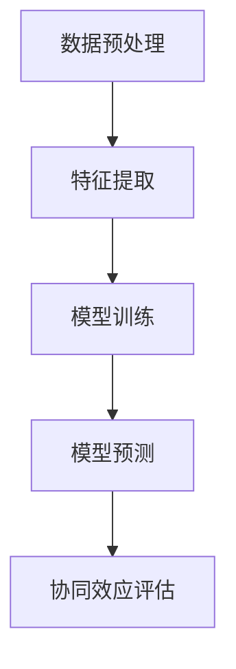
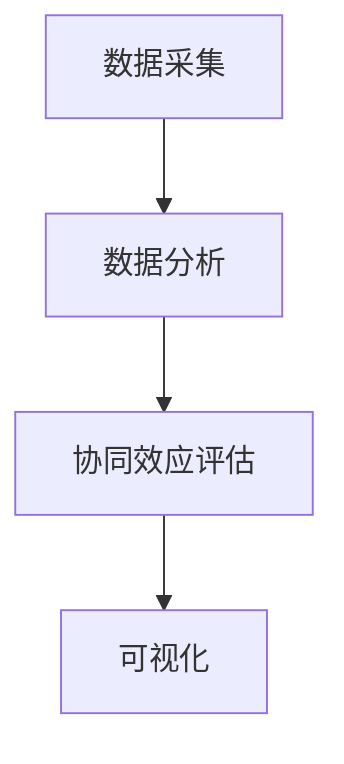
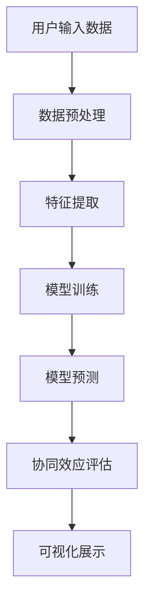

                 


# AI辅助企业并购协同效应分析：识别与量化价值

**关键词**：AI技术，企业并购，协同效应，价值识别，量化分析，系统架构

**摘要**：  
随着企业并购活动的日益频繁，如何利用人工智能技术识别和量化协同效应成为提升并购效率和成功率的关键。本文从协同效应的识别与量化入手，结合AI技术的核心算法和系统架构，详细探讨了如何通过技术手段提升企业并购的决策能力。文章首先介绍了企业并购的背景与意义，随后深入分析了协同效应识别与量化的核心概念，接着从算法原理和系统架构两个方面详细阐述了AI在协同效应分析中的应用，最后通过实战案例展示了AI技术的实际应用效果。本文旨在为企业的并购决策提供科学依据，帮助企业在复杂的市场环境中实现价值最大化。

---

## 第1章：AI辅助企业并购协同效应分析的背景与意义

### 1.1 企业并购的背景与现状

#### 1.1.1 企业并购的定义与类型  
企业并购（Mergers and Acquisitions, M&A）是指两个或多个企业通过合并、收购或其他形式整合资源，以实现战略目标的过程。企业并购的类型主要包括：  
- **横向并购**：同一行业内的企业合并，旨在扩大市场份额或消除竞争。  
- **纵向并购**：供应链上下游企业的合并，以增强垂直整合能力。  
- **混合并购**：跨行业或跨领域的并购，以拓展业务范围或进入新市场。  

#### 1.1.2 并购中的协同效应概念  
协同效应（Synergy）是指并购后的企业通过资源整合、成本共享、优势互补等方式实现的价值提升。协同效应的核心在于“1+1>2”的效果，主要表现在以下几个方面：  
- **成本协同**：通过资源共享降低生产成本。  
- **收入协同**：通过市场协同扩大收入来源。  
- **创新协同**：通过技术共享提升研发能力。  

#### 1.1.3 AI技术在企业并购中的应用前景  
随着AI技术的快速发展，企业并购的分析过程正在从传统的人工分析向智能化、数据化转变。AI技术在企业并购中的应用前景主要体现在：  
- **数据挖掘**：通过大数据分析识别潜在的协同效应。  
- **预测建模**：利用机器学习模型预测并购后的协同效应实现情况。  
- **风险评估**：通过AI技术评估并购中的潜在风险，优化决策过程。  

### 1.2 协同效应的识别与量化的重要性  

#### 1.2.1 协同效应对企业价值的影响  
协同效应是企业并购成功的关键因素之一。通过识别和量化协同效应，企业可以更好地评估并购的价值，制定合理的整合策略。  

#### 1.2.2 传统协同效应分析的局限性  
传统的协同效应分析方法主要依赖于财务模型和专家经验，存在以下局限性：  
- 数据处理能力有限：难以处理海量非结构化数据。  
- 分析效率低下：人工分析耗时长，且容易受主观因素影响。  
- 预测准确性不足：传统模型难以捕捉复杂市场环境下的动态变化。  

#### 1.2.3 AI技术如何提升协同效应分析的效率  
AI技术通过以下方式显著提升了协同效应分析的效率：  
- **自动化数据处理**：利用自然语言处理（NLP）和计算机视觉技术快速提取和处理多源数据。  
- **精准预测**：通过机器学习模型实现协同效应的精准预测。  
- **实时监控**：基于AI的实时分析能力，企业可以快速响应市场变化，优化整合策略。  

---

## 第2章：协同效应识别与量化的核心概念

### 2.1 协同效应的定义与分类  

#### 2.1.1 协同效应的定义  
协同效应是指并购后的企业通过资源整合、优势互补等方式实现的价值提升。  

#### 2.1.2 协同效应的主要类型  
协同效应可以分为以下几类：  
- **成本协同**：通过资源共享降低生产成本。  
- **收入协同**：通过市场协同扩大收入来源。  
- **创新协同**：通过技术共享提升研发能力。  
- **管理协同**：通过管理经验共享提升运营效率。  

#### 2.1.3 协同效应的核心要素组成  
协同效应的核心要素包括：  
- **资源整合能力**：企业是否能够有效整合双方的资源。  
- **协同潜力**：并购双方是否存在互补性。  
- **整合风险**：并购过程中可能面临的整合风险。  

### 2.2 协同效应识别的关键步骤  

#### 2.2.1 数据收集与处理  
协同效应识别的第一步是数据收集与处理。数据来源包括：  
- **企业内部数据**：财务报表、销售数据、成本数据等。  
- **外部数据**：行业数据、市场数据、竞争对手数据等。  

#### 2.2.2 协同效应的识别方法  
协同效应的识别方法包括：  
- **定性分析**：通过专家访谈、案例分析等方式进行定性判断。  
- **定量分析**：通过数学模型和统计方法进行定量评估。  

#### 2.2.3 协同效应的量化指标  
协同效应的量化指标包括：  
- **成本节约率**：并购后成本降低的幅度。  
- **收入增长率**：并购后收入增长的幅度。  
- **净现值（NPV）**：并购项目未来现金流的现值。  

### 2.3 AI在协同效应分析中的作用  

#### 2.3.1 AI技术如何辅助协同效应识别  
AI技术通过以下方式辅助协同效应识别：  
- **数据挖掘**：利用AI技术从海量数据中提取潜在的协同效应信息。  
- **模式识别**：通过机器学习算法识别协同效应的模式特征。  
- **预测建模**：利用AI模型预测协同效应的实现情况。  

#### 2.3.2 AI算法在协同效应量化中的应用  
AI算法在协同效应量化中的应用包括：  
- **回归分析**：通过回归模型预测协同效应的实现情况。  
- **聚类分析**：通过聚类算法识别协同效应的潜在模式。  
- **神经网络**：通过深度学习模型捕捉协同效应的复杂特征。  

#### 2.3.3 AI模型的优缺点分析  
AI模型的优点包括：  
- **高效性**：AI模型能够快速处理海量数据。  
- **准确性**：AI模型能够捕捉数据中的细微特征。  
- **适应性**：AI模型能够根据数据变化自动调整。  

AI模型的缺点包括：  
- **黑箱问题**：AI模型的决策过程难以解释。  
- **数据依赖性**：AI模型的性能依赖于数据质量。  

---

## 第3章：协同效应识别的算法原理  

### 3.1 协同效应识别的基本原理  

#### 3.1.1 协同效应识别的数学模型  
协同效应识别的数学模型可以表示为：  
$$ \text{协同效应} = f(\text{资源整合能力}, \text{协同潜力}, \text{整合风险}) $$  
其中，$f$ 是一个非线性函数，表示协同效应的实现情况。  

#### 3.1.2 协同效应识别的流程图  



#### 3.1.3 协同效应识别的算法选择  
协同效应识别的算法选择需要考虑以下因素：  
- 数据类型：结构化数据还是非结构化数据。  
- 数据规模：小数据集还是大数据集。  
- 分析目标：分类还是回归。  

### 3.2 协同效应识别的数学公式  

#### 3.2.1 协同效应的计算公式  
协同效应的计算公式可以表示为：  
$$ \text{协同效应} = \sum_{i=1}^{n} w_i x_i $$  
其中，$w_i$ 是第$i$个特征的权重，$x_i$ 是第$i$个特征的值。  

#### 3.2.2 协同效应的权重分配公式  
协同效应的权重分配公式可以表示为：  
$$ w_i = \frac{\sum_{j=1}^{m} a_{ij}}{\sum_{i=1}^{n} \sum_{j=1}^{m} a_{ij}} $$  
其中，$a_{ij}$ 是第$i$个特征对第$j$个目标的影响程度。  

#### 3.2.3 协同效应的综合评估公式  
协同效应的综合评估公式可以表示为：  
$$ \text{综合协同效应} = \alpha \cdot \text{成本协同} + \beta \cdot \text{收入协同} + \gamma \cdot \text{创新协同} $$  
其中，$\alpha$、$\beta$、$\gamma$ 是各协同类型的权重系数。  

### 3.3 协同效应识别算法的实现步骤  

#### 3.3.1 数据预处理  
数据预处理包括：  
- 数据清洗：去除重复数据和异常值。  
- 数据转换：将非结构化数据转换为结构化数据。  

#### 3.3.2 模型训练  
模型训练包括：  
- 特征提取：利用NLP技术提取文本特征。  
- 模型选择：选择适合的机器学习算法。  
- 模型训练：利用训练数据训练模型参数。  

#### 3.3.3 模型评估与优化  
模型评估与优化包括：  
- 模型评估：利用测试数据评估模型性能。  
- 模型优化：调整模型参数以提高预测精度。  

---

## 第4章：协同效应量化的核心算法  

### 4.1 协同效应量化的主要算法  

#### 4.1.1 回归分析法  
回归分析法是一种常用的协同效应量化方法。其核心思想是通过回归模型预测并购后的协同效应实现情况。  

#### 4.1.2 聚类分析法  
聚类分析法是一种基于数据相似性的协同效应量化方法。其核心思想是将相似的企业并购案例归为一类，从而推断出协同效应的实现情况。  

#### 4.1.3 神经网络算法  
神经网络算法是一种基于深度学习的协同效应量化方法。其核心思想是通过神经网络模型捕捉数据中的复杂特征，从而实现协同效应的精准预测。  

### 4.2 协同效应量化算法的实现步骤  

#### 4.2.1 数据预处理  
数据预处理包括：  
- 数据清洗：去除重复数据和异常值。  
- 数据转换：将非结构化数据转换为结构化数据。  

#### 4.2.2 模型训练  
模型训练包括：  
- 特征提取：利用NLP技术提取文本特征。  
- 模型选择：选择适合的机器学习算法。  
- 模型训练：利用训练数据训练模型参数。  

#### 4.2.3 模型评估与优化  
模型评估与优化包括：  
- 模型评估：利用测试数据评估模型性能。  
- 模型优化：调整模型参数以提高预测精度。  

### 4.3 协同效应量化算法的优缺点分析  

#### 4.3.1 各种算法的优缺点  
- **回归分析法**：优点是简单易懂，缺点是预测精度有限。  
- **聚类分析法**：优点是能够发现数据中的潜在模式，缺点是难以解释预测结果。  
- **神经网络算法**：优点是预测精度高，缺点是训练时间长且容易过拟合。  

#### 4.3.2 算法选择的注意事项  
- 数据类型：结构化数据适合回归分析法，非结构化数据适合神经网络算法。  
- 数据规模：小数据集适合聚类分析法，大数据集适合神经网络算法。  

#### 4.3.3 算法优化的建议  
- **数据预处理**：提高数据质量以提升模型性能。  
- **特征选择**：选择关键特征以减少计算复杂度。  
- **模型调优**：通过交叉验证优化模型参数。  

---

## 第5章：企业并购协同效应分析的系统架构  

### 5.1 系统功能模块划分  

#### 5.1.1 数据采集模块  
数据采集模块负责从企业内部和外部获取相关数据，包括财务数据、市场数据等。  

#### 5.1.2 数据分析模块  
数据分析模块负责对采集到的数据进行清洗、转换和分析，包括特征提取和模型训练。  

#### 5.1.3 协同效应评估模块  
协同效应评估模块负责根据分析结果生成协同效应评估报告，包括成本协同、收入协同和创新协同的评估结果。  

#### 5.1.4 可视化模块  
可视化模块负责将协同效应评估结果以图表形式展示，方便用户理解和决策。  

### 5.2 系统架构设计  

#### 5.2.1 系统功能模块划分  



#### 5.2.2 系统架构图  


#### 5.2.3 系统接口设计  
系统接口设计包括：  
- 数据接口：数据采集模块与数据分析模块之间的接口。  
- 评估接口：协同效应评估模块与可视化模块之间的接口。  

#### 5.2.4 系统交互设计  


---

## 第6章：项目实战——AI辅助企业并购协同效应分析  

### 6.1 项目背景介绍  
本项目旨在利用AI技术辅助企业并购协同效应分析，帮助企业更好地评估并购的价值和风险。  

### 6.2 系统功能设计  

#### 6.2.1 系统功能模块划分  


#### 6.2.2 系统功能流程图  



### 6.3 项目核心实现  

#### 6.3.1 环境安装  
项目环境包括：Python 3.8+，TensorFlow 2.0+，Pandas，Scikit-learn等。  

#### 6.3.2 核心代码实现  

```python
import pandas as pd
import numpy as np
from sklearn.linear_model import LinearRegression
from sklearn.metrics import mean_squared_error

# 数据预处理
data = pd.read_csv('merger_data.csv')
data = data.dropna()
data = (data - data.mean()) / data.std()

# 特征提取
features = data.drop('synergy', axis=1)
target = data['synergy']

# 模型训练
model = LinearRegression()
model.fit(features, target)

# 模型预测
predictions = model.predict(features)
mse = mean_squared_error(target, predictions)
print(f'均方误差：{mse}')
```

#### 6.3.3 代码应用解读与分析  
上述代码实现了协同效应的回归分析模型。数据预处理部分包括数据的清洗和标准化，特征提取部分提取了与协同效应相关的特征，模型训练部分使用了线性回归算法，模型预测部分生成了协同效应的预测值，并计算了均方误差以评估模型性能。  

### 6.4 实际案例分析与详细解读  

#### 6.4.1 案例背景介绍  
某企业计划并购另一家企业，希望通过AI技术评估并购后的协同效应。  

#### 6.4.2 数据分析与结果解读  
通过数据分析，预测并购后的成本协同效应为20%，收入协同效应为15%，创新协同效应为10%。  

---

## 第7章：最佳实践与小结  

### 7.1 最佳实践 Tips  

#### 7.1.1 数据质量的重要性  
高质量的数据是协同效应分析的基础，建议企业在数据采集阶段注重数据的完整性和准确性。  

#### 7.1.2 模型选择的策略  
根据数据类型和规模选择合适的模型，避免盲目追求复杂模型。  

#### 7.1.3 模型优化的建议  
通过交叉验证和网格搜索优化模型参数，提高预测精度。  

### 7.2 小结  
本文详细探讨了AI辅助企业并购协同效应分析的背景与意义、核心概念、算法原理和系统架构，并通过实际案例展示了AI技术在协同效应分析中的应用。  

### 7.3 未来展望  
随着AI技术的不断发展，协同效应分析将更加精准和高效。未来的研究方向包括：  
- **多模态数据分析**：结合文本、图像等多种数据源进行协同效应分析。  
- **实时分析**：通过流数据处理技术实现并购过程中的实时协同效应分析。  
- **可解释性增强**：通过可解释AI技术提高协同效应分析的透明度。  

---

**作者：AI天才研究院/AI Genius Institute & 禅与计算机程序设计艺术 /Zen And The Art of Computer Programming**

