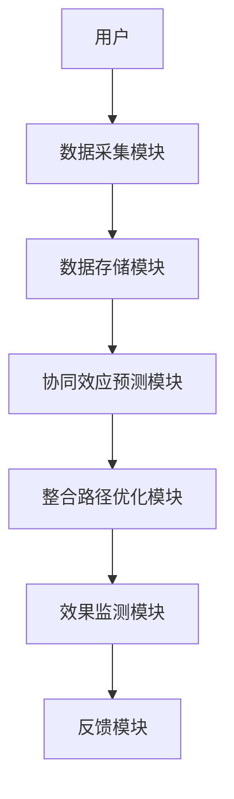
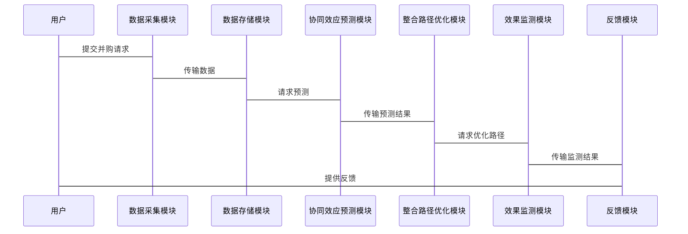

                 

# AI辅助企业并购协同效应实现：整合路径规划与效果监测

## 关键词：企业并购、协同效应、AI辅助、整合路径、效果监测

## 摘要：本文详细探讨了如何利用人工智能技术辅助企业并购中的协同效应实现，包括整合路径的规划与效果监测。通过理论分析、算法设计、系统架构和实际案例的结合，本文为读者提供了从理论到实践的全面指导，展示了AI技术在优化企业并购协同效应中的巨大潜力。

---

# 第一部分：企业并购与协同效应概述

## 第1章：企业并购与协同效应的基本概念

### 1.1 企业并购的基本概念

#### 1.1.1 企业并购的定义与类型
企业并购（Mergers and Acquisitions，M&A）是指一家企业与其他企业合并或收购其资产或股份的行为。根据并购的主体和目的，企业并购可以分为横向并购、纵向并购和混合并购。横向并购是指同一行业内的企业合并，旨在扩大市场份额；纵向并购是指供应链上下游的企业合并，以优化生产流程；混合并购则是指不同行业之间的企业合并，寻求多元化发展。

#### 1.1.2 协同效应的定义与分类
协同效应（Synergy）是指在企业并购后，由于资源优化配置、效率提升等原因，企业整体价值超过并购前两家企业价值之和的现象。协同效应可以分为财务协同效应、战略协同效应和运营协同效应。财务协同效应主要体现在成本节约和价值提升；战略协同效应体现在企业战略目标的互补性；运营协同效应则体现在生产效率和管理效率的提升。

#### 1.1.3 协同效应在企业并购中的重要性
协同效应是企业并购成功的关键因素之一。通过实现协同效应，企业可以降低成本、提高效率、增强市场竞争力，从而实现更高的投资回报。然而，协同效应的实现需要精确的整合路径规划和有效的效果监测。

---

### 1.2 AI技术与企业并购的结合

#### 1.2.1 AI技术在企业并购中的应用场景
人工智能技术在企业并购中的应用主要体现在以下几个方面：  
1. **并购目标筛选**：通过自然语言处理和数据分析技术，筛选出符合企业战略目标的潜在并购目标。  
2. **协同效应预测**：利用机器学习模型预测并购后的协同效应，评估并购的可行性和潜在价值。  
3. **整合路径优化**：通过AI技术优化并购后的整合路径，确保资源整合的高效性和协同效应的最大化。

#### 1.2.2 协同效应实现的AI辅助路径
AI技术可以通过以下步骤辅助协同效应的实现：  
1. **数据收集与分析**：收集并购双方的财务数据、运营数据和市场数据，进行深入分析。  
2. **协同效应预测模型构建**：基于机器学习算法，构建协同效应预测模型，评估并购后的潜在协同效应。  
3. **整合路径规划**：根据预测结果，制定最优的整合路径，确保协同效应的实现。  

#### 1.2.3 企业并购中的数据驱动决策
在企业并购中，数据驱动决策是实现协同效应的重要手段。通过AI技术，企业可以利用大数据分析潜在并购目标的市场表现、财务状况和竞争优势，从而做出更加科学的决策。

---

## 第2章：协同效应的理论基础与实现路径

### 2.1 协同效应的理论模型

#### 2.1.1 协同效应的构成要素
协同效应的实现需要多个要素的共同作用：  
1. **战略一致性**：并购双方的战略目标需要一致，才能实现协同效应。  
2. **资源整合效率**：资源整合的效率直接影响协同效应的实现程度。  
3. **组织文化融合**：组织文化的融合是实现协同效应的重要前提。

#### 2.1.2 协同效应的实现机制
协同效应的实现机制主要包括以下步骤：  
1. **目标识别与评估**：识别潜在的协同效应来源，并对其潜力进行评估。  
2. **整合规划与实施**：制定整合计划，并组织实施。  
3. **效果监测与优化**：持续监测协同效应的实现情况，并根据反馈进行优化。

#### 2.1.3 协同效应的度量方法
协同效应的度量方法主要包括以下几种：  
1. **财务指标法**：通过财务指标如成本节约、收入增长等来度量协同效应。  
2. **市场表现法**：通过并购后的市场表现来评估协同效应。  
3. **主观评估法**：通过管理层的主观评估来度量协同效应。

### 2.2 企业并购中的协同效应类型

#### 2.2.1 财务协同效应
财务协同效应是指并购后企业通过资源整合实现的成本节约和价值提升。例如，通过合并销售团队降低人力成本，或者通过共享采购渠道降低采购成本。

#### 2.2.2 战略协同效应
战略协同效应是指并购双方在战略目标上的互补性。例如，通过并购进入新的市场或产品领域，实现战略扩张。

#### 2.2.3 运营协同效应
运营协同效应是指并购后企业在生产、供应链和管理等运营环节上的效率提升。例如，通过整合生产流程提高生产效率。

### 2.3 协同效应的实现路径

#### 2.3.1 并购前的协同效应评估
在并购前，企业需要对潜在并购目标进行协同效应评估，包括财务分析、市场分析和管理分析等方面。

#### 2.3.2 并购后的协同效应整合
并购完成后，企业需要制定整合计划，包括组织结构调整、资源整合和文化融合等，确保协同效应的实现。

#### 2.3.3 协同效应的风险与挑战
协同效应的实现面临诸多风险和挑战，例如整合过程中的文化冲突、资源分配不均和管理协调问题等。企业需要制定有效的风险管理策略，降低整合风险。

---

## 第3章：AI技术在企业并购中的应用

### 3.1 AI技术的核心能力与优势

#### 3.1.1 数据分析能力
AI技术可以通过大数据分析技术，对潜在并购目标的市场表现、财务状况和竞争优势进行深入分析，为决策提供支持。

#### 3.1.2 智能预测能力
通过机器学习算法，AI技术可以预测并购后的协同效应，评估并购的可行性和潜在价值。

#### 3.1.3 自然语言处理能力
自然语言处理技术可以用于分析企业并购相关的文本数据，例如公司公告、新闻报道等，提取有价值的信息。

### 3.2 AI在企业并购中的应用场景

#### 3.2.1 并购目标筛选与评估
通过AI技术，企业可以筛选出符合战略目标的潜在并购目标，并对其协同效应潜力进行评估。

#### 3.2.2 并购风险预测与管理
AI技术可以帮助企业预测并购后的风险，并制定有效的风险管理策略，降低整合风险。

#### 3.2.3 协同效应的智能规划
通过AI技术，企业可以制定协同效应的整合路径，并优化整合计划，确保协同效应的最大化。

### 3.3 AI技术的算法原理与实现

#### 3.3.1 协同效应预测模型
协同效应预测模型可以通过机器学习算法，如随机森林、支持向量机等，基于历史数据和当前数据，预测并购后的协同效应。

#### 3.3.2 整合路径优化算法
整合路径优化算法可以通过图论和优化算法，如遗传算法、模拟退火等，优化整合路径，确保资源整合的高效性。

#### 3.3.3 效果监测与反馈机制
效果监测与反馈机制可以通过时间序列分析和在线学习算法，实时监测协同效应的实现情况，并根据反馈优化整合策略。

---

## 第4章：AI辅助企业并购协同效应实现的系统架构与实现

### 4.1 系统功能设计

#### 4.1.1 数据采集模块
数据采集模块负责采集企业并购相关的数据，包括财务数据、市场数据和文本数据等。

#### 4.1.2 协同效应预测模块
协同效应预测模块基于机器学习算法，预测并购后的协同效应，并评估并购的可行性。

#### 4.1.3 整合路径优化模块
整合路径优化模块通过优化算法，制定最优的整合路径，并优化资源整合的效率。

#### 4.1.4 效果监测模块
效果监测模块负责实时监测协同效应的实现情况，并根据反馈优化整合策略。

### 4.2 系统架构设计

#### 4.2.1 系统架构图
以下是系统架构设计的Mermaid图：

#### 4.2.2 接口设计
系统接口设计主要包括以下几种：  
1. 数据接口：用于数据采集模块与数据存储模块之间的数据传输。  
2. 模型接口：用于协同效应预测模块与整合路径优化模块之间的数据交互。  
3. 反馈接口：用于效果监测模块与反馈模块之间的数据交互。

#### 4.2.3 系统交互流程
以下是系统交互流程的Mermaid序列图：

---

## 第5章：AI辅助企业并购协同效应实现的项目实战

### 5.1 实际案例分析

#### 5.1.1 案例背景
某制造企业希望通过并购进入新的市场领域，实现战略扩张。并购目标是另一家同行业企业，双方在生产、供应链和市场方面具有一定的协同潜力。

#### 5.1.2 数据准备
数据准备包括并购双方的财务数据、市场数据和文本数据等。例如，财务数据包括收入、利润、成本等；市场数据包括市场份额、竞争对手分析等；文本数据包括公司公告、新闻报道等。

#### 5.1.3 模型训练
通过机器学习算法，训练协同效应预测模型，预测并购后的协同效应潜力。例如，使用随机森林算法进行预测，并对模型进行调参优化。

#### 5.1.4 整合路径优化
通过优化算法，制定整合路径，优化资源整合的效率。例如，通过遗传算法优化生产流程，提高生产效率。

#### 5.1.5 效果监测
在并购完成后，通过效果监测模块，实时监测协同效应的实现情况，并根据反馈优化整合策略。例如，通过时间序列分析监测收入和成本的变化，评估协同效应的实现情况。

---

## 第6章：总结与展望

### 6.1 全书总结
本文详细探讨了AI技术在企业并购协同效应实现中的应用，从理论到实践，全面介绍了协同效应的实现路径和AI技术的具体应用。通过实际案例分析，展示了AI技术在优化企业并购协同效应中的巨大潜力。

### 6.2 未来展望
随着AI技术的不断发展，其在企业并购中的应用将更加广泛和深入。未来的研究可以进一步探索AI技术在企业并购中的其他应用场景，例如并购后的风险管理、文化融合等，为企业的并购决策提供更加全面的支持。

---

## 作者：AI天才研究院 & 禅与计算机程序设计艺术

---

希望这篇文章能够为读者提供全面的指导，帮助他们理解AI技术在企业并购协同效应实现中的重要作用，并为企业并购提供新的思路和方法。

