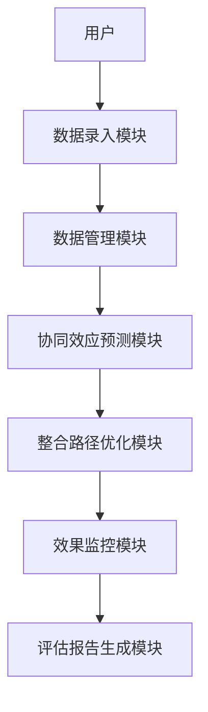

                 


# AI辅助企业并购协同效应评估：整合路径规划与效果预测

> 关键词：企业并购，协同效应，AI辅助，整合路径，效果预测，机器学习，系统架构

> 摘要：本文详细探讨了AI技术在企业并购协同效应评估中的应用，重点分析了整合路径规划与效果预测的方法。通过结合企业并购的背景与实际需求，文章从协同效应的核心概念、算法原理、系统架构设计到项目实战，全面阐述了如何利用AI技术优化企业并购的过程。本文适合企业并购领域的专业人士、数据科学家以及对AI技术在商业应用感兴趣的读者阅读。

---

## 第一部分：企业并购与协同效应概述

### 第1章：企业并购概述

#### 1.1 企业并购的基本概念

企业并购（Mergers and Acquisitions，简称M&A）是指一家企业与其他企业合并或收购其资产、股权等行为。企业并购的主要目的是通过整合资源、优化资产配置、提升市场竞争力等方式实现企业价值的最大化。企业并购可以分为两种类型：一种是合并（Merger），即两家或更多企业合并成一家新的企业；另一种是收购（Acquisition），即一家企业收购另一家企业的全部或部分资产。

企业并购的基本流程包括以下几个步骤：
1. **战略规划**：确定并购目标和战略意图。
2. **目标筛选**：识别潜在的并购目标。
3. **尽职调查**：对目标企业进行详细调查，评估其财务状况、市场地位、技术能力等。
4. **估值与谈判**：对目标企业进行估值，并与目标企业进行谈判，确定并购价格和条件。
5. **整合计划**：制定整合计划，包括组织结构、业务流程、文化融合等方面的整合方案。
6. **执行与监控**：执行并购交易，并对整合过程进行监控和调整，确保整合目标的实现。

#### 1.2 协同效应的定义与重要性

协同效应（Synergy）是指在企业并购后，通过资源整合、优势互补，使得整体效益超过并购前的两个企业效益之和的现象。协同效应是企业并购的重要驱动力，能够帮助企业实现成本节约、收入增长、市场扩展等目标。

协同效应的分类包括以下几种：
1. **成本协同效应**：通过整合供应链、共享资源、减少重复劳动等方式降低成本。
2. **收入协同效应**：通过市场扩展、产品互补、客户资源共享等方式增加收入。
3. **管理协同效应**：通过优化组织结构、提升管理水平等方式提高企业效率。
4. **技术协同效应**：通过技术共享、研发合作等方式提升技术水平。

协同效应对企业并购的重要作用体现在以下几个方面：
1. **提升企业价值**：通过协同效应，企业能够实现价值的最大化，提升股东回报。
2. **增强竞争力**：通过协同效应，企业能够更好地应对市场竞争，提升市场地位。
3. **降低并购风险**：协同效应的有效实现能够降低并购后的整合风险，确保并购成功。

#### 1.3 企业并购中的整合路径规划

整合路径规划是指在企业并购后，如何通过整合资源、优化组织结构、协调文化差异等方式实现协同效应的过程。整合路径规划的关键因素包括以下几个方面：
1. **战略一致性**：并购双方的战略目标应保持一致，确保整合的方向和目标明确。
2. **组织结构优化**：通过调整组织结构，优化资源配置，提升企业效率。
3. **文化融合**：协调并购双方的企业文化差异，促进员工的融合与合作。
4. **风险管理**：识别和评估整合过程中可能存在的风险，并制定相应的风险应对策略。

协同效应评估与整合路径规划的关系是密切的。整合路径规划是实现协同效应的重要手段，而协同效应评估则是衡量整合路径规划成功与否的重要指标。通过协同效应评估，企业可以更好地优化整合路径，实现协同效应的最大化。

#### 1.4 协同效应评估的挑战与机遇

协同效应评估的挑战主要体现在以下几个方面：
1. **数据获取难度**：协同效应的评估需要大量准确的数据支持，但实际操作中可能存在数据不足或数据不准确的问题。
2. **评估方法的局限性**：传统的协同效应评估方法可能存在一定的局限性，难以全面反映协同效应的真实情况。
3. **整合风险**：企业并购后的整合过程可能存在文化冲突、管理混乱等问题，影响协同效应的实现。

AI技术的应用为企业并购协同效应评估带来了新的机遇：
1. **数据处理能力**：AI技术能够处理海量数据，提高数据的准确性和完整性。
2. **预测能力**：通过机器学习算法，AI能够预测协同效应的实现情况，帮助企业制定更科学的整合策略。
3. **动态调整能力**：AI技术能够实时监控整合过程，根据实际情况动态调整整合策略，确保协同效应的最大化。

---

### 第2章：协同效应的核心概念与联系

#### 2.1 协同效应的核心原理

协同效应的核心原理是通过资源整合和优势互补，实现整体效益的最大化。协同效应的实现需要企业内部的协同和外部环境的支持。内部协同包括组织结构优化、资源共享、流程优化等；外部协同包括市场扩展、合作伙伴关系建立等。

协同效应的关键影响因素包括以下几个方面：
1. **企业规模**：企业规模越大，协同效应的可能性越高。
2. **行业特性**：不同行业的协同效应实现方式和效果可能存在差异。
3. **整合程度**：整合程度越高，协同效应越容易实现。
4. **文化差异**：文化差异可能影响整合效果，进而影响协同效应的实现。

协同效应的度量方法包括以下几种：
1. **成本节约法**：计算并购后成本的节约额，作为协同效应的度量指标。
2. **收入增长法**：计算并购后收入的增长额，作为协同效应的度量指标。
3. **价值提升法**：通过企业价值的提升来衡量协同效应的实现情况。

#### 2.2 协同效应与整合路径的关系

协同效应与整合路径之间存在密切的联系。整合路径的规划直接影响协同效应的实现，而协同效应的评估反过来又可以指导整合路径的优化。

整合路径对协同效应的影响体现在以下几个方面：
1. **组织结构优化**：通过优化组织结构，整合资源，实现协同效应。
2. **流程优化**：通过优化业务流程，提升效率，实现协同效应。
3. **文化融合**：通过文化融合，促进员工的合作，实现协同效应。

协同效应对整合路径的反馈作用体现在以下几个方面：
1. **目标调整**：协同效应的实现情况可以作为整合路径调整的依据。
2. **风险预警**：通过协同效应评估，识别整合过程中的潜在风险，并及时采取应对措施。
3. **资源优化**：协同效应的实现可以指导企业进一步优化资源配置，提升整合效果。

#### 2.3 协同效应评估的ER实体关系图

协同效应评估涉及多个实体，包括企业并购方、被并购方、协同效应、整合路径等。以下是协同效应评估的ER实体关系图：

```mermaid
er
  actor: 企业并购方
  actormerger: 被并购方
  synergy: 协同效应
  integrationpath: 整合路径
  relation:
    actor --> synergy: 产生
    actormerger --> synergy: 产生
    integrationpath --> synergy: 促进
    actor --> integrationpath: 制定
    actormerger --> integrationpath: 配合
    synergy --> integrationpath: 反馈
```

---

## 第二部分：协同效应评估的算法与数学模型

### 第3章：协同效应预测模型的算法原理

#### 3.1 协同效应预测模型的构建

协同效应预测模型的构建需要考虑多个因素，包括企业的财务数据、市场表现、管理能力等。以下是协同效应预测模型的构建步骤：

1. **数据收集**：收集企业并购方和被并购方的财务数据、市场数据、管理数据等。
2. **数据预处理**：对数据进行清洗、标准化、特征选择等处理，确保数据的准确性和可用性。
3. **模型训练**：选择合适的机器学习算法，对数据进行训练，构建协同效应预测模型。
4. **模型评估**：通过交叉验证等方法，评估模型的准确性和稳定性。
5. **模型优化**：根据评估结果，优化模型参数，提升模型性能。

#### 3.2 协同效应预测模型的实现

以下是协同效应预测模型的实现代码：

```python
import pandas as pd
from sklearn.ensemble import RandomForestRegressor
from sklearn.metrics import mean_squared_error
from sklearn.model_selection import train_test_split

# 数据加载
data = pd.read_csv('synergy_data.csv')

# 特征选择
features = ['revenue', 'profit', 'employees', 'market_share']
target = 'synergy_score'

# 数据分割
X = data[features]
y = data[target]
X_train, X_test, y_train, y_test = train_test_split(X, y, test_size=0.2, random_state=42)

# 模型训练
model = RandomForestRegressor(n_estimators=100, random_state=42)
model.fit(X_train, y_train)

# 模型预测
y_pred = model.predict(X_test)

# 模型评估
mse = mean_squared_error(y_test, y_pred)
rmse = mse ** 0.5
print(f"均方误差: {mse}, 根均方误差: {rmse}")
```

#### 3.3 协同效应预测模型的数学表达式

协同效应预测模型的数学表达式如下：

$$
\text{协同效应} = \beta_0 + \beta_1x_1 + \beta_2x_2 + \ldots + \beta_nx_n + \epsilon
$$

其中，$x_i$ 表示各个影响协同效应的因素，$\beta_i$ 表示各个因素的系数，$\epsilon$ 表示误差项。

---

### 第4章：协同效应评估的系统架构设计

#### 4.1 系统功能设计

协同效应评估系统需要实现以下功能：
1. **数据录入与管理**：支持用户录入企业并购方和被并购方的基本信息、财务数据、市场数据等。
2. **协同效应预测**：基于机器学习算法，预测协同效应的实现情况。
3. **整合路径优化**：根据协同效应预测结果，优化整合路径，制定整合计划。
4. **效果监控与评估**：实时监控整合过程，评估协同效应的实现情况，调整整合策略。

#### 4.2 系统架构设计

以下是协同效应评估系统的架构图：



---

## 第三部分：项目实战与优化

### 第5章：项目实战

#### 5.1 项目环境安装

协同效应评估系统的开发需要以下环境：
1. **Python 3.8及以上版本**
2. **Pandas、Scikit-learn、Mermaid等库**

安装命令：
```bash
pip install pandas scikit-learn mermaid
```

#### 5.2 系统核心实现

以下是协同效应评估系统的核心代码：

```python
class SynergyEvaluator:
    def __init__(self):
        self.model = RandomForestRegressor(n_estimators=100, random_state=42)

    def train_model(self, features, target):
        self.model.fit(features, target)

    def predict_synergy(self, features):
        return self.model.predict(features)

# 使用示例
data = pd.read_csv('synergy_data.csv')
evaluator = SynergyEvaluator()
evaluator.train_model(data[['revenue', 'profit', 'employees', 'market_share']], data['synergy_score'])
predictions = evaluator.predict_synergy(new_data[['revenue', 'profit', 'employees', 'market_share']])
```

#### 5.3 项目小结

通过本项目的实战，我们了解了AI技术在企业并购协同效应评估中的应用，掌握了协同效应预测模型的构建方法，熟悉了协同效应评估系统的开发流程。未来，可以通过进一步优化模型、扩展系统功能等方式，提升协同效应评估的准确性和效率。

---

## 第四部分：总结与展望

### 第6章：总结与展望

#### 6.1 最佳实践

1. **数据质量**：确保数据的准确性和完整性，是协同效应评估的基础。
2. **模型选择**：根据实际情况选择合适的机器学习算法，提升模型的预测能力。
3. **系统架构**：设计合理的系统架构，确保系统的高效性和可扩展性。
4. **持续优化**：根据实际应用情况，持续优化协同效应评估模型和系统，提升评估效果。

#### 6.2 小结

本文详细探讨了AI技术在企业并购协同效应评估中的应用，从协同效应的核心概念、算法原理、系统架构设计到项目实战，全面阐述了如何利用AI技术优化企业并购的过程。通过本文的讲解，读者可以掌握协同效应评估的基本方法和实现步骤，为实际应用提供参考。

#### 6.3 注意事项

1. **数据隐私**：在实际应用中，需注意数据隐私保护，确保数据的安全性和合规性。
2. **模型解释性**：在实际应用中，需关注模型的解释性，确保模型的决策过程透明可解释。
3. **持续监控**：在实际应用中，需持续监控协同效应的实现情况，及时调整整合策略，确保并购目标的实现。

#### 6.4 拓展阅读

1. 《企业并购与价值评估》
2. 《机器学习在金融领域的应用》
3. 《系统架构设计与实现》

---

## 作者信息

作者：AI天才研究院/AI Genius Institute & 禅与计算机程序设计艺术 /Zen And The Art of Computer Programming

---

以上是《AI辅助企业并购协同效应评估：整合路径规划与效果预测》的技术博客文章的完整目录大纲和部分章节内容，涵盖了企业并购的背景与核心概念、协同效应的评估方法、AI技术的应用以及系统架构设计等重要内容，适合企业并购领域的专业人士、数据科学家以及对AI技术在商业应用感兴趣的读者阅读。

