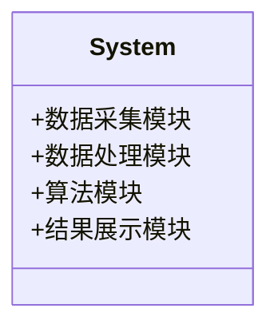
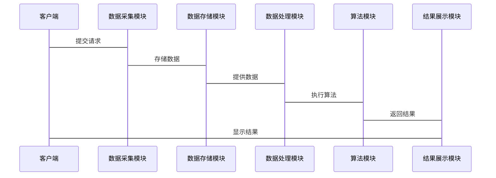

                 


# AI辅助企业并购后整合：业务流程优化与文化融合监控

> 关键词：AI，企业并购，业务流程优化，文化融合，机器学习，深度学习，流程挖掘

> 摘要：企业并购后的整合是企业战略发展中的关键环节，涉及到业务流程的重构和企业文化的融合。本文将探讨如何利用人工智能技术辅助企业并购后的整合过程，重点分析业务流程优化与文化融合监控的核心概念、算法原理、系统架构设计以及实际应用案例。通过本文的阐述，读者可以深入了解AI在企业并购整合中的重要作用，并掌握相关技术实现的方法。

---

## 第一部分：企业并购与整合背景

### 第1章：企业并购与整合概述

#### 1.1 企业并购的背景与趋势

- **1.1.1 并购的定义与类型**
  - 并购（Mergers and Acquisitions，M&A）是指两个或多个企业之间的合并或收购行为。
  - 并购类型包括：横向并购、纵向并购、混合并购。

- **1.1.2 当前企业并购的趋势**
  - 全球化背景下的跨国并购增加。
  - 数字化转型推动技术驱动型并购。
  - ESG（环境、社会、治理）因素成为并购的重要考量。

- **1.1.3 并购整合的重要性**
  - 提高企业竞争力。
  - 实现资源优化配置。
  - 增强市场适应能力。

#### 1.2 企业并购中的整合挑战

- **1.2.1 业务流程整合的难点**
  - 不同企业的流程差异大。
  - 数据孤岛问题严重。
  - 流程整合后的协同效应难以实现。

- **1.2.2 文化融合的障碍**
  - 企业文化的冲突。
  - 员工抵触情绪。
  - 管理风格的差异。

- **1.2.3 跨文化管理的问题**
  - 不同国家或地区的法律法规差异。
  - 语言和沟通障碍。
  - 本地化管理的复杂性。

#### 1.3 AI在企业并购整合中的作用

- **1.3.1 AI技术如何优化整合流程**
  - 数据挖掘技术用于分析并购数据。
  - 自然语言处理技术用于文档自动化。
  - 机器学习技术用于预测整合风险。

- **1.3.2 AI在文化融合中的应用**
  - 文化匹配度分析。
  - 员工行为预测。
  - 融合进度监控。

- **1.3.3 AI辅助决策的优势**
  - 提高决策的准确性。
  - 减少人为错误。
  - 提高整合效率。

---

## 第二部分：业务流程优化的核心概念与算法

### 第2章：业务流程优化的AI方法

#### 2.1 业务流程优化的定义与目标

- **2.1.1 业务流程优化的定义**
  - 通过对现有流程的分析和改进，提高流程效率和效果。

- **2.1.2 优化的目标与关键指标**
  - 目标：提高效率、降低成本、增强灵活性。
  - 关键指标：流程周期时间、成本、资源利用率。

#### 2.2 流程挖掘与分析

- **2.2.1 流程挖掘的定义**
  - 通过分析日志数据，发现实际流程中的问题和改进点。

- **2.2.2 数据流图的构建**
  - 使用流程图工具（如Lucidchart）绘制业务流程图。
  - 通过数据流图分析流程瓶颈。

- **2.2.3 流程分析的工具与方法**
  - 工具：Process Mining Tools（如ProM框架）。
  - 方法：基于日志数据的流程发现、基于规则的流程验证。

#### 2.3 基于AI的流程优化算法

- **2.3.1 机器学习在流程优化中的应用**
  - 使用监督学习预测流程中的关键绩效指标（KPI）。
  - 使用无监督学习识别流程中的异常行为。

- **2.3.2 算法选择与实现**
  - 监督学习：线性回归、决策树。
  - 无监督学习：聚类分析、关联规则挖掘。

- **2.3.3 流程优化的数学模型**
  - 使用线性规划模型优化资源分配。
  - 使用马尔可夫链模型预测流程中的状态转换。

---

## 第三部分：文化融合监控的AI技术

### 第3章：文化融合监控的核心概念

#### 3.1 文化融合的定义与关键要素

- **3.1.1 文化融合的定义**
  - 将两个或多个企业的文化进行整合，形成新的文化体系。

- **3.1.2 融合的阶段与目标**
  - 理解阶段：了解双方文化差异。
  - 融合阶段：消除差异，形成共同文化。
  - 优化阶段：持续改进文化体系。

#### 3.2 文化冲突的识别与预测

- **3.2.1 文化冲突的类型与表现**
  - 价值观冲突：对问题的看法不同。
  - 行为习惯冲突：工作方式不同。
  - 语言和沟通冲突：沟通不畅。

- **3.2.2 基于AI的冲突预测模型**
  - 使用自然语言处理技术分析员工反馈。
  - 使用机器学习模型预测冲突风险。

#### 3.3 文化适应性评估

- **3.3.1 适应性评估指标**
  - 员工满意度。
  - 组织凝聚力。
  - 业务绩效。

- **3.3.2 AI在评估中的应用**
  - 使用情感分析技术评估员工情绪。
  - 使用聚类分析技术识别文化适应的难点。

---

## 第四部分：AI算法原理与实现

### 第4章：机器学习算法在整合中的应用

#### 4.1 监督学习在流程优化中的应用

- **4.1.1 线性回归模型**
  - 使用线性回归模型预测流程中的关键指标。
  - 例如：预测流程完成时间。

- **4.1.2 决策树算法**
  - 使用决策树算法识别流程中的关键决策点。
  - 例如：基于决策树的流程优化。

- **4.1.3 案例分析**
  - 案例：某企业并购后的订单处理流程优化。
  - 分析：使用决策树算法识别订单处理中的瓶颈。

#### 4.2 无监督学习在文化融合中的应用

- **4.2.1 聚类分析**
  - 使用聚类分析技术识别员工的文化偏好。
  - 例如：将员工分为不同的文化群体。

- **4.2.2 主成分分析**
  - 使用主成分分析技术简化文化数据。
  - 例如：识别文化融合中的关键因素。

- **4.2.3 案例分析**
  - 案例：某跨国并购中的文化融合监控。
  - 分析：使用聚类分析识别文化冲突点。

#### 4.3 深度学习在整合中的应用

- **4.3.1 RNN与LSTM网络**
  - 使用循环神经网络（RNN）和长短期记忆网络（LSTM）进行时间序列预测。
  - 例如：预测并购后的业务绩效。

- **4.3.2 图神经网络**
  - 使用图神经网络分析组织结构中的关系。
  - 例如：识别并购后的关键合作节点。

- **4.3.3 案例分析**
  - 案例：某科技公司并购后的团队协作优化。
  - 分析：使用图神经网络优化团队协作流程。

---

## 第五部分：系统分析与架构设计

### 第5章：系统架构设计与实现

#### 5.1 问题场景介绍

- **场景描述**
  - 某企业并购后需要整合业务流程和文化体系。
  - 需要开发一个AI辅助整合系统。

#### 5.2 系统功能设计

- **5.2.1 领域模型设计**
  - 使用mermaid类图描述系统模块。
  - 类图示例：



- **5.2.2 功能模块**
  - 数据采集模块：采集业务流程和文化数据。
  - 数据处理模块：清洗和预处理数据。
  - 算法模块：运行机器学习算法。
  - 结果展示模块：可视化结果。

#### 5.3 系统架构设计

- **5.3.1 系统架构**
  - 使用mermaid架构图描述系统架构。
  - 架构图示例：


- **5.3.2 接口设计**
  - 数据接口：REST API。
  - 算法接口：函数调用。

#### 5.4 系统交互设计

- **5.4.1 交互流程**
  - 使用mermaid序列图描述系统交互。
  - 序列图示例：



---

## 第六部分：项目实战

### 第6章：项目实现与案例分析

#### 6.1 环境安装与配置

- **6.1.1 环境要求**
  - Python 3.8+
  - 机器学习库：scikit-learn、TensorFlow。
  - 可视化工具：Matplotlib、Seaborn。

#### 6.2 核心代码实现

- **6.2.1 数据采集模块**
  - 使用Python脚本采集业务流程数据。
  ```python
  import pandas as pd

  def collect_data():
      # 示例代码
      data = pd.read_csv('process_data.csv')
      return data
  ```

- **6.2.2 数据处理模块**
  - 数据清洗和预处理。
  ```python
  def preprocess_data(data):
      # 示例代码
      data.dropna(inplace=True)
      return data
  ```

- **6.2.3 算法模块**
  - 使用机器学习算法进行预测。
  ```python
  from sklearn.tree import DecisionTreeRegressor

  def train_model(X, y):
      model = DecisionTreeRegressor()
      model.fit(X, y)
      return model
  ```

- **6.2.4 结果展示模块**
  - 使用可视化工具展示结果。
  ```python
  import matplotlib.pyplot as plt

  def visualize_results(results):
      plt.bar(range(len(results)), results)
      plt.show()
  ```

#### 6.3 项目实战案例

- **6.3.1 案例分析**
  - 某企业并购后的订单处理流程优化。
  - 数据采集：订单处理时间、订单错误率。
  - 数据处理：清洗和预处理数据。
  - 算法实现：使用决策树算法预测订单处理时间。
  - 结果展示：可视化预测结果与实际结果对比。

---

## 第七部分：总结与展望

### 第7章：总结与展望

#### 7.1 全文总结

- 本文详细探讨了AI在企业并购整合中的应用，特别是业务流程优化和文化融合监控的核心概念、算法原理和系统架构设计。
- 通过实际案例分析，展示了AI技术在企业并购整合中的巨大潜力。

#### 7.2 未来展望

- 随着AI技术的不断发展，未来在企业并购整合中的应用将更加广泛。
- 关键技术包括：更复杂的深度学习模型、强化学习在流程优化中的应用、多模态数据融合技术。

#### 7.3 最佳实践 tips

- 数据隐私保护：在数据采集和处理过程中，注意保护员工隐私。
- 模型优化：定期更新模型，确保预测结果的准确性。
- 文化融合：加强跨文化培训，促进员工之间的理解和合作。

---

## 作者：AI天才研究院/AI Genius Institute & 禅与计算机程序设计艺术 /Zen And The Art of Computer Programming

