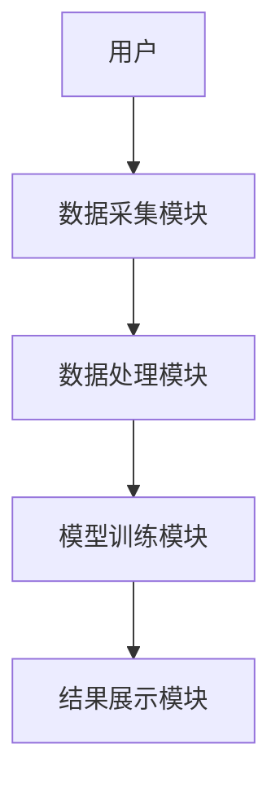
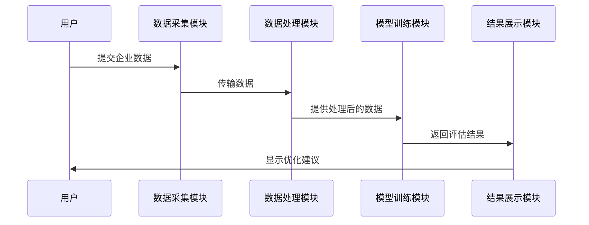

                 


# AI辅助企业并购后整合：文化融合与业务协同的量化评估

> 关键词：企业并购、文化融合、业务协同、量化评估、人工智能、整合策略

> 摘要：企业并购后整合是企业在快速变化的商业环境中实现可持续发展的重要策略之一。然而，文化冲突与业务协同的复杂性常常导致整合失败。本文将探讨如何利用人工智能技术，通过量化评估的方法，解决文化融合与业务协同的核心问题，为企业并购后整合提供科学的决策支持。文章从背景分析、核心概念、算法原理、系统架构到实际案例，全面阐述了AI在企业并购整合中的应用。

---

# 第一部分：企业并购后整合的背景与挑战

## 第1章：企业并购的背景与整合的重要性

### 1.1 企业并购的定义与特点
- **企业并购的定义**：企业并购是指一家企业通过购买、合并或其他方式取得另一家企业所有权的商业行为。
- **企业并购的核心特点**：
  - 战略性：以获取竞争优势为核心目标。
  - 复杂性：涉及法律、财务、人力资源等多个领域。
  - 风险性：整合失败可能导致巨大损失。
- **并购后整合的重要性**：整合是并购成功的关键，直接影响企业价值的实现。

### 1.2 企业并购后整合的核心挑战
- **文化冲突**：不同企业的文化差异可能导致员工抵触情绪，影响工作效率。
- **业务协同的复杂性**：整合双方业务流程需要协调多个部门，涉及资源分配和流程优化。
- **资源浪费**：未能有效整合可能导致资源重复配置或浪费。

### 1.3 AI技术在企业并购整合中的应用前景
- **数据驱动的决策支持**：AI可以通过分析海量数据，提供整合策略建议。
- **文化融合的量化评估**：AI能够通过自然语言处理技术，评估企业文化契合度。
- **业务协同的预测与优化**：AI可以预测整合后的业务协同效果，并提出优化建议。

---

# 第二部分：文化融合与业务协同的量化评估

## 第2章：文化融合的量化评估

### 2.1 文化融合的核心要素
- **企业价值观**：包括企业使命、愿景和核心价值观。
- **组织结构**：包括管理风格、决策流程和沟通方式。
- **员工文化认同**：包括员工对企业文化的认同感和归属感。

### 2.2 文化融合的评估指标
| 指标维度 | 具体指标 |
|----------|----------|
| 价值观匹配度 | 企业愿景一致性、核心价值观相似性 |
| 组织结构契合度 | 管理风格匹配度、决策流程一致性 |
| 员工文化认同度 | 员工满意度、员工忠诚度 |

### 2.3 文化融合的量化模型
$$
\text{文化融合度} = 0.4 \times V + 0.3 \times O + 0.3 \times E
$$
其中：
- \( V \) 表示价值观匹配度（0-1分）。
- \( O \) 表示组织结构契合度（0-1分）。
- \( E \) 表示员工文化认同度（0-1分）。

### 2.4 AI在文化融合评估中的应用
- **数据来源**：通过分析员工反馈、管理风格和企业价值观数据。
- **算法选择**：使用聚类分析和线性回归模型进行评估。

## 第3章：业务协同的量化评估

### 3.1 业务协同的核心要素
- **业务流程协同**：包括供应链、生产流程和客户服务。
- **资源协同**：包括人力资源、财务资源和信息资源。
- **绩效协同**：包括生产效率、成本控制和利润增长。

### 3.2 业务协同的评估指标
| 指标维度 | 具体指标 |
|----------|----------|
| 业务流程效率 | 流程周期、瓶颈分析 |
| 资源利用率 | 人力资源分配、设备利用率 |
| 绩效提升 | 成本降低、利润增长 |

### 3.3 业务协同的量化模型
$$
\text{业务协同度} = 0.3 \times F + 0.4 \times R + 0.3 \times P
$$
其中：
- \( F \) 表示业务流程效率（0-1分）。
- \( R \) 表示资源利用率（0-1分）。
- \( P \) 表示绩效提升（0-1分）。

### 3.4 AI在业务协同评估中的应用
- **数据来源**：通过分析业务流程数据、资源分配数据和绩效数据。
- **算法选择**：使用协同过滤和决策树模型进行预测和优化。

---

# 第三部分：AI辅助企业并购后整合的系统架构

## 第4章：系统架构设计

### 4.1 系统功能模块
- **数据采集模块**：采集企业文化和业务数据。
- **数据处理模块**：对数据进行清洗和预处理。
- **模型训练模块**：训练文化融合和业务协同模型。
- **结果展示模块**：展示量化评估结果和优化建议。

### 4.2 系统架构图


### 4.3 系统交互流程


---

# 第四部分：AI辅助整合的项目实战

## 第5章：项目实施与案例分析

### 5.1 项目环境安装
- **工具安装**：安装Python、TensorFlow、Scikit-learn等工具。
- **数据获取**：从企业内部获取文化数据和业务数据。

### 5.2 文化融合模型实现
```python
import numpy as np
from sklearn.linear_model import LinearRegression

# 示例数据
X = np.array([[5, 4, 3], [6, 5, 4], [7, 6, 5]])
y = np.array([0.8, 0.9, 0.7])

# 模型训练
model = LinearRegression()
model.fit(X, y)

# 预测文化融合度
new_X = np.array([[4, 3, 2]])
print(model.predict(new_X))
```

### 5.3 业务协同模型实现
```python
import pandas as pd
from sklearn.ensemble import RandomForestRegressor

# 示例数据
data = pd.DataFrame({
    'F': [0.7, 0.6, 0.8],
    'R': [0.5, 0.4, 0.6],
    'P': [0.6, 0.5, 0.7]
})

# 模型训练
model = RandomForestRegressor()
model.fit(data[['F', 'R']], data['P'])

# 预测业务协同度
new_data = pd.DataFrame({
    'F': [0.7],
    'R': [0.5]
})
print(model.predict(new_data))
```

### 5.4 实际案例分析
- **案例背景**：某跨国企业并购一家本地企业。
- **文化融合评估**：预测文化融合度为0.85，需重点关注员工文化认同。
- **业务协同优化**：预测业务协同度为0.7，建议优化供应链流程。

---

# 第五部分：总结与展望

## 第6章：总结与最佳实践

### 6.1 总结
- AI技术在企业并购整合中的应用前景广阔。
- 文化融合与业务协同的量化评估是整合成功的关键。

### 6.2 最佳实践
- **数据质量**：确保数据的准确性和完整性。
- **模型选择**：根据具体问题选择合适的算法。
- **持续优化**：定期评估模型效果并进行优化。

### 6.3 注意事项
- 避免过度依赖AI技术，需结合企业实际情况。
- 注意数据隐私和安全问题。

### 6.4 拓展阅读
- 推荐阅读《企业并购整合的策略与实践》。
- 关注AI在企业整合中的最新研究进展。

---

# 作者

作者：AI天才研究院 & 禅与计算机程序设计艺术

---

通过以上内容，我们系统地介绍了AI辅助企业并购后整合的方法与实践，从理论到实际应用，为企业的整合提供了科学的决策支持。

