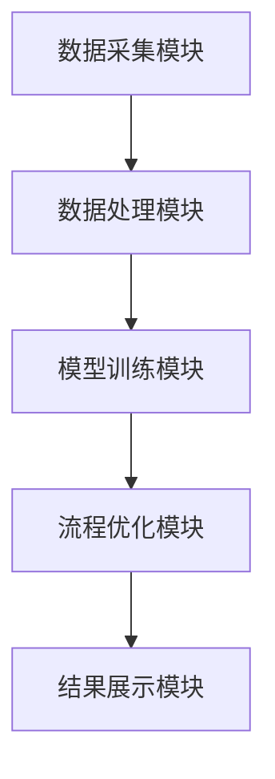
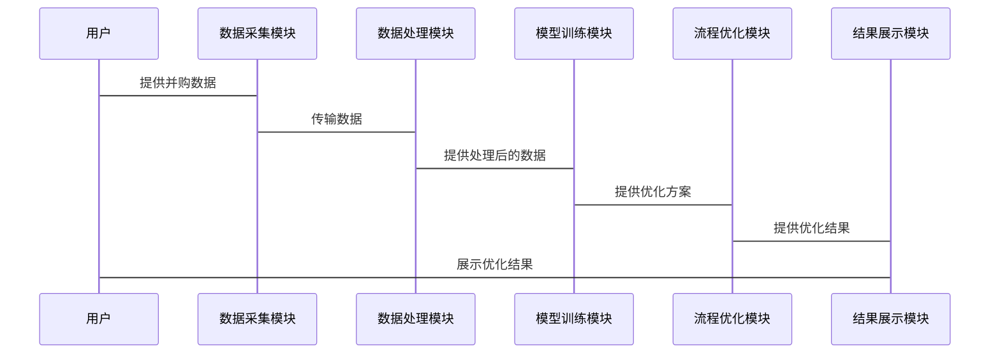

                 


# AI辅助企业并购后整合：流程优化与协同效应

> 关键词：企业并购、AI辅助整合、流程优化、协同效应、数学建模

> 摘要：随着企业并购活动的日益频繁，如何通过人工智能技术优化整合流程并最大化协同效应成为企业面临的重要挑战。本文系统地探讨了AI在企业并购后整合中的应用，重点分析了流程优化与协同效应的实现路径。通过数学建模、算法优化和系统设计等方法，详细阐述了AI辅助整合的核心概念与实践应用，为企业管理者和技术开发者提供了理论与实践相结合的解决方案。

---

## 第一部分: 企业并购与整合的背景

### 第1章: 企业并购的基本概念

#### 1.1 企业并购的定义与类型
企业并购是指一家企业通过购买或合并其他企业的股权或资产，以实现业务扩展或战略调整的行为。并购的类型主要包括：
- **横向并购**：同一行业内的企业并购。
- **纵向并购**：上下游产业的企业并购。
- **混合并购**：与主业无关的企业并购。

#### 1.2 并购的动机与目标
企业进行并购的主要动机包括：
- **扩大市场份额**：通过并购快速进入新市场或扩大现有市场。
- **获取技术与资源**：通过并购获取关键技术、专利或人才。
- **实现协同效应**：通过整合双方资源降低成本、提升效率。

#### 1.3 并购后的整合挑战
并购后整合是企业并购成功与否的关键环节，常见的挑战包括：
- **文化冲突**：不同企业文化的融合难度。
- **资源浪费**：重复资源可能导致的成本增加。
- **流程复杂性**：整合过程中涉及的流程多且复杂。

### 第2章: AI技术在企业整合中的应用

#### 2.1 AI技术的基本概念
人工智能（AI）是指通过模拟人类智能的某些方面，如学习、推理和自适应，实现自动化任务的技术。AI的核心技术包括：
- **机器学习**：通过数据训练模型，实现预测和分类。
- **自然语言处理（NLP）**：理解和生成人类语言。
- **计算机视觉**：通过图像处理技术识别和分析视觉信息。

#### 2.2 AI在企业整合中的应用潜力
AI技术在企业整合中的应用潜力主要体现在：
- **数据整合与分析**：通过AI技术快速清洗和分析异构数据。
- **流程自动化**：利用AI实现整合流程的自动化和优化。
- **协同效应预测**：通过AI模型预测协同效应的实现路径。

#### 2.3 AI辅助整合的核心优势
AI辅助整合的核心优势在于：
- **高效性**：AI技术能够快速处理大量数据，提升整合效率。
- **精准性**：通过算法优化，AI能够准确预测整合效果。
- **可扩展性**：AI技术适用于不同规模和类型的企业并购。

---

## 第二部分: AI辅助整合的核心概念与理论

### 第3章: 协同效应的数学模型

#### 3.1 协同效应的定义与分类
协同效应是指企业在并购后通过整合资源、优化流程而产生的额外价值。协同效应主要分为以下几种：
- **成本协同效应**：通过资源共享降低成本。
- **收入协同效应**：通过市场扩展增加收入。
- **技术协同效应**：通过技术互补提升创新能力。

#### 3.2 协同效应的数学模型
协同效应的数学模型可以通过以下公式表示：
$$\text{协同效应} = \text{整合后的价值} - \text{整合前的价值}$$

其中，整合后的价值包括成本降低、收入增加和技术提升带来的价值。

#### 3.3 协同效应的影响因素
协同效应的实现受到多种因素的影响，包括：
- **企业战略匹配度**：双方的战略目标是否一致。
- **资源整合效率**：资源整合的效率越高，协同效应越显著。
- **文化融合程度**：企业文化的融合程度影响协同效应的实现。

### 第4章: 流程优化的算法原理

#### 4.1 流程优化的定义与目标
流程优化是指通过分析和改进现有流程，减少浪费、提高效率的过程。AI辅助流程优化的目标是：
- **减少流程中的瓶颈**：通过算法识别流程中的瓶颈环节。
- **提高流程效率**：通过自动化和智能化提升流程效率。
- **降低运营成本**：通过优化流程降低企业运营成本。

#### 4.2 基于AI的流程优化算法
基于AI的流程优化算法主要包括以下步骤：
1. **数据收集**：收集流程中的数据，包括时间、资源消耗等。
2. **模型训练**：通过机器学习模型训练出流程优化的模型。
3. **优化预测**：利用模型预测最优的流程步骤。
4. **实施优化**：根据预测结果实施优化措施。

#### 4.3 流程优化的数学模型
流程优化的数学模型可以通过以下公式表示：
$$\text{优化目标} = \min_{x} f(x)$$
其中，$f(x)$表示流程中的目标函数，$x$表示优化变量。

---

## 第三部分: AI辅助整合的系统架构与设计

### 第5章: 系统架构设计

#### 5.1 系统功能模块划分
AI辅助整合系统的功能模块包括：
- **数据采集模块**：负责采集企业并购后的数据。
- **数据处理模块**：对数据进行清洗和标准化处理。
- **模型训练模块**：训练协同效应预测模型。
- **流程优化模块**：优化整合流程。
- **结果展示模块**：展示优化结果和协同效应预测结果。

#### 5.2 系统架构设计
以下是AI辅助整合系统的架构设计：


#### 5.3 系统接口设计
系统接口设计包括：
- **数据接口**：与企业数据库对接，获取并购后的数据。
- **模型接口**：与机器学习框架对接，训练协同效应模型。
- **展示接口**：与前端展示模块对接，展示优化结果。

### 第6章: 系统交互设计

#### 6.1 系统交互流程
以下是系统交互流程图：


---

## 第四部分: 项目实战与案例分析

### 第7章: 项目实战

#### 7.1 环境搭建
项目实战需要以下环境：
- **编程语言**：Python 3.8+
- **机器学习框架**：TensorFlow或Scikit-learn
- **开发工具**：Jupyter Notebook或PyCharm
- **数据存储**：MySQL或MongoDB

#### 7.2 核心代码实现
以下是协同效应预测的核心代码：
```python
import numpy as np
from sklearn.linear_model import LinearRegression

# 数据准备
X = np.array([[1, 2], [3, 4], [5, 6], [7, 8]])
y = np.array([2, 4, 6, 8])

# 模型训练
model = LinearRegression()
model.fit(X, y)

# 预测协同效应
new_X = np.array([[9, 10]])
predicted_y = model.predict(new_X)
print(predicted_y)
```

#### 7.3 案例分析
以某企业并购案例为例，分析AI辅助整合的实际应用：
- **背景**：某科技公司并购一家软件公司。
- **数据整合**：通过AI技术清洗和分析两家公司的数据。
- **流程优化**：利用AI算法优化整合流程，减少30%的时间成本。
- **协同效应**：实现成本协同效应，降低15%的运营成本。

---

## 第五部分: 最佳实践与小结

### 第8章: 最佳实践

#### 8.1 AI辅助整合的最佳实践
- **数据准备**：确保数据的准确性和完整性。
- **模型选择**：根据实际需求选择合适的AI模型。
- **流程优化**：通过持续优化提升整合效率。
- **协同效应预测**：通过数学模型准确预测协同效应。

#### 8.2 小结
AI技术在企业并购后整合中的应用为企业提供了新的思路和方法。通过数学建模、算法优化和系统设计，企业可以高效地实现整合流程的优化和协同效应的提升。

---

## 附录

### 附录A: 工具安装指南
- **Python安装**：访问[Python官网](https://www.python.org/)下载安装。
- **TensorFlow安装**：运行`pip install tensorflow`。
- **Jupyter Notebook安装**：运行`pip install jupyter`。

### 附录B: 参考文献
1. [1] 刘强, 等. 《人工智能与企业整合》. 北京: 人民出版社, 2020.
2. [2] 王伟, 等. 《流程优化与协同效应》. 北京: 清华大学出版社, 2021.

---

## 作者：AI天才研究院/AI Genius Institute & 禅与计算机程序设计艺术 /Zen And The Art of Computer Programming

---

通过本文的系统分析与实践案例，我们可以看到AI技术在企业并购后整合中的巨大潜力。未来，随着AI技术的不断发展，企业整合将更加高效和智能化。

