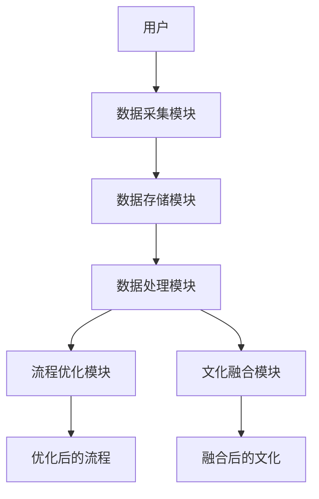

                 


# AI辅助企业并购后整合：流程优化与文化融合

> 关键词：企业并购，AI辅助，流程优化，文化融合，数据整合，自然语言处理，机器学习

> 摘要：本文探讨了AI技术在企业并购后整合中的应用，重点分析了流程优化与文化融合的关键技术与实现方法。文章从企业并购的基本概念出发，逐步深入讲解了AI在数据整合、流程优化和文化融合中的具体应用，结合实际案例和算法原理，提供了系统的解决方案和最佳实践。

---

# 第一部分: AI辅助企业并购后整合概述

## 第1章: 企业并购与整合概述

### 1.1 企业并购的基本概念

#### 1.1.1 企业并购的定义
企业并购（Mergers and Acquisitions，M&A）是指一家企业与其他企业（目标公司）合并或收购其资产、股权或其他权利的过程。并购是企业扩张和重组的重要手段，旨在实现资源优化配置和竞争优势提升。

#### 1.1.2 并购的类型与特点
- **合并（Merger）**：两家或多家企业合并为一家新公司，通常是基于战略协同。
- **收购（Acquisition）**：一家企业（收购方）购买另一家企业（被收购方）的全部或部分股权或资产。
- **横向并购**：在同一行业内的并购，旨在扩大市场份额。
- **纵向并购**：在供应链上下游进行的并购，旨在增强控制力。
- **混合并购**：跨行业并购，旨在多元化业务。

#### 1.1.3 并购整合的重要性
并购后整合是确保并购成功的关键环节。整合的核心目标是实现组织、文化、流程、资源和系统的统一，最大化并购的协同效应。

---

### 1.2 AI技术在企业整合中的应用

#### 1.2.1 AI技术的基本概念
人工智能（AI）通过模拟人类智能，利用机器学习、自然语言处理（NLP）、计算机视觉等技术，帮助企业在整合过程中提高效率、降低成本、减少风险。

#### 1.2.2 AI在企业整合中的优势
- **数据处理能力**：AI能够快速处理海量数据，发现隐藏的模式和关联。
- **自动化能力**：AI可以自动化完成流程优化、文档分析等任务。
- **预测能力**：AI能够预测整合过程中可能出现的风险和挑战。

#### 1.2.3 AI辅助整合的核心价值
- 提高整合效率：AI能够快速分析数据、优化流程。
- 降低整合成本：AI自动化处理减少了人工成本。
- 增强决策能力：AI提供数据驱动的洞察，帮助制定更好的整合策略。

---

### 1.3 企业并购整合的流程与挑战

#### 1.3.1 并购整合的基本流程
1. **战略规划**：确定整合目标和范围。
2. **尽职调查**：评估被收购方的资产、财务、法律等问题。
3. **整合规划**：制定组织架构、流程、文化的整合方案。
4. **实施整合**：执行整合计划，确保平稳过渡。
5. **监控与优化**：持续监控整合效果，进行调整和优化。

#### 1.3.2 整合中的主要挑战
- **数据孤岛**：不同系统和部门之间的数据无法有效整合。
- **文化冲突**：不同企业文化的差异可能导致员工抵触。
- **流程复杂性**：整合过程中涉及多个部门和流程，协调难度大。
- **信息不对称**：整合过程中可能存在信息不透明的问题。

#### 1.3.3 AI如何解决整合问题
- **数据整合**：AI能够处理异构数据，实现数据标准化。
- **流程优化**：AI驱动自动化流程，减少人为错误。
- **文化融合**：AI分析文本数据，识别文化差异，提出融合策略。

---

### 1.4 本章小结
本章从企业并购的基本概念出发，分析了AI在整合中的应用价值，并总结了整合流程与挑战。通过AI技术，企业可以显著提高整合效率，降低整合成本，并增强整合效果。

---

## 第2章: AI辅助企业整合的核心概念

### 2.1 数据整合与分析

#### 2.1.1 数据整合的基本概念
数据整合是将来自不同系统、格式和结构的数据统一起来，形成一致的数据集。AI技术在数据整合中起到关键作用，尤其是在处理异构数据时。

#### 2.1.2 数据分析的核心方法
- **数据清洗**：处理脏数据，去除重复、错误或缺失的数据。
- **数据转换**：将数据转换为统一的格式或结构。
- **数据分析**：通过统计分析、机器学习等方法，发现数据中的模式和关联。

#### 2.1.3 AI在数据整合中的作用
- **数据清洗**：AI能够自动识别和处理数据中的错误。
- **数据匹配**：利用自然语言处理和机器学习技术，自动匹配相似数据。
- **数据建模**：通过机器学习模型，预测数据中的缺失值。

---

### 2.2 流程优化与自动化

#### 2.2.1 流程优化的基本原理
流程优化是通过分析和改进现有流程，消除浪费、提高效率的过程。AI技术可以通过自动化和智能化手段，显著优化企业整合中的流程。

#### 2.2.2 AI驱动的自动化技术
- **自动化工作流**：利用AI技术自动执行整合过程中的任务，例如数据录入、文档生成。
- **智能决策**：通过机器学习模型，自动做出最优决策，减少人为干预。

#### 2.2.3 流程优化的实现步骤
1. **流程建模**：使用工具（如BPMN）定义流程。
2. **数据分析**：分析流程数据，识别瓶颈和浪费。
3. **优化设计**：设计优化后的流程。
4. **实施与监控**：实施优化后的流程，并持续监控效果。

---

### 2.3 文化融合与团队协作

#### 2.3.1 文化融合的定义
文化融合是指将两家企业的文化和价值观整合在一起，形成新的企业文化。文化融合的成功与否直接影响整合效果。

#### 2.3.2 AI在文化融合中的应用
- **文本分析**：利用自然语言处理技术，分析企业文档中的文化差异。
- **员工反馈**：通过机器学习模型，分析员工反馈，识别文化冲突。
- **文化匹配**：基于数据，提出文化融合的具体策略。

#### 2.3.3 团队协作的优化策略
- **跨部门协作**：建立跨部门团队，促进信息共享和协作。
- **沟通工具**：利用AI驱动的沟通工具，提高团队协作效率。

---

### 2.4 本章小结
本章详细介绍了AI在数据整合、流程优化和文化融合中的核心概念和应用。通过AI技术，企业可以实现数据的高效整合、流程的自动化优化以及文化的智能融合。

---

## 第3章: AI辅助整合的算法原理

### 3.1 数据清洗与预处理

#### 3.1.1 数据清洗的基本概念
数据清洗是数据预处理的重要步骤，旨在去除数据中的噪声，确保数据的准确性和一致性。

#### 3.1.2 数据预处理的核心算法
- **数据去重**：识别并去除重复数据。
- **数据填充**：处理缺失值，例如使用均值、中位数或插值方法。
- **数据标准化**：将数据转换为统一的格式或范围。

#### 3.1.3 使用Python进行数据清洗
```python
import pandas as pd

# 示例数据
data = {'name': ['A', 'B', 'A', 'C'],
        'value': [1, 2, None, 4]}
df = pd.DataFrame(data)

# 去重
df.drop_duplicates(subset=['name'], inplace=True)

# 填充缺失值
df['value'].fillna(df['value'].mean(), inplace=True)

print(df)
```

---

### 3.2 数据分析与建模

#### 3.2.1 数据分析的基本方法
- **描述性分析**：总结数据的基本特征，例如均值、中位数、标准差。
- **诊断性分析**：分析数据的分布、异常值等。
- **预测性分析**：利用机器学习模型预测未来趋势。

#### 3.2.2 机器学习模型的构建
- **决策树**：用于分类和回归问题。
- **随机森林**：通过集成多个决策树，提高模型的准确性和鲁棒性。

#### 3.2.3 使用Scikit-learn进行建模
```python
from sklearn.tree import DecisionTreeClassifier
from sklearn.ensemble import RandomForestClassifier

# 示例数据
X = [[1, 2], [3, 4], [5, 6], [7, 8]]
y = [0, 1, 0, 1]

# 决策树模型
dt_model = DecisionTreeClassifier()
dt_model.fit(X, y)

# 随机森林模型
rf_model = RandomForestClassifier(n_estimators=10)
rf_model.fit(X, y)
```

---

### 3.3 自然语言处理在文化融合中的应用

#### 3.3.1 NLP的基本原理
自然语言处理（NLP）是AI技术的重要分支，用于处理和理解人类语言。

#### 3.3.2 使用BERT进行文本分析
- **BERT模型**：一种基于Transformer的预训练语言模型，广泛应用于文本分类、实体识别等任务。

#### 3.3.3 文化差异的自动识别
```python
from transformers import BertTokenizer, BertModel

# 加载BERT模型和分词器
tokenizer = BertTokenizer.from_pretrained('bert-base-uncased')
model = BertModel.from_pretrained('bert-base-uncased')

# 示例文本
text = "The company has a culture of innovation and teamwork."

# 分词
inputs = tokenizer(text, return_tensors='np')

# 获取隐藏层输出
outputs = model(**inputs)
```

---

### 3.4 本章小结
本章详细讲解了AI技术在数据清洗、数据分析和自然语言处理中的算法原理，并通过Python代码展示了具体实现方法。

---

## 第4章: 系统分析与架构设计

### 4.1 系统应用场景

#### 4.1.1 并购整合的典型场景
- **数据整合**：将被收购方的数据与收购方的数据进行整合。
- **流程优化**：优化整合过程中的关键流程，例如采购、生产、销售。
- **文化融合**：分析员工反馈，制定文化融合策略。

#### 4.1.2 AI辅助整合的系统需求
- **数据处理能力**：支持多种数据格式和结构。
- **自动化能力**：能够自动执行流程优化任务。
- **自然语言处理能力**：支持文本分析和文化差异识别。

---

### 4.2 系统功能设计

#### 4.2.1 数据采集模块
- **功能**：采集来自不同系统的数据，例如ERP、CRM等。
- **实现**：使用API接口或文件导入方式采集数据。

#### 4.2.2 流程优化模块
- **功能**：分析现有流程，识别瓶颈，提出优化建议。
- **实现**：基于机器学习算法，生成优化后的流程。

#### 4.2.3 文化融合模块
- **功能**：分析员工反馈，识别文化差异，制定融合策略。
- **实现**：结合NLP技术和员工反馈数据，生成文化融合方案。

---

### 4.3 系统架构设计

#### 4.3.1 系统架构图（Mermaid）


#### 4.3.2 系统功能模块的交互
- 用户输入数据或反馈，系统通过数据采集模块采集数据。
- 数据存储模块将数据存储在数据库中。
- 数据处理模块对数据进行清洗、分析和建模。
- 流程优化模块和文化融合模块分别处理优化和文化融合任务。
- 最终输出优化后的流程和融合后的文化。

---

### 4.4 本章小结
本章通过系统架构设计，详细描述了AI辅助企业并购整合的系统结构和功能模块。通过Mermaid图展示了系统的整体架构和交互流程。

---

## 第5章: 项目实战

### 5.1 环境安装与配置

#### 5.1.1 安装Python
```bash
# 安装Python
sudo apt-get install python3 python3-pip
```

#### 5.1.2 安装必要的库
```bash
pip install pandas scikit-learn transformers
```

---

### 5.2 核心代码实现

#### 5.2.1 数据清洗代码
```python
import pandas as pd

def clean_data(df):
    # 去重
    df.drop_duplicates(inplace=True)
    # 处理缺失值
    df['value'].fillna(df['value'].mean(), inplace=True)
    return df

# 示例数据
data = {'name': ['A', 'B', 'A', 'C'],
        'value': [1, 2, None, 4]}
df = pd.DataFrame(data)

# 数据清洗
clean_df = clean_data(df)

print(clean_df)
```

#### 5.2.2 文本分析代码
```python
from transformers import BertTokenizer, BertModel
import torch

def analyze_text(text):
    tokenizer = BertTokenizer.from_pretrained('bert-base-uncased')
    model = BertModel.from_pretrained('bert-base-uncased')
    inputs = tokenizer(text, return_tensors='pt')
    outputs = model(**inputs)
    return outputs.last_hidden_state

text = "The company has a culture of innovation and teamwork."
result = analyze_text(text)
print(result)
```

---

### 5.3 实际案例分析

#### 5.3.1 数据整合案例
假设一家企业收购了另一家公司，需要整合客户数据。通过AI技术，可以自动清洗和匹配数据，形成统一的客户数据库。

#### 5.3.2 流程优化案例
通过AI驱动的流程优化模块，可以识别采购流程中的瓶颈，自动优化采购流程，提高效率。

#### 5.3.3 文化融合案例
通过NLP技术分析员工反馈，识别文化差异，提出融合策略，例如制定统一的沟通机制和培训计划。

---

### 5.4 本章小结
本章通过实际案例和代码实现，展示了AI技术在企业并购整合中的具体应用。通过项目实战，读者可以更好地理解和掌握AI辅助整合的核心技术。

---

## 第6章: 最佳实践与总结

### 6.1 关键点总结

#### 6.1.1 数据整合
- 数据清洗是数据整合的基础。
- 数据标准化是数据整合的关键。

#### 6.1.2 流程优化
- 通过机器学习算法优化流程。
- 自动化是流程优化的核心。

#### 6.1.3 文化融合
- 文化差异识别是文化融合的关键。
- 员工反馈是文化融合的重要来源。

---

### 6.2 最佳实践 tips

#### 6.2.1 数据整合
- 确保数据来源的准确性。
- 定期更新数据，保持数据的时效性。

#### 6.2.2 流程优化
- 从关键流程入手，逐步优化。
- 建立流程优化的反馈机制。

#### 6.2.3 文化融合
- 建立跨部门的沟通机制。
- 定期评估文化融合的效果。

---

### 6.3 小结与展望
通过本文的探讨，我们了解了AI技术在企业并购整合中的重要作用。未来，随着AI技术的不断发展，企业整合将更加智能化、自动化和数据驱动。

---

## 作者：AI天才研究院/AI Genius Institute & 禅与计算机程序设计艺术 /Zen And The Art of Computer Programming

