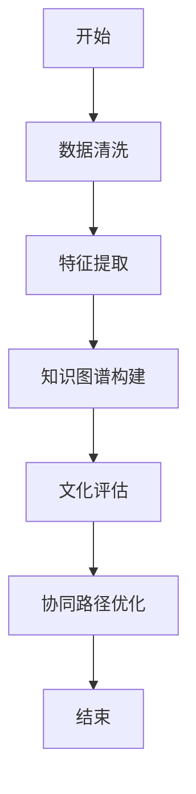
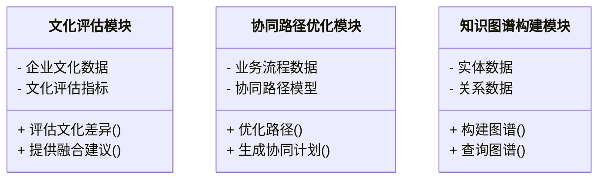
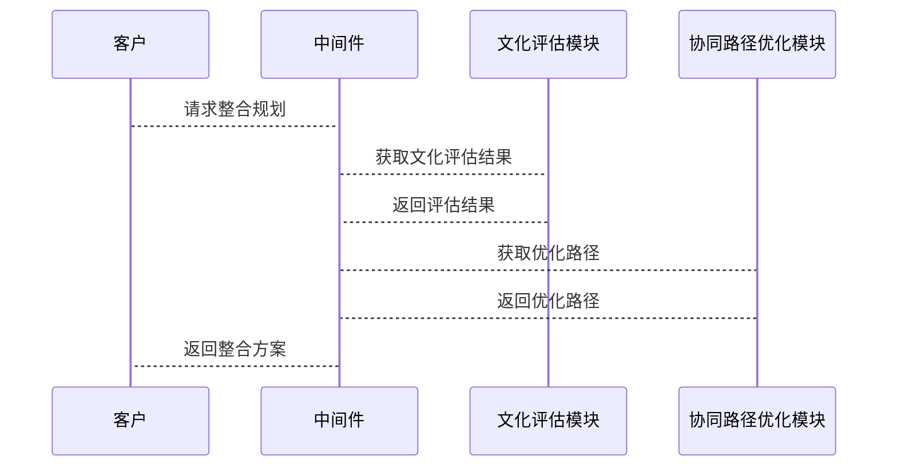

                 


# AI辅助企业并购整合规划：文化融合与业务协同路径的智能设计

## 关键词：企业并购、AI辅助、文化融合、业务协同、知识图谱

## 摘要：  
企业并购是企业战略发展的重要手段，然而并购后的整合过程复杂且挑战重重。本文探讨了如何利用人工智能技术辅助企业并购整合，特别是在文化融合与业务协同方面的智能设计。通过分析AI技术的核心优势，结合实际案例，详细阐述了AI在数据处理、知识图谱构建、文化评估与协同路径优化中的应用，提出了智能化整合规划的未来趋势和实践建议。

---

# 第1章: 企业并购整合的背景与挑战

## 1.1 企业并购的定义与特点

### 1.1.1 企业并购的基本概念
企业并购是指一家企业通过购买或合并另一家企业，以实现资源优化配置和战略发展的行为。其特点包括复杂性、不确定性高、涉及多部门协作等。

### 1.1.2 并购整合的核心目标
整合的目标是实现组织结构优化、业务流程协同、文化融合，从而提升整体竞争力。

### 1.1.3 并购整合的复杂性与挑战
包括文化冲突、业务协同低效、数据孤岛等问题。

## 1.2 传统企业并购整合的痛点

### 1.2.1 文化冲突与融合的困难
文化差异可能导致员工抵触情绪，影响整合效果。

### 1.2.2 业务协同的低效性
传统方法可能导致协同效率低下，资源浪费。

### 1.2.3 数据孤岛与信息不对称问题
数据分散在不同部门，难以有效整合和利用。

## 1.3 AI技术在企业并购整合中的应用潜力

### 1.3.1 AI技术的核心优势
AI能够处理大量数据，发现潜在模式，辅助决策。

### 1.3.2 AI在文化融合与业务协同中的作用
AI可以帮助分析文化差异，优化协同路径。

### 1.3.3 智能化整合规划的未来趋势
AI将推动整合过程的智能化和自动化。

## 1.4 本章小结

---

# 第2章: AI辅助企业并购整合的核心概念

## 2.1 企业并购整合的流程与阶段

### 2.1.1 并购前的评估与规划
包括战略评估、目标筛选等。

### 2.1.2 并购后的整合与协同
包括组织结构优化、业务流程整合等。

### 2.1.3 整合过程中的关键节点
如文化评估、协同路径设计等。

## 2.2 AI辅助整合的核心技术

### 2.2.1 数据分析与挖掘
利用AI分析企业数据，发现潜在问题。

### 2.2.2 知识图谱构建
构建知识图谱，帮助理解企业结构和关系。

### 2.2.3 自然语言处理（NLP）技术
用于文档分析和信息提取。

## 2.3 AI在文化融合与业务协同中的具体应用

### 2.3.1 文化评估与匹配
通过AI分析企业文化差异，制定融合策略。

### 2.3.2 业务流程优化
利用AI优化业务流程，提升效率。

### 2.3.3 协同路径设计
设计协同路径，减少冲突，提升效率。

## 2.4 核心概念对比分析

### 2.4.1 传统整合 vs AI辅助整合
对比分析两种方法的优劣。

### 2.4.2 不同AI技术的优劣势对比
如数据挖掘、知识图谱、NLP的对比。

### 2.4.3 企业规模与AI技术适用性分析
不同规模企业适用不同AI技术。

## 2.5 本章小结

---

# 第3章: AI辅助企业并购整合的算法原理

## 3.1 数据预处理与特征提取

### 3.1.1 数据清洗与标准化
去除噪音数据，标准化处理。

### 3.1.2 文本特征提取方法
如TF-IDF、Word2Vec等。

### 3.1.3 图结构数据的处理
如节点和边的表示。

## 3.2 知识图谱构建算法

### 3.2.1 实体识别与抽取
使用NLP技术识别实体。

### 3.2.2 关系抽取与推理
构建关系图谱，推理潜在关系。

### 3.2.3 图谱存储与查询优化
优化存储结构，提升查询效率。

## 3.3 文化融合与协同路径优化算法

### 3.3.1 文化评估指标体系
如文化兼容性、协同度等指标。

### 3.3.2 协同路径的动态规划模型
设计动态规划模型，优化路径。

### 3.3.3 基于强化学习的优化策略
使用强化学习优化协同路径。

## 3.4 算法流程图

### 数据预处理流程



---

# 第4章: AI辅助企业并购整合的系统架构设计

## 4.1 问题场景介绍

### 系统目标
实现企业并购整合的智能化规划。

### 项目介绍
设计一个AI辅助整合系统，涵盖数据处理、知识构建、协同优化等功能。

## 4.2 系统功能设计

### 领域模型设计



## 4.3 系统架构设计

### 系统架构图


## 4.4 系统接口设计

### API接口
如RESTful API，用于模块间通信。

## 4.5 系统交互设计

### 交互流程图



## 4.6 本章小结

---

# 第5章: AI辅助企业并购整合的项目实战

## 5.1 环境搭建

### 工具安装
如Python、TensorFlow、Numpy等。

## 5.2 核心代码实现

### 文化评估模块

```python
def assess_culture_similarity(culture1, culture2):
    similarity_score = cosine_similarity(culture1, culture2)
    return similarity_score
```

### 协同路径优化模块

```python
def optimize_path(paths):
    # 使用动态规划优化路径
    pass
```

## 5.3 代码应用解读与分析

### 代码功能说明
如文化评估函数计算文化相似度。

## 5.4 实际案例分析

### 案例分析
如某企业并购案例中的文化评估和协同路径优化。

## 5.5 项目小结

---

# 第6章: 扩展与未来展望

## 6.1 未来发展趋势

### 新兴技术的影响
如大语言模型的应用。

## 6.2 挑战与解决方案

### 技术挑战
数据隐私、模型泛化能力等。

## 6.3 最佳实践 tips

### 实践建议
如数据质量的重要性、模型调优等。

## 6.4 本章小结

---

# 作者信息

作者：AI天才研究院/AI Genius Institute & 禅与计算机程序设计艺术/Zen And The Art of Computer Programming

---

# 结语

通过系统的分析和实践，AI技术在企业并购整合中的应用前景广阔，能够显著提升整合效率和效果。未来，随着技术的不断发展，AI将在整合过程中发挥更大的作用。

