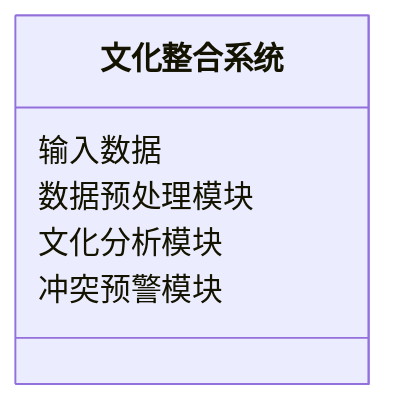
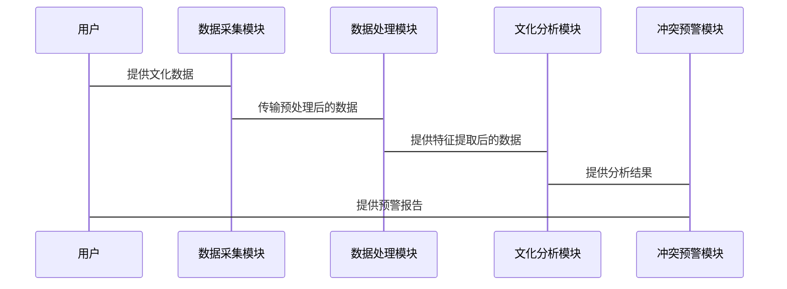

                 


# AI辅助企业并购文化整合：减少冲突

> 关键词：企业并购、文化整合、人工智能、机器学习、文本挖掘、分类算法、系统架构

> 摘要：本文探讨了如何利用人工智能技术辅助企业并购中的文化整合过程，以减少文化冲突，提升并购成功率。文章详细分析了文化整合的核心概念、AI技术的应用潜力、算法原理及系统架构，并通过实际案例展示如何通过AI实现高效的文化整合。

---

## 第1章: 企业并购中的文化整合问题

### 1.1 企业并购的基本概念

企业并购是企业间常见的战略行为，旨在通过整合资源、技术和市场来增强竞争力。然而，并购过程中最大的挑战之一是文化整合。

#### 1.1.1 文化整合的定义与重要性

文化整合是指在并购后，将两家企业的文化和价值观融合在一起，形成统一的企业文化。成功的文化整合能够提升员工的凝聚力，避免内部冲突，促进企业稳定发展。

### 1.2 传统文化整合方法的局限性

#### 1.2.1 传统方法的流程与特点

传统文化整合方法通常依赖于主观判断和经验，如问卷调查、访谈和文化培训等。这种方法耗时长、成本高，并且难以量化和评估。

#### 1.2.2 传统方法在实际中的不足

传统方法的主观性较强，难以全面捕捉和分析企业的文化特征。此外，文化冲突的早期预警和解决方案缺乏系统性，容易导致并购失败。

### 1.3 AI技术在文化整合中的潜力

#### 1.3.1 AI技术的基本概念

人工智能（AI）是一种模拟人类智能的技术，能够通过机器学习、自然语言处理等方式，从数据中提取有用的信息和模式。

#### 1.3.2 AI在文化整合中的应用场景

AI可以用于分析企业的文化数据，如员工反馈、内部沟通记录等，帮助识别文化差异和潜在冲突。

#### 1.3.3 AI技术的优势与挑战

AI的优势在于其高效性和准确性，能够快速处理大量数据，发现传统方法难以察觉的问题。然而，AI技术的应用也需要克服数据质量和模型解释性的挑战。

---

## 第2章: AI辅助文化整合的核心概念

### 2.1 文化整合的AI模型构建

#### 2.1.1 文化整合的核心要素

文化整合的核心要素包括企业价值观、组织结构、沟通方式和员工行为规范等。

#### 2.1.2 AI模型的构建步骤

1. 数据收集：获取企业的文化数据，如员工反馈、会议记录等。
2. 数据预处理：清洗和标准化数据。
3. 特征提取：提取文化相关的特征，如情感倾向、关键词频率等。
4. 模型训练：使用机器学习算法训练文化整合模型。

#### 2.1.3 模型的输入与输出

输入：企业的文化数据（文本、结构化数据）。

输出：文化整合的建议和潜在冲突的预警。

### 2.2 文化数据的AI建模

#### 2.2.1 文化数据的分类

文化数据可以分为文本数据（如员工反馈）和结构化数据（如员工满意度评分）。

#### 2.2.2 数据的预处理与特征工程

数据预处理：去除噪声、填充缺失值。

特征工程：提取关键词、情感分析结果等。

### 2.3 AI算法在文化整合中的应用

#### 2.3.1 机器学习算法的选择

常用算法包括支持向量机（SVM）、随机森林（RF）和深度学习模型（如LSTM）。

---

## 第3章: 文化整合的AI算法原理

### 3.1 文本挖掘与文化分析

#### 3.1.1 文本挖掘的基本概念

文本挖掘是从文本数据中提取有用信息的过程，常用于情感分析和主题建模。

#### 3.1.2 文本挖掘在文化分析中的应用

通过分析员工反馈，识别文化差异和潜在冲突。

#### 3.1.3 文本挖掘的实现步骤

1. 数据清洗：去除停用词、标点符号。
2. 词干提取：将单词转换为基本形式。
3. 主题建模：使用LDA模型提取主题。

### 3.2 文化整合的分类算法

#### 3.2.1 分类算法的原理

分类算法通过训练数据学习分类规则，用于预测新的数据点的类别。

#### 3.2.2 常见分类算法的比较

| 算法 | 优点 | 缺点 |
|------|------|------|
| 朴素贝叶斯 | 简单高效 | 易受数据分布影响 |
| 支持向量机 | 高准确性 | 参数敏感 |

#### 3.2.3 分类算法在文化整合中的应用

通过分类模型预测员工的文化倾向，识别潜在的文化冲突。

### 3.3 文化整合的聚类算法

#### 3.3.1 聚类算法的基本原理

聚类算法将相似的数据点分组，用于识别文化相似的部门或员工。

#### 3.3.2 聚类算法在文化整合中的应用

识别不同文化群体，制定针对性的整合策略。

---

## 第4章: 系统架构与实现

### 4.1 系统功能设计

#### 4.1.1 领域模型设计



#### 4.1.2 系统架构设计


### 4.2 系统接口设计

系统接口包括数据输入接口、模型训练接口和预警报告接口。

### 4.3 系统交互设计



---

## 第5章: 项目实战

### 5.1 环境安装与配置

安装Python、机器学习库（如scikit-learn、NLTK）和数据处理工具（如Pandas）。

### 5.2 核心代码实现

```python
from sklearn.feature_extraction.text import TfidfVectorizer
from sklearn.svm import SVC
from sklearn.metrics import accuracy_score

# 数据预处理
def preprocess(text):
    return text.lower().strip()

# 文本向量化
vectorizer = TfidfVectorizer(max_features=500)
X = vectorizer.fit_transform([preprocess(text) for text in texts])

# 模型训练
model = SVC()
model.fit(X.toarray(), labels)

# 预测与评估
y_pred = model.predict(X_test.toarray())
print(accuracy_score(y_test, y_pred))
```

### 5.3 案例分析

分析一家科技公司并购案例，展示AI如何识别文化冲突并提出整合建议。

---

## 第6章: 最佳实践与小结

### 6.1 最佳实践

1. 数据质量是关键，确保数据的完整性和准确性。
2. 结合业务场景选择合适的算法。
3. 定期评估和优化模型。

### 6.2 小结

本文详细探讨了AI在企业并购文化整合中的应用，展示了如何通过AI技术减少文化冲突，提升并购成功率。

### 6.3 未来展望

未来，随着AI技术的进步，文化整合将更加智能化和个性化。

---

## 作者：AI天才研究院 & 禅与计算机程序设计艺术

---

通过以上步骤，我们可以看到AI技术在企业并购文化整合中的巨大潜力。希望本文能够为企业并购中的文化整合提供新的思路和方法。

