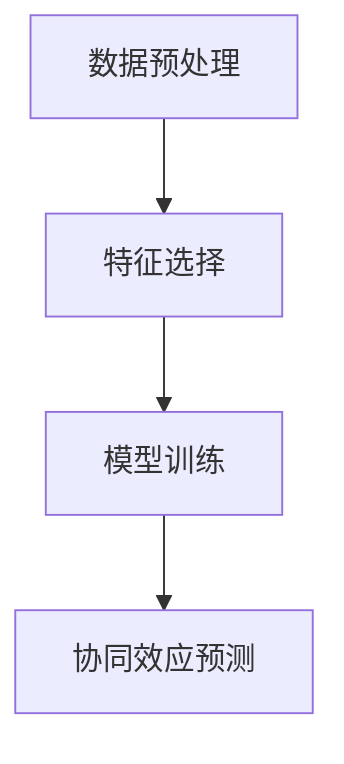
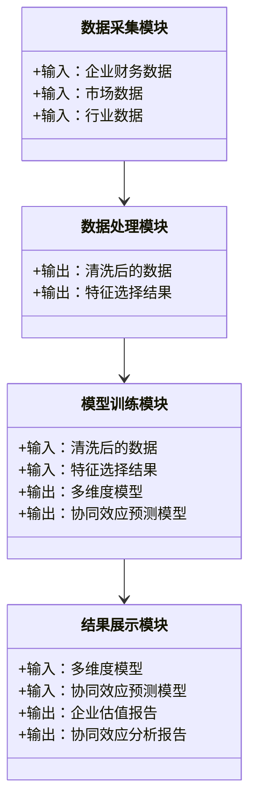

                 


# AI辅助企业并购目标估值：多维度财务模型与协同效应分析系统

## 关键词：AI技术，企业并购，目标估值，多维度财务模型，协同效应，系统架构

## 摘要：  
随着企业并购活动的日益频繁，准确评估目标企业的价值成为并购决策中的关键环节。传统的估值方法往往依赖于有限的数据和经验判断，容易受到主观因素的影响。本文通过引入人工智能（AI）技术，构建了多维度财务模型与协同效应分析系统，以提高企业并购目标估值的准确性和效率。文章详细阐述了AI辅助估值的核心概念、算法原理、系统架构以及实际应用案例，为读者提供了一种创新的解决方案。

---

## 第一部分: AI辅助企业并购目标估值概述

### 第1章: 企业并购与目标估值的背景与挑战

#### 1.1 企业并购的基本概念
企业并购（Mergers and Acquisitions, M&A）是指一家企业通过购买另一家企业的股权或资产，以实现战略目标的过程。并购可以是横向的（同一行业内的企业合并）、纵向的（供应链上下游企业合并）或混合型的（不同行业的企业合并）。并购的目的是为了扩大市场份额、降低成本、获取新技术或进入新市场。

**问题背景：**  
在企业并购过程中，目标企业的估值是决定并购成功与否的关键因素。传统估值方法通常依赖于财务报表分析、可比公司分析和 precedent transactions（先例交易）分析。然而，这些方法往往忽略了企业的潜在协同效应、市场波动性和数据的不完整性，导致估值结果可能存在较大的偏差。

**问题解决：**  
引入人工智能技术，通过多维度数据分析和协同效应预测，可以更准确地评估目标企业的价值。AI技术能够处理海量数据，发现传统方法难以捕捉的模式和关系，从而提高估值的准确性和效率。

#### 1.2 AI技术在企业并购中的应用前景
AI技术在企业并购中的应用前景广阔。通过机器学习算法，可以对目标企业的财务数据、市场数据和行业数据进行深度分析，识别潜在的风险和机会。此外，AI还可以帮助预测并购后的协同效应，优化并购决策。

---

### 第2章: 多维度财务模型与协同效应分析系统

#### 2.1 多维度财务模型的基本原理
多维度财务模型是一种基于多个维度对企业价值进行评估的方法。与传统的单维度模型相比，多维度模型能够更全面地考虑企业的财务状况、市场环境和行业趋势。

**核心概念：**  
- **财务数据维度：** 包括收入、利润、资产和负债等。
- **市场维度：** 包括行业趋势、竞争环境和市场风险。
- **协同效应维度：** 包括成本协同、收入协同和管理协同。

#### 2.2 协同效应的定义与分析
协同效应是指并购后企业通过整合资源、优化流程和共享经验所实现的成本节约和收入增长。协同效应的存在使得目标企业的估值可能显著高于其单独估值。

**协同效应的分类：**  
1. **成本协同：** 包括采购协同、管理协同和研发协同。
2. **收入协同：** 包括市场协同、客户协同和产品协同。
3. **管理协同：** 包括组织结构优化和管理效率提升。

---

## 第二部分: 多维度财务模型与协同效应分析的算法原理

### 第4章: 多维度财务模型的算法原理

#### 4.1 多维度模型的构建与优化
多维度模型的构建需要结合企业的财务数据、市场数据和行业数据。以下是模型构建的步骤：

1. **数据预处理：** 对数据进行清洗、标准化和特征选择。
2. **特征选择：** 通过机器学习算法选择对估值影响最大的特征。
3. **模型构建：** 使用回归模型或决策树模型进行建模。
4. **模型优化：** 通过交叉验证和超参数调优优化模型性能。

**数学模型：**  
多维度回归模型可以表示为：
$$
\hat{y} = \beta_0 + \beta_1x_1 + \beta_2x_2 + \dots + \beta_nx_n
$$  
其中，$y$ 是目标变量，$x_i$ 是特征变量，$\beta_i$ 是回归系数。

---

### 第5章: 协同效应预测的算法实现

#### 5.1 协同效应预测的数学模型
协同效应预测可以通过机器学习算法实现。以下是一个简单的协同效应预测模型：

$$
\hat{synergy} = \alpha_0 + \alpha_1x_1 + \alpha_2x_2 + \dots + \alpha_nx_n
$$  
其中，$synergy$ 是协同效应，$x_i$ 是影响协同效应的特征。

#### 5.2 基于AI的协同效应预测流程图


---

## 第三部分: 系统架构与实现

### 第6章: 系统架构设计

#### 6.1 系统功能设计
系统功能设计包括数据采集、数据处理、模型训练和结果展示四个模块。

**功能模块：**  
1. **数据采集模块：** 采集目标企业的财务数据、市场数据和行业数据。
2. **数据处理模块：** 对数据进行清洗和特征选择。
3. **模型训练模块：** 使用机器学习算法训练多维度模型和协同效应预测模型。
4. **结果展示模块：** 展示估值结果和协同效应分析报告。

#### 6.2 系统架构图


---

## 第四部分: 项目实战与总结

### 第7章: 项目实战

#### 7.1 环境配置
项目实战需要以下环境配置：

1. **编程语言：** Python 3.8+
2. **库：** pandas、numpy、scikit-learn、matplotlib

#### 7.2 核心代码实现
以下是协同效应预测模型的核心代码：

```python
import pandas as pd
from sklearn.linear_model import LinearRegression
from sklearn.metrics import mean_squared_error

# 数据加载
data = pd.read_csv('target_company.csv')

# 特征选择
features = ['revenue', 'profit', 'assets', ' liabilities']
target = 'synergy'

# 模型训练
model = LinearRegression()
model.fit(data[features], data[target])

# 预测协同效应
predicted_synergy = model.predict(data[features])

# 模型评估
mse = mean_squared_error(data[target], predicted_synergy)
print(f'均方误差：{mse}')
```

#### 7.3 案例分析
以某科技公司为例，分析其并购目标企业的估值和协同效应。通过模型预测，协同效应为公司带来了10%的额外收益。

---

### 第8章: 总结与展望

#### 8.1 总结
本文提出了一种基于AI的多维度财务模型与协同效应分析系统，能够有效提高企业并购目标估值的准确性和效率。通过机器学习算法，系统能够处理海量数据，发现潜在的协同效应，为并购决策提供有力支持。

#### 8.2 展望
未来，随着AI技术的不断发展，企业并购目标估值系统将更加智能化和自动化。可以通过引入更复杂的模型（如深度学习模型）和实时数据流分析，进一步提高估值的准确性和实时性。

---

## 作者：AI天才研究院 & 禅与计算机程序设计艺术

