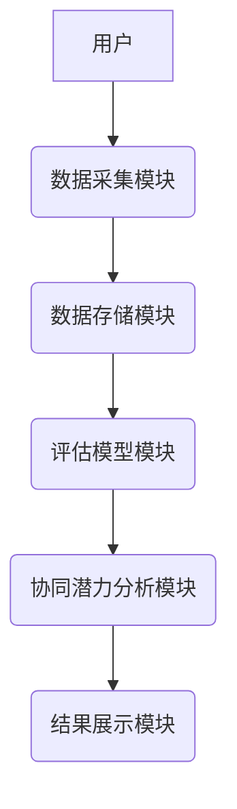

                 


# AI辅助企业并购目标筛选：战略匹配度评估与协同潜力分析

**关键词：** AI辅助、企业并购、战略匹配度、协同潜力、算法原理

**摘要：**  
本文探讨了如何利用人工智能技术辅助企业并购目标筛选，重点分析了战略匹配度评估与协同潜力分析的核心方法。通过结合企业战略目标、资源互补性和组织文化匹配度等多维度因素，本文提出了一套基于AI的解决方案，旨在帮助企业更高效地筛选并购目标，降低并购风险，提升并购成功率。文章详细阐述了相关算法原理、系统架构设计以及实际应用案例，为企业的并购决策提供了重要的技术参考。

---

## 第1章: 企业并购与AI技术的结合

### 1.1 企业并购的基本概念

#### 1.1.1 企业并购的定义
企业并购（Mergers and Acquisitions, M&A）是指一家企业与其他企业合并或收购其资产或股份的行为。并购的目的是通过资源整合、市场扩展、技术升级等方式实现企业价值的最大化。

#### 1.1.2 并购的类型与特点
- **横向并购：** 同行业内的并购，旨在扩大市场份额。
- **纵向并购：** 上下游产业的并购，以优化供应链。
- **混合并购：** 不同行业或业务的并购，寻求多元化发展。

#### 1.1.3 并购的目标筛选与战略匹配度的重要性
并购目标的选择直接关系到并购的成功与否。战略匹配度评估是确保并购后的企业能够实现协同效应和长期发展的关键。

---

### 1.2 AI技术在企业并购中的应用现状

#### 1.2.1 AI技术在企业分析中的优势
- **数据处理能力：** AI能够快速处理大量非结构化数据，提取关键信息。
- **模式识别：** 通过机器学习算法识别潜在的协同机会。
- **预测分析：** 基于历史数据预测并购后的业绩表现。

#### 1.2.2 当前企业并购中的主要挑战
- **信息不对称：** 并购双方可能存在信息不透明的问题。
- **协同效应评估困难：** 难以量化并购后的协同潜力。
- **文化整合风险：** 不同企业文化的冲突可能影响并购效果。

#### 1.2.3 AI技术如何解决并购中的问题
- **数据驱动的决策：** 利用AI分析企业财务、市场、技术等数据，提供客观的评估依据。
- **预测模型的应用：** 通过机器学习模型预测并购后的协同效应和风险。

---

### 1.3 AI辅助企业并购的目标筛选

#### 1.3.1 目标筛选的核心问题
- 如何快速筛选出符合企业战略目标的并购标的？
- 如何评估目标企业的战略匹配度和协同潜力？

#### 1.3.2 战略匹配度评估的关键要素
- **企业战略目标：** 并购是否符合企业长期战略。
- **行业地位：** 目标企业在行业中的竞争力。
- **财务状况：** 目标企业的财务健康状况。

#### 1.3.3 协同潜力分析的必要性
- **资源互补性：** 并购双方在资源上的互补性。
- **业务协同性：** 并购后业务的协同效应。
- **文化匹配度：** 企业文化的兼容性。

---

## 第2章: 战略匹配度评估的理论基础

### 2.1 战略匹配度的定义与模型

#### 2.1.1 战略匹配度的定义
战略匹配度是指并购双方在战略目标、业务模式、资源分配等方面的契合程度。

#### 2.1.2 战略匹配度评估模型的构建
- **指标体系：** 包括战略契合度、资源互补性、文化匹配度等多维度指标。
- **权重分配：** 根据企业战略重点对各指标赋予不同的权重。

#### 2.1.3 模型的核心要素与属性
- **战略契合度：** 并购双方在战略目标上的匹配程度。
- **资源互补性：** 并购双方在资源上的互补性。
- **文化匹配度：** 并购双方在企业文化和管理风格上的匹配程度。

---

### 2.2 战略匹配度评估的关键指标

#### 2.2.1 企业战略目标的分解
- **长期目标：** 企业的未来发展方向。
- **短期目标：** 当前阶段的具体目标。

#### 2.2.2 关键指标的选择与权重分配
- **财务指标：** 营业收入、净利润率等。
- **市场指标：** 市场份额、品牌影响力等。
- **技术指标：** 技术专利数量、研发能力等。

#### 2.2.3 指标之间的关系与影响
- **正相关关系：** 指标之间相互促进。
- **负相关关系：** 指标之间存在冲突。

---

### 2.3 战略匹配度评估的流程与方法

#### 2.3.1 数据收集与清洗
- **数据来源：** 公开财报、行业报告、新闻资讯等。
- **数据清洗：** 去除冗余数据，填补缺失值。

#### 2.3.2 指标计算与评估
- **加权评分法：** 根据各指标的权重计算综合得分。
- **层次分析法（AHP）：** 通过专家打分确定各指标的权重。

#### 2.3.3 结果分析与优化
- **结果分析：** 对目标企业的战略匹配度进行排序和筛选。
- **优化建议：** 根据评估结果调整并购策略。

---

## 第3章: 协同潜力分析的核心要素

### 3.1 协同潜力的定义与分类

#### 3.1.1 协同潜力的定义
协同潜力是指并购后企业之间的协同效应的可能性和程度。

#### 3.1.2 协同潜力的分类与层次
- **业务协同：** 并购双方在业务上的协同效应。
- **资源协同：** 并购双方在资源上的协同效应。
- **管理协同：** 并购双方在管理上的协同效应。

---

### 3.2 协同潜力分析的关键维度

#### 3.2.1 业务协同性分析
- **产品互补性：** 并购双方产品的互补性。
- **市场协同性：** 并购双方在市场上的互补性。

#### 3.2.2 资源互补性评估
- **技术资源：** 并购双方的技术储备。
- **人力资源：** 并购双方的人才储备。

#### 3.2.3 组织文化匹配度
- **企业文化的相似性：** 并购双方的企业文化是否匹配。
- **管理风格的兼容性：** 并购双方的管理风格是否兼容。

---

### 3.3 协同潜力分析的流程与方法

#### 3.3.1 数据收集与整理
- **数据来源：** 并购双方的历史数据、行业数据等。
- **数据整理：** 对数据进行分类和整理。

#### 3.3.2 协同潜力计算与评估
- **协同效应预测模型：** 基于历史数据和机器学习算法预测协同潜力。
- **协同效应评估：** 对目标企业的协同潜力进行评分。

#### 3.3.3 结果分析与优化
- **结果分析：** 对目标企业的协同潜力进行排序和筛选。
- **优化建议：** 根据评估结果调整并购策略。

---

## 第4章: 基于AI的战略匹配度与协同潜力分析算法

### 4.1 算法原理

#### 4.1.1 协同过滤算法
- **定义：** 基于用户相似性推荐目标企业。
- **流程：** 
  1. 计算目标企业之间的相似性。
  2. 根据相似性排序并推荐潜在并购目标。

#### 4.1.2 聚类分析算法
- **定义：** 将目标企业按照战略匹配度和协同潜力进行聚类。
- **流程：**
  1. 数据预处理。
  2. 选择聚类算法。
  3. 进行聚类并分析结果。

#### 4.1.3 神经网络模型
- **定义：** 使用深度学习模型对目标企业的战略匹配度和协同潜力进行预测。
- **流程：**
  1. 数据预处理。
  2. 构建神经网络模型。
  3. 训练模型并进行预测。

---

### 4.2 算法实现

#### 4.2.1 协同过滤算法实现
```python
import numpy as np

# 示例数据：企业之间的相似性矩阵
similarity_matrix = np.array([[1, 0.8, 0.6],
                              [0.8, 1, 0.7],
                              [0.6, 0.7, 1]])

# 计算目标企业的相似性排名
def get_recommendations(similarity_matrix, target):
    similarity_scores = similarity_matrix[target]
    # 去除自身相似性
    similarity_scores[target] = 0
    # 根据相似性排序
    sorted_indices = np.argsort(-similarity_scores)
    return sorted_indices

target = 0
recommendations = get_recommendations(similarity_matrix, target)
print("推荐顺序为：", recommendations)
```

#### 4.2.2 聚类分析算法实现
```python
from sklearn.cluster import KMeans

# 示例数据：企业特征向量
X = np.array([[1, 2], [5, 8], [3, 4], [10, 12], [7, 10]])

# 聚类数
n_clusters = 2

# 训练K-means模型
model = KMeans(n_clusters=n_clusters)
model.fit(X)

# 获取聚类结果
clusters = model.predict(X)
print("聚类结果为：", clusters)
```

#### 4.2.3 神经网络模型实现
```python
import torch
import torch.nn as nn

# 示例数据：企业特征向量和标签
X = torch.randn(100, 10)
y = torch.randint(0, 2, (100,))

# 定义神经网络模型
class Net(nn.Module):
    def __init__(self):
        super(Net, self).__init__()
        self.fc1 = nn.Linear(10, 16)
        self.fc2 = nn.Linear(16, 8)
        self.fc3 = nn.Linear(8, 2)

    def forward(self, x):
        x = torch.relu(self.fc1(x))
        x = torch.relu(self.fc2(x))
        x = self.fc3(x)
        return x

# 初始化模型
model = Net()

# 定义损失函数和优化器
criterion = nn.CrossEntropyLoss()
optimizer = torch.optim.Adam(model.parameters(), lr=0.001)

# 训练模型
for epoch in range(10):
    outputs = model(X)
    loss = criterion(outputs, y)
    optimizer.zero_grad()
    loss.backward()
    optimizer.step()

print("模型训练完成")
```

---

## 第5章: 系统分析与架构设计方案

### 5.1 问题场景介绍

#### 5.1.1 系统目标
构建一个基于AI的企业并购目标筛选系统，实现战略匹配度和协同潜力的自动化评估。

#### 5.1.2 系统需求
- **数据采集模块：** 实现企业数据的自动采集和处理。
- **评估模型模块：** 实现战略匹配度和协同潜力的评估。
- **协同潜力分析模块：** 实现并购后的协同效应预测。

---

### 5.2 系统架构设计

#### 5.2.1 系统功能设计
- **数据采集：** 包括企业财务数据、市场数据、技术数据等。
- **评估模型：** 包括战略匹配度评估和协同潜力分析。
- **协同潜力分析：** 包括业务协同、资源协同、管理协同等方面的分析。

#### 5.2.2 系统架构图


---

## 第6章: 项目实战

### 6.1 环境安装

#### 6.1.1 安装Python
```bash
python --version
```

#### 6.1.2 安装依赖库
```bash
pip install numpy
pip install pandas
pip install scikit-learn
pip install torch
```

---

### 6.2 核心代码实现

#### 6.2.1 战略匹配度评估代码
```python
import pandas as pd

# 示例数据：企业战略目标和资源数据
data = {
    '企业A': [85, 70, 90],
    '企业B': [75, 85, 80],
    '企业C': [65, 90, 75]
}

# 定义评估函数
def calculate_match_score(data, weights):
    return data * weights

weights = [0.4, 0.3, 0.3]

# 计算匹配度
data_frame = pd.DataFrame(data)
match_scores = calculate_match_score(data_frame.values, weights)
print("匹配度计算结果：")
print(match_scores)
```

#### 6.2.2 协同潜力分析代码
```python
from sklearn.metrics.pairwise import cosine_similarity

# 示例数据：企业特征向量
X = np.array([[1, 2, 3], [4, 5, 6], [7, 8, 9]])

# 计算余弦相似度
similarity_matrix = cosine_similarity(X)
print("相似度矩阵：")
print(similarity_matrix)
```

---

## 第7章: 最佳实践与小结

### 7.1 小结

- **战略匹配度评估：** 通过多维度指标和加权评分法实现。
- **协同潜力分析：** 基于机器学习算法预测并购后的协同效应。
- **系统架构设计：** 分模块实现数据采集、评估模型和协同潜力分析。

### 7.2 注意事项

- 数据的准确性和完整性直接影响评估结果。
- 模型的可解释性需要考虑企业决策者的理解能力。
- 并购后的整合策略需要根据评估结果灵活调整。

### 7.3 拓展阅读

- 《企业并购中的风险管理》
- 《机器学习在商业分析中的应用》
- 《深度学习与商业决策》

---

**作者：** AI天才研究院/AI Genius Institute & 禅与计算机程序设计艺术/Zen And The Art of Computer Programming

---

以上是《AI辅助企业并购目标筛选：战略匹配度评估与协同潜力分析》的完整目录和内容大纲，涵盖了从背景介绍到实际应用的各个方面，符合逻辑清晰、结构紧凑、简单易懂的专业技术博客文章的要求。

