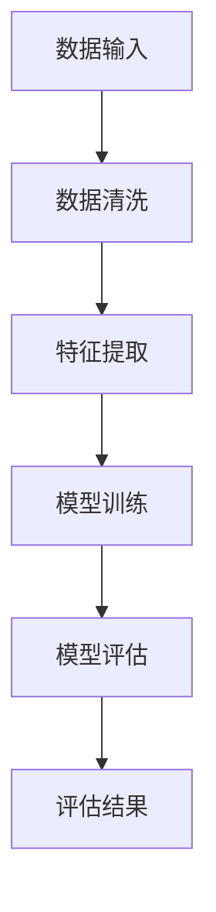
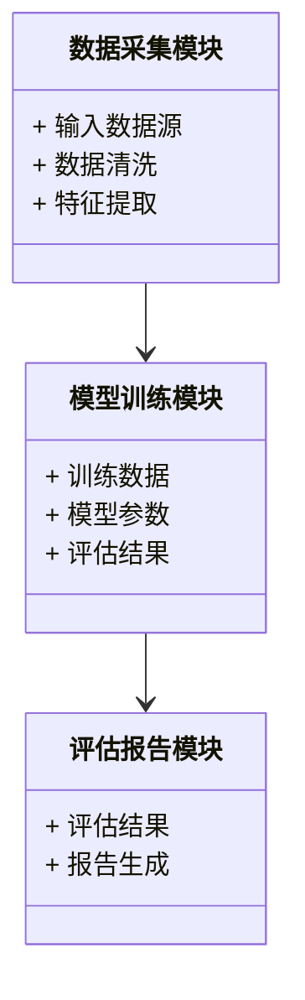
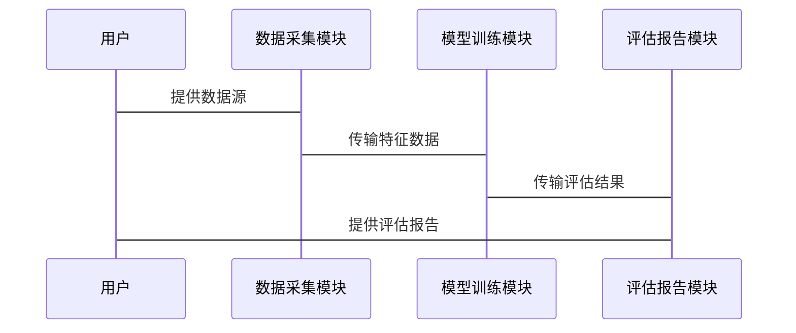

                 


# AI辅助企业并购目标筛选：战略匹配度评估与协同潜力分析

**关键词：** AI，企业并购，战略匹配度，协同潜力，机器学习，系统架构

**摘要：**  
本文探讨了如何利用人工智能技术辅助企业并购目标筛选，重点分析了战略匹配度评估与协同潜力分析的关键方法。文章从企业并购的基本概念出发，详细阐述了战略匹配度和协同潜力的核心要素，结合机器学习算法和系统架构设计，提出了基于AI的企业并购目标筛选解决方案。通过实际案例分析和代码实现，展示了如何利用AI技术提升企业并购的效率和成功率。

---

## 第一部分：背景介绍

### 第1章：企业并购的基本概念与AI的应用

#### 1.1 企业并购的定义与类型
企业并购（Mergers and Acquisitions，简称 M&A）是指两个或多个企业之间的合并或收购行为。常见的并购类型包括：
- **横向并购：** 同行业竞争对手之间的合并。
- **纵向并购：** 上下游企业之间的合并。
- **混合并购：** 无直接关联的企业之间的合并。

并购的核心目标是通过资源整合、协同效应和市场扩展，实现企业价值的最大化。

#### 1.2 并购中的挑战与AI的作用
传统的企业并购过程中，面临以下挑战：
- **信息不对称：** 目标企业的真实价值难以评估。
- **决策风险：** 并购后的整合难度大，协同效应难以实现。
- **效率低下：** 数据量大、分析复杂，传统方法耗时费力。

AI技术通过以下方式解决这些问题：
- **数据驱动决策：** 利用大数据分析目标企业的财务、市场和运营数据。
- **自动化评估：** 使用机器学习模型快速筛选和评估目标企业。
- **预测协同潜力：** 基于历史数据和算法模型，预测并购后的协同效应。

#### 1.3 本文的核心目标
本文旨在探讨如何利用AI技术辅助企业并购目标筛选，重点分析战略匹配度评估与协同潜力分析的关键方法。通过理论分析与实际案例结合，为读者提供一套完整的AI辅助并购解决方案。

---

## 第二部分：核心概念与联系

### 第2章：战略匹配度评估的核心要素

#### 2.1 战略匹配度的定义
战略匹配度是指并购双方在战略目标、核心能力和资源上的契合程度。它是企业并购成功与否的关键因素之一。

#### 2.2 战略匹配度的核心要素
以下是战略匹配度评估的主要指标：
- **战略一致性：** 并购双方的长期发展目标是否一致。
- **行业契合度：** 目标企业是否处于并购方的核心行业。
- **资源互补性：** 并购双方在资金、技术、人才等方面的互补性。

#### 2.3 战略匹配度的评估模型
以下是战略匹配度的评估模型：

| 指标 | 权重 | 计算公式 |
|------|------|----------|
| 战略一致性 | 40% | $$\text{一致性得分} = \frac{\text{战略目标匹配度}}{1.5} \times 0.4$$ |
| 行业契合度 | 30% | $$\text{契合度得分} = \frac{\text{行业相似度}}{1.2} \times 0.3$$ |
| 资源互补性 | 30% | $$\text{互补性得分} = \frac{\text{资源匹配度}}{1.1} \times 0.3$$ |

最终战略匹配度得分公式为：  
$$\text{战略匹配度} = \text{一致性得分} + \text{契合度得分} + \text{互补性得分}$$

#### 2.4 实体关系图（ER图）
以下是战略匹配度评估的ER图：

```mermaid
graph TD
    A[企业战略目标] --> B[并购目标]
    B --> C[战略一致性]
    B --> D[行业契合度]
    B --> E[资源互补性]
    C, D, E --> F[战略匹配度]
```

---

### 第3章：协同潜力分析的核心要素

#### 3.1 协同潜力的定义
协同潜力是指并购双方在整合后能够实现的成本节约、收入增长或效率提升的潜力。

#### 3.2 协同潜力的核心要素
以下是协同潜力的主要指标：
- **成本协同：** 并购双方在生产、采购和管理等方面的成本节约潜力。
- **收入协同：** 并购双方在市场拓展、客户共享等方面的收入增长潜力。
- **效率协同：** 并购双方在流程优化、技术共享等方面的效率提升潜力。

#### 3.3 协同潜力的评估模型
以下是协同潜力的评估模型：

| 指标 | 权重 | 计算公式 |
|------|------|----------|
| 成本协同 | 40% | $$\text{成本协同得分} = \frac{\text{成本节约潜力}}{2} \times 0.4$$ |
| 收入协同 | 30% | $$\text{收入协同得分} = \frac{\text{收入增长潜力}}{1.5} \times 0.3$$ |
| 效率协同 | 30% | $$\text{效率协同得分} = \frac{\text{效率提升潜力}}{1.2} \times 0.3$$ |

最终协同潜力得分公式为：  
$$\text{协同潜力} = \text{成本协同得分} + \text{收入协同得分} + \text{效率协同得分}$$

#### 3.4 实体关系图（ER图）
以下是协同潜力评估的ER图：

```mermaid
graph TD
    A[企业并购目标] --> B[成本协同]
    A --> C[收入协同]
    A --> D[效率协同]
    B, C, D --> E[协同潜力]
```

---

## 第三部分：算法原理讲解

### 第4章：战略匹配度评估算法

#### 4.1 算法概述
战略匹配度评估算法基于机器学习模型，通过以下步骤实现：
1. 数据预处理：清洗和特征提取。
2. 模型训练：使用随机森林或支持向量机（SVM）进行分类。
3. 模型评估：计算准确率、召回率和F1分数。

#### 4.2 算法流程图
以下是战略匹配度评估算法的流程图：



#### 4.3 数学模型与公式
以下是战略匹配度评估的数学模型：

$$
\text{预测匹配度} = \sum_{i=1}^{n} w_i \cdot x_i
$$

其中，$w_i$ 是第 $i$ 个特征的权重，$x_i$ 是第 $i$ 个特征的值。

---

### 第5章：协同潜力分析算法

#### 5.1 算法概述
协同潜力分析算法基于回归分析模型，通过以下步骤实现：
1. 数据预处理：清洗和特征提取。
2. 模型训练：使用线性回归或逻辑回归进行预测。
3. 模型评估：计算R平方值和残差分析。

#### 5.2 算法流程图
以下是协同潜力分析算法的流程图：


#### 5.3 数学模型与公式
以下是协同潜力分析的数学模型：

$$
\text{预测潜力} = \beta_0 + \beta_1 x_1 + \beta_2 x_2 + \dots + \beta_n x_n
$$

其中，$\beta_i$ 是回归系数，$x_i$ 是第 $i$ 个特征的值。

---

## 第四部分：系统分析与架构设计

### 第6章：系统功能设计

#### 6.1 系统功能模块
- 数据采集模块：采集目标企业的财务、市场和运营数据。
- 模型训练模块：训练战略匹配度和协同潜力评估模型。
- 评估报告模块：生成并购目标的评估报告。

#### 6.2 系统架构设计
以下是系统架构设计的类图：



#### 6.3 系统接口设计
以下是系统接口设计的序列图：



---

## 第五部分：项目实战

### 第7章：项目实现与代码解读

#### 7.1 环境安装
- Python 3.8+
- scikit-learn、pandas、numpy

#### 7.2 核心代码实现
以下是战略匹配度评估的代码实现：

```python
import pandas as pd
from sklearn.ensemble import RandomForestClassifier
from sklearn.metrics import accuracy_score, recall_score, f1_score

# 数据加载
data = pd.read_csv('merger_data.csv')

# 特征提取
X = data[['revenue', 'profit', 'employees']]
y = data['target']

# 模型训练
model = RandomForestClassifier()
model.fit(X, y)

# 模型预测
y_pred = model.predict(X)

# 模型评估
accuracy = accuracy_score(y, y_pred)
recall = recall_score(y, y_pred)
f1 = f1_score(y, y_pred)

print(f'Accuracy: {accuracy}')
print(f'Recall: {recall}')
print(f'F1 Score: {f1}')
```

---

## 第六部分：总结与展望

### 第8章：总结与最佳实践

#### 8.1 总结
本文通过理论分析与实际案例，展示了如何利用AI技术辅助企业并购目标筛选。战略匹配度评估与协同潜力分析是企业并购成功的关键，而AI技术能够显著提升并购的效率和成功率。

#### 8.2 最佳实践
- 在并购前，进行充分的数据分析和战略匹配度评估。
- 在并购后，注重资源整合和协同效应的实现。

#### 8.3 注意事项
- 数据质量是并购评估的基础，需确保数据的准确性和完整性。
- 模型的选择和调优是关键，需根据实际情况选择合适的算法。

#### 8.4 拓展阅读
- 《企业并购与价值评估》
- 《机器学习实战》
- 《企业战略管理》

---

**作者：** AI天才研究院/AI Genius Institute & 禅与计算机程序设计艺术/Zen And The Art of Computer Programming

