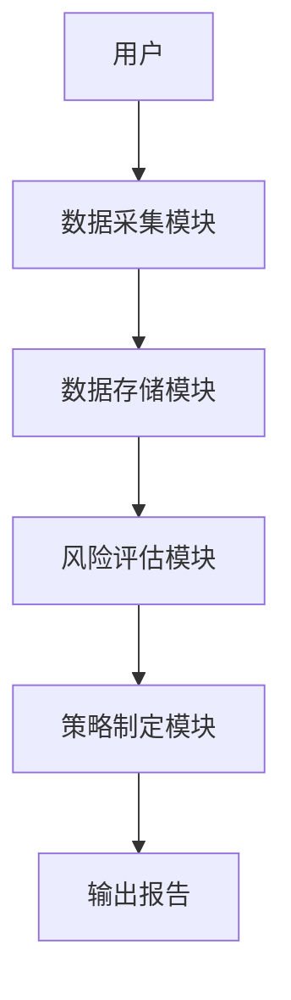

                 


# AI辅助企业并购风险评估与缓解策略

## 关键词：企业并购、人工智能、风险评估、风险管理、算法模型

## 摘要：  
企业并购是企业战略发展中的重要决策，但也伴随着诸多风险。本文将探讨如何利用人工智能技术辅助企业并购的风险评估与缓解策略。通过分析并购中的主要风险类型，构建基于机器学习的评估模型，并制定相应的缓解策略，帮助企业在并购过程中做出更明智的决策，降低潜在风险。

---

# 第1章：企业并购与AI技术概述

## 1.1 企业并购的基本概念

### 1.1.1 并购的定义与类型  
企业并购（Mergers and Acquisitions, M&A）是指企业之间通过合并、收购或其他形式，将两个或多个独立的实体整合为一个实体的过程。并购可以分为以下几种类型：  
1. **横向并购**：同一行业内的企业并购，旨在扩大市场份额或消除竞争。  
2. **纵向并购**：产业链上下游的企业并购，以增强供应链控制能力。  
3. **混合并购**：跨行业或跨领域的并购，以 diversify 业务组合。  

### 1.1.2 并购的动机与目标  
企业进行并购的动机通常包括：  
1. 获取技术或资源。  
2. 进入新市场或区域。  
3. 降低成本或提高效率。  
4. 增强市场地位。  

### 1.1.3 并购中的主要风险  
企业并购涉及多方面的风险，主要包括：  
1. **财务风险**：如目标企业的财务状况不佳或存在隐藏的债务。  
2. **市场风险**：如目标企业所在行业的竞争加剧或市场环境变化。  
3. **法律风险**：如目标企业存在法律纠纷或合规问题。  
4. **操作风险**：如并购后的整合困难或文化冲突。  
5. **伦理风险**：如并购涉及的利益相关者关系复杂，可能引发道德争议。  

---

## 1.2 AI技术的基本概念

### 1.2.1 人工智能的定义与分类  
人工智能（Artificial Intelligence, AI）是指通过计算机模拟人类智能的技术。AI可以分为以下几类：  
1. **狭义AI**：专注于特定任务的智能系统，如语音识别、图像识别等。  
2. **广义AI**：具备通用智能的系统，能够像人类一样理解和解决问题。  

### 1.2.2 机器学习与深度学习简介  
1. **机器学习**：通过数据训练模型，使其能够从数据中学习并做出预测或决策。  
2. **深度学习**：基于人工神经网络的机器学习方法，能够处理复杂的数据模式。  

### 1.2.3 自然语言处理在并购中的应用  
自然语言处理（NLP）技术可以帮助分析目标企业的文档、合同和新闻报道，提取关键信息，评估其风险。

---

## 1.3 AI在企业并购中的应用前景  

### 1.3.1 AI如何辅助风险评估  
AI可以通过分析历史并购案例、市场数据和目标企业的相关信息，预测潜在风险并提出规避建议。  

### 1.3.2 数据驱动的并购决策  
通过AI技术，企业可以基于大量数据进行分析，做出更科学的并购决策。  

### 1.3.3 AI在并购后的整合与管理中的作用  
并购完成后，AI可以帮助优化业务流程、整合数据和管理团队，提高整合效率。  

---

# 第2章：并购风险的分类与特征

## 2.1 并购风险的分类  

### 2.1.1 财务风险  
财务风险是并购中最常见的风险之一，主要源于目标企业财务状况不佳或存在隐藏债务。  

### 2.1.2 市场风险  
市场风险包括目标企业所在行业的竞争加剧或市场环境变化。  

### 2.1.3 法律风险  
法律风险涉及目标企业可能存在的法律纠纷或合规问题。  

### 2.1.4 操作风险  
操作风险源于并购后的整合困难或文化冲突。  

### 2.1.5 伦理风险  
伦理风险涉及并购涉及的利益相关者关系复杂，可能引发道德争议。  

---

## 2.2 每类风险的特征与影响  

### 2.2.1 财务风险的量化评估  
财务风险可以通过目标企业的财务报表和市场数据进行量化分析。  

### 2.2.2 市场风险的预测模型  
市场风险可以通过时间序列分析或机器学习模型进行预测。  

### 2.2.3 法律风险的合规性分析  
法律风险需要结合目标企业的历史记录和行业法规进行分析。  

### 2.2.4 操作风险的流程优化  
操作风险可以通过优化并购后的整合流程进行缓解。  

### 2.2.5 伦理风险的社会影响  
伦理风险可能影响企业的声誉和社会责任形象。  

---

# 第3章：基于AI的风险评估模型构建

## 3.1 数据收集与预处理  

### 3.1.1 数据来源与整合  
数据来源包括目标企业的财务报表、市场数据、新闻报道和法律文件等。  

### 3.1.2 数据清洗与特征工程  
数据清洗包括去除重复数据、处理缺失值和异常值。特征工程包括提取关键特征和进行特征转换。  

### 3.1.3 数据标注与标注工具  
数据标注是将数据进行分类或打标签，以便后续模型训练。  

---

## 3.2 模型选择与训练  

### 3.2.1 选择合适的机器学习模型  
根据风险类型和数据特征选择合适的模型，如逻辑回归、随机森林或神经网络。  

### 3.2.2 数据的特征选择与降维  
通过特征选择和降维技术（如PCA）优化模型性能。  

### 3.2.3 模型的训练与优化  
通过交叉验证和网格搜索优化模型参数，提高模型的泛化能力。  

---

## 3.3 模型评估与验证  

### 3.3.1 评估指标的选择  
常用的评估指标包括准确率、召回率、F1值和AUC曲线。  

### 3.3.2 交叉验证与过拟合问题  
通过交叉验证评估模型的泛化能力，避免过拟合。  

### 3.3.3 模型的调优与部署  
根据验证结果对模型进行调优，并将其部署到实际应用中。  

---

# 第4章：风险缓解策略的制定与实施

## 4.1 风险排序与优先级处理  

### 4.1.1 风险的优先级评估  
根据风险的影响程度和发生概率对风险进行排序。  

### 4.1.2 制定缓解策略的步骤  
1. 识别高风险领域。  
2. 制定具体的缓解措施。  
3. 实施措施并监控效果。  

### 4.1.3 策略的可行性分析  
评估缓解策略的成本和可行性。  

---

## 4.2 AI辅助策略的制定  

### 4.2.1 利用AI进行风险预测  
通过AI模型预测潜在风险，并制定相应的应对策略。  

### 4.2.2 数据驱动的决策支持  
利用数据和AI技术为并购决策提供支持。  

### 4.2.3 策略的动态调整  
根据市场变化和模型反馈动态调整缓解策略。  

---

## 4.3 风险缓解策略的实施  

### 4.3.1 并购前的风险缓解  
1. **尽职调查的优化**：通过AI技术提高尽职调查的效率和准确性。  
2. **风险评估报告的生成**：生成详细的并购风险评估报告。  
3. **并购条款的协商**：根据风险评估结果协商并购条款。  

### 4.3.2 并购后的整合与风险管理  
1. **企业文化整合**：通过AI技术分析目标企业文化，制定整合策略。  
2. **组织结构优化**：根据并购后的业务需求优化组织结构。  
3. **业务流程整合**：整合业务流程，提高运营效率。  

---

# 第5章：系统架构与实现

## 5.1 系统架构设计  

### 5.1.1 系统功能模块设计  
系统主要功能模块包括：  
1. **数据采集模块**：负责收集目标企业的相关数据。  
2. **风险评估模块**：基于AI模型进行风险评估。  
3. **策略制定模块**：根据评估结果制定缓解策略。  

### 5.1.2 系统架构图  
使用Mermaid绘制系统架构图如下：  



### 5.1.3 系统接口设计  
系统接口包括：  
1. 数据输入接口：接收目标企业的数据。  
2. 模型调用接口：调用AI模型进行风险评估。  
3. 报告生成接口：生成风险评估报告。  

---

## 5.2 系统实现与代码示例  

### 5.2.1 环境安装与配置  
需要安装以下工具和库：  
- Python 3.8及以上版本  
- TensorFlow、Scikit-learn、Pandas、Matplotlib  

### 5.2.2 核心代码实现  

#### 1. 数据预处理代码示例  

```python
import pandas as pd
import numpy as np

# 加载数据
data = pd.read_csv('并购数据.csv')

# 处理缺失值
data = data.dropna()

# 标准化处理
from sklearn.preprocessing import StandardScaler
scaler = StandardScaler()
scaled_data = scaler.fit_transform(data)
```

#### 2. 模型训练代码示例  

```python
from sklearn.model_selection import train_test_split
from sklearn.linear_model import LogisticRegression

# 划分训练集和测试集
X_train, X_test, y_train, y_test = train_test_split(scaled_data, target_labels, test_size=0.2)

# 训练模型
model = LogisticRegression()
model.fit(X_train, y_train)

# 模型评估
print("准确率：", model.score(X_test, y_test))
```

---

## 5.3 项目实战  

### 5.3.1 项目背景  
某企业计划收购一家科技公司，希望通过AI技术评估并购风险并制定缓解策略。  

### 5.3.2 项目实施  
1. **数据收集**：收集目标企业的财务报表、市场数据和法律文件。  
2. **风险评估**：使用AI模型评估并购中的主要风险。  
3. **策略制定**：根据评估结果制定风险缓解策略。  

---

## 5.4 实际案例分析  

### 5.4.1 案例介绍  
某企业通过AI技术评估目标企业的财务风险，发现目标企业存在较大的财务隐患，并通过协商调整并购条款，降低了财务风险。  

---

## 5.5 项目小结  
通过AI技术辅助企业并购风险评估与缓解策略的制定，可以显著提高并购决策的科学性和准确性，降低并购风险，提高并购成功的概率。  

---

# 第6章：结论与展望

## 6.1 总结  
本文详细探讨了AI技术在企业并购风险评估与缓解策略中的应用，提出了基于机器学习的风险评估模型，并制定了相应的风险缓解策略。  

## 6.2 展望  
未来，随着AI技术的不断发展，企业并购的风险评估与缓解策略将更加智能化和精准化，为企业创造更大的价值。  

---

# 参考文献  

1. John, D. (2020). *Artificial Intelligence in Business*. MIT Press.  
2. Smith, J. (2019). *Machine Learning for Finance*. Springer.  
3. Brown, T. (2021). *Risk Management in Mergers and Acquisitions*. Wiley.  

---

# 作者：AI天才研究院/AI Genius Institute & 禅与计算机程序设计艺术 /Zen And The Art of Computer Programming

