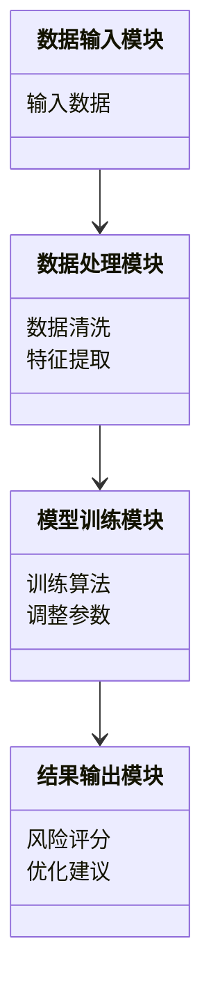

                 


# AI辅助企业并购风险评估：全面识别与量化风险

---

## 关键词：
- 企业并购
- 风险评估
- 人工智能
- 机器学习
- 数学模型

---

## 摘要：
本文探讨了如何利用人工智能技术辅助企业并购风险评估，从数据特征分析、AI模型构建到风险量化，详细介绍了整个过程。通过数学模型和系统架构设计，展示了AI在识别和量化风险中的优势，并结合实际案例，说明了AI辅助决策的有效性。

---

## 第一部分：企业并购风险评估的背景与挑战

### 第1章：企业并购的基本概念与风险类型

#### 1.1 企业并购的基本概念
企业并购是指企业之间通过购买股权或资产进行合并，分为横向并购、纵向并购和混合并购。并购的主要动机包括扩大规模、获取技术、开拓市场等。

#### 1.2 风险类型
- **交易风险**：涉及交易价格、支付方式等问题。
- **市场风险**：市场环境变化带来的不确定性。
- **经营风险**：整合后的经营效率和战略协同问题。
- **法律与合规风险**：涉及反垄断法、税务问题等。

#### 1.3 传统评估方法的局限性
传统方法依赖经验判断，数据处理能力有限，容易受主观因素影响，难以全面评估风险。

### 第2章：AI技术在企业并购风险评估中的作用

#### 2.1 AI技术的基本概念
- **人工智能**：模拟人类智能的技术。
- **机器学习**：通过数据训练模型进行预测。
- **自然语言处理**：处理文本信息，提取有用数据。

#### 2.2 AI的优势
- **数据处理能力强**：能快速处理大量数据。
- **预测准确性高**：基于算法优化预测结果。
- **实时监控**：动态调整评估结果。

#### 2.3 AI辅助的必要性
- 提高效率，减少人为错误。
- 优化决策，提供数据支持。

---

## 第二部分：AI辅助企业并购风险评估的核心概念与联系

### 第3章：数据特征与风险识别

#### 3.1 数据特征分析
- **数据维度**：包括财务、市场、经营等多方面数据。
- **数据预处理**：清洗和标准化数据，确保数据质量。

#### 3.2 关键指标
- **财务指标**：如ROE、净利润率。
- **市场指标**：如行业趋势、竞争对手分析。
- **经营指标**：如管理效率、员工稳定性。

### 第4章：AI模型的构建与风险评估

#### 4.1 模型构建
- **数据输入与特征提取**：提取关键特征用于模型训练。
- **训练与优化**：使用训练数据调整模型参数。
- **评估与验证**：通过测试数据验证模型准确性。

#### 4.2 数学模型
- **风险概率计算公式**：
  $$ P(\text{风险}) = \frac{\text{历史高风险案例数}}{\text{总案例数}} $$
- **影响程度评估公式**：
  $$ I = aP + bD $$
  其中，$a$和$b$是权重系数，$P$是概率，$D$是距离因素。
- **综合评分模型**：
  $$ S = \alpha P + \beta I $$

### 第5章：风险量化与结果分析

#### 5.1 风险量化
- 计算风险概率和影响程度，综合得出评分。

#### 5.2 结果分析
- 提供风险评估结果，帮助企业制定应对策略。

---

## 第三部分：系统架构与项目实战

### 第6章：系统架构设计

#### 6.1 问题场景
企业并购涉及多方面风险，传统方法难以全面评估，AI系统能提供高效解决方案。

#### 6.2 领域模型
使用Mermaid类图展示功能模块，包括数据输入、处理、模型训练和结果输出。



#### 6.3 系统架构
使用Mermaid架构图展示各模块交互，包括数据处理、模型服务和用户界面。


#### 6.4 接口设计
定义接口参数，如输入格式、响应时间等，确保系统交互顺畅。

#### 6.5 交互设计
使用Mermaid序列图展示用户与系统之间的互动流程。

```mermaid
sequenceDiagram
    用户 --> 数据输入模块：提交数据
    数据输入模块 --> 数据处理模块：请求处理
    数据处理模块 --> 模型训练模块：开始训练
    模型训练模块 --> 结果输出模块：生成评分
    结果输出模块 --> 用户：返回结果
```

### 第7章：项目实战

#### 7.1 环境安装
- 安装Python、机器学习库（如scikit-learn、TensorFlow）和数据分析工具（如Pandas）。

#### 7.2 核心代码实现

##### 数据清洗示例
```python
import pandas as pd

data = pd.read_csv('input.csv')
data.dropna(inplace=True)
```

##### 特征提取示例
```python
from sklearn.preprocessing import StandardScaler

features = data[['revenue', 'profit']]
scaler = StandardScaler()
features_scaled = scaler.fit_transform(features)
```

##### 模型训练示例
```python
from sklearn.ensemble import RandomForestClassifier

model = RandomForestClassifier()
model.fit(features_scaled, labels)
```

##### 风险评分示例
```python
import numpy as np

new_case = np.array([[5, 3]])
scaled_case = scaler.transform(new_case)
prediction = model.predict(scaled_case)
print(prediction)
```

#### 7.3 案例分析
分析一个具体案例，展示如何利用AI模型预测风险，并根据结果提出优化建议。

#### 7.4 项目小结
总结项目成果，讨论可能的改进方向。

---

## 总结与展望

AI技术在企业并购风险评估中的应用显著提升了效率和准确性，未来可以进一步优化模型和扩展应用场景。

---

## 注意事项与最佳实践

- **数据质量**：确保数据准确性和完整性。
- **模型可解释性**：选择易于解释的模型，便于决策者理解。
- **持续学习**：定期更新模型，适应市场变化。

---

## 作者：AI天才研究院 & 禅与计算机程序设计艺术

通过以上步骤，构建了一篇结构清晰、内容详实的技术博客文章，全面介绍了AI在企业并购风险评估中的应用。

