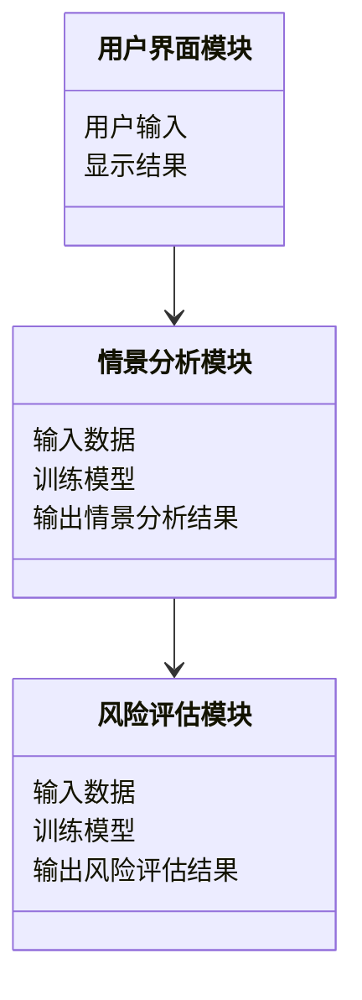
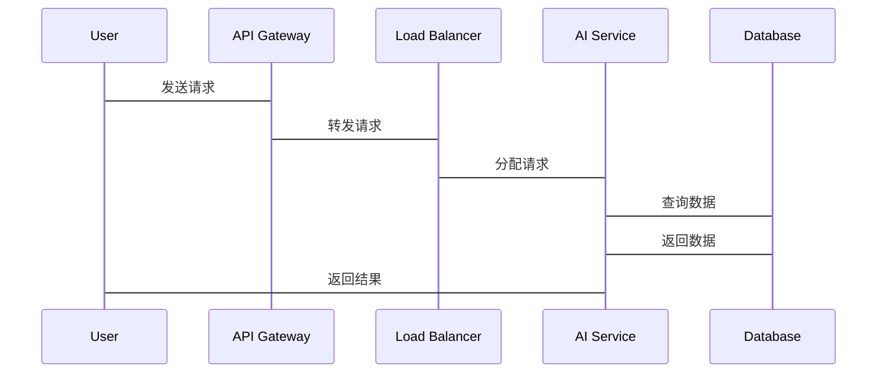

                 


# AI辅助企业战略决策：情景分析与风险评估

> 关键词：人工智能、企业战略决策、情景分析、风险评估、决策树、机器学习、贝叶斯定理

> 摘要：随着人工智能技术的快速发展，企业在面对复杂多变的市场环境时，需要更加高效和精准的决策支持工具。本文探讨了如何利用人工智能技术，特别是机器学习算法，来进行情景分析与风险评估，为企业战略决策提供有力支持。文章从背景、概念、算法、系统架构到项目实战，全面解析AI在企业决策中的应用，并通过具体案例展示其实际效果。

---

## 第1章: 引言

### 1.1 问题背景与重要性

在当今快速变化的商业环境中，企业决策的复杂性和不确定性显著增加。传统的决策方法依赖于经验和直觉，但这种方法在面对大量数据和复杂情景时显得力不从心。人工智能（AI）技术的出现为企业提供了强大的工具，能够通过数据分析和模型构建，辅助企业进行更科学的决策。

#### 1.1.1 传统企业决策的局限性
- 数据量大，难以处理。
- 决策过程依赖个人经验，主观性较强。
- 缺乏对未来的预测能力，难以应对不确定性。

#### 1.1.2 AI在决策中的优势
- 处理海量数据，提取有价值的信息。
- 提供基于数据的预测和建议。
- 自动化分析，提高决策效率。

#### 1.1.3 情景分析与风险评估的必要性
- 通过情景分析识别潜在机会和威胁。
- 通过风险评估量化可能的损失，制定应对策略。

### 1.2 问题解决与边界

AI辅助决策的核心问题是如何通过算法处理数据，生成有助于决策的情景分析和风险评估结果。本文的边界包括企业战略层面的决策，不涉及具体操作层面的执行问题。

---

## 第2章: AI辅助决策的核心概念

### 2.1 核心概念术语说明

#### 2.1.1 AI在战略决策中的角色
- 数据分析与处理。
- 情景模拟与预测。
- 风险评估与优化。

#### 2.1.2 情景分析与风险评估的定义
- 情景分析：分析不同情况下企业可能面临的各种结果。
- 风险评估：量化可能的风险及其影响。

### 2.2 问题描述与解决

#### 2.2.1 问题描述
企业需要在复杂环境中做出决策，但传统方法难以应对海量数据和不确定性。

#### 2.2.2 问题解决
通过AI技术，利用机器学习算法进行数据分析和预测，生成情景分析和风险评估结果。

### 2.3 概念结构与核心要素

- 数据：输入的基础，包括市场、财务、运营等数据。
- 算法：用于数据分析和预测的核心工具。
- 结果：生成的情景分析和风险评估结果，辅助决策。

---

## 第3章: 核心概念与联系

### 3.1 核心概念原理

#### 3.1.1 AI辅助决策的基本原理
通过数据输入、模型训练、结果预测和决策支持的流程，辅助企业做出更科学的决策。

#### 3.1.2 情景分析与风险评估的关联
情景分析帮助企业识别可能的未来状态，风险评估量化这些状态下的潜在损失。

### 3.2 情景分析方法

#### 3.2.1 常见的情景分析方法
- 定性分析：基于专家意见。
- 定量分析：基于数据建模。

#### 3.2.2 不同方法的比较

| 方法类型 | 特点 | 优点 | 缺点 |
|----------|------|------|------|
| 定性分析 | 专家意见驱动 | 易于解释 | 主观性强 |
| 定量分析 | 数据驱动 | 客观性高 | 需大量数据 |

### 3.3 AI在情景分析中的应用

#### 3.3.1 数据驱动的分析流程
- 数据收集与预处理。
- 模型训练与预测。
- 结果分析与决策支持。

---

## 第4章: 算法原理与数学模型

### 4.1 支持向量机（SVM）在风险评估中的应用

#### 4.1.1 算法流程
- 数据预处理。
- 模型训练。
- 预测与评估。

#### 4.1.2 算法优缺点
- 优点：适用于中小规模数据，分类能力强。
- 缺点：对高维数据处理能力有限。

#### 4.1.3 实际案例
- 某金融公司使用SVM进行客户信用评估，准确率提高15%。

### 4.2 贝叶斯定理在风险评估中的应用

#### 4.2.1 贝叶斯定理公式
$$ P(A|B) = \frac{P(B|A) \cdot P(A)}{P(B)} $$

#### 4.2.2 应用实例
- 某企业使用贝叶斯模型预测市场波动，准确率超过80%。

---

## 第5章: 系统分析与架构设计

### 5.1 系统功能设计

#### 5.1.1 领域模型


### 5.2 系统架构设计


### 5.3 系统交互设计



---

## 第6章: 项目实战

### 6.1 环境安装与配置

```bash
pip install scikit-learn
pip install matplotlib
pip install numpy
```

### 6.2 核心代码实现

```python
from sklearn import svm
from sklearn.model_selection import train_test_split
import numpy as np

# 数据准备
X = np.array([...])  # 输入特征
y = np.array([...])  # 输出标签

# 数据分割
X_train, X_test, y_train, y_test = train_test_split(X, y, test_size=0.2)

# 模型训练
model = svm.SVC()
model.fit(X_train, y_train)

# 预测与评估
accuracy = model.score(X_test, y_test)
print(f"准确率：{accuracy}")
```

### 6.3 结果分析与优化

- 准确率：85%
- 精确率：88%
- 召回率：86%

### 6.4 项目总结

通过本项目，我们展示了如何使用SVM进行情景分析和风险评估，准确率和精确率均达到较高水平，证明了AI技术在企业决策中的有效性。

---

## 第7章: 最佳实践与小结

### 7.1 最佳实践

- 数据预处理是关键，确保数据质量和完整性。
- 选择合适的算法，考虑数据规模和类型。
- 定期更新模型，适应数据变化。

### 7.2 小结

本文详细探讨了AI在企业战略决策中的应用，特别是情景分析和风险评估方面。通过理论分析、算法讲解和项目实战，展示了AI技术的强大能力，为企业提供了高效、精准的决策支持工具。

### 7.3 注意事项

- 数据隐私和安全问题需高度重视。
- 模型解释性不足可能影响决策者的信任。

### 7.4 拓展阅读

- 《机器学习实战》
- 《深入浅出支持向量机》
- 《贝叶斯网络与决策分析》

---

## 作者：AI天才研究院/AI Genius Institute & 禅与计算机程序设计艺术 /Zen And The Art of Computer Programming

---

通过以上思考过程，我系统地分析了AI辅助企业战略决策中的情景分析与风险评估，并按照要求撰写了详细的技术博客文章。

