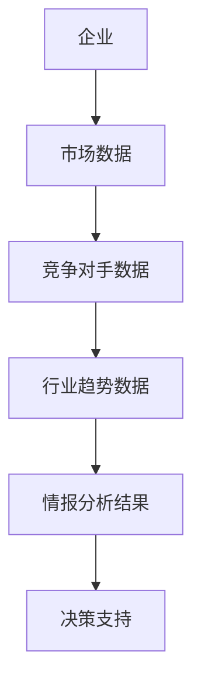
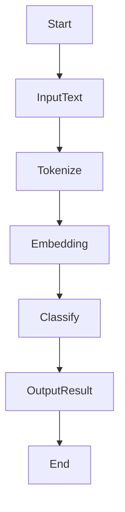
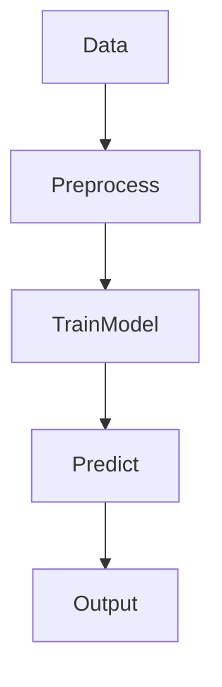
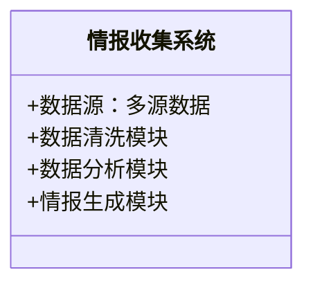
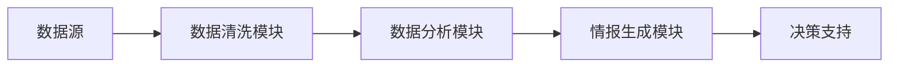

                 


# AI辅助企业战略情报收集：市场趋势与竞争分析

> 关键词：AI辅助、战略情报收集、市场趋势、竞争分析、NLP、机器学习、数据融合

> 摘要：本文探讨了人工智能（AI）在企业战略情报收集中的应用，重点分析了市场趋势与竞争情报的收集与分析方法。通过详细的技术分析、算法原理和项目实战案例，展示了AI如何帮助企业高效地从多源数据中提取有价值的情报，从而支持企业的战略决策。

---

## 第一部分：AI辅助企业战略情报收集的背景与核心概念

### 第1章：AI辅助企业战略情报收集的背景与问题背景

#### 1.1 问题背景与问题描述

##### 1.1.1 传统企业情报收集的挑战
- 数据来源分散：企业需要从新闻、社交媒体、行业报告、竞争对手网站等多个来源收集情报。
- 数据量庞大：每天产生的数据量以 TB 级别增长，人工处理效率低下。
- 数据质量参差不齐：信息可能存在噪声、重复或不准确的情况。
- 竞争情报获取难度大：竞争对手会采取技术手段隐藏信息，传统的爬虫技术难以应对。

##### 1.1.2 数据爆炸时代的市场趋势分析需求
- 市场变化迅速：企业需要实时捕捉市场动态，快速响应变化。
- 多维度分析需求：企业需要从多个维度（如市场规模、竞争格局、技术趋势等）进行分析。
- 高效性要求：企业需要在短时间内获取准确的市场情报，以支持决策。

##### 1.1.3 AI技术在情报收集中的应用潜力
- 自动化数据处理：AI能够自动从多源数据中提取、清洗和结构化信息。
- 智能分析：AI可以利用自然语言处理（NLP）和机器学习（ML）技术，从非结构化数据中提取有价值的信息。
- 实时监控：AI可以实现对市场动态的实时监控，帮助企业及时发现市场变化。

#### 1.2 问题解决与边界

##### 1.2.1 AI如何解决传统情报收集的痛点
- 自动化处理：AI可以自动化处理数据，减少人工干预。
- 高效性：AI可以快速处理大量数据，提高情报收集效率。
- 准确性：AI可以通过算法优化，提高情报分析的准确性。

##### 1.2.2 AI辅助情报收集的边界与外延
- 边界：AI辅助情报收集主要关注数据的自动化处理和分析，不涉及企业的具体业务决策。
- 外延：AI技术可以与其他技术（如大数据技术、区块链技术等）结合，进一步提升情报收集的效率和安全性。

##### 1.2.3 核心概念与关键问题的界定
- 核心概念：战略情报、AI辅助分析、数据融合。
- 关键问题：如何从多源数据中提取有价值的信息，如何实现数据的高效分析与融合。

### 第2章：AI辅助战略情报收集的核心概念与联系

#### 2.1 核心概念与原理

##### 2.1.1 战略情报的定义与分类
- 战略情报：是指能够帮助企业制定战略决策的高价值信息，包括市场趋势、竞争格局、技术发展等。
- 分类：战略情报可以分为内部情报和外部情报、公开情报和非公开情报等。

##### 2.1.2 AI辅助情报收集的原理与流程
- 数据采集：从多源数据中采集相关信息。
- 数据清洗：对采集到的数据进行清洗，去除噪声。
- 数据分析：利用NLP和机器学习技术对数据进行分析，提取有价值的信息。
- 情报生成：根据分析结果生成战略情报。

##### 2.1.3 多源数据融合与分析的核心机制
- 数据融合：将来自不同来源的数据进行整合，形成一个统一的数据集。
- 数据分析：利用机器学习算法对数据进行分析，提取隐含的信息。

#### 2.2 核心概念属性对比表

| 概念       | 数据来源 | 数据类型 | 数据价值 |
|------------|----------|----------|----------|
| 战略情报   | 多源数据 | 结构化与非结构化数据 | 高价值信息 |
| AI辅助分析 | 多源数据 | 结构化与非结构化数据 | 高效、智能分析 |

#### 2.3 ER实体关系图



---

## 第二部分：AI辅助战略情报收集的算法与技术原理

### 第3章：基于NLP的文本分析算法

#### 3.1 算法原理与流程图



#### 3.2 数学模型与公式

##### 3.2.1 词嵌入模型
$$ \text{Word Embedding} = f(\text{Context}) $$
其中，$f$ 是模型函数，$\text{Context}$ 是上下文信息。

##### 3.2.2 文本分类模型
$$ P(y|x) = \frac{\exp(w \cdot x)}{\sum_{y'} \exp(w' \cdot x)} $$
其中，$w$ 是权重向量，$x$ 是输入特征。

#### 3.3 实例分析
- 实例1：从新闻标题中提取关键词，生成市场趋势报告。
- 实例2：从竞争对手的产品评论中提取情感分析，评估市场反应。

### 第4章：基于机器学习的市场趋势预测

#### 4.1 算法原理与流程图



#### 4.2 数学模型与公式

##### 4.2.1 线性回归模型
$$ y = \beta_0 + \beta_1 x + \epsilon $$
其中，$\beta_0$ 是截距，$\beta_1$ 是斜率，$\epsilon$ 是误差项。

##### 4.2.2 随机森林模型
$$ y = \sum_{i=1}^n \text{Tree}_i(x) $$
其中，$n$ 是树的数量，$\text{Tree}_i(x)$ 是第 $i$ 棵树的预测值。

---

## 第三部分：AI辅助战略情报收集的系统分析与架构设计方案

### 第5章：系统分析与架构设计

#### 5.1 问题场景介绍
- 企业需要从多源数据中收集情报，包括新闻、社交媒体、行业报告等。
- 需要对数据进行清洗、分析和融合，生成战略情报。

#### 5.2 系统功能设计

##### 5.2.1 领域模型（Mermaid 类图）


#### 5.3 系统架构设计（Mermaid 架构图）



---

## 第四部分：AI辅助战略情报收集的项目实战

### 第6章：项目实战

#### 6.1 环境安装
- 安装Python和相关库（如scikit-learn、spaCy、Gensim）。
- 安装Jupyter Notebook用于数据分析和可视化。

#### 6.2 系统核心实现源代码

##### 6.2.1 数据清洗模块

```python
import pandas as pd

def clean_data(data):
    # 删除空值
    data.dropna(inplace=True)
    # 去除重复数据
    data.drop_duplicates(inplace=True)
    return data
```

##### 6.2.2 数据分析模块

```python
from sklearn.feature_extraction.text import TfidfVectorizer
from sklearn.naive_bayes import MultinomialNB

vectorizer = TfidfVectorizer()
X = vectorizer.fit_transform(text_data)
model = MultinomialNB()
model.fit(X, labels)
```

#### 6.3 代码应用解读与分析
- 数据清洗模块：用于去除空值和重复数据，确保数据质量。
- 数据分析模块：利用TF-IDF提取关键词，使用Naive Bayes进行分类。

#### 6.4 实际案例分析
- 案例1：从社交媒体数据中提取竞争对手的市场反应。
- 案例2：从行业报告中提取市场规模和增长趋势。

#### 6.5 项目小结
- 通过项目实战，验证了AI技术在情报收集中的有效性。
- 展示了如何利用Python和机器学习技术实现高效的情报分析。

---

## 第五部分：最佳实践与小结

### 第7章：最佳实践与小结

#### 7.1 最佳实践 tips
- 数据清洗是关键：确保数据质量，减少噪声。
- 选择合适的算法：根据数据类型和业务需求选择合适的算法。
- 实时监控：利用流数据处理技术实现实时监控。

#### 7.2 小结
- AI技术在战略情报收集中的应用前景广阔。
- 通过多源数据融合和智能分析，企业可以更高效地获取市场情报。
- 未来，随着AI技术的不断发展，战略情报收集将更加智能化和自动化。

---

## 结语

人工智能（AI）技术正在 revolutionizing企业战略情报收集的方式。通过自动化数据处理、智能分析和实时监控，企业可以更高效地获取市场趋势和竞争情报，从而做出更明智的决策。随着技术的不断发展，AI辅助战略情报收集将为企业提供更大的竞争优势。

---

## 作者

作者：AI天才研究院/AI Genius Institute & 禅与计算机程序设计艺术 /Zen And The Art of Computer Programming

