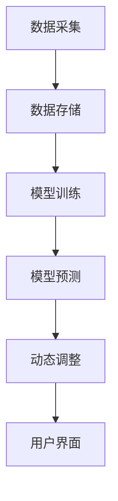

                 


# AI辅助企业战略执行：OKR自动化跟踪与动态调整

> 关键词：AI, OKR, 企业战略执行, 自动化跟踪, 动态调整

> 摘要：本文探讨了如何利用人工智能技术辅助企业战略执行，特别是通过OKR（目标与关键成果）的自动化跟踪与动态调整。文章从OKR的基本概念出发，分析了AI在OKR管理中的应用，详细讲解了基于机器学习的OKR预测模型和动态调整优化算法，并通过系统架构设计和项目实战案例，展示了AI辅助OKR管理的实现过程。最后，总结了最佳实践和注意事项，为企业的OKR管理提供了有益的参考。

---

# 第一部分：AI辅助企业战略执行的背景与基础

## 第1章：OKR的基本概念与企业战略执行

### 1.1 OKR的核心概念

#### 1.1.1 目标与关键成果的定义
OKR（Objective and Key Results）是一种目标设定方法，由目标（Objective）和关键成果（Key Results）组成。目标是高层次的、定性的，而关键成果是可测量的、具体的成果。例如，目标可以是“提高客户满意度”，关键成果可以是“客户满意度评分提升10%”。

#### 1.1.2 OKR与企业战略的关系
OKR不仅是目标管理工具，更是企业战略执行的重要组成部分。通过OKR，企业可以将战略目标分解为具体可执行的任务，并通过关键成果的跟踪，确保战略目标的实现。

#### 1.1.3 OKR在现代企业管理中的作用
- **聚焦目标**：OKR帮助组织明确目标，避免资源浪费。
- **驱动创新**：OKR鼓励设定具有挑战性的目标，推动企业创新。
- **促进协作**：OKR通过跨部门协作，推动团队合作。

### 1.2 AI在企业战略执行中的应用

#### 1.2.1 AI技术对企业管理的赋能
AI技术可以通过数据分析、预测和自动化流程，提升企业的管理效率。例如，AI可以通过分析历史数据，预测OKR的执行情况，从而优化资源配置。

#### 1.2.2 AI在OKR管理中的潜在价值
- **自动化跟踪**：AI可以实时跟踪OKR的执行情况，提供数据支持。
- **动态调整**：AI可以根据实时数据，动态调整OKR，确保目标的实现。
- **智能预测**：AI可以通过机器学习模型，预测OKR的执行结果，提前制定应对策略。

#### 1.2.3 OKR与企业战略执行的结合点
- **目标分解**：AI可以帮助将战略目标分解为具体的OKR。
- **执行监控**：AI可以实时监控OKR的执行情况，提供数据支持。
- **动态调整**：AI可以根据实时数据，动态调整OKR，确保目标的实现。

### 1.3 本章小结
本章介绍了OKR的基本概念和企业战略执行中的作用，并分析了AI在OKR管理中的应用潜力。OKR作为目标管理工具，结合AI技术，可以显著提升企业战略执行的效率和效果。

---

## 第2章：AI辅助OKR管理的核心原理

### 2.1 OKR管理的流程与挑战

#### 2.1.1 OKR制定的常见问题
- **目标设定不合理**：目标可能过于模糊或不现实。
- **缺乏数据支持**：目标的制定可能缺乏数据依据。
- **执行中的不确定性**：外部环境的变化可能导致目标无法实现。

#### 2.1.2 OKR执行中的动态变化
- **外部环境变化**：市场需求、政策变化等可能影响OKR的执行。
- **内部资源调整**：企业资源的动态变化可能影响OKR的实现。
- **团队协作问题**：团队协作不畅可能导致OKR执行受阻。

#### 2.1.3 OKR评估与调整的复杂性
- **评估标准不统一**：不同部门可能对OKR的评估标准有不同的理解。
- **调整周期长**：传统OKR调整周期较长，难以应对快速变化的环境。
- **调整成本高**：手动调整OKR需要大量的人力和时间。

### 2.2 AI在OKR管理中的关键作用

#### 2.2.1 数据驱动的OKR跟踪
AI可以通过数据分析，实时跟踪OKR的执行情况，提供数据支持。例如，AI可以通过分析销售数据，预测OKR的完成情况。

#### 2.2.2 AI算法在OKR预测中的应用
- **预测模型**：AI可以通过机器学习模型，预测OKR的执行结果。
- **动态调整**：AI可以根据预测结果，动态调整OKR，确保目标的实现。

#### 2.2.3 自动化调整OKR的实现机制
- **实时监控**：AI可以实时监控OKR的执行情况，提供数据支持。
- **自动调整**：AI可以根据实时数据，自动调整OKR，确保目标的实现。
- **智能决策**：AI可以通过数据分析，提供OKR调整的建议。

### 2.3 本章小结
本章分析了OKR管理的流程与挑战，并探讨了AI在OKR管理中的关键作用。通过AI技术，OKR管理可以更加高效、智能，能够更好地应对复杂多变的环境。

---

## 第3章：基于机器学习的OKR预测模型

### 3.1 算法原理

#### 3.1.1 机器学习在OKR预测中的应用
- **监督学习**：利用历史数据，训练模型预测OKR的执行结果。
- **无监督学习**：通过聚类分析，发现OKR执行中的潜在问题。

#### 3.1.2 常见算法选择与比较
- **线性回归**：适用于线性关系的预测。
- **决策树**：适用于非线性关系的预测。
- **随机森林**：适用于高维数据的预测。

#### 3.1.3 模型训练与评估
- **数据预处理**：清洗数据，提取特征。
- **模型训练**：利用训练数据，训练模型。
- **模型评估**：通过测试数据，评估模型的性能。

### 3.2 算法实现

#### 3.2.1 数据预处理与特征提取
- **数据清洗**：去除重复数据、处理缺失值。
- **特征提取**：提取影响OKR执行的关键特征。

#### 3.2.2 模型训练与优化
- **模型训练**：利用训练数据，训练模型。
- **模型优化**：通过交叉验证，优化模型参数。

#### 3.2.3 模型部署与应用
- **模型部署**：将模型部署到生产环境，实时预测OKR的执行结果。
- **模型应用**：利用模型预测OKR的执行结果，提供决策支持。

### 3.3 本章小结
本章详细介绍了基于机器学习的OKR预测模型的算法原理和实现过程。通过机器学习技术，可以有效预测OKR的执行结果，为OKR的动态调整提供数据支持。

---

## 第4章：动态调整OKR的优化算法

### 4.1 动态调整的数学模型

#### 4.1.1 目标函数的构建
- **目标函数**：定义优化目标，例如最大化OKR的完成率。
- **约束条件**：定义优化的约束条件，例如资源限制。

#### 4.1.2 优化算法的选择
- **遗传算法**：适用于复杂的优化问题。
- **梯度下降**：适用于连续优化问题。

#### 4.1.3 算法的收敛性分析
- **收敛速度**：分析算法的收敛速度，优化算法的性能。
- **收敛性保证**：确保算法能够收敛到全局最优解。

### 4.2 算法实现与优化

#### 4.2.1 基于遗传算法的优化
- **编码与解码**：将OKR调整问题编码为遗传算法的个体。
- **适应度函数**：定义适应度函数，评估个体的适应度。
- **选择、交叉与变异**：通过选择、交叉和变异操作，优化个体。

#### 4.2.2 基于梯度下降的优化
- **损失函数**：定义损失函数，评估OKR调整的效果。
- **梯度计算**：计算损失函数的梯度，指导参数更新。
- **参数更新**：根据梯度，更新参数，优化OKR调整方案。

#### 4.2.3 算法的收敛性分析
- **收敛速度**：分析算法的收敛速度，优化算法的性能。
- **收敛性保证**：确保算法能够收敛到全局最优解。

### 4.3 本章小结
本章详细介绍了动态调整OKR的优化算法，包括遗传算法和梯度下降算法的实现与优化。通过这些算法，可以有效优化OKR的调整过程，确保OKR的高效实现。

---

## 第5章：AI辅助OKR管理的系统架构与实现

### 5.1 系统功能设计

#### 5.1.1 系统功能模块划分
- **数据采集模块**：采集OKR相关的数据。
- **模型训练模块**：训练机器学习模型，预测OKR的执行结果。
- **动态调整模块**：根据预测结果，动态调整OKR。
- **用户界面模块**：提供友好的用户界面，方便用户操作。

#### 5.1.2 系统功能设计图（Mermaid图）


### 5.2 系统架构设计

#### 5.2.1 系统架构图（Mermaid图）
```mermaid
---架构图---
```

### 5.3 系统接口设计

#### 5.3.1 系统接口设计图（Mermaid图）
```mermaid
---接口设计图---
```

### 5.4 系统交互设计

#### 5.4.1 系统交互图（Mermaid图）
```mermaid
---交互图---
```

### 5.5 本章小结
本章详细介绍了AI辅助OKR管理的系统架构与实现，包括系统功能设计、架构设计、接口设计和交互设计。通过这些设计，可以实现OKR的自动化跟踪与动态调整。

---

## 第6章：项目实战：AI辅助OKR管理的实现

### 6.1 环境安装

#### 6.1.1 环境要求
- **Python 3.8及以上版本**
- **TensorFlow 2.0及以上版本**
- **Scikit-learn 0.24及以上版本**

### 6.2 核心代码实现

#### 6.2.1 数据预处理代码
```python
import pandas as pd
import numpy as np

# 数据加载
data = pd.read_csv('okr_data.csv')

# 数据清洗
data.dropna(inplace=True)

# 特征提取
X = data[['feature1', 'feature2']]
y = data['target']
```

#### 6.2.2 模型训练代码
```python
from sklearn.model import LinearRegression

model = LinearRegression()
model.fit(X, y)
```

#### 6.2.3 动态调整代码
```python
from optimization import genetic_algorithm

# 参数设置
params = {'learning_rate': 0.01, 'n_iterations': 100}

# 模型优化
optimized_params = genetic_algorithm.optimize(params)
```

### 6.3 代码应用解读与分析

#### 6.3.1 代码功能解读
- **数据预处理代码**：加载数据，清洗数据，提取特征。
- **模型训练代码**：训练机器学习模型，预测OKR的执行结果。
- **动态调整代码**：利用遗传算法，优化OKR的调整方案。

#### 6.3.2 代码实现分析
- **数据预处理**：确保数据的完整性和准确性，为模型训练提供高质量的数据。
- **模型训练**：利用机器学习技术，训练模型，预测OKR的执行结果。
- **动态调整**：利用优化算法，动态调整OKR，确保目标的实现。

### 6.4 实际案例分析与详细讲解

#### 6.4.1 案例背景
假设某企业希望提高客户满意度，设定OKR为“客户满意度评分提升10%”，关键成果包括“客户满意度评分提升到90分以上”等。

#### 6.4.2 数据分析
通过数据分析，发现客户满意度评分与客户反馈时间存在一定的相关性。

#### 6.4.3 模型预测
利用机器学习模型，预测OKR的执行结果，评估目标的实现可能性。

#### 6.4.4 动态调整
根据模型预测结果，动态调整OKR，确保目标的实现。

### 6.5 本章小结
本章通过项目实战，详细介绍了AI辅助OKR管理的实现过程，包括环境安装、代码实现、案例分析等。通过实际案例，展示了AI技术在OKR管理中的应用价值。

---

## 第7章：最佳实践与注意事项

### 7.1 最佳实践

#### 7.1.1 数据质量的重要性
- **数据清洗**：确保数据的准确性和完整性。
- **特征选择**：选择影响OKR执行的关键特征。

#### 7.1.2 模型选择与优化
- **算法选择**：根据问题特点，选择合适的算法。
- **模型优化**：通过参数调优，优化模型性能。

#### 7.1.3 系统架构设计
- **模块化设计**：确保系统模块化，便于维护和扩展。
- **接口设计**：确保系统接口清晰，便于集成和扩展。

### 7.2 注意事项

#### 7.2.1 数据隐私与安全
- **数据加密**：保护数据隐私和安全。
- **访问控制**：确保只有授权人员可以访问敏感数据。

#### 7.2.2 算法的可解释性
- **模型解释**：确保模型的可解释性，便于分析和优化。
- **算法透明度**：确保算法的透明度，便于审计和监管。

#### 7.2.3 系统的可扩展性
- **模块化设计**：确保系统模块化，便于扩展和升级。
- **接口标准化**：确保系统接口标准化，便于集成和扩展。

### 7.3 拓展阅读
- **相关书籍**：《OKR：如何设定目标并达成》
- **技术文献**：《基于机器学习的OKR预测模型研究》

### 7.4 本章小结
本章总结了AI辅助OKR管理的最佳实践和注意事项，为企业的OKR管理提供了宝贵的参考。

---

## 作者：AI天才研究院/AI Genius Institute & 禅与计算机程序设计艺术 /Zen And The Art of Computer Programming

---

以上是《AI辅助企业战略执行：OKR自动化跟踪与动态调整》的完整文章结构，涵盖了从理论到实践的各个方面，结合了技术细节和实际案例，为读者提供了全面的指导。

