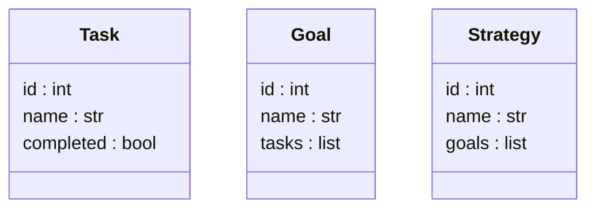

                 


# AI辅助企业战略执行：任务分解与进度监控

## 关键词：人工智能、战略执行、任务分解、进度监控、系统架构、算法原理

## 摘要：本文系统阐述了如何利用人工智能技术辅助企业战略执行，重点分析了任务分解与进度监控的核心概念、算法原理及系统架构，并通过实战案例展示了AI在提升企业战略执行效率中的实际应用。文章内容涵盖背景分析、概念解析、算法实现、系统设计和项目实践，旨在为企业管理者和技术人员提供理论指导和实践参考。

---

# 第1章：AI辅助企业战略执行的背景

## 1.1 核心概念术语说明
- **企业战略执行**：指企业在实现其长期目标的过程中，通过制定和实施具体策略的过程。
- **任务分解**：将战略目标分解为具体可执行的任务，便于管理和监控。
- **进度监控**：实时跟踪任务执行情况，评估进度偏差，并采取调整措施。

## 1.2 问题背景与描述
企业在执行战略时常常面临以下挑战：
- **目标模糊**：战略目标过于宽泛，难以分解为具体任务。
- **执行低效**：任务执行过程中缺乏实时监控和调整机制。
- **资源分配不当**：资源分配不合理，导致任务执行效率低下。

## 1.3 问题解决与边界
- **AI的解决方案**：利用AI技术进行任务分解和进度监控，提高战略执行效率。
- **边界与外延**：AI辅助战略执行的范围不包括战略制定和资源分配的初始阶段。

---

# 第2章：AI辅助战略执行的核心概念

## 2.1 核心概念分析
- **任务分解**：将战略目标分解为具体任务，明确每个任务的目标、责任和时间。
- **进度监控**：实时跟踪任务进度，分析偏差并提出调整建议。

## 2.2 相关概念对比
| 概念 | 描述 | 区别 |
|------|------|------|
| 任务分解 | 将战略目标拆解为具体任务 | 侧重于结构化分解 |
| 项目管理 | 通过计划、执行、监控和收尾完成项目 | 更广泛，涵盖整个项目周期 |

## 2.3 实体关系图与流程图
```mermaid
erDiagram
    customer[企业战略目标] --> task[任务分解]
    task --> progress[进度监控]
    progress --> result[执行结果]
```

---

# 第3章：AI辅助任务分解与进度监控的算法原理

## 3.1 任务分解算法
### 3.1.1 分解策略
- **层次分解法**：将战略目标分解为多个子目标，每个子目标进一步分解为任务。
- **优先级排序**：根据任务的重要性和紧急性进行排序。

### 3.1.2 数学模型
$$ \text{总任务数} = \sum_{i=1}^{n} \text{子目标分解任务数} $$

### 3.1.3 Python实现
```python
def decompose_tasks(strategy):
    tasks = []
    for goal in strategy.goals:
        subtasks = goal.decompose()
        tasks.extend(subtasks)
    return tasks
```

## 3.2 进度监控算法
### 3.2.1 监控指标
- **完成率**：任务完成的比例。
- **偏差分析**：实际进度与计划进度的差异。

### 3.2.2 数学模型
$$ \text{完成率} = \frac{\text{已完成任务数}}{\text{总任务数}} \times 100\% $$

### 3.2.3 Python实现
```python
def monitor_progress(tasks):
    completed = sum(1 for task in tasks if task.completed)
    progress = (completed / len(tasks)) * 100
    return progress
```

---

# 第4章：系统架构与接口设计

## 4.1 项目场景介绍
- 系统名称：AI辅助战略执行管理系统。
- 功能模块：任务分解模块、进度监控模块、数据存储模块。

## 4.2 功能设计与类图


## 4.3 系统架构图


---

# 第5章：项目实战

## 5.1 环境安装与配置
- 安装Python和相关库（如pandas、numpy）。
- 配置AI模型（如TensorFlow或PyTorch）。

## 5.2 核心代码实现
```python
from datetime import datetime

class Task:
    def __init__(self, name):
        self.name = name
        self.start_time = None
        self.end_time = None
        self.completed = False

    def start(self):
        self.start_time = datetime.now()
        print(f"任务 {self.name} 已启动。")

    def complete(self):
        self.end_time = datetime.now()
        self.completed = True
        print(f"任务 {self.name} 已完成。")

class Goal:
    def __init__(self, name):
        self.name = name
        self.tasks = []

    def add_task(self, task):
        self.tasks.append(task)

    def decompose(self):
        # 示例分解逻辑
        return [Task(f"子任务{i+1}") for i in range(3)]

class Strategy:
    def __init__(self, name):
        self.name = name
        self.goals = []

    def add_goal(self, goal):
        self.goals.append(goal)

    def decompose(self):
        for goal in self.goals:
            goal.decompose()
```

## 5.3 案例分析与解读
- **案例背景**：某企业战略目标为“提高市场份额”。
- **任务分解**：将目标分解为市场调研、产品优化、营销推广等任务。
- **进度监控**：实时跟踪每个任务的完成情况，调整资源分配。

---

# 第6章：总结与最佳实践

## 6.1 小结
AI辅助企业战略执行的关键在于任务分解和进度监控的自动化，通过算法优化和系统设计提升执行效率。

## 6.2 注意事项
- 确保数据质量，避免偏差。
- 定期更新AI模型，适应变化。

## 6.3 拓展阅读
- 推荐书籍：《企业战略管理》、《人工智能项目实战》。
- 在线资源：查阅相关技术博客和AI框架文档。

---

# 作者：AI天才研究院/AI Genius Institute & 禅与计算机程序设计艺术 /Zen And The Art of Computer Programming

